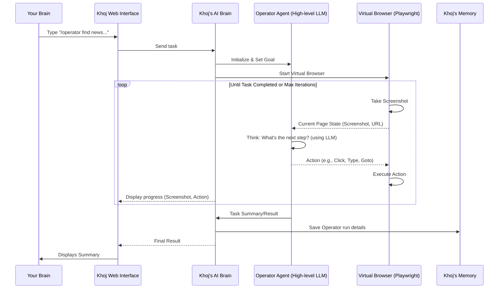

# Chapter 10: Operator Agent

In [Chapter 9: Conversation Commands & Tools](09_conversation_commands___tools_.md), we saw how Khoj can use specific commands and underlying "tools" to perform actions like searching the internet or running code. These tools are powerful, but they require Khoj to know *exactly* what information it needs (e.g., a search query, Python code).

But what if you want Khoj to do something more complex on a website, something that requires it to *see* the page, *think* about what to do, and then *interact* with it, step by step, just like a human?

### What Problem Does the Operator Agent Solve?

Imagine you want Khoj to:
*   "Go to a specific online store, search for a product, add it to the cart, and tell me the total price."
*   "Navigate to a news website, find the latest article about AI, and summarize it for me."
*   "Log in to a service, find a specific setting, and change it."

These tasks are tricky! They require Khoj to:
1.  **See** the webpage (like looking at a screenshot).
2.  **Understand** the goal and decide what to do next (e.g., "I need to click the 'Login' button first").
3.  **Execute** actions (click, type, scroll).
4.  **Repeat** these steps until the task is done.

Khoj's regular tools can't do this alone because they don't "see" or "interact" with a live website.

This is exactly what the **Operator Agent** solves! It's an advanced capability that gives your Khoj assistant its own **virtual hands and eyes** to navigate and interact with a web browser, just like you would. It's like giving your AI its own little web browser and telling it, "Go figure this out!"

**Our Goal for this Chapter:** By the end of this chapter, you'll understand what the Operator Agent is, how it works like a human navigating a website, and how you can use it to make Khoj perform complex web tasks.

### What is the Operator Agent?

The Operator Agent is a specialized AI agent within Khoj that can **autonomously interact with a web browser**. It simulates a human user's actions, making it possible for Khoj to complete multi-step tasks on the internet.

Here's how it works:

1.  **Virtual Browser**: Khoj uses a special program called `Playwright` to launch and control a hidden web browser. This is the "hands and eyes" for the Operator Agent.
2.  **Seeing the Page**: The Operator Agent can "see" what's on the web page. It does this by taking **screenshots** of the page and sometimes by getting a simplified description of the page's structure.
3.  **Two "Brains" (LLMs) for Thinking and Acting**: The Operator Agent uses powerful [Large Language Models (LLMs)](06_chatmodel___ai_model_api__llm_integration__.md) to perform its tasks:
    *   **High-level Reasoning Brain**: This LLM looks at the screenshot and your overall goal (e.g., "Find the flight"). It decides the *next logical step* (e.g., "I should type into the search bar"). This is often a powerful "vision-enabled" LLM, meaning it can understand images.
    *   **Grounding Brain (sometimes part of the High-level Brain)**: If needed, another part of the system (or the same LLM) figures out *exactly where* on the screen to click or type. It helps locate specific buttons, links, or text fields from the screenshot.
4.  **Taking Action**: Once it decides and locates, it executes actions like:
    *   `click`: Clicking buttons or links.
    *   `type`: Typing text into input fields.
    *   `scroll`: Scrolling up or down the page.
    *   `goto`: Navigating directly to a URL.
    *   `back`: Going back to the previous page.

It's a continuous loop: See -> Think -> Act -> See -> Think -> Act... until the task is complete.

### How to Use the Operator Agent: Finding News on a Specific Website

Let's imagine you want Khoj to go to the "IEEE Spectrum" website, find the latest news on quantum computing, and summarize it for you. This requires browsing, not just a single search.

1.  **Open Khoj Chat**: Go to the Khoj Web Interface.
2.  **Type Your Command and Task**: In the chat input box, you'll use the `/operator` [Conversation Command](09_conversation_commands___tools_.md):
    ```
    /operator go to ieee.org/spectrum, then find the latest news on quantum computing, and summarize it for me.
    ```
3.  **Send Your Message**: Press `Enter` or click the send button.

That's it! Khoj will then launch its virtual browser, start navigating, clicking, and reading, and display its progress (including screenshots) directly in your chat. Once it completes the task, it will provide the summary.

You will see updates in the chat window, like:
```
**Operating Browser**:
- Open URL: https://ieee.org/spectrum
- Image: [Screenshot of the IEEE Spectrum homepage]

**Operating Browser**:
- Type "quantum computing"
- Image: [Screenshot after typing into search bar]

... and so on, until the summary is provided.
```

### Under the Hood: How the Operator Agent Works

When you type an `/operator` command, a sophisticated process kicks off.

#### Step-by-Step Walkthrough

1.  **You Provide a Task**: You type `/operator go to ieee.org/spectrum...`
2.  **Web Interface Sends Task**: Your command travels to the [Khoj Backend](01_web_interface__frontend__.md).
3.  **Operator Agent Initialization**: The Khoj Backend recognizes the `/operator` command. It initializes the "Operator Agent" and its "Browser Environment" (the virtual browser). It also picks the best available "vision-enabled" [ChatModel](06_chatmodel___ai_model_api__llm_integration__.md) to act as the Operator Agent's high-level reasoning brain.
4.  **Launch Virtual Browser**: The Browser Environment starts a hidden web browser.
5.  **Operator Loop (See, Think, Act)**:
    *   **See**: The Browser Environment takes a screenshot of the current webpage.
    *   **Think**: The Operator Agent (its reasoning LLM) receives the screenshot and your overall goal. It decides on the *next action* (e.g., "I need to type 'quantum computing' into the search bar at coordinates X, Y").
    *   **Act**: The Operator Agent sends this action (e.g., `TypeAction(text='quantum computing', x=..., y=...)`) to the Browser Environment.
    *   **Execution**: The Browser Environment performs the action in the virtual browser.
    *   **Repeat**: The loop continues with a new screenshot and the updated state of the browser.
6.  **Progress Updates**: Throughout this process, Khoj sends updates (including new screenshots) back to your Web Interface so you can follow along.
7.  **Task Completion / Summary**: Once the Operator Agent determines it has completed the task (e.g., summarized the article), it provides a final summary to the Khoj Backend.
8.  **Display Final Result**: The Backend sends the summary back to your Web Interface.

Here's a simplified sequence diagram:



#### A Peek at the Code

Let's look at the key parts of Khoj's code that make the Operator Agent function.

First, the `/operator` command itself is defined in `src/khoj/utils/helpers.py`, just like other [Conversation Commands](09_conversation_commands___tools_.md):

```python
# src/khoj/utils/helpers.py
# ...

class ConversationCommand(str, Enum):
    # ...
    Operator = "operator" # Here's our /operator command!
    # ...
```
This simply registers `operator` as a recognizable command.

The main entry point for running the Operator Agent is the `operate_browser` function in `src/khoj/processor/operator/operate_browser.py`:

```python
# src/khoj/processor/operator/operate_browser.py
# ...

async def operate_browser(
    query: str, # Your task, e.g., "go to ieee.org/spectrum..."
    user: KhojUser,
    conversation_log: dict,
    # ... other parameters
    agent: Agent = None,
    tracer: dict = {},
):
    # Selects the vision-enabled LLM for the Operator Agent's reasoning
    reasoning_model: ChatModel = await ConversationAdapters.aget_default_chat_model(user, agent_chat_model)
    if not reasoning_model or not reasoning_model.vision_enabled:
        reasoning_model = await ConversationAdapters.aget_vision_enabled_config()

    # Initialize the specific Operator Agent (e.g., OpenAI or Anthropic based)
    operator_agent: OperatorAgent
    if reasoning_model.name.startswith("gpt-4o"):
        operator_agent = OpenAIOperatorAgent(query, reasoning_model, max_iterations, tracer)
    # ... (other agent types)

    # Initialize the virtual browser environment
    environment = BrowserEnvironment()
    await environment.start(width=1024, height=768) # Launch browser with specific dimensions

    try:
        iterations = 0
        while iterations < max_iterations and not task_completed:
            iterations += 1
            # 1. Get current environment state (screenshot, URL)
            browser_state = await environment.get_state()
            # 2. Agent decides action(s) (calls the LLM)
            agent_result = await operator_agent.act(browser_state)
            # 3. Execute actions in the environment
            env_steps: List[EnvStepResult] = []
            for action in agent_result.actions:
                env_step = await environment.step(action)
                env_steps.append(env_step)
            # Render status update to chat
            # ...
            # 4. Update agent with results of its action
            operator_agent.add_action_results(env_steps, agent_result)

    finally:
        if environment:
            await environment.close() # Close the browser when done
```
This `operate_browser` function is the orchestrator. It sets up the `reasoning_model` (the LLM brain), initializes the correct `OperatorAgent` (like `OpenAIOperatorAgent` for OpenAI models), starts the `BrowserEnvironment` (the virtual browser), and then enters the main `while` loop for the "See, Think, Act" process.

The `OperatorAgent` base class (in `src/khoj/processor/operator/operator_agent_base.py`) defines the common structure for different types of LLM-based Operator Agents:

```python
# src/khoj/processor/operator/operator_agent_base.py
# ...

class OperatorAgent(ABC):
    def __init__(self, query: str, vision_model: ChatModel, max_iterations: int, tracer: dict):
        self.query = query
        self.vision_model = vision_model # The LLM brain
        self.max_iterations = max_iterations
        self.tracer = tracer
        self.messages: List[AgentMessage] = []

    @abstractmethod
    async def act(self, current_state: EnvState) -> AgentActResult:
        # This is where the LLM does its "thinking" and decides actions
        pass

    @abstractmethod
    def add_action_results(self, env_steps: list[EnvStepResult], agent_action: AgentActResult) -> None:
        # This is where the agent processes the results of its actions
        pass

    # ... other abstract methods for summarizing and formatting
```
The `act` method is the core: it's where the LLM is called to decide the next action. `add_action_results` is where the agent updates its internal "memory" with the outcome of the action.

Let's peek into `OpenAIOperatorAgent` (in `src/khoj/processor/operator/operator_agent_openai.py`), which implements the `act` method using an OpenAI vision model:

```python
# src/khoj/processor/operator/operator_agent_openai.py
# ...

class OpenAIOperatorAgent(OperatorAgent):
    async def act(self, current_state: EnvState) -> AgentActResult:
        client = get_openai_async_client(self.vision_model.ai_model_api.api_key, self.vision_model.ai_model_api.api_base_url)

        # This is the detailed instructions given to the LLM (the "persona")
        system_prompt = f"""<SYSTEM_CAPABILITY>
* You are Khoj, a smart web browser operating assistant. ...
* You can interact with the web browser to perform tasks like clicking, typing, scrolling, and more using the computer_use_preview tool.
* ...
</SYSTEM_CAPABILITY>
"""
        # Define the tools the LLM can "call" (e.g., click, type, goto)
        tools = [
            {"type": "computer_use_preview", "display_width": 1024, "display_height": 768, "environment": "browser"},
            {"type": "function", "name": "back", "description": "Go back..."},
            {"type": "function", "name": "goto", "description": "Go to a specific URL...", "parameters": {"type": "object", "properties": {"url": {"type": "string"}}}},
        ]

        if is_none_or_empty(self.messages):
            self.messages = [AgentMessage(role="user", content=self.query)]

        # Call the OpenAI model with current messages, system prompt, and tools
        response: Response = await client.responses.create(
            model="computer-use-preview", # The OpenAI model for browser operations
            input=self._format_message_for_api(self.messages),
            instructions=system_prompt,
            tools=tools,
        )

        # Parse the LLM's response into standardized OperatorActions
        actions: List[OperatorAction] = []
        for block in response.output:
            if block.type == "function_call":
                if block.name == "goto":
                    url = json.loads(block.arguments).get("url")
                    if url: actions.append(GotoAction(url=url))
                elif block.name == "back":
                    actions.append(BackAction())
            elif block.type == "computer_call":
                openai_action = block.action
                if openai_action.type == "click":
                    actions.append(ClickAction(x=openai_action.x, y=openai_action.y))
                # ... (parse other action types like type, scroll, keypress)
            # ...

        self._update_usage(response.usage.input_tokens, response.usage.output_tokens)
        return AgentActResult(actions=actions, action_results=action_results, rendered_response=rendered_response)
```
This `act` method sends the current browser state (via `self.messages`, which includes the screenshot) and the `system_prompt` (instructions) to the OpenAI LLM. It then takes the LLM's suggested actions (like clicking or typing) and converts them into standardized `OperatorAction` objects.

These `OperatorAction` objects are defined in `src/khoj/processor/operator/operator_actions.py`:

```python
# src/khoj/processor/operator/operator_actions.py
# ...

class Point(BaseModel):
    x: float
    y: float

class ClickAction(BaseAction):
    type: Literal["click"] = "click"
    x: float
    y: float
    button: Literal["left", "right", "middle", "wheel"] = "left"

class TypeAction(BaseAction):
    type: Literal["type"] = "type"
    text: str

class GotoAction(BaseAction):
    type: Literal["goto"] = "goto"
    url: str

class BackAction(BaseAction):
    type: Literal["back"] = "back"

# ... (many other actions like ScrollAction, KeypressAction, ScreenshotAction)

OperatorAction = Union[
    ClickAction, TypeAction, GotoAction, BackAction, # ... and all others
]
```
These are the "commands" the Operator Agent gives to the virtual browser. Each action clearly defines what it wants to do (e.g., `click`) and what parameters it needs (e.g., `x` and `y` coordinates for clicking).

Finally, the `BrowserEnvironment` (in `src/khoj/processor/operator/operator_environment_browser.py`) handles the actual interaction with the Playwright browser:

```python
# src/khoj/processor/operator/operator_environment_browser.py
# ...

try:
    from playwright.async_api import Browser, Page, Playwright, async_playwright
except ImportError:
    # ... (error message if Playwright not installed)

class BrowserEnvironment(Environment):
    def __init__(self):
        self.playwright: Optional[Playwright] = None
        self.browser: Optional[Browser] = None
        self.page: Optional[Page] = None
        # ...

    async def start(self, width: int = 1024, height: int = 768) -> None:
        self.playwright = await async_playwright().start()
        self.browser = await self.playwright.chromium.launch(headless=False, args=[f"--window-size={width},{height}"])
        self.page = await self.browser.new_page() # Creates a new browser tab
        await self.page.set_viewport_size({"width": self.width, "height": self.height})
        if self.page.url == "about:blank":
            await self.page.goto("https://duckduckgo.com") # Start on a default page
        # ... event handlers for page loads, new pages

    async def _get_screenshot(self) -> Optional[str]:
        if not self.page or self.page.is_closed(): return None
        screenshot_bytes = await self.page.screenshot(full_page=False, type="png")
        # ... (add mouse position, convert to webp, base64 encode)
        return base64.b64encode(screenshot_webp_bytes).decode("utf-8")

    async def get_state(self) -> EnvState:
        url = self.page.url
        screenshot = await self._get_screenshot() # Get the current screenshot
        return EnvState(url=url, screenshot=screenshot)

    async def step(self, action: OperatorAction) -> EnvStepResult:
        # This executes the action in the browser
        if not self.page or self.page.is_closed(): return EnvStepResult(error="Browser page is not available.")
        try:
            match action.type:
                case "click":
                    await self.page.mouse.click(action.x, action.y, button=action.button)
                case "double_click":
                    await self.page.mouse.dblclick(action.x, action.y)
                case "type":
                    await self.page.keyboard.type(action.text)
                case "scroll":
                    await self.page.mouse.wheel(action.scroll_x or 0, action.scroll_y or 0)
                case "goto":
                    await self.page.goto(action.url)
                case "back":
                    await self.page.go_back()
                # ... (other actions handled)
        except Exception as e:
            error = f"Error executing action {action.type}: {e}"
        after_state = await self.get_state()
        return EnvStepResult(output=output, error=error, current_url=after_state.url, screenshot_base64=after_state.screenshot)

    async def close(self) -> None:
        if self.browser: await self.browser.close()
        if self.playwright: await self.playwright.stop()
```
The `BrowserEnvironment` uses Playwright to `start` a Chromium browser, takes `_get_screenshot`s, retrieves the current browser `state`, and, most importantly, takes a `step` by executing the `OperatorAction` (like `click`, `type`, `goto`) in the actual virtual browser.

### Conclusion

You've just explored one of Khoj's most advanced and exciting features: the **Operator Agent**! You learned that it gives Khoj "virtual hands and eyes" to interact with web pages, allowing it to perform complex, multi-step tasks autonomously. By combining a virtual browser with powerful reasoning and grounding LLMs, Khoj can now navigate, click, type, and scroll just like a human, opening up a whole new world of possibilities for your personal AI assistant.

This concludes our journey through the core concepts of Khoj. From the frontend to the backend, from authentication to content processing, search, conversations, agents, and now the powerful Operator Agent, you have a solid foundation for understanding how your personal AI brain works!

---

Generated by [AI Codebase Knowledge Builder](https://github.com/The-Pocket/Tutorial-Codebase-Knowledge)