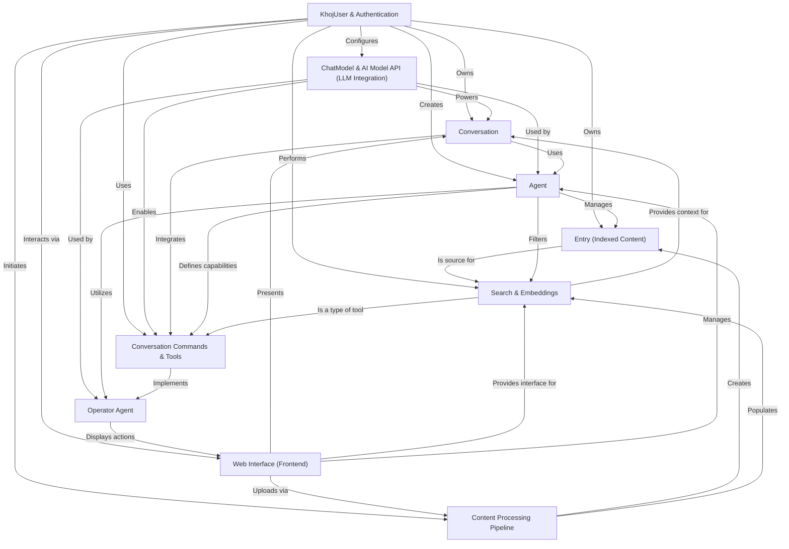

# Tutorial: khoj

Khoj is your *personal AI brain* designed to help you *quickly find answers*, *generate content*, and *manage your knowledge* from both your private notes and the vast public internet. It functions as an *intelligent assistant* by organizing your diverse data, maintaining continuous dialogues, and even interacting with web browsers on your behalf to accomplish tasks.

**Source Repository:** [https://github.com/khoj-ai/khoj.git](https://github.com/khoj-ai/khoj.git)

## Chapters

1. [Web Interface (Frontend)
](01_web_interface__frontend__.md)
2. [KhojUser & Authentication
](02_khojuser___authentication_.md)
3. [Entry (Indexed Content)
](03_entry__indexed_content__.md)
4. [Content Processing Pipeline
](04_content_processing_pipeline_.md)
5. [Search & Embeddings
](05_search___embeddings_.md)
6. [ChatModel & AI Model API (LLM Integration)
](06_chatmodel___ai_model_api__llm_integration__.md)
7. [Conversation
](07_conversation_.md)
8. [Agent
](08_agent_.md)
9. [Conversation Commands & Tools
](09_conversation_commands___tools_.md)
10. [Operator Agent
](10_operator_agent_.md)

---

Generated by [AI Codebase Knowledge Builder](https://github.com/The-Pocket/Tutorial-Codebase-Knowledge)