This file is a merged representation of the entire codebase, combining all repository files into a single document.
Generated by Repomix on: 2025-05-25 06:27:41

# File Summary

## Purpose:

This file contains a packed representation of the entire repository's contents.
It is designed to be easily consumable by AI systems for analysis, code review,
or other automated processes.

## File Format:

The content is organized as follows:
1. This summary section
2. Repository information
3. Repository structure
4. Multiple file entries, each consisting of:
   a. A header with the file path (## File: path/to/file)
   b. The full contents of the file in a code block

## Usage Guidelines:

- This file should be treated as read-only. Any changes should be made to the
  original repository files, not this packed version.
- When processing this file, use the file path to distinguish
  between different files in the repository.
- Be aware that this file may contain sensitive information. Handle it with
  the same level of security as you would the original repository.

## Notes:

- Some files may have been excluded based on .gitignore rules and Repomix's
  configuration.
- Binary files are not included in this packed representation. Please refer to
  the Repository Structure section for a complete list of file paths, including
  binary files.

## Additional Information:

For more information about Repomix, visit: https://github.com/andersonby/python-repomix


# Repository Structure

```
09_conversation_commands___tools_.md
05_search___embeddings_.md
01_web_interface__frontend__.md
07_conversation_.md
04_content_processing_pipeline_.md
index.md
08_agent_.md
02_khojuser___authentication_.md
03_entry__indexed_content__.md
10_operator_agent_.md
06_chatmodel___ai_model_api__llm_integration__.md
```

# Repository Files


## 09_conversation_commands___tools_.md

````markdown
# Chapter 9: Conversation Commands & Tools

In [Chapter 8: Agent](08_agent.md), we learned how you can create specialized AI assistants (Agents) within Khoj, each with its own knowledge and personality. This allows Khoj to be a focused expert. But how do you tell Khoj to do something beyond just answering questions from its knowledge base? What if you want it to search the internet, run code, or summarize a specific document?

### What Problem Do Conversation Commands & Tools Solve?

Imagine Khoj is your super-smart assistant. You can ask it general questions, and it will respond intelligently using its vast knowledge and your indexed notes. However, sometimes you need it to perform a very specific action that requires an external capability. For example:

*   You want to know the **latest news on AI breakthroughs**, which requires searching the live internet.
*   You need to **summarize a long PDF document** you just uploaded.
*   You want to **run a small Python script** to calculate something or analyze data.

If Khoj could only chat, it wouldn't be able to fulfill these specific requests. This is where **Conversation Commands** and **Tools** come in!

**Conversation Commands** are like special "spell words" or direct instructions you give to Khoj. They start with a `/` (forward slash) and tell Khoj *exactly* what kind of action you want it to perform.

**Tools** are the actual "gadgets" or "superpowers" in Khoj's toolbox. Each command activates a specific tool, allowing Khoj to connect to external services or run specialized code to get the job done. It’s like having a specialized vocabulary to tell your AI assistant to pick up a specific tool from its workbench and use it!

**Our Goal for this Chapter:** By the end of this chapter, you'll understand what Conversation Commands and Tools are, how to use them to direct Khoj's behavior, and how Khoj uses them to perform specialized tasks.

### What are Conversation Commands?

Conversation Commands are special keywords you type directly into the Khoj chat interface. They are designed to give Khoj explicit instructions about how to process your query or what external capability to use.

Here are some common Conversation Commands in Khoj:

*   `/online`: Tell Khoj to search the internet.
*   `/notes`: Tell Khoj to *only* use your personal notes for context.
*   `/general`: Tell Khoj to *only* use its general knowledge, ignoring your notes.
*   `/summarize`: Ask Khoj to summarize content, often from a selected file.
*   `/code`: Ask Khoj to generate and run Python code.
*   `/image`: Ask Khoj to generate an image based on your description.
*   `/diagram`: Ask Khoj to generate a visual diagram.
*   `/research`: Tell Khoj to perform a deeper, multi-step research process.

You can see a full list of commands and their descriptions directly in Khoj's chat interface by typing `/help`.

### What are Tools?

Tools are the underlying functionalities that Khoj uses to execute Conversation Commands (and sometimes decides to use on its own even without a direct command!). They are integrations with external services or internal Python code that allow Khoj to go beyond simple text generation.

Think of each tool as a specific skill or capability:

*   **Web Search Tool**: Connects to search engines (like Google, Serper, Firecrawl) to find information on the live internet. Used by the `/online` command.
*   **Webpage Reading Tool**: Can read and extract information from specific URLs. Used by `/webpage`.
*   **Code Execution Tool**: Runs Python code in a safe environment (a "sandbox") to perform calculations, data analysis, or interact with local files. Used by `/code`.
*   **Image Generation Tool**: Connects to AI image generation services (like DALL-E) to create pictures from text descriptions. Used by `/image`.
*   **Diagram Generation Tool**: Generates diagrams (like flowcharts) using tools like Excalidraw or Mermaid.js. Used by `/diagram`.
*   **Summarization Tool**: Focuses the AI on generating a concise summary of a document. Used by `/summarize`.
*   **Operator Tool**: Allows Khoj to control a web browser to perform complex tasks (we'll dive into this powerful tool in [Chapter 10: Operator Agent](10_operator_agent.md)).

Khoj uses these tools to extend its capabilities, making it a much more versatile assistant.

### How to Use Conversation Commands & Tools: Getting the Latest News

Let's walk through our central use case: asking Khoj to search the internet for the latest news on AI breakthroughs.

1.  **Open Khoj Chat**: Go to the Khoj Web Interface, as you learned in [Chapter 1: Web Interface (Frontend)](01_web_interface__frontend__.md).
2.  **Type Your Command and Query**: In the chat input box, type:
    ```
    /online latest news on AI breakthroughs
    ```
3.  **Send Your Message**: Press `Enter` or click the send button.

That's it! Khoj will recognize the `/online` command, activate its Web Search Tool, search the internet, and then use the results to formulate a coherent response.

**Another Example: Summarizing a Document**

Let's say you have a PDF file titled `project_notes.pdf` that you've already indexed in Khoj (as discussed in [Chapter 3: Entry (Indexed Content)](03_entry__indexed_content__.md)).

1.  **Select the File**: In the Khoj Web Interface sidebar, go to "Files" and select `project_notes.pdf` by clicking its checkbox. This "attaches" the file to your current conversation as a filter.
    ```markdown
    
    ```
2.  **Type Your Summarize Command**: In the chat input box, type:
    ```
    /summarize
    ```
3.  **Send Your Message**: Press `Enter`.

Khoj will then use the Summarization Tool to read through your `project_notes.pdf` (because you've filtered it for the conversation) and provide a concise summary.

### Under the Hood: How Commands & Tools Work

When you type a command, a precise sequence of events unfolds within Khoj to ensure the right tool is activated and its results are used.

#### Step-by-Step Walkthrough

1.  **You Type a Command**: You type `/online latest news on AI breakthroughs` into the Khoj Web Interface.
2.  **Web Interface Sends Query**: Your query travels to the [Khoj Backend](01_web_interface__frontend__.md).
3.  **Command Parsing**: The Khoj Backend first looks at your query to see if it starts with a known `Conversation Command` (like `/online`).
4.  **Tool Activation**: If a command is found (or if the AI decides a tool is needed based on your regular query), Khoj activates the corresponding "Tool." For `/online`, this means preparing the Web Search Tool.
5.  **Tool Execution**: The activated Tool performs its specific action. For the Web Search Tool, this means making API calls to external search engines (like Serper.dev or Google).
6.  **Tool Results Return**: The Tool gathers its results (e.g., search snippets, webpage content) and sends them back to the Khoj Backend.
7.  **LLM Integration**: The Khoj Backend then takes these fresh tool results, combines them with your original query, and the ongoing [Conversation](07_conversation.md) history. This comprehensive package is sent to the chosen [ChatModel & AI Model API (LLM Integration)](06_chatmodel___ai_model_api__llm_integration__.md) (the LLM).
8.  **LLM Generates Response**: The LLM uses all this context to formulate a human-like answer that incorporates the tool's findings.
9.  **Backend Saves & Displays**: The AI's response (along with details about which tool was used and its output) is saved to your [Conversation](07_conversation.md) log in the [Database](03_entry__indexed_content__.md). Finally, it's sent back to your Web Interface for you to see.

Here's a simplified sequence diagram:

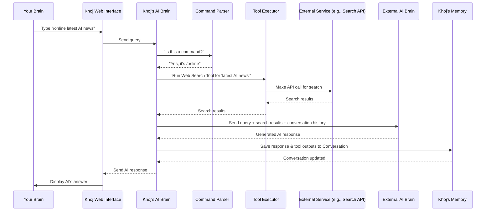

#### A Peek at the Code

Let's look at how Khoj handles these commands and dispatches to tools.

First, the `ConversationCommand` is an `Enum` (a set of named constants) that defines all the available commands. This is found in `src/khoj/utils/helpers.py`:

```python
# src/khoj/utils/helpers.py
# ...

class ConversationCommand(str, Enum):
    Default = "default"
    General = "general"
    Notes = "notes"
    Help = "help"
    Online = "online" # Here's our /online command!
    Webpage = "webpage"
    Code = "code"
    Image = "image"
    Text = "text"
    Summarize = "summarize" # And /summarize!
    Diagram = "diagram"
    Research = "research"
    Operator = "operator"
    # ... more commands
```
This `Enum` makes it easy for Khoj to consistently refer to and identify different commands.

When your query arrives at the backend, `get_conversation_command` in `src/khoj/routers/helpers.py` checks which command (if any) you used:

```python
# src/khoj/routers/helpers.py
# ...

def get_conversation_command(query: str) -> ConversationCommand:
    if query.startswith("/notes"):
        return ConversationCommand.Notes
    elif query.startswith("/help"):
        return ConversationCommand.Help
    elif query.startswith("/general"):
        return ConversationCommand.General
    elif query.startswith("/online"): # This checks for /online
        return ConversationCommand.Online
    elif query.startswith("/image"):
        return ConversationCommand.Image
    elif query.startswith("/summarize"): # This checks for /summarize
        return ConversationCommand.Summarize
    # ... (more command checks)
    else:
        return ConversationCommand.Default
```
This function is part of the "Command Parser" step. It simply looks at the beginning of your query string and returns the corresponding `ConversationCommand` enum value.

Sometimes, Khoj's LLM will decide to use a tool even if you didn't explicitly type a command. This happens in the `aget_data_sources_and_output_format` function in `src/khoj/routers/helpers.py`, where the LLM is asked to `PickTools` (a Pydantic model for structured output) based on your query:

```python
# src/khoj/routers/helpers.py
# ...

async def aget_data_sources_and_output_format(
    query: str,
    conversation_history: dict,
    # ... other parameters
) -> Dict[str, Any]:
    # ... (prepare prompts with available tool descriptions)

    class PickTools(BaseModel):
        source: List[str] = Field(..., min_items=1) # The tool to use (e.g., "online")
        output: str # The desired output format (e.g., "text", "image")

    with timer("Chat actor: Infer information sources to refer", logger):
        response = await send_message_to_model_wrapper(
            relevant_tools_prompt, # Prompt telling LLM to pick tools
            response_type="json_object",
            response_schema=PickTools, # Tells LLM to respond in this structure
            # ... other parameters
        )
    # ... (parse and validate response to get chosen_sources and chosen_output)
    return {"sources": data_sources, "output": output_mode}
```
This snippet shows how Khoj uses an LLM (via `send_message_to_model_wrapper`) to intelligently decide which `source` (tool) and `output` format to use for a given query, even without a direct command. The LLM is provided with descriptions of each tool, which are defined in `tool_descriptions_for_llm` in `src/khoj/utils/helpers.py`:

```python
# src/khoj/utils/helpers.py
# ...

tool_descriptions_for_llm = {
    ConversationCommand.Default: "To use a mix of your internal knowledge and the user's personal knowledge...",
    ConversationCommand.General: "To use when you can answer the question without any outside information...",
    ConversationCommand.Notes: "To search the user's personal knowledge base...",
    ConversationCommand.Online: "To search for the latest, up-to-date information from the internet. Note: **Questions about Khoj should always use this data source**",
    ConversationCommand.Webpage: "To use if the user has directly provided the webpage urls...",
    ConversationCommand.Code: "To run Python code to parse information, run complex calculations...",
    ConversationCommand.Operator: "To use when you need to operate and take actions using a GUI web browser.",
    # ... more descriptions
}
```
This dictionary provides the LLM with clear descriptions of each tool, helping it make informed decisions.

Once a command is identified (either by the user or inferred by the LLM), the `execute_information_collection` function (located in `src/khoj/routers/research.py`) orchestrates the actual tool execution. While this function is specifically for "research" mode, it illustrates the general pattern of how different tools are called based on the `ConversationCommand`:

```python
# src/khoj/routers/research.py
# ...

async def execute_information_collection(
    user: KhojUser,
    query: str,
    conversation_id: str,
    # ... other parameters
):
    # ... (logic to pick the next tool to use, often using apick_next_tool which leverages LLM)

    # this_iteration.tool will contain the ConversationCommand (e.g., ConversationCommand.Online)
    if this_iteration.tool == ConversationCommand.Notes:
        # Calls the notes search logic
        async for result in extract_references_and_questions(...):
            yield result

    elif this_iteration.tool == ConversationCommand.Online: # Here's our /online command!
        # Calls the online search tool
        async for result in search_online(
            this_iteration.query, # The query for the search engine
            construct_tool_chat_history(previous_iterations, ConversationCommand.Online),
            location,
            user,
            send_status_func,
            # ... other parameters
        ):
            if isinstance(result, dict) and ChatEvent.STATUS in result:
                yield result[ChatEvent.STATUS]
            # ... (process online results)

    elif this_iteration.tool == ConversationCommand.Code: # Here's our /code command!
        # Calls the code execution tool
        async for result in run_code(
            this_iteration.query, # The query for the code tool
            construct_tool_chat_history(previous_iterations, ConversationCommand.Code),
            "",
            location,
            user,
            send_status_func,
            # ... other parameters
        ):
            if isinstance(result, dict) and ChatEvent.STATUS in result:
                yield result[ChatEvent.STATUS]
            # ... (process code results)
    # ... (other tool execution logic)
```
This snippet shows how the code uses `if/elif` statements to branch to different tool-specific functions (`search_online`, `run_code`, etc.) based on the determined `this_iteration.tool`.

Now, let's look at the beginning of an actual "tool" function, `search_online` (from `src/khoj/processor/tools/online_search.py`), which is called when the `/online` command is used:

```python
# src/khoj/processor/tools/online_search.py
# ...

async def search_online(
    query: str,
    conversation_history: dict,
    location: LocationData,
    user: KhojUser,
    send_status_func: Optional[Callable] = None,
    # ... other parameters
):
    if not is_internet_connected():
        logger.warning("Cannot search online as not connected to internet")
        yield {}
        return

    # Breakdown the query into subqueries (the actual search terms)
    new_subqueries = await generate_online_subqueries(
        query, conversation_history, location, user, # ...
    )

    # Call different search engine APIs (Serper, Google, Firecrawl, Jina, Searxng)
    search_engines = []
    if SERPER_DEV_API_KEY:
        search_engines.append(("Serper", search_with_serper))
    # ... (add other search engines based on API keys)

    for search_engine, search_func in search_engines:
        logger.info(f"🌐 Searching the Internet with {search_engine} for {subqueries}")
        search_tasks = [search_func(subquery, location) for subquery in subqueries]
        search_results = await asyncio.gather(*search_tasks)
        # ... (process results and yield them)
```
This `search_online` function demonstrates how Khoj's Web Search Tool generates sub-queries, then dispatches them to different underlying search engine integrations (like `search_with_serper`). It then yields the search results to be incorporated into the LLM's final response.

Similarly, the `run_code` function (from `src/khoj/processor/tools/run_code.py`) is called for the `/code` command:

```python
# src/khoj/processor/tools/run_code.py
# ...

async def run_code(
    query: str,
    conversation_history: dict,
    context: str,
    location_data: LocationData,
    user: KhojUser,
    send_status_func: Optional[Callable] = None,
    # ... other parameters
):
    # Generate Code using the LLM
    generated_code = await generate_python_code(
        query, conversation_history, context, location_data, user, # ...
    )

    # Execute Code in a sandboxed environment
    result = await execute_sandboxed_python(generated_code.code, generated_code.input_files)

    # Return the results
    yield {query: {"code": result.pop("code"), "results": result}}
```
This `run_code` function first uses the LLM to `generate_python_code` based on your query, then executes that code in a safe sandbox (`execute_sandboxed_python`), and finally returns the code's output.

### Conclusion

You've now seen how Conversation Commands and Tools empower Khoj to go beyond simple conversation. By using specific `/` commands, you can direct Khoj to search the internet, summarize documents, run code, generate images, and more. Each command activates a specialized "tool" in Khoj's powerful arsenal, making your personal AI assistant incredibly versatile and capable of tackling a wide range of tasks.

Next, we'll combine the power of Agents and these tools with the concept of the "Operator Agent," allowing Khoj to perform complex, multi-step actions autonomously in a web browser.

[Chapter 10: Operator Agent](10_operator_agent.md)

---

Generated by [AI Codebase Knowledge Builder](https://github.com/The-Pocket/Tutorial-Codebase-Knowledge)
````

## 05_search___embeddings_.md

````markdown
# Chapter 5: Search & Embeddings

In [Chapter 4: Content Processing Pipeline](04_content_processing_pipeline_.md), we explored how Khoj meticulously breaks down your documents into intelligent chunks called `Entry` objects, preparing them for your personal "second brain." Now, the big question is: how does Khoj actually *find* the right information from all those `Entry` objects when you ask a question? This is where the magic of Search & Embeddings comes in!

### What Problem Do Search & Embeddings Solve?

Imagine you've just uploaded a massive collection of your research papers, meeting notes, and web articles into Khoj. Later, you want to ask a question like: "What were the main arguments for using renewable energy in the report I read last week?"

If Khoj just searched for the exact words "renewable energy" or "report," it might miss important paragraphs that use synonyms like "green power" or "document." You want Khoj to understand the *meaning* of your question and find relevant information, even if the exact words aren't present.

This is the problem that **Search & Embeddings** solve! It's like having a highly intelligent "meaning-matcher" for your personal library. Instead of just looking for keywords, Khoj understands the *idea* behind your query and finds documents that are about the same *idea*.

**Our Goal for this Chapter:** By the end of this chapter, you'll understand how Khoj uses "embeddings" to perform super-smart searches, finding information based on meaning rather than just words, and how it refines those results for accuracy.

### What are Embeddings?

At the heart of Khoj's smart search are **embeddings**. Don't let the technical term scare you!

Think of an embedding as a **numerical fingerprint** or a **"meaning code"** for a piece of text.
*   Every `Entry` (those chunks of your documents) gets its own unique numerical fingerprint.
*   Your search query (your question to Khoj) also gets its own numerical fingerprint.

These "fingerprints" are long lists of numbers that capture the *meaning* of the text. Texts with similar meanings will have "fingerprints" that are numerically very close to each other.

Khoj uses a special type of AI model called a **"bi-encoder"** to create these embeddings. It's really good at understanding text and converting it into these numerical meaning codes.

### What is Semantic Search?

Once everything (your documents and your queries) has these numerical "meaning codes" (embeddings), Khoj can do **semantic search**.

Semantic search means searching based on **meaning**, not just keywords.
*   When you ask Khoj a question, it converts your question into its numerical meaning code.
*   Then, it rapidly compares your question's meaning code to the meaning codes of all your stored `Entry` objects.
*   It finds the `Entry` objects whose meaning codes are numerically closest to your question's meaning code. This means they are about the same *topic* or *idea*.

This is why Khoj can find "green power" when you search for "renewable energy" – because their meaning codes are very similar!

### What is a Cross-Encoder?

After Khoj's "bi-encoder" finds the initial set of relevant `Entry` objects using semantic search, it needs a **"second opinion"** to make sure the results are truly the best. This is where the **"cross-encoder"** comes in.

The cross-encoder is another type of AI model that is slower but more precise. It takes your original query and the top few `Entry` objects found by the bi-encoder, and then it re-reads them *together*. It gives a more refined score on how relevant each `Entry` is to your specific query.

*   **Bi-encoder**: Fast, finds many *potential* matches based on general meaning.
*   **Cross-encoder**: Slower, but **re-ranks** the top matches to ensure they are *precisely* relevant to your query.

It's like the bi-encoder quickly picks out 10 books that *might* be what you're looking for, and then the cross-encoder carefully skims those 10 books to tell you which 3 are *exactly* what you need.

### How to Use Search & Embeddings (Indirectly)

You don't directly interact with "embeddings" or "encoders" in Khoj. These are all part of the intelligent system working behind the scenes. You simply **use the Khoj search or chat interface** as you learned in [Chapter 1: Web Interface (Frontend)](01_web_interface__frontend__.md).

**Example:**
1.  **Upload Documents**: You've uploaded various files containing information about quantum physics, perhaps a PDF, some Markdown notes, etc. (This process generated `Entry` objects with their embeddings, as discussed in [Chapter 3: Entry (Indexed Content)](03_entry__indexed_content__.md) and [Chapter 4: Content Processing Pipeline](04_content_processing_pipeline_.md)).
2.  **Ask a Question**: In the Khoj chat interface, you type:
    `Tell me about the principles of quantum entanglement.`
3.  **Khoj Searches**: Khoj's Search & Embeddings system automatically:
    *   Converts your question into a numerical embedding (meaning code).
    *   Compares it to all `Entry` embeddings.
    *   Uses the cross-encoder to refine the top results.
    *   Pulls out the most relevant `Entry` chunks.
    *   Uses these chunks to formulate an answer for you.

You just type your question, and Khoj's smart search does the rest!

### Under the Hood: How Search & Embeddings Work

Let's trace the journey of your question through Khoj's search system.

#### Step-by-Step Walkthrough

1.  **You Ask a Question**: You type "Summarize my notes on quantum physics" into the Khoj Web Interface.
2.  **Khoj Backend Receives Query**: Your question travels to the Khoj Backend.
3.  **Query to Embedding (Bi-Encoder)**: The Khoj Backend sends your question to the **Bi-Encoder Model**. This model converts your question into a numerical embedding (its "meaning code").
4.  **Semantic Search (Database)**: Khoj then takes this query embedding and searches its database. It looks for `Entry` objects (your document chunks) that have embeddings (meaning codes) that are numerically very similar to your query's embedding. It quickly finds a set of top potential matches.
5.  **Result Refinement (Cross-Encoder)**: The Khoj Backend then takes your original question and the top few `Entry` objects found in step 4. It sends them to the **Cross-Encoder Model**. The Cross-Encoder meticulously re-reads both your query and these potential `Entry` matches together to give a more accurate relevance score for each.
6.  **Formulate Answer**: Based on these highly re-ranked and relevant `Entry` objects, Khoj formulates its answer.
7.  **Display Answer**: The answer is sent back to your Web Interface and displayed in the chat.

Here's a simplified sequence diagram:

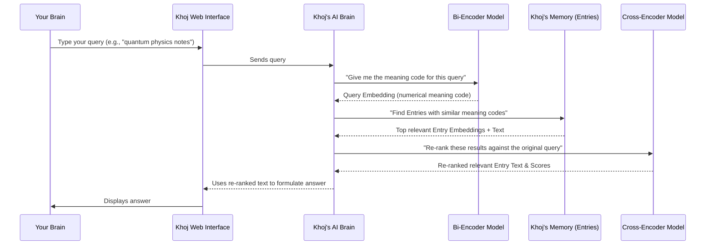

#### A Peek at the Code

Let's look at some key parts of the Khoj code that make this happen.

First, remember the `Entry` model from `src/khoj/database/models/__init__.py`? It has a special field to store those numerical embeddings:

```python
# src/khoj/database/models/__init__.py
# ...

class Entry(DbBaseModel):
    # ... other fields
    embeddings = VectorField(dimensions=None) # This stores the numerical embedding!
    raw = models.TextField() # Original chunk of text
    compiled = models.TextField() # Cleaned/optimized chunk of text
    # ...
```
The `embeddings = VectorField(dimensions=None)` line is crucial. It tells the database that this field will hold a list of numbers, which is our numerical meaning code for the text.

When you initiate a search, the `search` endpoint in `src/khoj/routers/api.py` calls `execute_search`. Inside `execute_search`, your query is first converted into an embedding:

```python
# src/khoj/routers/api.py
# ...

async def execute_search(
    user: KhojUser,
    q: str, # This is your query, e.g., "quantum physics notes"
    # ... other parameters
):
    # ... (prepare query by removing filters)

    encoded_asymmetric_query = None
    if t != SearchType.Image:
        # Get the default search model (which includes the bi-encoder)
        search_model = await sync_to_async(get_default_search_model)()
        # Convert your query into its numerical embedding!
        encoded_asymmetric_query = state.embeddings_model[search_model.name].embed_query(defiltered_query)

    # ... (submit search to text_search.query)
```
The `state.embeddings_model[search_model.name].embed_query(defiltered_query)` line is where the **bi-encoder** does its job, turning your text query into numbers.

Next, `text_search.query` (from `src/khoj/search_type/text_search.py`) uses this query embedding to find relevant `Entry` objects:

```python
# src/khoj/search_type/text_search.py
# ...

async def query(
    raw_query: str,
    user: KhojUser,
    type: SearchType = SearchType.All,
    question_embedding: Union[torch.Tensor, None] = None, # Your query's numerical embedding!
    # ... other parameters
) -> Tuple[List[dict], List[Entry]]:
    # ...

    # Find relevant entries by comparing embeddings
    hits = EntryAdapters.search_with_embeddings(
        raw_query=raw_query,
        embeddings=question_embedding, # Compare this to Entry embeddings!
        max_results=top_k,
        file_type_filter=file_type,
        max_distance=max_distance,
        user=user,
        agent=agent,
    ).all()
    hits = await sync_to_async(list)(hits)
    return hits
```
This function calls `EntryAdapters.search_with_embeddings` to perform the actual database lookup. Let's see how that works in `src/khoj/database/adapters/__init__.py`:

```python
# src/khoj/database/adapters/__init__.py
# ...

class EntryAdapters:
    @staticmethod
    def search_with_embeddings(
        raw_query: str,
        embeddings: Tensor, # Your query's embedding
        user: KhojUser,
        max_results: int = 10,
        # ... other parameters
    ):
        # ... (filter entries by user/agent)
        relevant_entries = Entry.objects.filter(owner_filter).annotate(
            distance=CosineDistance("embeddings", embeddings) # Calculates similarity using embeddings!
        )
        relevant_entries = relevant_entries.filter(distance__lte=max_distance) # Filters out less relevant results
        # ... (more filtering and sorting)
        return relevant_entries[:max_results]
```
The key line here is `distance=CosineDistance("embeddings", embeddings)`. `CosineDistance` is a mathematical way to measure how "close" two numerical vectors (our embeddings) are. A smaller distance means they are more similar in meaning. This is how Khoj quickly finds the most semantically relevant `Entry` objects.

After the initial search, the results are passed to `rerank_and_sort_results` in `src/khoj/search_type/text_search.py` to be refined by the **cross-encoder**:

```python
# src/khoj/search_type/text_search.py
# ...

def rerank_and_sort_results(hits, query, rank_results, search_model_name):
    # Rerank results if explicitly requested or if cross-encoder inference is enabled
    rank_results = (rank_results or state.cross_encoder_model[search_model_name].inference_server_enabled()) and len(
        list(hits)
    ) > 1

    if rank_results:
        # This calls the cross-encoder to re-score the hits
        hits = cross_encoder_score(query, hits, search_model_name)

    # Sort results, prioritizing cross-encoder score if used
    hits = sort_results(rank_results=rank_results, hits=hits)

    return hits

def cross_encoder_score(query: str, hits: List[SearchResponse], search_model_name: str) -> List[SearchResponse]:
    """Score all retrieved entries using the cross-encoder"""
    # ... (error handling)
    
    # This is where the Cross-Encoder model does its prediction
    cross_scores = state.cross_encoder_model[search_model_name].predict(query, hits)

    # Convert cross-encoder scores to distances for ranking
    for idx in range(len(cross_scores)):
        hits[idx]["cross_score"] = 1 - cross_scores[idx] # Store new score for sorting

    return hits
```
The `cross_encoder_score` function calls `state.cross_encoder_model[search_model_name].predict`, which is the core of the cross-encoder's re-ranking. This function takes your query and the raw text of the search results and produces a new, more accurate relevance score.

Finally, the `EmbeddingsModel` (bi-encoder) and `CrossEncoderModel` classes themselves are defined in `src/khoj/processor/embeddings.py`:

```python
# src/khoj/processor/embeddings.py
# ...

class EmbeddingsModel: # This is our Bi-Encoder
    def __init__(self, model_name: str = "thenlper/gte-small", **kwargs):
        # Loads the bi-encoder model (e.g., "thenlper/gte-small")
        self.embeddings_model = SentenceTransformer(self.model_name, **self.model_kwargs)

    def embed_query(self, query):
        # Converts a single query string into its numerical embedding
        return self.embeddings_model.encode([query], **self.query_encode_kwargs)[0]

    def embed_documents(self, docs):
        # Converts a list of document chunks into their numerical embeddings
        return self.embeddings_model.encode(docs, **self.docs_encode_kwargs).tolist()

class CrossEncoderModel: # This is our Cross-Encoder
    def __init__(self, model_name: str = "mixedbread-ai/mxbai-rerank-xsmall-v1", **kwargs):
        # Loads the cross-encoder model (e.g., "mixedbread-ai/mxbai-rerank-xsmall-v1")
        self.cross_encoder_model = CrossEncoder(model_name=self.model_name, **self.model_kwargs)

    def predict(self, query, hits: List[SearchResponse], key: str = "compiled"):
        # Takes the query and search results, and predicts new relevance scores
        cross_inp = [[query, hit.additional[key]] for hit in hits]
        cross_scores = self.cross_encoder_model.predict(cross_inp)
        return cross_scores
```
These classes load the actual AI models (bi-encoder and cross-encoder) and provide methods to `embed_query` (turn queries into numbers), `embed_documents` (turn document chunks into numbers), and `predict` (re-rank search results).

### Conclusion

You've now seen how Khoj's "second brain" truly understands your information! By converting both your queries and your `Entry` documents into numerical "embeddings" (meaning codes) using a **bi-encoder**, Khoj can perform powerful **semantic search** based on meaning. A **cross-encoder** then acts as a quality control, refining the initial search results for even greater accuracy. This entire system works behind the scenes, allowing you to simply ask questions and get highly relevant answers.

Next, we'll explore how Khoj uses these retrieved `Entry` objects and integrates with large language models (LLMs) to generate human-like chat responses and summaries.

[Chapter 6: ChatModel & AI Model API (LLM Integration)](06_chatmodel___ai_model_api__llm_integration__.md)

---

Generated by [AI Codebase Knowledge Builder](https://github.com/The-Pocket/Tutorial-Codebase-Knowledge)
````

## 01_web_interface__frontend__.md

````markdown
# Chapter 1: Web Interface (Frontend)

Welcome to the exciting world of Khoj! In this first chapter, we're going to explore the part of Khoj you interact with most directly: its Web Interface, also known as the Frontend. Think of it as the "dashboard" or "control panel" of your personal AI, making it super easy to access and manage your second brain.

### What Problem Does the Web Interface Solve?

Imagine Khoj as a super-smart assistant that knows everything about your notes, documents, and even things you've seen online. But how do you *talk* to this assistant? How do you ask it questions, tell it to find something, or even give it new information?

This is exactly what the Web Interface solves! It's the friendly face of Khoj, running right in your web browser. It's built to be the primary way you interact with Khoj, making advanced AI features feel as simple as chatting with a friend.

**Our Goal for this Chapter:** By the end of this chapter, you'll understand how to use Khoj's Web Interface to ask it a question and how your message travels through the system.

### What is the Web Interface?

The Web Interface is the part of Khoj that loads in your browser, like Google Chrome, Firefox, or Safari. It's what you see when you visit [Khoj Cloud](https://app.khoj.dev). It's designed to be intuitive and visually pleasing, offering several key features:

*   **Chat Interface**: This is where you can have conversations with Khoj, asking it questions or giving it commands.
*   **Search Functionality**: A dedicated area to search through all your indexed content, finding specific notes or documents quickly.
*   **Settings & Management**: Places where you can adjust how Khoj works and manage your connected "agents" (which are like specialized helpers within Khoj).

The technical bits: Khoj's Web Interface is built using `Next.js`, which is a popular framework for `React`. Don't worry too much about these names right now; just know that they are modern web technologies that help build fast, interactive, and good-looking websites. It's like using advanced LEGO bricks to build a fancy interactive house on the web!

### How to Use the Web Interface: Asking a Question

Let's walk through our central use case: asking Khoj a question.

1.  **Open Khoj**: First, open your web browser and go to [Khoj Cloud](https://app.khoj.dev) or your self-hosted Khoj server. You'll see a screen that looks like a chat application.
2.  **Type Your Question**: At the bottom of the screen, you'll find a text box. This is your main input area. Type your question there, just like you would in a messaging app. For example, you could type:
    `Summarize my notes on project X.`
3.  **Send Your Message**: Once you've typed your question, you can press the `Enter` key or click the "Send" (up arrow) button.

It's that simple! Khoj will then process your request and display its answer right back in the chat window.

You can also easily add files to your "second brain" through this interface! You can simply drag and drop documents into the chat window, or click the paperclip icon to select files from your computer.

```markdown

```

This makes it easy to quickly provide Khoj with new information it can learn from and help you with.

### Under the Hood: How Your Message Travels

So, what happens when you type a message and hit send? Let's simplify the journey of your question:

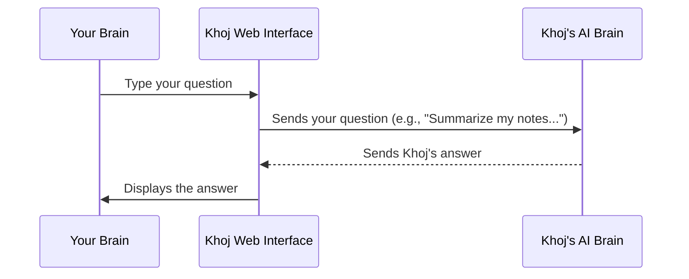

1.  **You type and send**: You, the user, type your query into the text box within your web browser.
2.  **Web Interface sends to Backend**: The Khoj Web Interface (the part in your browser) takes your message and sends it over the internet to the Khoj Backend. The Backend is where all the heavy lifting, like processing your AI queries and searching your "second brain" data, happens.
3.  **Backend processes**: The Khoj Backend receives your question, understands it, looks for relevant information (e.g., your notes), and generates an answer.
4.  **Backend sends back**: The Khoj Backend then sends this answer back to your Web Interface.
5.  **Web Interface displays**: Finally, your Web Interface receives the answer and beautifully displays it in the chat window for you to read.

### A Peek at the Code

Let's look at some very simplified code snippets to see how the Web Interface handles user input and displays information. Remember, these are just tiny parts of a much larger system, simplified to show the core idea!

First, the main page (`src/interface/web/app/page.tsx`) sets up the overall structure, including the `ChatInputArea` where you type.

```typescript
// src/interface/web/app/page.tsx
// ... (imports and other setup)

function ChatBodyData(props: ChatBodyDataProps) {
    const [message, setMessage] = useState(""); // This stores what you type
    // ... (other state and logic)

    // This is the component where you type your messages
    return (
        <ChatInputArea
            // ... (other props)
            sendMessage={(message) => setMessage(message)} // When you send, update 'message'
            sendDisabled={processingMessage}
            // ... (more props)
        />
    );
}

// ... (other parts of the Home component)
```
In this snippet, `message` is a placeholder that holds whatever you type. When you click send, the `sendMessage` function is called, which updates this `message` variable.

Now, let's look at the `ChatInputArea` component itself (`src/interface/web/app/components/chatInputArea/chatInputArea.tsx`), which contains the actual text box:

```typescript
// src/interface/web/app/components/chatInputArea/chatInputArea.tsx
// ... (imports and other setup)

export const ChatInputArea = forwardRef<HTMLTextAreaElement, ChatInputProps>((props, ref) => {
    const [message, setMessage] = useState(""); // Stores current input text
    // ... (other state and logic)

    function onSendMessage() {
        if (!message.trim()) return; // Don't send empty messages

        // Call the function provided by the parent component to send the message
        props.sendMessage(message.trim());
        setMessage(""); // Clear the input box after sending
    }

    return (
        <div className="flex-grow flex flex-col w-full gap-1.5 relative">
            <Textarea
                ref={chatInputRef}
                value={message} // Display the current message
                onChange={(e) => setMessage(e.target.value)} // Update 'message' as you type
                // ... (more attributes like placeholder, styling)
            />
            <Button
                // ... (styling and other attributes)
                onClick={onSendMessage} // Call 'onSendMessage' when button clicked
            >
                {/* Send icon */}
            </Button>
        </div>
    );
});

// ... (component export)
```
This simplified code shows the `Textarea` (the text box) where you type. As you type, the `onChange` event updates the `message` variable. When you click the `Button` (the send button), the `onSendMessage` function is called, which then uses `props.sendMessage` to pass your message up to the main part of the application.

After the message is sent, the chat page (`src/interface/web/app/chat/page.tsx`) is responsible for displaying the conversation history and any new incoming messages from Khoj.

```typescript
// src/interface/web/app/chat/page.tsx
// ... (imports and other setup)

function ChatBodyData(props: ChatBodyDataProps) {
    const [messages, setMessages] = useState<StreamMessage[]>([]); // Array of all messages

    // This component renders the full chat history
    return (
        <ChatHistory
            conversationId={conversationId}
            incomingMessages={messages} // Pass the list of messages to ChatHistory
            setIncomingMessages={setMessages} // Allow ChatHistory to update messages
            // ... (other props)
        />
    );
}

// ... (other parts of the Chat component)
```
The `ChatHistory` component then iterates through the `messages` array and displays each one, including your questions and Khoj's answers.

Finally, for search (`src/interface/web/app/search/page.tsx`), there's a dedicated input field:

```typescript
// src/interface/web/app/search/page.tsx
// ... (imports and other setup)

export default function Search() {
    const [searchQuery, setSearchQuery] = useState(""); // Stores what you type in search
    const [searchResults, setSearchResults] = useState<SearchResult[] | null>(null); // Stores results
    // ... (other state and logic)

    function handleSearchInputChange(value: string) {
        setSearchQuery(value); // Update search query as you type
        // ... (logic to trigger search after a small delay)
    }

    function search() {
        if (!searchQuery.trim()) return; // Don't search empty query
        // ... (logic to fetch search results from the backend)
        setSearchResultsLoading(true);
        fetch(`/api/search?q=${encodeURIComponent(searchQuery)}`)
            .then((response) => response.json())
            .then((data) => {
                setSearchResults(data); // Update search results
                setSearchResultsLoading(false);
            });
    }

    return (
        <div>
            <Input
                type="search"
                placeholder="Search Documents"
                value={searchQuery}
                onChange={(e) => handleSearchInputChange(e.currentTarget.value)}
                onKeyDown={(e) => {
                    if (e.key === "Enter") {
                        search(); // Search on Enter key
                    }
                }}
            />
            {/* Display searchResults here */}
            {searchResults && searchResults.length > 0 && (
                <div className="mt-4">
                    {searchResults.map((result, index) => (
                        // Render each search result as a Note component
                        <Note key={result["corpus-id"]} note={result} />
                    ))}
                </div>
            )}
        </div>
    );
}
```
Here, the `Input` component is where you type your search query. When you type, `handleSearchInputChange` updates `searchQuery`. Pressing `Enter` or clicking the "Find" button triggers the `search` function, which fetches results from the backend (`/api/search`) and updates `searchResults` to display them.

### Conclusion

You've just completed your first deep dive into Khoj! You learned that the Web Interface (Frontend) is your primary way to interact with Khoj through your web browser. It's the "dashboard" where you can chat, search, and manage your personal AI. You also got a peek at how your messages travel from your browser to Khoj's "brain" (the Backend) and back again.

Next, we'll explore how Khoj knows who you are and keeps your information secure.

[Chapter 2: KhojUser & Authentication](02_khojuser___authentication_.md)

---

Generated by [AI Codebase Knowledge Builder](https://github.com/The-Pocket/Tutorial-Codebase-Knowledge)
````

## 07_conversation_.md

````markdown
# Chapter 7: Conversation

In [Chapter 6: ChatModel & AI Model API (LLM Integration)](06_chatmodel___ai_model_api__llm_integration__.md), we learned how Khoj intelligently connects to different powerful AI brains (LLMs) to generate human-like responses. But what if you want to remember what you discussed last week? How does Khoj keep track of all your questions and its answers over time, so it can provide relevant follow-ups or context in new interactions?

This is where the concept of a `Conversation` comes in!

### What Problem Does "Conversation" Solve?

Imagine you're chatting with a friend. You don't repeat everything you've said before because you both remember the context of your discussion. You can ask follow-up questions like, "What about that idea we discussed yesterday?" and your friend understands what you're referring to.

For an AI assistant like Khoj, this "memory" is crucial! If Khoj just answered one question at a time and then forgot everything, it would be frustrating. You'd have to provide all the context every single time, making complex tasks or continuous research impossible.

The `Conversation` concept solves this by acting as a **digital notebook** or **chat log** that keeps a persistent record of all your interactions with Khoj. It ensures that Khoj remembers past messages, allowing for a continuous, meaningful dialogue.

**Our Goal for this Chapter:** By the end of this chapter, you'll understand what a `Conversation` is, why it's so important for Khoj's memory, and how Khoj automatically uses and manages it behind the scenes to maintain a continuous dialogue.

### What is a Conversation?

A `Conversation` in Khoj is simply the **persistent record of your dialogue** with the AI assistant. Think of it as a dedicated chat history that automatically stores everything you and Khoj say to each other.

Each `Conversation` object contains:

*   **Unique ID**: Every conversation gets its own special ID, like a unique name tag, so Khoj can always refer to it specifically.
*   **Messages**: This is the core! It stores every question you ask (`by: you`) and every response Khoj gives (`by: khoj`), preserving the full chat history.
*   **Context and Details**: Beyond just the text, it also records:
    *   **Context**: What relevant [Entry](03_entry__indexed_content__.md) chunks were found (via [Search & Embeddings](05_search___embeddings_.md)).
    *   **Tool Outputs**: What tools Khoj used (e.g., searching online, running code) and their results (we'll cover these more in [Chapter 9: Conversation Commands & Tools](09_conversation_commands___tools_.md)).
    *   **Metadata**: Things like the time of each message, whether images were involved, etc.
*   **Associated Agent**: Each conversation can be linked to a specific "Agent" (an AI persona or specialized helper), which we'll explore in [Chapter 8: Agent](08_agent_.md). This helps Khoj adopt a specific persona or set of capabilities for that particular chat.
*   **Title/Slug**: A human-readable title (or a "slug" for internal identification) to help you easily identify and organize your conversations later.
*   **File Filters**: A list of specific files that are actively being used as context for that conversation, allowing you to narrow down Khoj's "focus."

By storing all this information, Khoj can always "look back" at your previous interactions, making its responses much more relevant and helpful.

### How to Use Conversations (Indirectly)

You don't directly "create" or "manage" `Conversation` objects yourself. Instead, Khoj handles them automatically as you interact with its chat interface (as seen in [Chapter 1: Web Interface (Frontend)](01_web_interface__frontend__.md)).

**Central Use Case: Having a Continuous Dialogue with Khoj**

1.  **Start a New Conversation**: When you first open Khoj or click the "New Chat" button, Khoj automatically starts a new `Conversation` for you.
2.  **Type Your First Question**: "What were the main findings in my notes on the Big Bang theory?"
3.  **Khoj Responds**: Khoj finds relevant [Entry](03_entry__indexed_content__.md) objects and gives you a summary.
4.  **Ask a Follow-Up Question**: "And how does that relate to dark matter?"
    *   **This is where `Conversation` shines!** Khoj doesn't need you to repeat "my notes on the Big Bang theory." Because it remembers the *entire conversation history* in the `Conversation` object, it knows the "that" refers to the previous topic and can continue the dialogue seamlessly.
5.  **View Past Conversations**: You can easily browse through your past `Conversation`s in the Khoj sidebar. Clicking on a past conversation instantly loads its full history, allowing you to pick up exactly where you left off.

```markdown

```
*The image above shows the sidebar in Khoj where you can see a list of your conversations. Each entry in this list represents a `Conversation` object.*

### Under the Hood: How Conversations Are Managed

Let's peek behind the scenes to see what happens when you interact with Khoj and how your `Conversation` is created and updated.

#### Step-by-Step Walkthrough

1.  **You Start a Chat**: You type your first message, "Summarize my notes on project X."
2.  **Web Interface Sends Message**: The [Web Interface (Frontend)](01_web_interface__frontend__.md) sends your message to the [Khoj Backend](01_web_interface__frontend__.md).
3.  **Backend Manages Conversation**: The Khoj Backend first checks if you're continuing an existing `Conversation` (e.g., if you're on a specific `conversationId` page) or if a new one needs to be created.
4.  **Retrieve Context & Process Query**:
    *   Khoj retrieves the relevant `Entry` objects from its [Database](03_entry__indexed_content__.md) (using [Search & Embeddings](05_search___embeddings_.md)).
    *   It also takes the full `Conversation` history (all previous messages) and bundles it up with your new query and the retrieved context.
    *   This bundled information is sent to the chosen [ChatModel](06_chatmodel___ai_model_api__llm_integration__.md) (the LLM).
5.  **LLM Generates Response**: The LLM processes all the information and generates a human-like response.
6.  **Backend Saves Conversation**: **Crucially, before sending the response back**, the Khoj Backend updates the active `Conversation` object in its [Database](03_entry__indexed_content__.md). It adds *both* your new message *and* the AI's response (along with any context, tool outputs, etc.) to the `conversation_log`. This is how the "memory" is preserved.
7.  **Backend Sends Response**: The generated response is sent back to the Web Interface.
8.  **Web Interface Displays**: Your Web Interface displays Khoj's answer, and you see the updated chat history, ready for your next question.

Here's a simplified sequence diagram:

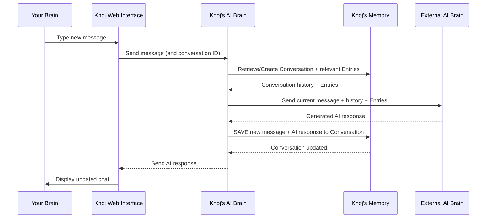

#### A Peek at the Code

Let's look at how the `Conversation` is defined and used in Khoj's code.

First, the `Conversation` model itself, defined in `src/khoj/database/models/__init__.py`. This is the blueprint for how a `Conversation` object is stored in Khoj's database:

```python
# src/khoj/database/models/__init__.py
# ... (imports and other models)

class ChatMessage(PydanticBaseModel):
    message: str
    context: List[Any] = [] # Stores relevant document chunks (Entries)
    onlineContext: Dict[str, Any] = {} # Stores online search results
    # ... more fields for images, code context, etc.
    by: str # "you" or "khoj"
    turnId: Optional[str] = None # Unique ID for each message turn

class Conversation(DbBaseModel):
    user = models.ForeignKey(KhojUser, on_delete=models.CASCADE)
    conversation_log = models.JSONField(default=dict) # The core chat history!
    client = models.ForeignKey(ClientApplication, on_delete=models.CASCADE, default=None, null=True, blank=True)

    slug = models.CharField(max_length=200, default=None, null=True, blank=True) # Internal identifier
    title = models.CharField(max_length=500, default=None, null=True, blank=True) # User-set title
    agent = models.ForeignKey(Agent, on_delete=models.SET_NULL, default=None, null=True, blank=True) # Linked Agent
    file_filters = models.JSONField(default=list) # Files used for context
    id = models.UUIDField(default=uuid.uuid4, editable=False, unique=True, primary_key=True, db_index=True)

    @property
    def messages(self) -> List[ChatMessage]:
        # Helper to get type-hinted chat messages
        validated_messages = []
        for msg in self.conversation_log.get("chat", []):
            try:
                validated_messages.append(ChatMessage.model_validate(msg))
            except ValidationError as e:
                logger.warning(f"Skipping invalid message: {e}")
        return validated_messages
```
This shows the `Conversation` model, holding a `user` link, a `conversation_log` (where all the `ChatMessage` objects are stored), `title` and `slug`, `agent` link, and `file_filters`. The `ChatMessage` Pydantic model shows the rich detail stored for each turn.

When you send a message, the main chat API endpoint in `src/khoj/routers/api_chat.py` is called. At the end of its processing, it calls `save_to_conversation_log` to record the interaction:

```python
# src/khoj/routers/api_chat.py
# ... (imports and other functions)

@api_chat.post("")
@requires(["authenticated"])
async def chat(
    request: Request,
    common: CommonQueryParams,
    body: ChatRequestBody,
    # ... (rate limiters and other parameters)
):
    # ... (extract query, conversation ID, other data from body)

    # After LLM generates a response (llm_response, chat_metadata are prepared):
    # This function saves the user query and AI response to the conversation log
    asyncio.create_task(
        save_to_conversation_log(
            q,
            llm_response,
            user,
            meta_log, # This is the conversation_log from the DB
            user_message_time,
            # ... (all the context, references, images, etc.)
            conversation_id=conversation_id, # The ID of the current conversation
        )
    )

    # ... (stream or return response to frontend)
```
This simplified view of the `chat` function shows how it orchestrates the process, ultimately delegating the saving of the conversation to `save_to_conversation_log`. It passes the current `conversation_log` (as `meta_log`) and the `conversation_id`.

The `save_to_conversation_log` function itself (located in `src/khoj/processor/conversation/utils.py`) prepares the message data and then calls `ConversationAdapters.save_conversation`:

```python
# src/khoj/processor/conversation/utils.py
# ... (imports)

async def save_to_conversation_log(
    q: str, # The user's query
    chat_response: str, # The AI's response
    user: KhojUser,
    meta_log: Dict, # The conversation_log (chat history) from the DB
    user_message_time: str = None,
    # ... (many other parameters for context, images, tools)
    conversation_id: str = None,
    # ... (tracer, etc.)
):
    # Prepare metadata for the user's message and Khoj's response
    user_message_metadata = {"created": user_message_time, "images": query_images, "turnId": turn_id}
    khoj_message_metadata = {
        "context": compiled_references,
        "intent": {"inferred-queries": inferred_queries, "type": intent_type},
        "onlineContext": online_results,
        "turnId": turn_id,
        "images": generated_images,
        # ... (other contextual data)
    }

    # Add the new user message and Khoj response to the conversation log
    updated_conversation = message_to_log(
        user_message=q,
        chat_response=chat_response,
        user_message_metadata=user_message_metadata,
        khoj_message_metadata=khoj_message_metadata,
        conversation_log=meta_log.get("chat", []), # Append to existing chat history
    )

    # This is the call that saves the updated conversation to the database!
    await ConversationAdapters.save_conversation(
        user,
        {"chat": updated_conversation},
        client_application=client_application,
        conversation_id=conversation_id,
        user_message=q,
    )
```
This function aggregates all the rich information (user query, AI response, relevant contexts, tool outputs, images) and uses `message_to_log` to format it into `ChatMessage` objects, then calls `ConversationAdapters.save_conversation` to persist it.

The `ConversationAdapters` (in `src/khoj/database/adapters/__init__.py`) is responsible for interacting directly with the `Conversation` database model:

```python
# src/khoj/database/adapters/__init__.py
# ... (imports)

class ConversationAdapters:
    # ... (other methods)

    @staticmethod
    @arequire_valid_user
    async def save_conversation(
        user: KhojUser,
        conversation_log: dict, # The full updated chat history
        client_application: ClientApplication = None,
        conversation_id: str = None,
        user_message: str = None,
    ):
        # Find the conversation by ID, or the most recent one for the user
        if conversation_id:
            conversation = await Conversation.objects.filter(
                user=user, client=client_application, id=conversation_id
            ).afirst()
        else:
            conversation = (
                await Conversation.objects.filter(user=user, client=client_application).order_by("-updated_at").afirst()
            )

        if conversation:
            # If conversation exists, update its log and last updated time
            conversation.conversation_log = conversation_log
            conversation.slug = user_message.strip()[:200] if user_message else None # Update slug/title
            conversation.updated_at = datetime.now(tz=timezone.utc)
            await conversation.asave() # Save changes to database
        else:
            # If no conversation found, create a new one
            await Conversation.objects.acreate(
                user=user, conversation_log=conversation_log, client=client_application, slug=user_message.strip()[:200]
            )

    @staticmethod
    @require_valid_user
    def get_conversation_sessions(user: KhojUser, client_application: ClientApplication = None):
        # This function fetches all conversations for display in the sidebar
        return (
            Conversation.objects.filter(user=user, client=client_application)
            .prefetch_related("agent") # Also grab associated agent details
            .order_by("-updated_at") # Sort by most recent first
        )
```
The `save_conversation` method handles both updating an existing `Conversation` record or creating a new one if it's the first message. The `get_conversation_sessions` method is how Khoj retrieves the list of your past conversations to show in the UI, enabling you to navigate them.

Finally, on the frontend, the `AllConversations` component in `src/interface/web/app/components/allConversations/allConversations.tsx` is responsible for fetching and displaying your list of conversations:

```typescript
// src/interface/web/app/components/allConversations/allConversations.tsx
// ... (imports)

interface ChatHistory {
    conversation_id: string;
    slug: string; // The title/identifier of the conversation
    agent_name: string;
    // ... other metadata
}

// Fetcher function (uses the API endpoint)
const fetchChatHistory = async (url: string) => {
    const response = await fetch(url, { method: "GET" });
    return response.json();
};

export const useChatSessionsFetchRequest = (url: string) => {
    // This hook fetches conversation sessions from the backend
    const { data, isLoading, error } = useSWR<ChatHistory[]>(url, fetchChatHistory);
    return { data, isLoading, error };
};

export default function AllConversations(props: SidePanelProps) {
    // ... (state management)

    // Call the hook to get chat sessions (list of conversations)
    const { data: chatSessions, isLoading } = useChatSessionsFetchRequest(
        authenticatedData ? `/api/chat/sessions` : "", // Calls /api/chat/sessions
    );

    useEffect(() => {
        if (chatSessions) {
            // Process and organize the fetched chat sessions for display
            // ... (grouping by time, etc.)
            setData(chatSessions);
        }
    }, [chatSessions]);

    // ... (render the list of ChatSession components)
}
```
This frontend code uses a `useSWR` hook to call the `/api/chat/sessions` endpoint (which is powered by `ConversationAdapters.get_conversation_sessions` on the backend). It then processes the `chatSessions` data to display your list of conversations, making them easily accessible.

### Conclusion

You've now learned about the backbone of Khoj's memory: the `Conversation`! It's the persistent record of your interactions, storing not just messages but also all the rich context, tool outputs, and linked information. This enables Khoj to maintain a continuous, intelligent dialogue with you, remembering past discussions and building upon them. Understanding `Conversation` is key to appreciating how Khoj provides a truly personalized and contextual AI experience.

Next, we'll dive into the concept of an "Agent," which allows you to interact with different AI personas or specialized helpers within Khoj, each potentially having their own unique `Conversation` settings and capabilities.

[Chapter 8: Agent](08_agent_.md)

---

Generated by [AI Codebase Knowledge Builder](https://github.com/The-Pocket/Tutorial-Codebase-Knowledge)
````

## 04_content_processing_pipeline_.md

````markdown
# Chapter 4: Content Processing Pipeline

In [Chapter 3: Entry (Indexed Content)](03_entry__indexed_content__.md), we learned that Khoj breaks down your large documents into smaller, intelligent chunks called `Entry` objects. These `Entry` objects, with their text, metadata, and special `embeddings`, are what make your content searchable. But how does Khoj *do* all this? How does a raw PDF or Markdown file magically transform into these smart `Entry` objects?

### What Problem Does the Content Processing Pipeline Solve?

Imagine you have a messy stack of physical documents on your desk: a long PDF research paper, some handwritten notes, and a printout of a webpage. You want to be able to quickly find specific information within them, perhaps asking, "What were the key findings in the quantum physics paper?"

If you just stuffed them all into a box, finding anything later would be a nightmare! You'd have to read through everything each time.

This is exactly the problem the **Content Processing Pipeline** solves for your digital documents! It's like a highly efficient **digital librarian** who takes your raw, unorganized files (like PDFs, Markdown notes, or Org-mode files), carefully processes them, and then neatly organizes and categorizes every important piece of information so it can be easily found later.

**Our Goal for this Chapter:** By the end of this chapter, you'll understand the steps Khoj takes behind the scenes to transform your raw files into searchable `Entry` objects, making your "second brain" truly intelligent.

### What is the Content Processing Pipeline?

The Content Processing Pipeline is a series of automated steps Khoj follows whenever you feed it a new document. Its main job is to take raw content and turn it into those valuable `Entry` objects we discussed.

It primarily performs three core operations:

1.  **Extract Text**: First, Khoj needs to read the actual words from your file. If it's a PDF, it needs to get the text out of the PDF format. If it's a Markdown file, it reads the Markdown text. This is like the librarian *reading* your document.
2.  **Split into Chunks**: Large documents are like long books. It's hard to find a specific sentence in a giant book. So, Khoj intelligently breaks down the extracted text into smaller, more manageable pieces – these are the *chunks* that will become individual `Entry` objects. This is like the librarian breaking a big book into smaller, topic-focused sections or flashcards.
3.  **Prepare for Indexing**: For each small chunk, Khoj does the final preparation. It generates that special numerical `embedding` (the "meaning code") and attaches all the useful `metadata` (like the original filename, file type, etc.). This makes each `Entry` ready to be stored and quickly searched. This is like the librarian carefully labeling each flashcard with its topic and where it came from, and adding a secret code that captures its main idea.

### How to Use the Content Processing Pipeline (Indirectly)

You don't directly "start" or "control" the Content Processing Pipeline. It works automatically in the background! Your interaction is simple:

1.  **Upload Your Files**: As we learned in [Chapter 1: Web Interface (Frontend)](01_web_interface__frontend__.md), you simply drag and drop your files (PDFs, Markdown, etc.) into the Khoj Web Interface.
    ```markdown
    
    ```
2.  **Khoj Handles the Rest**: Once you upload, Khoj's Content Processing Pipeline springs into action, performing the extract, split, and prepare steps automatically. You'll get a notification when your content is successfully indexed!

This "set it and forget it" approach makes Khoj incredibly easy to use.

### Under the Hood: The Journey of a Document

Let's trace the path of a document, say a `my_report.pdf`, through the Content Processing Pipeline.

#### Step-by-Step Walkthrough

1.  **You Upload `my_report.pdf`**: You drag and drop `my_report.pdf` into the Khoj chat window.
2.  **Web Interface Sends File**: The Khoj Web Interface sends your PDF file to the Khoj Backend.
3.  **Backend Receives & Delegates**: The Khoj Backend receives the file and tells the Content Processing Pipeline, "Hey, process this PDF!"
4.  **Content Pipeline Processes**: This is where the magic happens:
    *   **Extraction**: The pipeline uses specialized tools to open the PDF and extract all its text content.
    *   **Chunking**: It then takes this extracted text and intelligently breaks it down into smaller, meaningful chunks. For example, a 20-page PDF might become 50-100 smaller chunks. Each chunk is now ready to become an `Entry`.
    *   **Preparation**: For each chunk, Khoj calculates its unique `embedding` (numerical representation of its meaning) and attaches all relevant `metadata` (like the original filename `my_report.pdf`, file type `pdf`, etc.).
5.  **Storing `Entry` Objects**: These fully formed `Entry` objects are then saved into Khoj's database, ready to be searched.
6.  **Confirmation**: Khoj sends a message back to your Web Interface, confirming that `my_report.pdf` has been successfully indexed.

Here's a simplified sequence diagram of this process:

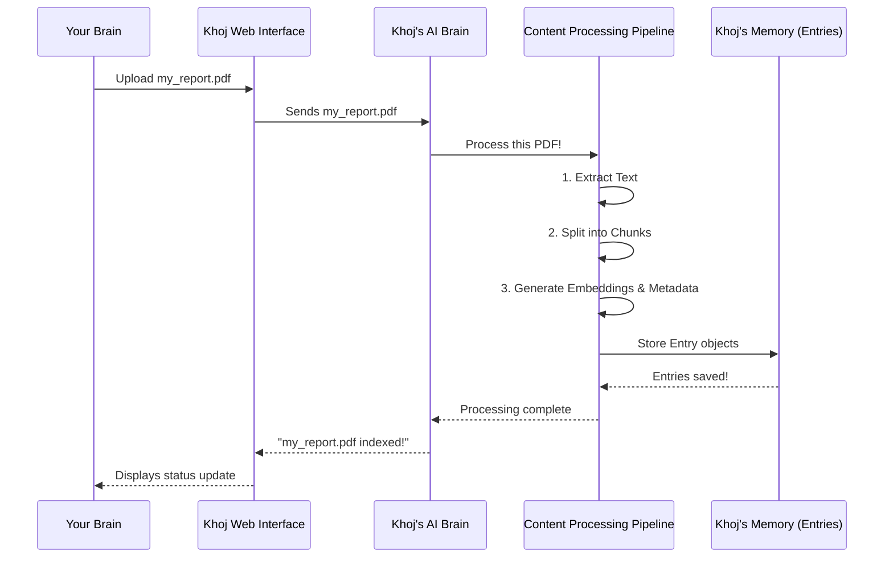

#### A Peek at the Code

Let's look at some simplified code snippets to see how this pipeline is built.

When you upload a file, the `indexer` function in `src/khoj/routers/api_content.py` is called. This is the entry point for your files:

```python
# src/khoj/routers/api_content.py
# ... imports and setup

async def indexer(
    request: Request,
    files: list[UploadFile], # This is your uploaded file, like my_report.pdf!
    # ... other parameters
):
    user = request.user.object
    index_files: Dict[str, Dict[str, str]] = {
        "pdf": {}, # Your PDF will go here
        # ... other file types
    }
    for file in files: # Loop through uploaded files
        file_data = get_file_content(file) # Get content and type
        if file_data.file_type in index_files:
            # Store content for its type (e.g., pdf's content in index_files["pdf"])
            index_files[file_data.file_type][file_data.name] = file_data.content
        # ... (error handling for unsupported files)

    indexer_input = IndexerInput(pdf=index_files["pdf"]) # Prepare input for processing
    
    # This function orchestrates the actual content processing
    success = await loop.run_in_executor(
        None, configure_content, user, indexer_input.model_dump(), # Pass input to pipeline
        regenerate, t,
    )
    # ... (handle success/failure)
```
This `indexer` function first takes your uploaded `files`, determines their type, and then prepares them to be sent to `configure_content`. `configure_content` is the conductor of our Content Processing Pipeline.

Next, within `configure_content` (which is a helper function that orchestrates the entire process, defined in `src/khoj/routers/helpers.py`), different "processors" are called based on the file type. For a PDF, `PdfToEntries` (from `src/khoj/processor/content/pdf/pdf_to_entries.py`) is used:

```python
# src/khoj/processor/content/pdf/pdf_to_entries.py
# ... imports

class PdfToEntries(TextToEntries):
    def __init__(self):
        super().__init__()

    def process(self, files: dict[str, bytes], user: KhojUser, regenerate: bool = False) -> Tuple[int, int]:
        # Step 1: Extract text from PDF files
        file_to_text_map, current_entries = PdfToEntries.extract_pdf_entries(files)

        # Step 2: Split extracted entries into smaller chunks
        current_entries = self.split_entries_by_max_tokens(current_entries, max_tokens=256)

        # Step 3: Generate embeddings and save Entry objects to database
        num_new_embeddings, num_deleted_embeddings = self.update_embeddings(
            user,
            current_entries,
            DbEntry.EntryType.PDF,
            DbEntry.EntrySource.COMPUTER,
            "compiled",
            # ... other parameters
        )
        return num_new_embeddings, num_deleted_embeddings

    @staticmethod
    def extract_text(pdf_file_content: bytes):
        """Extract text from a single PDF file (raw bytes)."""
        # Uses an external library (PyMuPDFLoader) to read the PDF and get text
        loader = PyMuPDFLoader(tmpf.name) # Simplified: this happens in a temp file
        pdf_entries_per_file = loader.load()
        # Clean text by removing null bytes and invalid characters
        pdf_entry_by_pages = [PdfToEntries.clean_text(page.page_content) for page in pdf_entries_per_file]
        return pdf_entry_by_pages
```
The `process` method within `PdfToEntries` clearly shows our three pipeline steps: `extract_pdf_entries` (for extraction), `split_entries_by_max_tokens` (for chunking), and `update_embeddings` (for preparing/indexing). The `extract_text` static method is the core of the extraction step for PDFs. Similar classes exist for Markdown (`MarkdownToEntries`) and Org-mode files (`OrgToEntries`).

The crucial `split_entries_by_max_tokens` and `update_embeddings` methods are defined in `src/khoj/processor/content/text_to_entries.py`, as they are common to most text-based files.

First, the splitting:

```python
# src/khoj/processor/content/text_to_entries.py
# ... imports

class TextToEntries(ABC):
    # ... (other methods)

    @staticmethod
    def split_entries_by_max_tokens(
        entries: List[Entry], max_tokens: int = 256, max_word_length: int = 500, raw_is_compiled: bool = False
    ) -> List[Entry]:
        "Split entries if compiled entry length exceeds the max tokens supported by the ML model."
        chunked_entries: List[Entry] = []
        for entry in entries:
            if is_none_or_empty(entry.compiled): continue

            # This intelligently breaks text into smaller chunks
            text_splitter = RecursiveCharacterTextSplitter(
                chunk_size=max_tokens,
                separators=["\n\n", "\n", "!", "?", ".", " ", "\t", ""], # Defines how to split
                # ... (more splitting logic)
            )
            chunked_entry_chunks = text_splitter.split_text(entry.compiled)
            corpus_id = uuid.uuid4() # Unique ID for this set of related chunks

            for chunk_index, compiled_entry_chunk in enumerate(chunked_entry_chunks):
                # Create a new Entry object for each chunk
                chunked_entries.append(
                    Entry(
                        compiled=compiled_entry_chunk,
                        raw=entry.raw,
                        heading=entry.heading,
                        file=entry.file,
                        corpus_id=corpus_id, # Link back to the original content
                    )
                )
        return chunked_entries
```
This `split_entries_by_max_tokens` method takes the long text extracted from your document and, using a `RecursiveCharacterTextSplitter`, cleverly breaks it down into smaller, defined `Entry` chunks. It prioritizes splitting by paragraphs, then sentences, then words, to keep chunks as meaningful as possible.

Finally, the `update_embeddings` method generates the numerical `embeddings` and saves the `Entry` objects:

```python
# src/khoj/processor/content/text_to_entries.py
# ... imports

class TextToEntries(ABC):
    # ... (other methods)

    def update_embeddings(
        self,
        user: KhojUser,
        current_entries: List[Entry], # These are the chunks we just created!
        file_type: str,
        file_source: str,
        key="compiled",
        # ... other parameters
    ):
        embeddings = []
        model = get_default_search_model() # Get the AI model for generating embeddings

        # This is where the magic happens: convert text to numerical embeddings!
        data_to_embed = [getattr(entry, key) for entry in current_entries]
        embeddings += self.embeddings_model[model.name].embed_documents(data_to_embed)

        added_entries: list[DbEntry] = []
        # Loop through each chunk and its generated embedding
        for entry_hash, new_embedding in zip(hashes_to_process, embeddings):
            entry = hash_to_current_entries[entry_hash] # Get the original Entry chunk
            # Create a database Entry object and save it
            added_entries.append(
                DbEntry(
                    user=user,
                    embeddings=new_embedding, # Store the numerical embedding!
                    raw=entry.raw,
                    compiled=entry.compiled,
                    file_path=entry.file,
                    file_source=file_source,
                    file_type=file_type,
                    hashed_value=entry_hash,
                    corpus_id=entry.corpus_id,
                    # ... other fields
                )
            )
        # Efficiently save all new Entry objects to the database
        DbEntry.objects.bulk_create(added_entries)
        # ... (handling for existing entries, deletions, etc.)
```
The `update_embeddings` function is the final step where the processed text chunks are transformed into their numerical `embeddings` using Khoj's embedding model. These `DbEntry` objects (the database representation of `Entry` objects) are then efficiently saved to Khoj's database, making them ready for search.

### Conclusion

You've now seen the full journey a document takes within Khoj! The Content Processing Pipeline is Khoj's unsung hero, quietly working behind the scenes to extract, split, and prepare your raw files into structured `Entry` objects. This meticulous process ensures that every piece of information in your "second brain" is ready for intelligent retrieval and interaction.

Next, we'll explore how Khoj actually *uses* these `Entry` objects and their powerful `embeddings` to find the exact information you need, incredibly fast!

[Chapter 5: Search & Embeddings](05_search___embeddings_.md)

---

Generated by [AI Codebase Knowledge Builder](https://github.com/The-Pocket/Tutorial-Codebase-Knowledge)
````

## index.md

````markdown
# Tutorial: khoj

Khoj is your *personal AI brain* designed to help you *quickly find answers*, *generate content*, and *manage your knowledge* from both your private notes and the vast public internet. It functions as an *intelligent assistant* by organizing your diverse data, maintaining continuous dialogues, and even interacting with web browsers on your behalf to accomplish tasks.


**Source Repository:** [https://github.com/khoj-ai/khoj.git](https://github.com/khoj-ai/khoj.git)

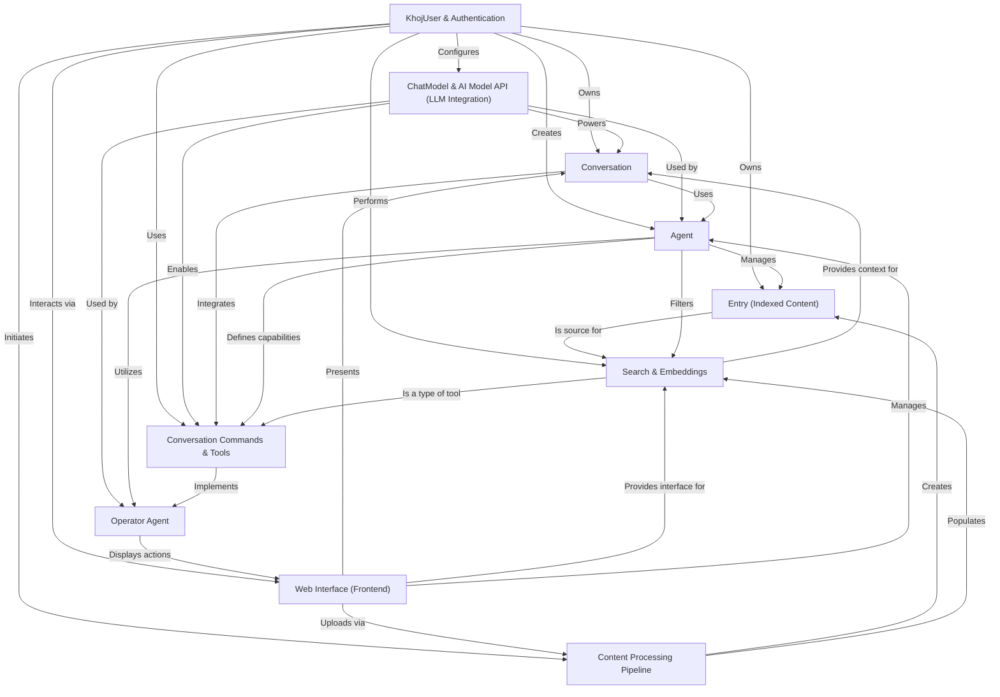

## Chapters

1. [Web Interface (Frontend)
](01_web_interface__frontend__.md)
2. [KhojUser & Authentication
](02_khojuser___authentication_.md)
3. [Entry (Indexed Content)
](03_entry__indexed_content__.md)
4. [Content Processing Pipeline
](04_content_processing_pipeline_.md)
5. [Search & Embeddings
](05_search___embeddings_.md)
6. [ChatModel & AI Model API (LLM Integration)
](06_chatmodel___ai_model_api__llm_integration__.md)
7. [Conversation
](07_conversation_.md)
8. [Agent
](08_agent_.md)
9. [Conversation Commands & Tools
](09_conversation_commands___tools_.md)
10. [Operator Agent
](10_operator_agent_.md)


---

Generated by [AI Codebase Knowledge Builder](https://github.com/The-Pocket/Tutorial-Codebase-Knowledge)
````

## 08_agent_.md

````markdown
# Chapter 8: Agent

In [Chapter 7: Conversation](07_conversation.md), we discovered how Khoj remembers your entire chat history, allowing for continuous and contextual dialogue. This "memory" is fantastic for general questions and ongoing discussions. But what if you need a specialized assistant? Someone who excels in a very specific field, has a particular way of talking, or only focuses on certain documents?

### What Problem Does "Agent" Solve?

Imagine you have a single, very smart general assistant (which is what Khoj is by default). This assistant is great for everything, but sometimes you wish you had a dedicated expert for a particular task. For example:

*   A **"Biologist"** who can answer questions only from your research papers on marine life.
*   A **"Code Expert"** who can help you debug Python scripts and search your code repositories.
*   A **"Personal Chef"** who suggests recipes and food facts from your recipe notes.

If your general assistant tried to be all these things at once, its responses might become muddled, or it might get confused about which set of notes to focus on.

This is exactly what the **Agent** concept solves! An `Agent` in Khoj is like hiring a **specialized AI employee** for your personal office. Each Agent has a unique job description, a distinct personality, and a specific set of skills (tools) and knowledge (documents).

**Our Goal for this Chapter:** By the end of this chapter, you'll understand what an `Agent` is, how to create one, and how it transforms Khoj into a collection of specialized AI assistants.

### What is an Agent?

An `Agent` is a customizable AI persona within Khoj. It allows you to mold Khoj into a specialized helper tailored to your specific needs. Each `Agent` can have:

*   **Name & Personality (`persona`)**: You give it a name (e.g., "Biologist") and a detailed `persona` (like a system prompt) that defines its expertise, tone, and overall approach. This dictates how it "thinks" and responds.
*   **Appearance (Icon & Color)**: Each Agent can have a unique icon and color, making it easy to identify visually in your conversations.
*   **Dedicated Knowledge Base (`files`)**: You can link an Agent to a specific set of your indexed [Entry](03_entry__indexed_content__.md) objects (files). This means it will primarily use *those* documents when answering questions, making its knowledge highly focused.
*   **Specific AI Brain (`chat_model`)**: You can assign a particular [ChatModel](06_chatmodel___ai_model_api__llm_integration__.md) (LLM) to an Agent. So, your "Code Expert" might use a model better suited for code, while your "Creative Writer" might use a different one.
*   **Allowed Tools (`input_tools`)**: Agents can be restricted to use only certain "tools" (like web search or code execution, which we'll explore in [Chapter 9: Conversation Commands & Tools](09_conversation_commands___tools_.md)). This ensures it only performs actions relevant to its role.
*   **Allowed Output Modes (`output_modes`)**: Similarly, Agents can be limited to specific output formats (e.g., generating images or diagrams).
*   **Privacy Level (`privacy_level`)**: Agents can be `public` (visible to all users on a server), `protected` (sharable via link), or `private` (only visible to you).

It's like giving your AI assistant a specialized uniform, a training manual for a specific job, and a restricted set of tools.

### How to Use Agents: Creating a Specialized Assistant

Let's walk through how you would create a new "Biologist" Agent and use it to chat about your marine biology notes.

**Central Use Case: Creating a "Biologist" Agent and Chatting with it.**

1.  **Upload Relevant Files**: First, make sure your marine biology research papers and notes are already indexed in Khoj (as discussed in [Chapter 3: Entry (Indexed Content)](03_entry__indexed_content__.md)).
    ```markdown
    
    ```
2.  **Navigate to the Agents Page**: In the Khoj Web Interface, click on "Agents" in the sidebar. This will show you a list of existing Agents.
    ```markdown
    
    ```
3.  **Create a New Agent**: Click the "Add Agent" or "Create" button. You'll see a form to configure your new Agent.
    *   **Name**: Type "Biologist".
    *   **Personality**: Enter a detailed prompt, e.g., "You are an excellent marine biologist. Your goal is to provide accurate and detailed answers about marine ecosystems, species, and oceanography, strictly adhering to the context of the provided documents. If the answer is not in the documents, state that you cannot answer from the provided information."
    *   **Knowledge Base (`files`)**: Select your marine biology PDF files or notes from the list of indexed documents.
    *   **Chat Model**: Choose a suitable [ChatModel](06_chatmodel___ai_model_api__llm_integration__.md) (e.g., `gpt-4o-mini`).
    *   **Icon & Color**: Pick a marine-themed icon and a blue/green color.
    *   **Privacy Level**: Set it to "private" if it's just for you.
4.  **Save Your Agent**: Click "Save" or "Create". Your new "Biologist" Agent is now available!
5.  **Start a Chat with Your New Agent**:
    *   From the Agents page, click the "Start Chatting" button on your "Biologist" Agent card.
    *   This will open a new [Conversation](07_conversation.md) linked specifically to your "Biologist" Agent.
6.  **Ask a Question**: In the chat, type: "What are the common feeding habits of deep-sea hydrothermal vent organisms?"
    *   Because you're chatting with the "Biologist" Agent, Khoj will *only* search your marine biology notes and use the "Biologist" persona to formulate the answer. It won't get distracted by your notes on quantum physics or your shopping lists!

### Under the Hood: How Agents Influence Khoj's Behavior

When you create or select an Agent, a lot happens behind the scenes to customize Khoj's responses.

#### Step-by-Step Walkthrough

1.  **You Configure and Save an Agent**: You fill out the Agent creation form (name, persona, files, model, etc.) on the Web Interface.
2.  **Web Interface Sends Agent Data**: Your browser sends this configuration data to the Khoj Backend.
3.  **Backend Stores Agent**: The Khoj Backend saves a new `Agent` object in its [Database](03_entry__indexed_content__.md), linking it to your [KhojUser](02_khojuser___authentication_.md). It also updates the `FileObject` and `Entry` objects if you assigned specific files to the Agent.
4.  **You Start a `Conversation` with the Agent**: When you click "Start Chatting" for your "Biologist" Agent, Khoj creates a new [Conversation](07_conversation.md) and explicitly links it to that specific `Agent` object.
5.  **Query Processing with Agent Context**: When you type a message in this Agent-specific conversation:
    *   The Khoj Backend identifies the current `Conversation` and, crucially, the `Agent` linked to it.
    *   It fetches the `Agent`'s `persona`, `chat_model`, `input_tools`, `output_modes`, and `files` list.
    *   **Search & Embeddings**: When performing [Search & Embeddings](05_search___embeddings_.md) to find relevant [Entry](03_entry__indexed_content__.md) objects, Khoj filters the search results to primarily (or exclusively) include entries from the `files` linked to this Agent.
    *   **LLM Prompting**: The Agent's `persona` is added as a "system message" or instructions to the [ChatModel](06_chatmodel___ai_model_api__llm_integration__.md) (LLM) before your query is sent. This ensures the LLM adopts the Agent's defined personality.
    *   **Tool/Output Restriction**: The `input_tools` and `output_modes` tell Khoj which special capabilities the Agent is allowed to use or display.
6.  **LLM Generates Response**: The LLM, now acting as your specialized Agent, generates a response based on the focused context and its defined persona.
7.  **Response Display**: The answer is sent back to your Web Interface and displayed.

Here's a simplified sequence diagram:

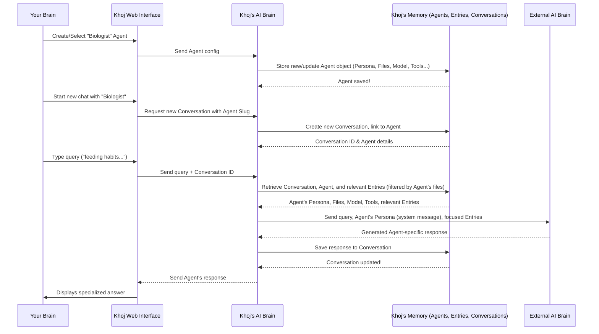

#### A Peek at the Code

Let's look at the actual code that defines and manages Agents.

First, the `Agent` model itself, defined in `src/khoj/database/models/__init__.py`. This is the blueprint for how an `Agent` object is stored in Khoj's database:

```python
# src/khoj/database/models/__init__.py
# ... (imports and other models)

class Agent(DbBaseModel):
    # ... (StyleColorTypes, StyleIconTypes, PrivacyLevel, InputToolOptions, OutputModeOptions definitions)

    creator = models.ForeignKey(KhojUser, on_delete=models.CASCADE, default=None, null=True, blank=True)
    name = models.CharField(max_length=200)
    personality = models.TextField(default=None, null=True, blank=True) # The "persona"
    input_tools = ArrayField(models.CharField(max_length=200, choices=InputToolOptions.choices), default=list)
    output_modes = ArrayField(models.CharField(max_length=200, choices=OutputModeOptions.choices), default=list)
    managed_by_admin = models.BooleanField(default=False)
    chat_model = models.ForeignKey(ChatModel, on_delete=models.CASCADE) # Link to AI brain
    slug = models.CharField(max_length=200, unique=True) # Unique identifier
    style_color = models.CharField(max_length=200, choices=StyleColorTypes.choices, default=StyleColorTypes.ORANGE)
    style_icon = models.CharField(max_length=200, choices=StyleIconTypes.choices, default=StyleIconTypes.LIGHTBULB)
    privacy_level = models.CharField(max_length=30, choices=PrivacyLevel.choices, default=PrivacyLevel.PRIVATE)
    is_hidden = models.BooleanField(default=False)

    def save(self, *args, **kwargs):
        # ... (logic for auto-generating slug and setting managed_by_admin)
        super().save(*args, **kwargs)

    def __str__(self):
        return self.name
```
This simplified `Agent` model shows how the `persona`, `chat_model` (linked to `ChatModel` via `ForeignKey`), `input_tools`, `output_modes`, `privacy_level`, and visual styles are all defined. The `slug` is a unique, URL-friendly identifier for the agent.

The `AgentAdapters.aupdate_agent` function (in `src/khoj/database/adapters/__init__.py`) handles creating and updating Agents, including associating them with `FileObject` (the underlying file representation of your knowledge base):

```python
# src/khoj/database/adapters/__init__.py
# ...

class AgentAdapters:
    # ... (other methods)

    @arequire_valid_user
    async def aupdate_agent(
        user: KhojUser,
        name: str,
        personality: str,
        privacy_level: str,
        icon: str,
        color: str,
        chat_model: Optional[str],
        files: List[str], # List of filenames for the knowledge base
        input_tools: List[str],
        output_modes: List[str],
        slug: Optional[str] = None,
        is_hidden: Optional[bool] = False,
    ):
        # Find the ChatModel object based on its name
        chat_model_option = await ChatModel.objects.filter(name=chat_model).afirst()

        # Update or create the Agent in the database
        agent, created = await Agent.objects.filter(slug=slug, creator=user).aupdate_or_create(
            defaults={
                "name": name, "creator": user, "personality": personality, "privacy_level": privacy_level,
                "style_icon": icon, "style_color": color, "chat_model": chat_model_option,
                "input_tools": input_tools, "output_modes": output_modes, "is_hidden": is_hidden,
            }
        )

        # Delete old files and entries linked to this agent
        await FileObject.objects.filter(agent=agent).adelete()
        await Entry.objects.filter(agent=agent).adelete()

        # Link new files and duplicate their entries for the agent's knowledge base
        for file in files:
            reference_file = await FileObject.objects.filter(file_name=file, user=agent.creator).afirst()
            if reference_file:
                await FileObject.objects.acreate(file_name=file, agent=agent, raw_text=reference_file.raw_text)

                # Duplicate all entries associated with the file, linking them to the agent
                entries: List[Entry] = []
                async for entry in Entry.objects.filter(file_path=file, user=agent.creator).aiterator():
                    entries.append(
                        Entry(
                            agent=agent, # Crucial: Link this entry to the new agent!
                            embeddings=entry.embeddings, raw=entry.raw, compiled=entry.compiled,
                            file_path=entry.file_path, file_name=entry.file_name,
                            # ... (other fields copied from original entry)
                        )
                    )
                await Entry.objects.abulk_create(entries) # Efficiently save all new entries

        return agent
```
This function is powerful! When you provide a list of `files`, it duplicates the `FileObject` and all its associated `Entry` objects, linking them specifically to your new `Agent`. This creates a separate, dedicated knowledge base for that Agent without affecting your main personal knowledge base.

On the frontend, the `AgentCard` component (`src/interface/web/app/components/agentCard/agentCard.tsx`) is responsible for displaying Agent information and handling interactions like starting a chat:

```typescript
// src/interface/web/app/components/agentCard/agentCard.tsx
// ... (imports)

export interface AgentData {
    slug: string; // The unique identifier
    name: string;
    persona: string;
    color: string;
    icon: string;
    privacy_level: string;
    files?: string[]; // Files linked to this agent
    chat_model: string;
    input_tools: string[];
    output_modes: string[];
    // ... other fields
}

async function openChat(slug: string, userData: UserProfile | null) {
    // This sends a request to the backend to create a new conversation linked to this agent
    const response = await fetch(`/api/chat/sessions?agent_slug=${encodeURIComponent(slug)}`, {
        method: "POST",
    });
    const data = await response.json();
    if (response.status == 200) {
        // Redirect to the new conversation page
        window.location.href = `/chat?conversationId=${data.conversation_id}`;
    } else {
        // ... (error handling)
    }
}

export function AgentCard(props: AgentCardProps) {
    // ... (component setup, form for editing)

    return (
        <Card>
            {/* ... (Card Header, Title, Popover for options) */}
            <Button
                onClick={() => openChat(props.data.slug, userData)} // Calls openChat with the agent's slug
            >
                <PaperPlaneTilt />
                Start Chatting
            </Button>
            {/* ... (Card Content, Footer displaying badges) */}
        </Card>
    );
}
```
The `AgentData` interface mirrors the backend `Agent` model. The `openChat` function is called when you click "Start Chatting." It makes an API call to `/api/chat/sessions` (with the `agent_slug`) to create a new [Conversation](07_conversation.md) linked to that Agent, and then redirects you to that new conversation.

On the backend, when `openChat` calls `/api/chat/sessions`, the `acreate_conversation_session` adapter (`src/khoj/database/adapters/__init__.py`) is used:

```python
# src/khoj/database/adapters/__init__.py
# ...

class ConversationAdapters:
    # ... (other methods)

    @staticmethod
    @arequire_valid_user
    async def acreate_conversation_session(
        user: KhojUser, client_application: ClientApplication = None, agent_slug: str = None, title: str = None
    ):
        if agent_slug:
            # If an agent_slug is provided, find that agent
            agent = await AgentAdapters.aget_readonly_agent_by_slug(agent_slug, user)
            if agent is None:
                raise HTTPException(status_code=400, detail="No such agent currently exists.")
            # Create a new Conversation, explicitly linking it to the found agent
            return await Conversation.objects.acreate(user=user, client=client_application, agent=agent, title=title)
        # If no agent_slug, use the default agent
        agent = await AgentAdapters.aget_default_agent()
        return await Conversation.objects.acreate(user=user, client=client_application, agent=agent, title=title)
```
This method checks if an `agent_slug` is provided. If so, it fetches the corresponding `Agent` object and then creates a new `Conversation` instance with `agent=agent`. This permanently links the conversation to your chosen Agent.

Finally, when Khoj performs a search during a conversation, the `search_with_embeddings` function (from `src/khoj/database/adapters/__init__.py`, which we saw in [Chapter 5: Search & Embeddings](05_search___embeddings_.md)) takes the `agent` into account:

```python
# src/khoj/database/adapters/__init__.py
# ...

class EntryAdapters:
    # ...

    @staticmethod
    def search_with_embeddings(
        raw_query: str,
        embeddings: Tensor,
        user: KhojUser,
        max_results: int = 10,
        file_type_filter: str = None,
        max_distance: float = math.inf,
        agent: Agent = None, # The Agent linked to the current conversation
    ):
        owner_filter = Q()
        if user != None:
            owner_filter = Q(user=user)
        if agent != None:
            owner_filter |= Q(agent=agent) # Add filter for entries owned by the agent

        # ... (further filtering and sorting)

        relevant_entries = EntryAdapters.apply_filters(user, raw_query, file_type_filter, agent)
        relevant_entries = relevant_entries.filter(owner_filter).annotate(
            distance=CosineDistance("embeddings", embeddings)
        )
        # ... (rest of the search logic)
        return relevant_entries[:max_results]
```
The `owner_filter` ensures that when an `agent` is present, the search primarily targets `Entry` objects specifically associated with that `agent`. This is how your "Biologist" Agent only consults your marine biology notes.

### Conclusion

You've just unlocked a powerful capability in Khoj: the `Agent`! You learned that an Agent is a customizable AI persona with its own name, personality, dedicated knowledge base, preferred AI brain, and specific tools. By creating and using Agents, you can transform Khoj into a team of specialized assistants, each perfectly suited for different aspects of your digital life. This allows for highly focused and contextual interactions, making your personal AI even more powerful.

Next, we'll dive deeper into those "tools" and "output modes" that Agents can use, exploring the various "Conversation Commands & Tools" that extend Khoj's capabilities beyond just answering questions.

[Chapter 9: Conversation Commands & Tools](09_conversation_commands___tools_.md)

---

Generated by [AI Codebase Knowledge Builder](https://github.com/The-Pocket/Tutorial-Codebase-Knowledge)
````

## 02_khojuser___authentication_.md

````markdown
# Chapter 2: KhojUser & Authentication

In [Chapter 1: Web Interface (Frontend)](01_web_interface__frontend__.md), we learned how to interact with Khoj through your web browser, typing questions and seeing answers appear. But what if you have private notes, personal conversations, or want to make sure only *you* can access your second brain? This is where KhojUser & Authentication comes in!

### What Problem Does KhojUser & Authentication Solve?

Imagine Khoj as your super-smart personal assistant, holding all your private thoughts, documents, and conversations. You wouldn't want just anyone to walk up to your assistant and start asking questions or digging through your data, right?

KhojUser & Authentication is like the **ID card and security gate** for your personal AI brain. It ensures that:
*   Only **you** (or people you explicitly authorize) can access your private data.
*   Your settings and preferences are **saved just for you**.
*   You can securely **log in** from different devices or applications.

**Our Goal for this Chapter:** By the end of this chapter, you'll understand what a "KhojUser" is, how to log in to Khoj, and how the system keeps your access secure.

### What is a KhojUser?

A `KhojUser` is simply **you** within the Khoj system. It's your unique identity. When you create an account, Khoj creates a `KhojUser` profile for you. This profile stores basic information like your email and username, and it's linked to all your indexed content, conversations, and custom settings.

Think of it as your digital passport for your personal AI.

### How Does Authentication Work?

Authentication is the process of Khoj **verifying your identity**. It's how Khoj confirms that the person trying to access the system is actually you. Khoj offers a few friendly ways to do this:

1.  **Email (Magic Link)**: You enter your email, and Khoj sends you a special link. Clicking this link logs you in automatically, without needing a password. It's like being handed a temporary, secure key!
2.  **Google Account**: You can sign in using your existing Google account. This is super convenient as Google handles the identity verification for you.
3.  **API Keys**: For other applications (like the Khoj Desktop app or plugins for tools like Emacs or Obsidian), you can generate a special "API Key." This key is like a secret token that these applications use to prove they are authorized by *you* to access your Khoj data.

### How to Use KhojUser & Authentication: Logging In

Let's walk through the most common way to use KhojUser & Authentication: logging in.

1.  **Go to Khoj**: Open your web browser and go to [Khoj Cloud](https://app.khoj.dev) (or your self-hosted Khoj server).
2.  **Choose Your Login Method**: You'll see options to sign in, often including "Continue with Google" or an email input for a "magic link."
    *   **Using Google**: Click "Continue with Google," select your Google account, and follow the prompts. You'll be redirected back to Khoj.
    *   **Using Email**: Enter your email address and click "Send Magic Link." Check your email inbox for a link from Khoj. Click that link, and you'll be logged in!

```markdown

```

Once logged in, you can access all your private data and conversations.

#### Managing API Keys for Other Khoj Clients

If you want to connect other Khoj clients (like the desktop application), you'll need an API key:

1.  **Log In**: First, log into the Khoj Web Interface as described above.
2.  **Go to Settings**: Look for a "Settings" or "Profile" area (often a gear icon or your profile picture).
3.  **Generate API Key**: Within settings, there will be an option to manage API keys. You can typically give your key a name (e.g., "My Desktop") and generate it. Copy this key – you'll usually only see it once!

```markdown
```json
{
  "token": "kk-your-secret-api-key-here",
  "name": "My Desktop"
}
```
This is an example of what an API key might look like when generated. You would then copy `kk-your-secret-api-key-here` into your other Khoj applications.

### Under the Hood: How Authentication Works

Let's peek behind the curtain to see what happens when you log in or generate an API key.

#### The Login Flow (Simplified)

When you try to log in via the web interface:

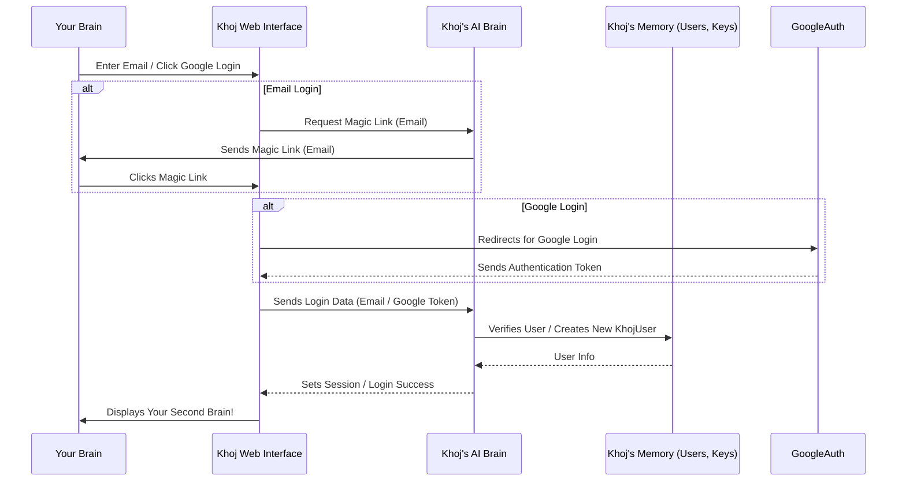

This diagram shows that your web browser talks to the Khoj Backend, which then talks to Khoj's Database to verify who you are.

#### A Peek at the Code

Khoj uses a few key components to handle users and authentication.

First, let's see how the web interface `src/interface/web/app/common/auth.ts` checks if you're logged in:

```typescript
// src/interface/web/app/common/auth.ts
// ... imports
export interface UserProfile {
    email: string;
    username: string;
    photo: string;
    // ... other user details
}

const fetcher = (url: string) =>
    window
        .fetch(url)
        .then((res) => res.json())
        .catch((err) => console.warn(err));

export function useAuthenticatedData() {
    const { data, error, isLoading } = useSWR<UserProfile>("/api/v1/user", fetcher, {
        revalidateOnFocus: false,
    });

    if (data?.detail === "Forbidden") {
        return { data: null, error: "Forbidden", isLoading: false };
    }

    return { data, error, isLoading };
}
```
This `useAuthenticatedData` function is a "hook" that web pages use to see if there's a logged-in user. It makes a request to `/api/v1/user` on the Khoj Backend. If it gets user data back, it means you're authenticated!

Now, on the Backend side, in `src/khoj/routers/auth.py`, you'll find the logic for logging in. Here's a simplified look at the magic link login:

```python
# src/khoj/routers/auth.py
# ... imports and setup

@auth_router.post("/magic")
async def login_magic_link(request: Request, form: MagicLinkForm):
    # This checks if the email is valid and finds or creates a user
    user, is_new = await aget_or_create_user_by_email(form.email, check_deliverability=False)

    if not user:
        raise HTTPException(status_code=404, detail="Invalid email address.")

    # A unique code is generated for the magic link
    unique_id = user.email_verification_code
    # And then an email is sent with this code
    await send_magic_link_email(user.email, unique_id, request.base_url)

    return Response(status_code=200)

@auth_router.get("/magic")
async def sign_in_with_magic_link(request: Request, code: str, email: str):
    # When you click the magic link, this endpoint is called
    user, code_is_expired = await aget_user_validated_by_email_verification_code(code, email)

    if user and not code_is_expired:
        # If the code is valid and not expired, the user's session is created
        request.session["user"] = {"email": user.email}
        return RedirectResponse(url="/") # Redirect to the main page
    return Response(status_code=401) # Login failed
```
The first snippet handles sending the magic link email, and the second snippet verifies the code from the magic link and logs you in by setting your "session" (which is like a temporary ID card for your browser).

For API keys, the `generate_token` function is used:

```python
# src/khoj/routers/auth.py
# ...
@auth_router.post("/token")
@requires(["authenticated"], redirect="login_page")
async def generate_token(request: Request, token_name: Optional[str] = None):
    "Generate API token for given user"
    token = await acreate_khoj_token(user=request.user.object, name=token_name)
    return {
        "token": token.token,
        "name": token.name,
    }
```
This code, when you're already logged in (`@requires(["authenticated"])`), generates a new `KhojApiUser` (your API key) in the database and returns it.

At the heart of the backend's authentication is `UserAuthenticationBackend` in `src/khoj/configure.py`. This is where Khoj decides if an incoming request (from your browser or a client app) is authenticated.

```python
# src/khoj/configure.py
# ... imports

class UserAuthenticationBackend(AuthenticationBackend):
    async def authenticate(self, request: HTTPConnection):
        # 1. Check if user is logged in via browser session
        current_user = request.session.get("user")
        if current_user and current_user.get("email"):
            # ... fetches user from database ...
            return AuthCredentials(["authenticated"]), AuthenticatedKhojUser(user)

        # 2. Check for API key (Bearer token from Desktop/Emacs/Obsidian)
        if len(request.headers.get("Authorization", "").split("Bearer ")) == 2:
            bearer_token = request.headers["Authorization"].split("Bearer ")[1]
            # ... fetches user linked to this token from database ...
            return AuthCredentials(["authenticated"]), AuthenticatedKhojUser(user_with_token.user)

        # 3. Check for Whatsapp client (uses client_id and phone_number)
        client_id = request.query_params.get("client_id")
        if client_id:
            # ... complex logic to authenticate by phone number and client application ...
            return AuthCredentials(["authenticated"]), AuthenticatedKhojUser(user, client_application)

        # If none of the above, user is unauthenticated
        return AuthCredentials(), UnauthenticatedUser()
```
This `authenticate` method is called for almost every incoming request. It checks multiple places to see if you're logged in: your browser's "session" (for web logins), the "Authorization" header for API keys, or specific query parameters for other clients. If it finds a valid credential, it tells Khoj that you are an authenticated user.

Behind these backend functions, there are models (like blueprints for data) defined in `src/khoj/database/models/__init__.py`.

```python
# src/khoj/database/models/__init__.py
# ... imports

class KhojUser(AbstractUser):
    uuid = models.UUIDField(default=uuid.uuid4, editable=False)
    phone_number = PhoneNumberField(null=True, default=None, blank=True)
    verified_email = models.BooleanField(default=False)
    email_verification_code = models.CharField(max_length=200, null=True, default=None, blank=True)
    # ... more fields
```
The `KhojUser` model stores your core information. It's a standard Django user model with some extra Khoj-specific fields like `uuid` (a unique ID) and `email_verification_code`.

```python
# src/khoj/database/models/__init__.py
# ...

class KhojApiUser(models.Model):
    """User issued API tokens to authenticate Khoj clients"""
    user = models.ForeignKey(KhojUser, on_delete=models.CASCADE)
    token = models.CharField(max_length=50, unique=True)
    name = models.CharField(max_length=50)
    accessed_at = models.DateTimeField(null=True, default=None)
```
The `KhojApiUser` model stores the API keys you generate, linking them back to your `KhojUser` profile.

Finally, adapter functions in `src/khoj/database/adapters/__init__.py` help interact with these models easily:

```python
# src/khoj/database/adapters/__init__.py
# ... imports

async def aget_or_create_user_by_email(input_email: str, check_deliverability=False) -> tuple[KhojUser, bool]:
    # Normalizes email and either finds an existing user or creates a new one.
    user, is_new = await KhojUser.objects.filter(email=email).aupdate_or_create(
        defaults={"username": email, "email": email}
    )
    # Sets up a magic link code and its expiry
    user.email_verification_code = f"{secrets.randbelow(int(1e6)):06}"
    user.email_verification_code_expiry = datetime.now(tz=timezone.utc) + timedelta(minutes=5)
    await user.asave()
    return user, is_new

async def acreate_khoj_token(user: KhojUser, name=None):
    "Create Khoj API key for user"
    token = f"kk-{secrets.token_urlsafe(32)}" # Generates a random, secure token
    name = name or f"{generate_random_name().title()}"
    return await KhojApiUser.objects.acreate(token=token, user=user, name=name)
```
These adapter functions are like helpful librarians that know how to efficiently find, create, and update information about users and their tokens in Khoj's database.

### Conclusion

You've now learned about the `KhojUser` and how authentication keeps your personal AI brain secure. You understand that Khoj uses various methods like email magic links, Google accounts, and API keys to verify your identity. This foundation of identity and security is crucial before we dive into how Khoj stores your actual data.

Next, we'll explore the concept of "Entry," which is how Khoj stores and indexes all your content, making it searchable and useful.

[Chapter 3: Entry (Indexed Content)](03_entry__indexed_content__.md)

---

Generated by [AI Codebase Knowledge Builder](https://github.com/The-Pocket/Tutorial-Codebase-Knowledge)
````

## 03_entry__indexed_content__.md

````markdown
# Chapter 3: Entry (Indexed Content)

In [Chapter 2: KhojUser & Authentication](02_khojuser___authentication_.md), you learned how Khoj knows *who* you are and keeps your personal second brain secure. Now that we know you're you, the next big question is: *what* exactly does Khoj store from your vast collection of documents and notes? How does it actually "understand" and "remember" the content you feed it?

### What Problem Does "Entry" Solve?

Imagine you have a huge digital library: PDFs, Markdown notes, web pages, even conversations. You want Khoj to be able to answer questions like, "Summarize my notes on quantum physics" or "Find that paragraph about project X from my meeting notes."

If Khoj just stored entire files as one giant blob, it would be like trying to find a specific sentence in a massive book without an index. It would be slow and inefficient.

This is where the concept of an `Entry` comes in! An `Entry` is the **fundamental unit of information** that Khoj stores and searches. Think of it as Khoj's way of **breaking down your large documents into smaller, meaningful, and searchable chunks**. It's like taking a big book and turning it into a collection of well-indexed flashcards, each representing a key idea or paragraph.

**Our Goal for this Chapter:** By the end of this chapter, you'll understand what an `Entry` is, what pieces of information it holds, and how Khoj uses it to process your content for later searching.

### What is an Entry?

An `Entry` is essentially a **smart chunk of text** extracted from your documents. When you upload a PDF, a Markdown file, or even have a conversation, Khoj doesn't just save the whole thing. Instead, it processes the content and turns it into many smaller `Entry` objects.

Each `Entry` is designed to be self-contained and rich with information, allowing Khoj to precisely understand and retrieve it later. Here are the key characteristics of an `Entry`:

*   **Text/Data (Raw & Compiled)**: This is the actual piece of content. For example, a single paragraph from your PDF or a section from your Markdown file. Khoj often keeps two versions:
    *   `raw`: The original text (sometimes with formatting).
    *   `compiled`: A cleaned-up, optimized version of the text, ready for the AI to process.
*   **Unique ID**: Every `Entry` gets its own special ID, like a barcode, so Khoj can always find and refer to it uniquely.
*   **Metadata**: This is "data about data." For an `Entry`, metadata includes things like:
    *   The original `file_name` it came from.
    *   The `file_type` (e.g., PDF, Markdown, Plaintext).
    *   The `file_source` (e.g., "computer," "notion," "github").
    *   A `heading` if it came from a section with one.
    *   A `hashed_value` to quickly check if the content has changed.
*   **Embedding**: This is arguably the most powerful part! An embedding is a **numerical representation of the `Entry`'s meaning**. Think of it as a special code that captures the "topic" or "idea" of that chunk of text. Khoj uses these numerical embeddings to perform incredibly smart searches (which we'll explore in [Chapter 5: Search & Embeddings](05_search___embeddings_.md)).

### How to Use Entries (Indirectly)

You don't directly "create" or "manage" `Entry` objects yourself. Instead, you interact with them indirectly by **uploading documents or connecting content sources**. Khoj then does the heavy lifting of breaking down your content into `Entry` objects behind the scenes.

Let's revisit our central use case: asking Khoj a question about your content.

1.  **Upload a File**: You might drag and drop a PDF file named `my_notes.pdf` into the Khoj chat interface (as learned in [Chapter 1: Web Interface (Frontend)](01_web_interface__frontend__.md)).
    ```markdown
    
    ```
2.  **Khoj Processes**: Khoj's internal systems take this `my_notes.pdf` and begin to:
    *   Extract all the text.
    *   Break that text into many smaller `Entry` chunks.
    *   For each chunk, it generates an embedding, assigns a unique ID, and records metadata like `file_name: my_notes.pdf` and `file_type: pdf`.
    *   All these `Entry` objects are then stored in Khoj's database.
3.  **Ask a Question**: Later, you ask Khoj: "Summarize my notes on quantum physics."
4.  **Khoj Searches Entries**: Khoj doesn't re-read the entire PDF. Instead, it quickly searches through all the `Entry` objects it created. Using the embeddings, it finds the *most relevant* `Entry` chunks that are about "quantum physics" and uses them to answer your question.

This process of breaking down content into `Entry` objects is what makes Khoj fast, efficient, and intelligent.

### Under the Hood: The Journey of an Entry

Let's trace what happens when you upload a file and it becomes a collection of `Entry` objects.

#### Step-by-Step Walkthrough

1.  **You Upload a File**: You drag `my_notes.pdf` onto the Khoj Web Interface.
2.  **Web Interface Sends to Backend**: The Web Interface sends the file data to Khoj's Backend.
3.  **Backend Initiates Processing**: The Backend receives the file and hands it over to the "Content Processing Pipeline" (more on this in [Chapter 4: Content Processing Pipeline](04_content_processing_pipeline_.md)).
4.  **Content Processing**: This pipeline:
    *   **Extracts Text**: Converts the `my_notes.pdf` into plain text.
    *   **Splits into Chunks**: Divides the plain text into smaller, manageable chunks. Each chunk is destined to become an `Entry`.
    *   **Generates Embeddings & Metadata**: For each chunk, it calculates its numerical `embedding` and gathers all the necessary `metadata` (like `file_name`, `file_type`, etc.). It also assigns a `unique ID` and `hashed_value`.
5.  **Storing Entries**: These fully formed `Entry` objects are then stored in Khoj's database, ready for quick retrieval.
6.  **Confirmation**: Khoj confirms the successful indexing back to the Web Interface.

Here's a simplified sequence diagram:

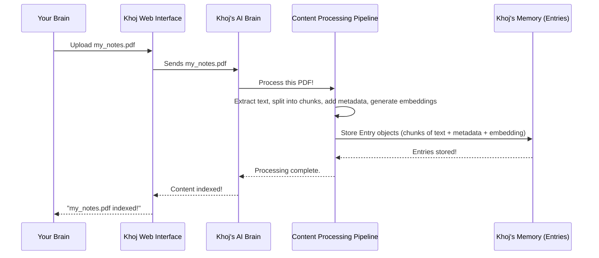

#### A Peek at the Code

Let's look at how `Entry` is defined and used in the code.

First, the `Entry` model itself, found in `src/khoj/database/models/__init__.py`. This defines the blueprint for what an `Entry` looks like in Khoj's database:

```python
# src/khoj/database/models/__init__.py
# ... (imports and other models)

class Entry(DbBaseModel): # DbBaseModel provides created_at/updated_at
    class EntryType(models.TextChoices):
        IMAGE = "image"
        PDF = "pdf"
        MARKDOWN = "markdown"
        # ... other types

    class EntrySource(models.TextChoices):
        COMPUTER = "computer"
        NOTION = "notion"
        # ... other sources

    user = models.ForeignKey(KhojUser, on_delete=models.CASCADE, default=None, null=True, blank=True)
    embeddings = VectorField(dimensions=None) # This stores the numerical embedding!
    raw = models.TextField() # Original chunk of text
    compiled = models.TextField() # Cleaned/optimized chunk of text
    heading = models.CharField(max_length=1000, default=None, null=True, blank=True)
    file_source = models.CharField(max_length=30, choices=EntrySource.choices, default=EntrySource.COMPUTER)
    file_type = models.CharField(max_length=30, choices=EntryType.choices, default=EntryType.PLAINTEXT)
    file_path = models.CharField(max_length=400, default=None, null=True, blank=True)
    file_name = models.CharField(max_length=400, default=None, null=True, blank=True)
    url = models.URLField(max_length=400, default=None, null=True, blank=True)
    hashed_value = models.CharField(max_length=100) # Used to check if content changed
    corpus_id = models.UUIDField(default=uuid.uuid4, editable=False) # Unique ID for this entry
    # ... (other fields like search_model, file_object)

    def save(self, *args, **kwargs):
        # ... (validation for user/agent association)
```
This simplified snippet shows the `Entry` class, which uses Django's `models.Model` to define database fields. Notice `embeddings` (for the numerical representation), `raw` and `compiled` for the text, and various metadata fields like `file_source`, `file_type`, `file_name`, and `corpus_id` (the unique ID).

When a file is uploaded, the `indexer` function in `src/khoj/routers/api_content.py` is called. It receives the uploaded files and eventually calls `configure_content` (which leads to the Content Processing Pipeline described above):

```python
# src/khoj/routers/api_content.py
# ... (imports and other functions)

async def indexer(
    request: Request,
    files: list[UploadFile],
    t: Optional[Union[state.SearchType, str]] = state.SearchType.All,
    regenerate: bool = False,
    client: Optional[str] = None,
    # ... (other parameters)
):
    user = request.user.object
    # ... (prepare files for indexing)
    indexer_input = IndexerInput(
        org=index_files["org"],
        markdown=index_files["markdown"],
        pdf=index_files["pdf"], # Our my_notes.pdf would be here!
        # ... (other file types)
    )
    # ... (configuration setup)

    success = await loop.run_in_executor(
        None,
        configure_content, # This function orchestrates the content processing!
        user,
        indexer_input.model_dump(),
        regenerate,
        t,
    )
    # ... (handle success/failure, update telemetry)
```
The `indexer` function acts as the entry point for file uploads. It collects the uploaded files (like our `my_notes.pdf`) and passes them to `configure_content`, which then orchestrates the entire process of turning them into `Entry` objects.

Inside the Content Processing Pipeline, components like `TextToEntries` (found in `src/khoj/processor/content/text_to_entries.py`) are responsible for splitting the raw text into smaller entries and generating their embeddings:

```python
# src/khoj/processor/content/text_to_entries.py
# ... (imports and other methods)

class TextToEntries(ABC):
    # ... (initialization)

    @staticmethod
    def split_entries_by_max_tokens(
        entries: List[Entry], max_tokens: int = 256, max_word_length: int = 500, raw_is_compiled: bool = False
    ) -> List[Entry]:
        "Split entries if compiled entry length exceeds the max tokens supported by the ML model."
        chunked_entries: List[Entry] = []
        for entry in entries:
            # Uses RecursiveCharacterTextSplitter to intelligently break text
            text_splitter = RecursiveCharacterTextSplitter(
                chunk_size=max_tokens,
                separators=["\n\n", "\n", "!", "?", ".", " ", "\t", ""],
                # ... (more splitting logic)
            )
            chunked_entry_chunks = text_splitter.split_text(entry.compiled)
            corpus_id = uuid.uuid4() # A unique ID for related chunks from the same source

            for chunk_index, compiled_entry_chunk in enumerate(chunked_entry_chunks):
                # ... (prepend heading, clean text)
                chunked_entries.append(
                    Entry(
                        compiled=compiled_entry_chunk,
                        raw=entry.raw,
                        heading=entry.heading,
                        file=entry.file,
                        corpus_id=corpus_id, # Link chunks from same original content
                    )
                )
        return chunked_entries

    def update_embeddings(
        self,
        user: KhojUser,
        current_entries: List[Entry],
        file_type: str,
        file_source: str,
        key="compiled",
        # ... (other parameters)
    ):
        # ... (hashing and identifying new entries)
        embeddings = []
        model = get_default_search_model()
        # This is where the magic happens: convert text to numerical embeddings!
        embeddings += self.embeddings_model[model.name].embed_documents(data_to_embed)

        # ... (create DbEntry objects and save to database)
```
The `split_entries_by_max_tokens` method takes raw text and cleverly breaks it down into smaller, manageable `Entry` chunks, ensuring they're not too long for the AI model. The `update_embeddings` method then takes these prepared text chunks and converts them into their numerical `embeddings` using the `embeddings_model`, before saving them into the database.

Finally, helper functions in `src/khoj/database/adapters/__init__.py` like `EntryAdapters.search_with_embeddings` are used when you ask Khoj a question. They efficiently query the database for the most relevant `Entry` objects based on your search (leveraging those embeddings!):

```python
# src/khoj/database/adapters/__init__.py
# ... (imports and other adapters)

class EntryAdapters:
    # ... (other static methods)

    @staticmethod
    def search_with_embeddings(
        raw_query: str,
        embeddings: Tensor, # Your query's embedding!
        user: KhojUser,
        max_results: int = 10,
        file_type_filter: str = None,
        max_distance: float = math.inf,
        agent: Agent = None,
    ):
        # ... (filter by user/agent, text filters)
        relevant_entries = Entry.objects.filter(owner_filter).annotate(
            distance=CosineDistance("embeddings", embeddings) # Calculates similarity using embeddings
        )
        relevant_entries = relevant_entries.filter(distance__lte=max_distance) # Filters out less relevant results
        # ... (more filtering and sorting)
        return relevant_entries[:max_results]

    @staticmethod
    @arequire_valid_user
    async def adelete_entry_by_file(user: KhojUser, file_path: str):
        # This is how Khoj deletes all entries associated with a specific file
        return await Entry.objects.filter(user=user, file_path=file_path).adelete()

    @staticmethod
    @require_valid_user
    def get_unique_file_types(user: KhojUser):
        # Helps retrieve what types of files you've indexed (e.g., pdf, markdown)
        return Entry.objects.filter(user=user).values_list("file_type", flat=True).distinct()

    # ... (other methods for managing entries)
```
The `search_with_embeddings` function is called during search. It takes your query's embedding and compares it to the `embeddings` of all stored `Entry` objects to find the ones that are semantically (meaningfully) closest. `adelete_entry_by_file` and `get_unique_file_types` are examples of how Khoj manages these `Entry` objects in its database.

### Conclusion

You've just uncovered the core building blocks of your Khoj second brain: `Entry` objects. You learned that these are intelligent chunks of your content, complete with raw and compiled text, unique IDs, rich metadata, and powerful numerical `embeddings`. Understanding Entries is key to appreciating how Khoj processes, stores, and intelligently retrieves information from your documents, making your personal AI truly smart and searchable.

Next, we'll dive deeper into the "Content Processing Pipeline" to see the full journey a document takes from being uploaded to becoming a rich collection of `Entry` objects.

[Chapter 4: Content Processing Pipeline](04_content_processing_pipeline_.md)

---

Generated by [AI Codebase Knowledge Builder](https://github.com/The-Pocket/Tutorial-Codebase-Knowledge)
````

## 10_operator_agent_.md

````markdown
# Chapter 10: Operator Agent

In [Chapter 9: Conversation Commands & Tools](09_conversation_commands___tools_.md), we saw how Khoj can use specific commands and underlying "tools" to perform actions like searching the internet or running code. These tools are powerful, but they require Khoj to know *exactly* what information it needs (e.g., a search query, Python code).

But what if you want Khoj to do something more complex on a website, something that requires it to *see* the page, *think* about what to do, and then *interact* with it, step by step, just like a human?

### What Problem Does the Operator Agent Solve?

Imagine you want Khoj to:
*   "Go to a specific online store, search for a product, add it to the cart, and tell me the total price."
*   "Navigate to a news website, find the latest article about AI, and summarize it for me."
*   "Log in to a service, find a specific setting, and change it."

These tasks are tricky! They require Khoj to:
1.  **See** the webpage (like looking at a screenshot).
2.  **Understand** the goal and decide what to do next (e.g., "I need to click the 'Login' button first").
3.  **Execute** actions (click, type, scroll).
4.  **Repeat** these steps until the task is done.

Khoj's regular tools can't do this alone because they don't "see" or "interact" with a live website.

This is exactly what the **Operator Agent** solves! It's an advanced capability that gives your Khoj assistant its own **virtual hands and eyes** to navigate and interact with a web browser, just like you would. It's like giving your AI its own little web browser and telling it, "Go figure this out!"

**Our Goal for this Chapter:** By the end of this chapter, you'll understand what the Operator Agent is, how it works like a human navigating a website, and how you can use it to make Khoj perform complex web tasks.

### What is the Operator Agent?

The Operator Agent is a specialized AI agent within Khoj that can **autonomously interact with a web browser**. It simulates a human user's actions, making it possible for Khoj to complete multi-step tasks on the internet.

Here's how it works:

1.  **Virtual Browser**: Khoj uses a special program called `Playwright` to launch and control a hidden web browser. This is the "hands and eyes" for the Operator Agent.
2.  **Seeing the Page**: The Operator Agent can "see" what's on the web page. It does this by taking **screenshots** of the page and sometimes by getting a simplified description of the page's structure.
3.  **Two "Brains" (LLMs) for Thinking and Acting**: The Operator Agent uses powerful [Large Language Models (LLMs)](06_chatmodel___ai_model_api__llm_integration__.md) to perform its tasks:
    *   **High-level Reasoning Brain**: This LLM looks at the screenshot and your overall goal (e.g., "Find the flight"). It decides the *next logical step* (e.g., "I should type into the search bar"). This is often a powerful "vision-enabled" LLM, meaning it can understand images.
    *   **Grounding Brain (sometimes part of the High-level Brain)**: If needed, another part of the system (or the same LLM) figures out *exactly where* on the screen to click or type. It helps locate specific buttons, links, or text fields from the screenshot.
4.  **Taking Action**: Once it decides and locates, it executes actions like:
    *   `click`: Clicking buttons or links.
    *   `type`: Typing text into input fields.
    *   `scroll`: Scrolling up or down the page.
    *   `goto`: Navigating directly to a URL.
    *   `back`: Going back to the previous page.

It's a continuous loop: See -> Think -> Act -> See -> Think -> Act... until the task is complete.

### How to Use the Operator Agent: Finding News on a Specific Website

Let's imagine you want Khoj to go to the "IEEE Spectrum" website, find the latest news on quantum computing, and summarize it for you. This requires browsing, not just a single search.

1.  **Open Khoj Chat**: Go to the Khoj Web Interface.
2.  **Type Your Command and Task**: In the chat input box, you'll use the `/operator` [Conversation Command](09_conversation_commands___tools_.md):
    ```
    /operator go to ieee.org/spectrum, then find the latest news on quantum computing, and summarize it for me.
    ```
3.  **Send Your Message**: Press `Enter` or click the send button.

That's it! Khoj will then launch its virtual browser, start navigating, clicking, and reading, and display its progress (including screenshots) directly in your chat. Once it completes the task, it will provide the summary.

You will see updates in the chat window, like:
```
**Operating Browser**:
- Open URL: https://ieee.org/spectrum
- Image: [Screenshot of the IEEE Spectrum homepage]

**Operating Browser**:
- Type "quantum computing"
- Image: [Screenshot after typing into search bar]

... and so on, until the summary is provided.
```

### Under the Hood: How the Operator Agent Works

When you type an `/operator` command, a sophisticated process kicks off.

#### Step-by-Step Walkthrough

1.  **You Provide a Task**: You type `/operator go to ieee.org/spectrum...`
2.  **Web Interface Sends Task**: Your command travels to the [Khoj Backend](01_web_interface__frontend__.md).
3.  **Operator Agent Initialization**: The Khoj Backend recognizes the `/operator` command. It initializes the "Operator Agent" and its "Browser Environment" (the virtual browser). It also picks the best available "vision-enabled" [ChatModel](06_chatmodel___ai_model_api__llm_integration__.md) to act as the Operator Agent's high-level reasoning brain.
4.  **Launch Virtual Browser**: The Browser Environment starts a hidden web browser.
5.  **Operator Loop (See, Think, Act)**:
    *   **See**: The Browser Environment takes a screenshot of the current webpage.
    *   **Think**: The Operator Agent (its reasoning LLM) receives the screenshot and your overall goal. It decides on the *next action* (e.g., "I need to type 'quantum computing' into the search bar at coordinates X, Y").
    *   **Act**: The Operator Agent sends this action (e.g., `TypeAction(text='quantum computing', x=..., y=...)`) to the Browser Environment.
    *   **Execution**: The Browser Environment performs the action in the virtual browser.
    *   **Repeat**: The loop continues with a new screenshot and the updated state of the browser.
6.  **Progress Updates**: Throughout this process, Khoj sends updates (including new screenshots) back to your Web Interface so you can follow along.
7.  **Task Completion / Summary**: Once the Operator Agent determines it has completed the task (e.g., summarized the article), it provides a final summary to the Khoj Backend.
8.  **Display Final Result**: The Backend sends the summary back to your Web Interface.

Here's a simplified sequence diagram:

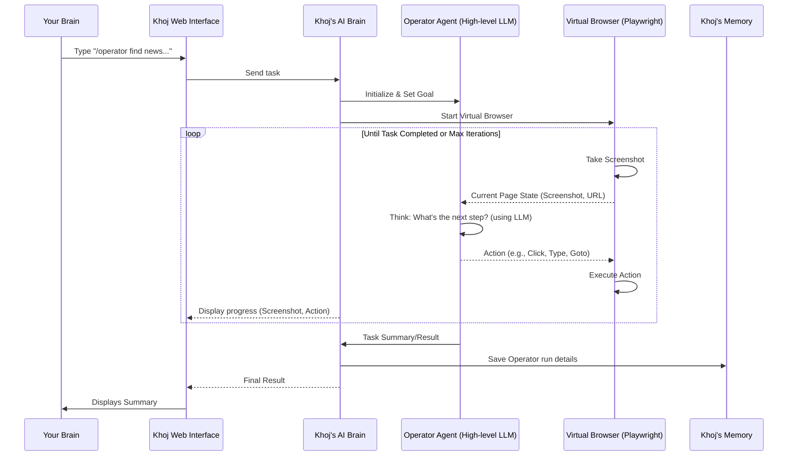

#### A Peek at the Code

Let's look at the key parts of Khoj's code that make the Operator Agent function.

First, the `/operator` command itself is defined in `src/khoj/utils/helpers.py`, just like other [Conversation Commands](09_conversation_commands___tools_.md):

```python
# src/khoj/utils/helpers.py
# ...

class ConversationCommand(str, Enum):
    # ...
    Operator = "operator" # Here's our /operator command!
    # ...
```
This simply registers `operator` as a recognizable command.

The main entry point for running the Operator Agent is the `operate_browser` function in `src/khoj/processor/operator/operate_browser.py`:

```python
# src/khoj/processor/operator/operate_browser.py
# ...

async def operate_browser(
    query: str, # Your task, e.g., "go to ieee.org/spectrum..."
    user: KhojUser,
    conversation_log: dict,
    # ... other parameters
    agent: Agent = None,
    tracer: dict = {},
):
    # Selects the vision-enabled LLM for the Operator Agent's reasoning
    reasoning_model: ChatModel = await ConversationAdapters.aget_default_chat_model(user, agent_chat_model)
    if not reasoning_model or not reasoning_model.vision_enabled:
        reasoning_model = await ConversationAdapters.aget_vision_enabled_config()

    # Initialize the specific Operator Agent (e.g., OpenAI or Anthropic based)
    operator_agent: OperatorAgent
    if reasoning_model.name.startswith("gpt-4o"):
        operator_agent = OpenAIOperatorAgent(query, reasoning_model, max_iterations, tracer)
    # ... (other agent types)

    # Initialize the virtual browser environment
    environment = BrowserEnvironment()
    await environment.start(width=1024, height=768) # Launch browser with specific dimensions

    try:
        iterations = 0
        while iterations < max_iterations and not task_completed:
            iterations += 1
            # 1. Get current environment state (screenshot, URL)
            browser_state = await environment.get_state()
            # 2. Agent decides action(s) (calls the LLM)
            agent_result = await operator_agent.act(browser_state)
            # 3. Execute actions in the environment
            env_steps: List[EnvStepResult] = []
            for action in agent_result.actions:
                env_step = await environment.step(action)
                env_steps.append(env_step)
            # Render status update to chat
            # ...
            # 4. Update agent with results of its action
            operator_agent.add_action_results(env_steps, agent_result)

    finally:
        if environment:
            await environment.close() # Close the browser when done
```
This `operate_browser` function is the orchestrator. It sets up the `reasoning_model` (the LLM brain), initializes the correct `OperatorAgent` (like `OpenAIOperatorAgent` for OpenAI models), starts the `BrowserEnvironment` (the virtual browser), and then enters the main `while` loop for the "See, Think, Act" process.

The `OperatorAgent` base class (in `src/khoj/processor/operator/operator_agent_base.py`) defines the common structure for different types of LLM-based Operator Agents:

```python
# src/khoj/processor/operator/operator_agent_base.py
# ...

class OperatorAgent(ABC):
    def __init__(self, query: str, vision_model: ChatModel, max_iterations: int, tracer: dict):
        self.query = query
        self.vision_model = vision_model # The LLM brain
        self.max_iterations = max_iterations
        self.tracer = tracer
        self.messages: List[AgentMessage] = []

    @abstractmethod
    async def act(self, current_state: EnvState) -> AgentActResult:
        # This is where the LLM does its "thinking" and decides actions
        pass

    @abstractmethod
    def add_action_results(self, env_steps: list[EnvStepResult], agent_action: AgentActResult) -> None:
        # This is where the agent processes the results of its actions
        pass

    # ... other abstract methods for summarizing and formatting
```
The `act` method is the core: it's where the LLM is called to decide the next action. `add_action_results` is where the agent updates its internal "memory" with the outcome of the action.

Let's peek into `OpenAIOperatorAgent` (in `src/khoj/processor/operator/operator_agent_openai.py`), which implements the `act` method using an OpenAI vision model:

```python
# src/khoj/processor/operator/operator_agent_openai.py
# ...

class OpenAIOperatorAgent(OperatorAgent):
    async def act(self, current_state: EnvState) -> AgentActResult:
        client = get_openai_async_client(self.vision_model.ai_model_api.api_key, self.vision_model.ai_model_api.api_base_url)

        # This is the detailed instructions given to the LLM (the "persona")
        system_prompt = f"""<SYSTEM_CAPABILITY>
* You are Khoj, a smart web browser operating assistant. ...
* You can interact with the web browser to perform tasks like clicking, typing, scrolling, and more using the computer_use_preview tool.
* ...
</SYSTEM_CAPABILITY>
"""
        # Define the tools the LLM can "call" (e.g., click, type, goto)
        tools = [
            {"type": "computer_use_preview", "display_width": 1024, "display_height": 768, "environment": "browser"},
            {"type": "function", "name": "back", "description": "Go back..."},
            {"type": "function", "name": "goto", "description": "Go to a specific URL...", "parameters": {"type": "object", "properties": {"url": {"type": "string"}}}},
        ]

        if is_none_or_empty(self.messages):
            self.messages = [AgentMessage(role="user", content=self.query)]

        # Call the OpenAI model with current messages, system prompt, and tools
        response: Response = await client.responses.create(
            model="computer-use-preview", # The OpenAI model for browser operations
            input=self._format_message_for_api(self.messages),
            instructions=system_prompt,
            tools=tools,
        )

        # Parse the LLM's response into standardized OperatorActions
        actions: List[OperatorAction] = []
        for block in response.output:
            if block.type == "function_call":
                if block.name == "goto":
                    url = json.loads(block.arguments).get("url")
                    if url: actions.append(GotoAction(url=url))
                elif block.name == "back":
                    actions.append(BackAction())
            elif block.type == "computer_call":
                openai_action = block.action
                if openai_action.type == "click":
                    actions.append(ClickAction(x=openai_action.x, y=openai_action.y))
                # ... (parse other action types like type, scroll, keypress)
            # ...

        self._update_usage(response.usage.input_tokens, response.usage.output_tokens)
        return AgentActResult(actions=actions, action_results=action_results, rendered_response=rendered_response)
```
This `act` method sends the current browser state (via `self.messages`, which includes the screenshot) and the `system_prompt` (instructions) to the OpenAI LLM. It then takes the LLM's suggested actions (like clicking or typing) and converts them into standardized `OperatorAction` objects.

These `OperatorAction` objects are defined in `src/khoj/processor/operator/operator_actions.py`:

```python
# src/khoj/processor/operator/operator_actions.py
# ...

class Point(BaseModel):
    x: float
    y: float

class ClickAction(BaseAction):
    type: Literal["click"] = "click"
    x: float
    y: float
    button: Literal["left", "right", "middle", "wheel"] = "left"

class TypeAction(BaseAction):
    type: Literal["type"] = "type"
    text: str

class GotoAction(BaseAction):
    type: Literal["goto"] = "goto"
    url: str

class BackAction(BaseAction):
    type: Literal["back"] = "back"

# ... (many other actions like ScrollAction, KeypressAction, ScreenshotAction)

OperatorAction = Union[
    ClickAction, TypeAction, GotoAction, BackAction, # ... and all others
]
```
These are the "commands" the Operator Agent gives to the virtual browser. Each action clearly defines what it wants to do (e.g., `click`) and what parameters it needs (e.g., `x` and `y` coordinates for clicking).

Finally, the `BrowserEnvironment` (in `src/khoj/processor/operator/operator_environment_browser.py`) handles the actual interaction with the Playwright browser:

```python
# src/khoj/processor/operator/operator_environment_browser.py
# ...

try:
    from playwright.async_api import Browser, Page, Playwright, async_playwright
except ImportError:
    # ... (error message if Playwright not installed)

class BrowserEnvironment(Environment):
    def __init__(self):
        self.playwright: Optional[Playwright] = None
        self.browser: Optional[Browser] = None
        self.page: Optional[Page] = None
        # ...

    async def start(self, width: int = 1024, height: int = 768) -> None:
        self.playwright = await async_playwright().start()
        self.browser = await self.playwright.chromium.launch(headless=False, args=[f"--window-size={width},{height}"])
        self.page = await self.browser.new_page() # Creates a new browser tab
        await self.page.set_viewport_size({"width": self.width, "height": self.height})
        if self.page.url == "about:blank":
            await self.page.goto("https://duckduckgo.com") # Start on a default page
        # ... event handlers for page loads, new pages

    async def _get_screenshot(self) -> Optional[str]:
        if not self.page or self.page.is_closed(): return None
        screenshot_bytes = await self.page.screenshot(full_page=False, type="png")
        # ... (add mouse position, convert to webp, base64 encode)
        return base64.b64encode(screenshot_webp_bytes).decode("utf-8")

    async def get_state(self) -> EnvState:
        url = self.page.url
        screenshot = await self._get_screenshot() # Get the current screenshot
        return EnvState(url=url, screenshot=screenshot)

    async def step(self, action: OperatorAction) -> EnvStepResult:
        # This executes the action in the browser
        if not self.page or self.page.is_closed(): return EnvStepResult(error="Browser page is not available.")
        try:
            match action.type:
                case "click":
                    await self.page.mouse.click(action.x, action.y, button=action.button)
                case "double_click":
                    await self.page.mouse.dblclick(action.x, action.y)
                case "type":
                    await self.page.keyboard.type(action.text)
                case "scroll":
                    await self.page.mouse.wheel(action.scroll_x or 0, action.scroll_y or 0)
                case "goto":
                    await self.page.goto(action.url)
                case "back":
                    await self.page.go_back()
                # ... (other actions handled)
        except Exception as e:
            error = f"Error executing action {action.type}: {e}"
        after_state = await self.get_state()
        return EnvStepResult(output=output, error=error, current_url=after_state.url, screenshot_base64=after_state.screenshot)

    async def close(self) -> None:
        if self.browser: await self.browser.close()
        if self.playwright: await self.playwright.stop()
```
The `BrowserEnvironment` uses Playwright to `start` a Chromium browser, takes `_get_screenshot`s, retrieves the current browser `state`, and, most importantly, takes a `step` by executing the `OperatorAction` (like `click`, `type`, `goto`) in the actual virtual browser.

### Conclusion

You've just explored one of Khoj's most advanced and exciting features: the **Operator Agent**! You learned that it gives Khoj "virtual hands and eyes" to interact with web pages, allowing it to perform complex, multi-step tasks autonomously. By combining a virtual browser with powerful reasoning and grounding LLMs, Khoj can now navigate, click, type, and scroll just like a human, opening up a whole new world of possibilities for your personal AI assistant.

This concludes our journey through the core concepts of Khoj. From the frontend to the backend, from authentication to content processing, search, conversations, agents, and now the powerful Operator Agent, you have a solid foundation for understanding how your personal AI brain works!

---

Generated by [AI Codebase Knowledge Builder](https://github.com/The-Pocket/Tutorial-Codebase-Knowledge)
````

## 06_chatmodel___ai_model_api__llm_integration__.md

````markdown
# Chapter 6: ChatModel & AI Model API (LLM Integration)

In [Chapter 5: Search & Embeddings](05_search___embeddings_.md), we unlocked the secret to how Khoj intelligently finds relevant pieces of your information using "embeddings." But finding information is only half the battle! Once Khoj has found those relevant `Entry` objects, how does it actually *talk* to you? How does it generate human-like summaries, answer your questions, or have a natural conversation?

This is where the magic of **ChatModel & AI Model API (LLM Integration)** comes into play! It's the part of Khoj that connects to the "brains" that generate natural language responses.

### What Problem Do ChatModel & AI Model API Solve?

Imagine Khoj as your personal smart assistant, but you want it to be able to "think" using different advanced AI brains. Maybe you want it to use a super-powerful, cloud-based AI like GPT for complex tasks, or a smaller, faster AI running directly on your computer for quick chats. Each of these AI brains (known as Large Language Models, or LLMs) works a little differently and needs different ways to connect.

The **ChatModel** and **AI Model API** concepts solve this problem. They are like a **universal remote control for various smart speakers**, allowing Khoj to switch between different AI brains (LLMs) for different tasks.

**Our Goal for this Chapter:** By the end of this chapter, you'll understand what `ChatModel` and `AiModelApi` are, why Khoj uses them, and how you can indirectly choose which AI brain Khoj uses for your conversations.

### What is a Large Language Model (LLM)?

First, let's understand the core concept: a **Large Language Model (LLM)**.
An LLM is a powerful type of Artificial Intelligence that is trained on massive amounts of text data. It can understand, generate, and respond to human language in a very natural way. When you ask Khoj a question and it gives you a human-like answer, an LLM is doing the heavy lifting behind that response.

Think of an LLM as the **"AI brain"** itself – it's the core engine that understands your prompt and generates text. Popular examples include OpenAI's GPT models, Google's Gemini/PaLM models, Anthropic's Claude, or local models like Llama.

### What is `ChatModel`?

A `ChatModel` in Khoj is a specific **configuration or blueprint for an LLM**. It defines *which* LLM Khoj should use and how it should behave.

Imagine you have a specific smart speaker brand, like "OpenAI's GPT" or "Llama's Llama." The `ChatModel` defines:
*   **Name**: What the model is called (e.g., `gpt-4o-mini`, `bartowski/Meta-Llama-3.1-8B-Instruct-GGUF`).
*   **Type**: Whether it's an OpenAI model, an Anthropic model, a Google model, or an "offline" model (running on your computer).
*   **Capabilities**: Does it understand images (`vision_enabled`)? How long can its conversations be (`max_prompt_size`)?
*   **Description/Strengths**: What is this model good at? (e.g., "Good for creative writing," "Fast for local tasks").

So, a `ChatModel` is essentially Khoj's internal record of *which* specific AI brain to use and its properties.

### What is `AiModelApi`?

The `AiModelApi` is where Khoj stores the **credentials** needed to connect to *external* LLM providers.

Continuing our smart speaker analogy, if the `ChatModel` is the specific smart speaker (like "Google Home"), then the `AiModelApi` is like the **power cable and Wi-Fi login details** that let it actually *work* and connect to the internet to get its intelligence. It typically holds sensitive information such as:
*   `api_key`: A secret code needed to access the LLM service.
*   `api_base_url`: The internet address where Khoj sends its requests to the LLM service.

### Why two separate concepts (`ChatModel` and `AiModelApi`)?

This separation is clever and flexible!
*   You might have several `ChatModel`s that all use the same external provider (e.g., `gpt-3.5-turbo` and `gpt-4` are both OpenAI models, and they can both use the *same* OpenAI `api_key` stored in a single `AiModelApi` entry).
*   This makes it easy to manage your credentials in one place, even if you add many different models from the same provider.
*   It also allows for "offline" `ChatModel`s (like Llama models running on your computer) that don't need an `AiModelApi` because they don't connect to an external service.

### How to Use ChatModel & AI Model API (Indirectly)

You don't directly "code" with `ChatModel` or `AiModelApi` in your daily use of Khoj. Instead, you interact with them through Khoj's **settings**.

**Central Use Case: Changing Khoj's AI Brain for Conversations**

Let's say you want Khoj to use a more powerful (and potentially slower/costlier) GPT-4 model instead of the default smaller model.

1.  **Open Khoj Settings**: In the Khoj Web Interface (as seen in [Chapter 1: Web Interface (Frontend)](01_web_interface__frontend__.md)), navigate to the "Settings" or "Models" section.
2.  **Select a Chat Model**: You'll see a list of available `ChatModel`s (e.g., "Khoj (Offline)", "GPT-4o mini", "Claude 3 Sonnet").
3.  **Choose Your Preferred Model**: Click on the `ChatModel` you wish to use. For example, selecting "GPT-4o mini."
4.  **Khoj Updates Internally**: Behind the scenes, Khoj updates your preferences, remembering that you want to use "GPT-4o mini" for future conversations. If this model requires an API key, Khoj will use the associated `AiModelApi` entry to connect.

This simple action changes the "AI brain" that Khoj uses for generating your chat responses, summaries, and more.

### Under the Hood: Switching Khoj's AI Brain

Let's trace what happens when you select a new `ChatModel` in Khoj's settings and how that model is then used in a conversation.

#### Step-by-Step Walkthrough

1.  **You Select a `ChatModel`**: In Khoj's settings, you click on "GPT-4o mini".
2.  **Web Interface Sends Request**: The Khoj Web Interface sends a message to the Khoj Backend saying, "The user wants to use `ChatModel` ID 'X' from now on."
3.  **Backend Updates User Preference**: The Khoj Backend receives this request and updates a special record (your `UserConversationConfig`) in its [Database](03_entry__indexed_content__.md) to remember your chosen `ChatModel`.
4.  **Conversation Starts**: Later, when you type a new message in the chat and hit send.
5.  **Backend Retrieves `ChatModel`**: As part of processing your new message, the Khoj Backend checks your `UserConversationConfig` to see which `ChatModel` you selected.
6.  **Retrieve `AiModelApi` (if needed)**: If your chosen `ChatModel` is an external LLM (like GPT-4o mini), Khoj also looks up the corresponding `AiModelApi` entry to get the necessary `api_key` and `api_base_url`.
7.  **Generate Response**: Khoj then uses this `ChatModel` (and `AiModelApi` credentials) to send your query and relevant [Entry](03_entry__indexed_content__.md) contexts to the actual LLM service (e.g., OpenAI's servers or your local Llama instance). The LLM generates a response.
8.  **Display Answer**: The LLM's response is sent back to Khoj, and then to your Web Interface, where you see it.

Here's a simplified sequence diagram:

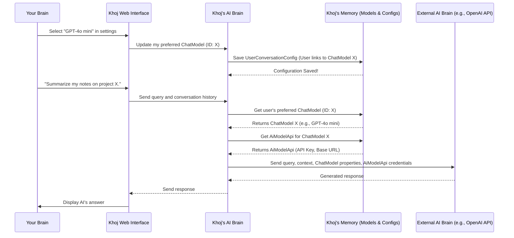

#### A Peek at the Code

Let's look at the actual code structures that define and manage these models.

First, the `ChatModel` and `AiModelApi` blueprints are defined in `src/khoj/database/models/__init__.py`:

```python
# src/khoj/database/models/__init__.py
# ... (imports and other models)

class AiModelApi(DbBaseModel):
    name = models.CharField(max_length=200)
    api_key = models.CharField(max_length=4000) # Your secret API key
    api_base_url = models.URLField(max_length=200, default=None, blank=True, null=True)

    def __str__(self):
        return self.name

class PriceTier(models.TextChoices):
    FREE = "free"
    STANDARD = "standard"

class ChatModel(DbBaseModel):
    class ModelType(models.TextChoices):
        OPENAI = "openai"
        OFFLINE = "offline" # Like Llama models running on your computer
        ANTHROPIC = "anthropic"
        GOOGLE = "google"

    name = models.CharField(max_length=200, default="bartowski/Meta-Llama-3.1-8B-Instruct-GGUF")
    model_type = models.CharField(max_length=200, choices=ModelType.choices, default=ModelType.OFFLINE)
    price_tier = models.CharField(max_length=20, choices=PriceTier.choices, default=PriceTier.FREE)
    vision_enabled = models.BooleanField(default=False) # Can it see images?
    # Links to the API credentials if it's an external model
    ai_model_api = models.ForeignKey(AiModelApi, on_delete=models.CASCADE, default=None, null=True, blank=True)
    description = models.TextField(default=None, null=True, blank=True)
    strengths = models.TextField(default=None, null=True, blank=True)

    def __str__(self):
        return self.name
```
Here, `AiModelApi` holds the actual connection details. `ChatModel` defines the LLM itself, its type (OpenAI, Offline, etc.), capabilities like `vision_enabled`, and crucially, a link (`ForeignKey`) to an `AiModelApi` if it needs external credentials.

When you change your preferred model in the settings, the `update_chat_model` API endpoint in `src/khoj/routers/api_model.py` is called:

```python
# src/khoj/routers/api_model.py
# ... (imports and setup)

@api_model.post("/chat", status_code=200)
@requires(["authenticated"])
async def update_chat_model(
    request: Request,
    id: str, # The ID of the ChatModel you selected
    client: Optional[str] = None,
):
    user = request.user.object
    # Check if the user is allowed to switch to this model (e.g., premium models)
    subscribed = has_required_scope(request, ["premium"])
    chat_model = await ChatModel.objects.filter(id=int(id)).afirst()
    if chat_model is None:
        return Response(status_code=404, content=json.dumps({"status": "error", "message": "Chat model not found"}))
    if not subscribed and chat_model.price_tier != PriceTier.FREE:
        raise Response(status_code=403,
            content=json.dumps({"status": "error", "message": "Subscribe to switch to this chat model"}),
        )

    # This calls the adapter to save the user's preference
    new_config = await ConversationAdapters.aset_user_conversation_processor(user, int(id))

    if new_config is None:
        return {"status": "error", "message": "Model not found"}

    return {"status": "ok"}
```
This function receives the `id` of the `ChatModel` you want to use. It performs validation (like checking if you're subscribed for paid models) and then calls `ConversationAdapters.aset_user_conversation_processor` to save your choice.

The `aset_user_conversation_processor` and `aget_chat_model` functions in `src/khoj/database/adapters/__init__.py` manage saving and retrieving your `ChatModel` preference:

```python
# src/khoj/database/adapters/__init__.py
# ... (imports and other adapters)

class ConversationAdapters:
    # ... (other methods)

    @staticmethod
    @arequire_valid_user
    async def aset_user_conversation_processor(user: KhojUser, conversation_processor_config_id: int):
        # Find the ChatModel based on the ID you selected
        config = await ChatModel.objects.filter(id=conversation_processor_config_id).afirst()
        if not config:
            return None
        # Save this ChatModel as your preferred setting
        new_config, _ = await UserConversationConfig.objects.aupdate_or_create(user=user, defaults={"setting": config})
        return new_config

    @staticmethod
    async def aget_chat_model(user: KhojUser):
        # When a conversation starts, get the user's preferred ChatModel
        subscribed = await ais_user_subscribed(user)
        config = (
            await UserConversationConfig.objects.filter(user=user)
            .prefetch_related("setting", "setting__ai_model_api") # Load associated AiModelApi
            .afirst()
        )
        if subscribed:
            if config:
                return config.setting # Return the user's chosen model
            # Fallback for subscribed users
            return await ConversationAdapters.aget_advanced_chat_model(user)
        else:
            if config and config.setting.price_tier == PriceTier.FREE:
                return config.setting # For free users, only return free models
            # Fallback for free users
            return await ConversationAdapters.aget_default_chat_model(user)
```
`aset_user_conversation_processor` updates the `UserConversationConfig` to link your `KhojUser` to the chosen `ChatModel`. `aget_chat_model` is later used to retrieve this `ChatModel` when a conversation needs to be processed. Notice how it `prefetch_related("setting__ai_model_api")` to also grab the API credentials if an external model is chosen.

Finally, when it's time to actually generate a response, Khoj's internal `OpenAIProcessor` (for OpenAI models, located in `src/khoj/processor/conversation/openai/gpt.py`) or `OfflineProcessor` (for local models, in `src/khoj/processor/conversation/offline/chat_model.py`) use these details:

```python
# src/khoj/processor/conversation/openai/gpt.py
# ... (imports)

async def converse_openai(
    references,
    user_query,
    # ... other parameters
    model: str = "gpt-4o-mini",
    api_key: Optional[str] = None, # This comes from AiModelApi!
    api_base_url: Optional[str] = None, # This comes from AiModelApi!
    temperature: float = 0.4,
    # ... more parameters
) -> AsyncGenerator[ResponseWithThought, None]:
    # ... (message preparation, context handling)

    # Call OpenAI's API using the provided API key and base URL
    async for chunk in chat_completion_with_backoff(
        messages=messages,
        model_name=model,
        temperature=temperature,
        openai_api_key=api_key, # Used here!
        api_base_url=api_base_url, # Used here!
        # ... other model parameters
    ):
        yield chunk
```
This simplified snippet shows how the `model` name, `api_key`, and `api_base_url` (retrieved via `ChatModel` and `AiModelApi`) are passed directly to the function that communicates with the OpenAI service, allowing it to generate the conversation response. A similar process occurs for offline models using `llama-cpp`.

### Conclusion

You've just learned how Khoj manages its "AI brains"! The `ChatModel` defines the specific Large Language Model (LLM) and its properties, while the `AiModelApi` securely stores the necessary credentials to connect to external LLM providers. This powerful abstraction allows Khoj to be flexible, letting you choose which AI intelligence powers your conversations, all managed seamlessly behind the scenes.

Next, we'll bring all these pieces together and dive into the exciting world of "Conversation" within Khoj, seeing how your queries, retrieved entries, and the chosen LLMs combine to create meaningful interactions.

[Chapter 7: Conversation](07_conversation_.md)

---

Generated by [AI Codebase Knowledge Builder](https://github.com/The-Pocket/Tutorial-Codebase-Knowledge)
````

## Statistics

- Total Files: 11
- Total Characters: 169109
- Total Tokens: 0
