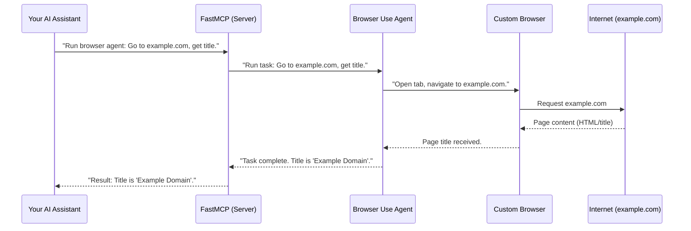

# Chapter 1: MCP Server (FastMCP)

Imagine you want to use a smart assistant, like an AI chatbot, to do things for you online. Maybe you want it to "browse a website" or "research a topic." How does your assistant, which is just a bunch of computer code, actually *talk* to a web browser or a research tool?

This is where the **MCP Server (FastMCP)** comes in! Think of FastMCP as the central "switchboard operator" or "coordinator" for our browser automation system. Its main job is to listen for requests from your AI assistant and then connect those requests to the right tools and services within our system.

## The Core Idea: Bridging AI and Browser Actions

Without FastMCP, your AI assistant would have no simple way to tell our browser automation system what to do. It would be like trying to call a friend without a phone. FastMCP provides that phone system, allowing different AI assistants (that understand the "language" of MCP) to easily send commands to our browser tools.

The "MCP" in MCP Server stands for **Model Context Protocol**. This is a special "language" or set of rules that AI agents use to communicate with each other and with services like ours. FastMCP knows this language, making it easy for any AI agent that also speaks MCP to use our browser automation.

## How it Works: A Simple Scenario

Let's walk through a little story to see FastMCP in action.

**Use Case:** Your AI assistant wants to "Go to example.com and tell me the title of the page."

Here's what happens behind the scenes with FastMCP:

1.  **AI Assistant has a Request:** Your AI assistant decides it needs to use the web browser. It knows about a special "tool" or `run_browser_agent` capability that our system provides.
2.  **Assistant Talks to FastMCP:** Your AI assistant sends a message (following the MCP rules) to the FastMCP server, essentially saying: "Hey FastMCP, please run the `run_browser_agent` tool and ask it to get the title of `example.com`."
3.  **FastMCP Routes the Request:** FastMCP receives this message. It's like the switchboard operator saying, "Ah, `run_browser_agent`! I know who handles that!"
4.  **FastMCP Connects to the Right Tool:** FastMCP then passes this request to the actual `run_browser_agent` (which we'll learn more about in [Browser Use Agent (Browser Automation Orchestrator)](03_browser_use_agent__browser_automation_orchestrator__.md)).
5.  **Tool Does the Work:** The `run_browser_agent` then uses other parts of our system (like the browser itself) to visit `example.com` and find its title.
6.  **Tool Sends Result Back:** The `run_browser_agent` sends the title back to FastMCP.
7.  **FastMCP Sends Result to AI Assistant:** FastMCP relays the result (the page title) back to your original AI assistant.

This whole process allows your AI assistant to perform complex web tasks without needing to know *how* to control a browser directly. It just tells FastMCP *what* it wants done, and FastMCP handles the rest!

## Internal View: What's Under the Hood?

Let's visualize this with a simplified diagram:



As you can see, FastMCP is `FMCP` in this diagram. It’s the central hub for requests.

### Looking at the Code (Simplified)

In our project, the main setup for the MCP Server is handled in `src/mcp_server_browser_use/server.py`.

Here's a tiny glimpse of how `FastMCP` (the core component of our MCP Server) is used to set up the server:

```python
# src/mcp_server_browser_use/server.py (Simplified)

from mcp.server.fastmcp import FastMCP # This is the core FastMCP library

# ... other imports and setup ...

def serve() -> FastMCP:
    """Configures and returns the FastMCP server instance."""
    server = FastMCP(
        server_id="browser-use", # A unique name for our server
        # ... other configurations for our server ...
    )

    # Register the run_browser_agent tool
    @server.tool(
        name="run_browser_agent",
        description="Tool for general browser automation and interaction...",
    )
    async def run_browser_agent(
        ctx: Context,  # Information about the incoming request
        task: str,     # The instruction from the AI assistant (e.g., "Go to example.com")
        # ... other parameters ...
    ) -> str:
        # This is where we will call our Browser Use Agent later!
        # For now, imagine it does the work:
        logger.info(f"AI requested browser agent task: {task}")
        # result = await some_browser_agent_function(task, ctx, config)
        return f"Browser agent successfully processed task: {task}"

    # We also register the deep research tool here!
    @server.tool(
        name="run_deep_research",
        description="Tool for multi-step web research and report generation...",
    )
    async def run_deep_research(
        ctx: Context,
        research_task: str, # The research question from AI assistant
        # ... other parameters ...
    ) -> str:
        # This is where we will call our Deep Research Agent later!
        logger.info(f"AI requested deep research: {research_task}")
        return f"Deep research processed: {research_task}"

    return server

# This line actually creates and starts our server when the program runs
server_instance = serve()
```

This code snippet shows:
*   We use something called `FastMCP` from a library to create our server.
*   We give our server a unique `server_id` like `"browser-use"`.
*   We tell `FastMCP` about special "tools" it provides. In our case, `run_browser_agent` and `run_deep_research`. These are like buttons on our "switchboard" that AI assistants can "press."
*   When an AI assistant uses one of these tools, the code inside the `@server.tool` function (like `run_browser_agent` or `run_deep_research`) will run. This is where we connect to the actual browser automation and research parts of our system!

You can see these `run_browser_agent` and `run_deep_research` calls referenced in the `README.md` file's "Features" section. This is how the system makes its capabilities available to other AI agents.

## Why MCP?

The Model Context Protocol (MCP) ensures that different AI frontends (like Claude Desktop, mentioned in the README) can easily integrate with our `browser-use` server. It's a standardized way for them to understand what tools we offer and how to use them.

The `README.md` file shows how an MCP client (like Claude Desktop) would configure itself to use our `browser-use` server:

```json
// Example 1: One-Line Latest Version (Always Fresh)
"mcpServers": {
    "browser-use": { // This "browser-use" matches our server_id!
      "command": "uvx",
      "args": ["mcp-server-browser-use@latest"],
      "env": {
        // ... environment variables ...
      }
    }
}
```

This configuration tells the MCP client how to start our `browser-use` server and what environment variables it needs (like API keys for LLMs, which we'll discuss in [LLM Provider (Language Model Integration)](07_llm_provider__language_model_integration__.md)).

## Conclusion

You've just learned about the brain of our browser automation system: the **MCP Server (FastMCP)**. It acts as the crucial link, allowing AI assistants to request web browsing and research tasks and then routing those requests to the right internal tools. It does this by implementing the Model Context Protocol (MCP) for standardized communication.

In the next chapter, we'll dive into [Settings & Configuration](02_settings___configuration_.md), where we'll see all the different ways you can customize how your MCP Server and its tools behave!

[Next Chapter: Settings & Configuration](02_settings___configuration_.md)

---

Generated by [AI Codebase Knowledge Builder](https://github.com/The-Pocket/Tutorial-Codebase-Knowledge)