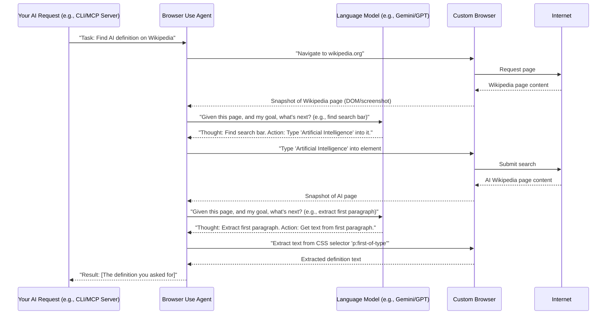

# Chapter 3: Browser Use Agent (Browser Automation Orchestrator)

In the [previous chapter](02_settings___configuration_.md), we configured the general behavior of our `mcp-browser-use` system. We learned how to set up things like whether the browser runs visibly (`headless=False`) or where files should be downloaded. But these settings are just *how* things are done. Now, let's talk about the "who" and the "what" – the actual "brain" that tells the browser *what* to do based on a given task.

This chapter introduces the **Browser Use Agent (Browser Automation Orchestrator)**. Think of this agent as a very skilled project manager for browser tasks. You give it a high-level goal, like "find the price of 'widget X' on 'shopping-site.com'," and it figures out all the detailed steps: go to the site, search for "widget X," click on the product page, find the price, and report it back. It's the orchestrator that turns your general requests into specific actions in a web browser.

Let's imagine a central use case:

**Central Use Case:** You want the system to "Go to Wikipedia, search for 'Artificial Intelligence', and tell me the definition from the first paragraph."

The Browser Use Agent is the component that will make this happen!

## What is the Browser Use Agent?

The Browser Use Agent is the "brain" that drives the AI's interaction with the web browser. Picture a skilled driver: you tell them the destination, and they figure out the exact steps (turn here, press pedal, etc.). Similarly, the Browser Use Agent takes high-level tasks like "find information on a website" and breaks them down into specific browser actions (click buttons, type text, extract data) using its predefined tools. It manages the flow, retries, and overall strategy for web navigation.

It doesn't directly control the mouse and keyboard (that's handled by the [Custom Browser (Playwright Wrapper)](05_custom_browser__playwright_wrapper__.md)). Instead, it decides *what* actions should be taken and *when*.

## How the Browser Use Agent Works: A Simple Scenario

Let's revisit our use case and see how the Browser Use Agent (we'll call it BUA for short) handles it.

**Use Case:** "Go to Wikipedia, search for 'Artificial Intelligence', and tell me the definition from the first paragraph."

Here's how the BUA might break this down:

1.  **Understand the Goal:** The BUA receives the instruction: "Go to Wikipedia, search for 'Artificial Intelligence', and tell me the definition from the first paragraph."
2.  **Initial Action:** It decides the first step is to navigate to Wikipedia.
3.  **Observe:** After loading Wikipedia, it "looks" at the page (gets a snapshot of the page's structure and visible text).
4.  **Plan:** It sees a search bar. Its plan becomes: type "Artificial Intelligence" into the search bar.
5.  **Act:** It performs the "type" action.
6.  **Observe:** It "looks" at the page again after searching (now on the AI page).
7.  **Plan:** It sees the first paragraph and knows it needs to extract its text.
8.  **Act:** It performs the "extract text" action.
9.  **Report:** It sends the extracted definition back.

This "Observe -> Plan -> Act" loop is at the heart of the Browser Use Agent. It constantly evaluates the current state of the browser and decides the next best action to achieve the overall goal.

## How to use the Browser Use Agent (via CLI)

You can interact with the Browser Use Agent directly through the command line interface (CLI) of `mcp-browser-use`. This is a great way to test its capabilities.

First, make sure you have your `.env` file set up from the [previous chapter](02_settings___configuration_.md). For this example, it's useful to have a visible browser, so ensure `MCP_BROWSER_HEADLESS=False` is in your `.env` file. You'll also need to set up your LLM API key, like `MCP_LLM_API_KEY=your_google_api_key` if you are using Google's Gemini.

Let's try our use case with the CLI:

```bash
python -m src.mcp_server_browser_use.cli run-browser-agent "Go to Wikipedia, search for 'Artificial Intelligence', and tell me the definition from the first paragraph."
```

**What happens:**

1.  The `mcp-browser-use` CLI starts.
2.  It loads the settings, including your LLM API key and browser settings.
3.  It initialises the `BrowserUseAgent` behind the scenes.
4.  A web browser window will open (if `headless=False`).
5.  You'll see the browser navigating to Wikipedia.
6.  The agent will type "Artificial Intelligence" into the search bar.
7.  It will navigate to the AI page.
8.  It will extract the first paragraph.
9.  The extracted definition will be printed in your terminal. You might also see intermediate steps logged in the terminal as the agent thinks and acts.

This simple command tells the *entire* system to: start a browser, navigate, interact, and extract information – all orchestrated by the Browser Use Agent.

## Inside the Browser Use Agent: Under the Hood

The Browser Use Agent is quite a sophisticated piece of software, but its core loop is simple: **Observe -> Plan -> Act**.

### The Flow: A High-Level Diagram


As you can see, the Browser Use Agent (BUA) is constantly talking to the [Language Model Integration (LLM Provider)](07_llm_provider__language_model_integration__.md) to decide its next step and then telling the [Custom Browser (Playwright Wrapper)](05_custom_browser__playwright_wrapper__.md) what to do.

### Core Components in Code

The main logic for the `BrowserUseAgent` lives in `src/mcp_server_browser_use/_internal/agent/browser_use/browser_use_agent.py`.

Let's look at a simplified version of its `run` method, which orchestrates the "Observe -> Plan -> Act" loop.

```python
# src/mcp_server_browser_use/_internal/agent/browser_use/browser_use_agent.py (Simplified)

class BrowserUseAgent(Agent): # Agent is a base class from 'browser_use' library
    async def run(self, max_steps: int = 100, **kwargs) -> AgentHistoryList:
        """Execute the task with maximum number of steps"""
        # ... setup and logging ...

        for step in range(max_steps):
            # 1. Observe: Get the current state of the browser
            # self.state holds information like current browser state, history etc.
            # This involves getting screenshots and DOM info from the Custom Browser
            # (Details handled by self._get_context_for_llm())

            # 2. Plan (LLM plays a big part here):
            # This is where the LLM is asked: "Given the current browser state,
            # what's the next best action to achieve the task?"
            # The agent decides which tools to use.
            # For example, it might decide to use a 'type' tool, a 'click' tool, or 'extract_text' tool.
            await self.step(AgentStepInfo(step_number=step, max_steps=max_steps))

            # 3. Act: Execute the planned action
            # The agent performs the action suggested by the LLM by calling
            # methods in the Custom Controller (which talks to the browser).
            # (Details handled inside self.step() and related methods)

            if self.state.history.is_done(): # Agent decided task is complete
                break
        # ... cleanup and result return ...
        return self.state.history
```
**Explanation:**

*   `BrowserUseAgent(Agent)`: Our `BrowserUseAgent` builds upon a general `Agent` class from the `browser-use` library, which provides the basic structure for agents.
*   `run()`: This is the main function you call (e.g., from the CLI or the [MCP Server (FastMCP)](01_mcp_server__fastmcp__.md)) to start the agent. It contains the core loop.
*   `for step in range(max_steps)`: The agent attempts to complete the task within a certain number of steps to prevent infinite loops.
*   `await self.step(...)`: This is the crucial part. Inside this method, the agent:
    *   Gets a snapshot of the current browser page (visuals and structure) from the [Custom Browser (Playwright Wrapper)](05_custom_browser__playwright_wrapper__.md).
    *   Sends this information, along with the task an its history, to the [LLM Provider (Language Model Integration)](07_llm_provider__language_model_integration__.md).
    *   The LLM "thinks" and recommends the next action (e.g., "click button X," "type into field Y").
    *   The agent then uses the [Custom Controller (Action Registry)](06_custom_controller__action_registry__.md) to actually perform that action in the browser.
*   `self.state.history.is_done()`: The agent will eventually decide if it has successfully completed the task or if it cannot proceed.

### Prompting the LLM (Simplified)

The crucial part of the "Plan" stage is how the Browser Use Agent talks to the LLM. It gives the LLM context about the current task, the browser's state, and available tools.

```python
# src/mcp_server_browser_use/_internal/agent/browser_use/browser_use_agent.py (Simplified)

class BrowserUseAgent(Agent):
    async def _get_action_from_llm(self, message_manager: MessageManager, system_prompt: SystemPrompt) -> ActionModel:
        """
        Asks the LLM to decide the next action based on the current state.
        """
        # 1. Get current browser snapshot
        current_browser_state: BrowserState = await self.browser_context.get_current_state()

        # 2. Prepare the messages for the LLM
        # This includes the system prompt (rules, tools), the task, and the current browser state.
        messages: List[BaseMessage] = message_manager.build_messages(
            system_prompt=system_prompt,
            current_browser_state=current_browser_state
        )

        # 3. Call the LLM (e.g., Gemini, GPT)
        # The LLM is expected to return a JSON object that matches our ActionModel
        llm_output_str: str = await self.llm.invoke(messages)

        # 4. Parse the LLM's output into a structured action
        action_model = extract_json_from_model_output(llm_output_str, ActionModel)
        return action_model
```
**Explanation:**

*   `_get_action_from_llm()`: This internal helper function shows how the agent interacts with the LLM.
*   `self.browser_context.get_current_state()`: This gets the detailed information about what the browser currently "sees" (e.g., the URL, visible text, links, buttons, and potentially a screenshot). This comes from the [Custom Browser (Playwright Wrapper)](05_custom_browser__playwright_wrapper__.md).
*   `message_manager.build_messages()`: This prepares the conversation history and the detailed "system prompt" for the LLM. The system prompt tells the LLM its role, the available tools (like `click`, `type`, `extract_text`), and how to format its response.
*   `self.llm.invoke(messages)`: This is where the call to the actual LLM (e.g., Google's Gemini or OpenAI's GPT) happens. This uses our [LLM Provider (Language Model Integration)](07_llm_provider__language_model_integration__.md).
*   `extract_json_from_model_output(...)`: The LLM's raw text response is parsed to extract a structured action (e.g., `{"action": "click", "element_selector": "#search-button"}`), which then tells the agent what to do next.

## Conclusion

The **Browser Use Agent (Browser Automation Orchestrator)** is the core intelligence that translates your high-level web tasks into a series of detailed browser actions. It continuously observes the browser's state, plans the next optimal action using its understanding and the power of a Large Language Model, and then executes that action. It's the orchestrator that makes autonomous web interaction possible.

In the next chapter, we'll look at the [Deep Research Agent](04_deep_research_agent_.md), which builds upon the Browser Use Agent to perform even more complex, multi-step web research tasks.

[Next Chapter: Deep Research Agent](04_deep_research_agent_.md)

---

Generated by [AI Codebase Knowledge Builder](https://github.com/The-Pocket/Tutorial-Codebase-Knowledge)