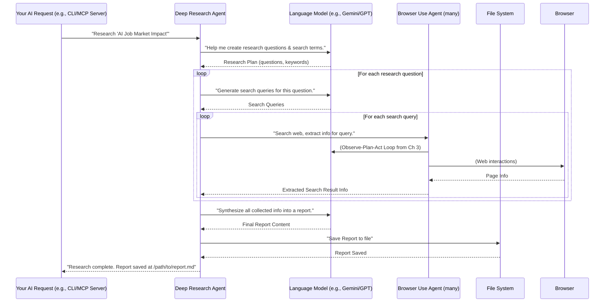

# Chapter 4: Deep Research Agent

In the [previous chapter](03_browser_use_agent__browser_automation_orchestrator__.md), we learned about the `Browser Use Agent`, which is great for performing specific tasks on a single website, like finding a definition on Wikipedia. But what if your task is much bigger? What if you need to research a complex topic that requires visiting many different websites, gathering information, and then putting it all together into a report?

This is where the **Deep Research Agent** comes in! Imagine a professional research librarian: you give them a topic, and they systematically search multiple sources, analyze information, and compile a detailed report. This agent does exactly that for you on the web. It goes beyond simple browsing by performing multi-step web searches, often using many "Browser Use Agents" (our project managers from the last chapter!), to gather in-depth information and then synthesize it into a final report. It can even save this report for you.

**Central Use Case:** You want to research "The impact of AI on job markets in the next 5 years" and get a comprehensive report.

The Deep Research Agent is designed to tackle this kind of complex, multi-page, multi-source research challenge.

## What is the Deep Research Agent?

The Deep Research Agent is like having a mini-team of specialized researchers. Instead of just going to one website to find a specific piece of data, it plans a full research strategy. It decides:

*   What questions need to be answered to cover the topic?
*   What keywords should be used for searching?
*   Which search results look most promising?
*   How to extract the relevant details from each promising website.
*   How to combine all the little pieces of information into one big, organized report.

It's "deep" because it digs into many sources, not just one, and then *synthesizes* (puts together) the information into a meaningful report, not just a collection of facts.

## How the Deep Research Agent Works: A Simple Scenario

Let's break down our central use case: "Research 'The impact of AI on job markets in the next 5 years' and get a comprehensive report."

Here's how the Deep Research Agent might approach this:

1.  **Understand the Topic:** It first analyzes your broad research topic to identify key sub-questions. For example: "What types of jobs will be affected?", "Will new jobs be created?", "What economic impacts are predicted?".
2.  **Plan Searches:** For each sub-question, it will create search queries (e.g., "AI job displacement", "AI job creation", "economic impact of AI").
3.  **Execute Searches (using Browser Use Agents):**
    *   It will perform a search on a search engine (like Google).
    *   For each promising search result, it might launch a *separate* [Browser Use Agent](03_browser_use_agent__browser_automation_orchestrator__.md) to visit that website, gather information, and summarize it.
    *   It can do this for many search results at the same time (in parallel) to speed up research.
4.  **Gather & Combine Information:** As information comes back from each individual browsing task, the Deep Research Agent stores it.
5.  **Synthesize Report:** Once enough information is gathered, it uses an LLM to analyze all the collected data, identify patterns, resolve conflicts (if any), and write a coherent, detailed report on the original topic.
6.  **Save Report (Optional):** It can then save this final report to a specific folder on your computer.

This multi-step, multi-agent approach is what makes the Deep Research Agent so powerful for complex research.

## How to use the Deep Research Agent (via CLI)

Just like the `Browser Use Agent`, you can run the `Deep Research Agent` directly from the command line.

You still need your `.env` file from [Chapter 2](02_settings___configuration_.md) with your LLM API key. For deep research, it's highly recommended to set a `save_dir`. If you don't, the report will only be printed to the console (and not saved as a file).

Add this to your `.env` file (if you haven't already):
```dotenv
# .env file
MCP_LLM_API_KEY=your_google_api_key_here
MCP_RESEARCH_TOOL_SAVE_DIR="./tmp/deep_research_reports"
```
Remember to change `your_google_api_key_here` to your actual API key. The `MCP_RESEARCH_TOOL_SAVE_DIR` specifies where the agent should save its generated reports. It's a good idea to put this inside your project's root for organization, like `tmp/deep_research_reports`.

Now, let's run our central use case:

```bash
python -m src.mcp_server_browser_use.cli run-deep-research "The impact of AI on job markets in the next 5 years"
```

**What happens:**

1.  The `mcp-browser-use` CLI starts.
2.  It uses the settings, including your LLM API key and the save directory.
3.  The `DeepResearchAgent` is initialized.
4.  You'll see messages in your terminal as the agent plans its research.
5.  Multiple browser windows might open (if `headless=False` in your settings) as individual [Browser Use Agents](03_browser_use_agent__browser_automation_orchestrator__.md) perform parallel searches and data extraction.
6.  The agent gathers all the information.
7.  Finally, it synthesizes a report.
8.  The full report will be printed to your terminal, and a Markdown file (`report.md`) will be saved in a new subfolder within `tmp/deep_research_reports` (e.g., `tmp/deep_research_reports/your_task_id/report.md`).

This single command kicks off a powerful, multi-stage research process!

## Inside the Deep Research Agent: Under the Hood

The Deep Research Agent is much more complex than the `Browser Use Agent` because it coordinates multiple sub-agents and manages a multi-step research workflow. It uses a concept called **Langgraph** to manage this complex flow. Think of Langgraph as a flowchart designer for AI agents.

### The Flow: A High-Level Diagram



As you can see, the Deep Research Agent (DRA) acts as the main conductor, orchestrating the LLM and spawning multiple [Browser Use Agents](03_browser_use_agent__browser_automation_orchestrator__.md) to gather information.

### Core Components in Code

The main logic for the `DeepResearchAgent` lives in `src/mcp_server_browser_use/_internal/agent/deep_research/deep_research_agent.py`.

It leverages a powerful library called `langgraph` to define its multi-stage process. Langgraph allows us to define "nodes" (steps) and "edges" (transitions between steps) in a graph, making complex workflows manageable.

Here's a very simplified look at how the `DeepResearchAgent` might set up its graph:

```python
# src/mcp_server_browser_use/_internal/agent/deep_research/deep_research_agent.py (Simplified)

class DeepResearchAgent:
    def __init__(self, **kwargs):
        # ... (setup LLM, browser config, etc.) ...
        self.graph = self._build_research_graph() # This builds the flowchart

    def _build_research_graph(self):
        workflow = StateGraph(ResearchState) # ResearchState holds current progress

        # Define nodes (steps in our research process)
        workflow.add_node("plan_research", self.plan_research_node)
        workflow.add_node("execute_search", self.execute_search_node)
        workflow.add_node("process_search_results", self.process_search_results_node)
        workflow.add_node("synthesize_report", self.synthesize_report_node)

        # Define edges (how steps connect)
        workflow.set_entry_point("plan_research") # Start here

        # After planning, go to execute search, then process results
        workflow.add_edge("plan_research", "execute_search")
        workflow.add_edge("execute_search", "process_search_results")

        # After processing, decide if more research is needed or if we can synthesize
        workflow.add_conditional_edges(
            "process_search_results",
            self.should_continue_research, # A function that decides where to go next
            {"continue": "execute_search", "finish": "synthesize_report"},
        )

        # After synthesizing, we are done
        workflow.add_edge("synthesize_report", END)

        return workflow.compile() # Turn the flowchart into runnable code

    async def run(self, topic: str, save_dir: str = None, **kwargs):
        initial_state = {"topic": topic, "save_dir": save_dir, "research_plan": [], "search_results": []}
        final_state = await self.graph.ainvoke(initial_state) # Run the flowchart
        # ... process final_state and save report ...
        return {"final_report": final_state.get("final_report", "No report generated.")}
```

**Explanation:**

*   `StateGraph(ResearchState)`: This tells Langgraph that our research process will keep track of its progress in a special `ResearchState` object (which stores the topic, plan, results, etc.).
*   `add_node(...)`: Each `add_node` line defines a distinct step in the research process. For instance:
    *   `plan_research_node`: This step uses the LLM to break down the main topic.
    *   `execute_search_node`: This step generates search queries and dispatches them to individual [Browser Use Agents](03_browser_use_agent__browser_automation_orchestrator__.md) (which run in parallel).
    *   `process_search_results_node`: This step takes the raw results from the browser agents and refines them.
    *   `synthesize_report_node`: This step combines all the refined information into the final report.
*   `set_entry_point("plan_research")`: This tells the graph to start at the "plan research" step.
*   `add_edge("plan_research", "execute_search")`: This means after `plan_research` is done, the graph automatically moves to `execute_search`.
*   `add_conditional_edges(...)`: This is smart! After `process_search_results`, the `should_continue_research` function decides if we need to do more searches (`"continue"`) or if we have enough info to write the report (`"finish"`).
*   `self.graph.ainvoke(initial_state)`: This line actually starts the entire research process, running through all the nodes and edges defined in the graph.

### Running Parallel Browser Tasks

A key feature of the Deep Research Agent is its ability to run multiple browser tasks at once to speed up data gathering. When the `execute_search_node` is run, it doesn't just call one `BrowserUseAgent`; it can call many!

The actual implementation uses Python's `asyncio` and `concurrent.futures` to manage these parallel tasks. Here's a tiny snippet showing the concept:

```python
# src/mcp_server_browser_use/_internal/agent/deep_research/deep_research_agent.py (Simplified)

async def execute_search_node(self, state: ResearchState):
    # ... generate search queries based on the plan ...

    search_queries_for_this_round = state.get("next_queries", [])
    logger.info(f"Executing {len(search_queries_for_this_round)} search tasks in parallel.")

    tasks = []
    for query in search_queries_for_this_round:
        # For each query, create a task to run a single BrowserUseAgent
        task_id = f"{state['task_id']}_subtask_{uuid.uuid4().hex[:6]}" # Unique ID for subtask
        tasks.append(
            # This function runs a BrowserUseAgent inside its own context
            run_single_browser_task(
                query,
                task_id=task_id,
                llm=self.llm, # Pass the LLM
                browser_config=self.browser_config,
                stop_event=self.stop_event,
                use_vision=state.get("use_vision", False)
            )
        )
    # Run all these tasks concurrently and wait for them to finish
    results = await asyncio.gather(*tasks)

    # ... process results and update ResearchState ...
    return {"search_results": results} # Add results to the state
```

**Explanation:**

*   `execute_search_node(self, state: ResearchState)`: This is one of the nodes in our Langgraph flowchart.
*   `search_queries_for_this_round`: The agent has already used the LLM to figure out what searches to do.
*   `tasks.append(run_single_browser_task(...))`: For each search query, we create an `asyncio` task. The `run_single_browser_task` function is responsible for setting up and running one instance of the [Browser Use Agent](03_browser_use_agent__browser_automation_orchestrator__.md).
*   `await asyncio.gather(*tasks)`: This magic line tells Python to run all the tasks concurrently. It waits until *all* of them are finished before proceeding. This is how the Deep Research Agent can explore many websites at the same time!

## Conclusion

The **Deep Research Agent** is your go-to tool for comprehensive web research. It skillfully combines the power of Language Models for planning and synthesis with the web interaction capabilities of multiple [Browser Use Agents](03_browser_use_agent__browser_automation_orchestrator__.md), performing complex, multi-stage research tasks and delivering organized reports. You've seen how it breaks down a complex problem into manageable steps and executes them efficiently.

In the next chapter, we're going to zoom in on the browser itself and understand how it interacts with the web in a way that our agents can understand. We'll explore the [Custom Browser (Playwright Wrapper)](05_custom_browser__playwright_wrapper__.md).

[Next Chapter: Custom Browser (Playwright Wrapper)](05_custom_browser__playwright_wrapper__.md)

---

Generated by [AI Codebase Knowledge Builder](https://github.com/The-Pocket/Tutorial-Codebase-Knowledge)