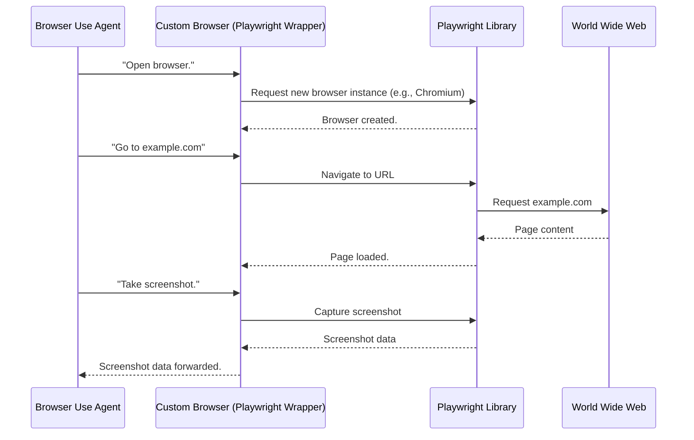

# Chapter 5: Custom Browser (Playwright Wrapper)

In the [previous chapter](04_deep_research_agent_.md), we saw how the `Deep Research Agent` orchestrates complex web research, even launching multiple `Browser Use Agents` to gather information. But have you ever wondered how these agents actually "see" and "touch" the web? How do they open a website, click buttons, or type text?

This is where the **Custom Browser (Playwright Wrapper)** comes in! Imagine the AI agents are like your brain, deciding what to do. The Custom Browser is like your hand, eye, and keyboard working together. It's the actual web browser that the AI agents control, allowing them to interact with websites as a human would. It uses a powerful tool called `Playwright` to do this, but with special custom additions.

**Central Use Case:** An AI agent needs to visit `example.com` and take a screenshot.

The Custom Browser is the core component that performs this action. It makes sure the browser is open, ready, and can follow instructions.

## What is the Custom Browser (Playwright Wrapper)?

Think of it as a remote-controlled robot hand that can interact with websites. When the AI agent (like the `Browser Use Agent`) says "go to this page," it's the Custom Browser that actually does it.

Here's why it's a "Custom Browser" and not just plain Playwright:

*   **Playwright:** This is the underlying tool that provides the basic "robot hand" capabilities (opening browsers, clicking, typing, etc.). It's like the raw motor and finger mechanisms.
*   **Custom Capabilities:** Our Custom Browser adds special features on top of Playwright, making it more flexible and useful for AI agents:
    *   **Connecting to an existing Chrome browser (CDP):** This means you can launch your own Chrome browser and our system can "plug into" it, controlling your active window. This is very cool if you want to see exactly what the AI is doing in *your* browser.
    *   **Handling specific configs:** It respects settings like `headless` (browser runs invisibly in the background) or `user data` (keeping your browser's history, cookies, and logins).
    *   **Managing browser contexts:** In Playwright, a "context" is like a fresh, isolated browser window or tab. Our Custom Browser can manage these for specialized tasks, ensuring one agent's actions don't interfere with another's.

## How to Use the Custom Browser (Conceptually)

You won't directly "use" the `Custom Browser` with a simple command like `run-browser-agent`. Instead, the `Browser Use Agent` (and by extension the `Deep Research Agent`) *uses* the Custom Browser behind the scenes.

Let's revisit our central use case: An AI agent needs to visit `example.com` and take a screenshot.

When you run a command like:
```bash
python -m src.mcp_server_browser_use.cli run-browser-agent "Go to example.com and take a screenshot."
```

Behind the scenes:

1.  The `MCP Server (FastMCP)` receives the request.
2.  It hands it off to the `Browser Use Agent`.
3.  The `Browser Use Agent` decides it needs a browser. It tells the system to get a `Custom Browser` instance.
4.  The `Custom Browser` launches a new browser (or connects to an existing one, based on your settings).
5.  The `Browser Use Agent` then instructs the `Custom Browser` instance to "go to `example.com`."
6.  Once the page loads, it instructs the `Custom Browser` to "take a screenshot."
7.  The `Custom Browser` performs these actions using Playwright and returns the screenshot data.

## Inside the Custom Browser: Under the Hood

The Custom Browser wraps Playwright's capabilities to provide a controlled environment for our AI agents.

### The Flow: A High-Level Diagram



### Core Components in Code

The main parts of the Custom Browser are defined in `src/mcp_server_browser_use/_internal/browser/custom_browser.py` and `src/mcp_server_browser_use/_internal/browser/custom_context.py`.

#### `CustomBrowser` Class (The Browser Manager)

This class is responsible for launching or connecting to the actual web browser.

```python
# src/mcp_server_browser_use/_internal/browser/custom_browser.py (Simplified)

from playwright.async_api import async_playwright, Playwright
from browser_use.browser.browser import Browser

class CustomBrowser(Browser):
    async def _setup_builtin_browser(self, playwright: Playwright):
        """
        Sets up and returns a Playwright Browser instance.
        Handles settings like headless mode, window size, etc.
        """
        # Decisions based on our Settings & Configuration (from Chapter 2)
        if self.config.headless:
            # Code to set up for invisible browsing
            pass
        else:
            # Code for visible browsing (adjust window size etc.)
            pass

        # Check if we should connect to an existing browser (CDP)
        if self.config.use_own_browser and self.config.cdp_url:
            # Connect to browser launched by user
            browser = await playwright.chromium.connect_over_cdp(self.config.cdp_url)
        elif self.config.user_data_dir:
            # Launch browser with specific user data (cookies, history)
            browser = await playwright.chromium.launch_persistent_context(
                self.config.user_data_dir, headless=self.config.headless
            )
        else:
            # Standard new browser launch
            browser = await playwright.chromium.launch(
                headless=self.config.headless,
                args=self.config.extra_browser_args
            )
        return browser

    async def new_context(self, config=None):
        """Creates a new browser context (like a new tab/window) within this browser."""
        # This will return an instance of CustomBrowserContext
        from .custom_context import CustomBrowserContext, CustomBrowserContextConfig
        merged_config = {**(self.config.model_dump() if self.config else {}), **(config.model_dump() if config else {})}
        return CustomBrowserContext(config=CustomBrowserContextConfig(**merged_config), browser=self)

```
**Explanation:**

*   `CustomBrowser(Browser)`: Our `CustomBrowser` inherits from a base `Browser` class provided by `browser-use` library.
*   `_setup_builtin_browser(self, playwright: Playwright)`: This is where the magic of starting or connecting to a browser happens.
    *   It checks `self.config.headless` (from [Settings & Configuration](02_settings___configuration_.md)) to decide if the browser should run visibly or invisibly.
    *   It checks `self.config.use_own_browser` and `self.config.cdp_url` to see if it should connect to a Chrome browser *you* launched. This is the `CDP Connection` feature from the `README.md`.
    *   It checks `self.config.user_data_dir` to launch a browser that keeps your user data (like a regular browser saving your info).
    *   Otherwise, it just launches a brand new, clean browser.
*   `new_context()`: This method is used to create a new "browser context."

#### `CustomBrowserContext` Class (The Tab/Window Manager)

Once a browser is launched, the `CustomBrowserContext` manages specific browser sessions, like individual tabs or isolated windows. This is where the "anti-detection" measures and cookie loading happen.

```python
# src/mcp_server_browser_use/_internal/browser/custom_context.py (Simplified)

import json
import os
from browser_use.browser.context import BrowserContext

class CustomBrowserContext(BrowserContext):
    async def _create_context(self, browser):
        """
        Creates a new Playwright context (like a private tab) and applies custom settings.
        """
        # If we connected to an existing CDP browser or are using a persistent context,
        # we might just use its default context instead of creating a new one.
        if self.browser.config.cdp_url or self.browser.config.browser_binary_path:
            context = browser.contexts[0]
        else:
            # Otherwise, create a fresh new context with specific settings
            context = await browser.new_context(
                no_viewport=True,
                user_agent=self.config.user_agent,
                record_video_dir=self.config.save_recording_path,
                # ... many other settings for the context ...
            )

        # Load cookies if specified in settings
        if self.config.cookies_file and os.path.exists(self.config.cookies_file):
            with open(self.config.cookies_file, 'r') as f:
                cookies = json.load(f)
                await context.add_cookies(cookies)
                # ... handle invalid cookie values ...

        # Inject anti-detection scripts
        await context.add_init_script(
            """
            // Hide "webdriver" property to make it look less like an automated browser
            Object.defineProperty(navigator, 'webdriver', { get: () => undefined });
            // ... more anti-detection measures ...
            """
        )
        return context

```
**Explanation:**

*   `CustomBrowserContext(BrowserContext)`: This also inherits from a base class that handles common browser actions.
*   `_create_context(self, browser)`: This method is called to set up a new isolated browsing session.
    *   It checks if we're connected via `CDP` or using a `persistent context` (which would have its own default context already), in which case it reuses that. This means the AI agent can control your *currently open* browser session.
    *   Otherwise, it creates a brand new, isolated Playwright `context`. This is useful for `Deep Research Agent` tasks where you might want multiple isolated browsing sessions running in parallel.
    *   It loads cookies from a file if `self.config.cookies_file` is set, allowing the AI to browse with your logged-in sessions.
    *   It injects *anti-detection scripts*. Websites sometimes try to figure out if they are being browsed by a human or a robot. These scripts make our browser look more like a human-controlled one, helping to avoid being blocked.

Together, `CustomBrowser` and `CustomBrowserContext` provide the robust and flexible browser environment that our AI agents need to interact with the world wide web. When you see messages about "navigating to a URL" or "taking a screenshot," it's these components doing the heavy lifting using Playwright.

## Conclusion

You've just peeled back the curtain on the **Custom Browser (Playwright Wrapper)**, the "robot hand" of our AI agents! You learned that it uses `Playwright` to control web browsers, but adds powerful custom features like connecting to your existing Chrome browser, managing user data, and even making it harder for websites to detect that it's an automated browser. This foundational component is what allows the `Browser Use Agent` and `Deep Research Agent` to perform their tasks effectively.

In the next chapter, we'll explore the [Custom Controller (Action Registry)](06_custom_controller__action_registry__.md), which is the bridge that translates the AI's high-level plans into the low-level actions that this Custom Browser actually performs.

[Next Chapter: Custom Controller (Action Registry)](06_custom_controller__action_registry__.md)

---

Generated by [AI Codebase Knowledge Builder](https://github.com/The-Pocket/Tutorial-Codebase-Knowledge)