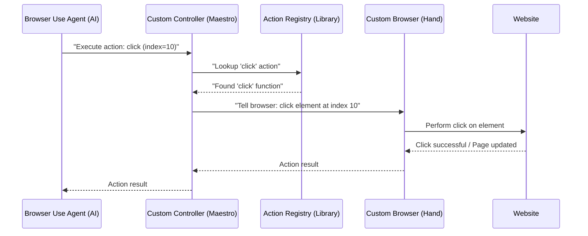

# Chapter 6: Custom Controller (Action Registry)

In the [previous chapter](05_custom_browser__playwright_wrapper__.md), we explored the `Custom Browser (Playwright Wrapper)`, which is the actual web browser our AI agents use to perform actions. It's like the "hand" that can navigate to websites and take screenshots. But a hand needs instructions! Who tells the hand what to do next? Who makes sense of the AI's high-level thoughts and translates them into specific browser clicks and types?

This is where the **Custom Controller (Action Registry)** comes in! Imagine a maestro conducting an orchestra. The maestro doesn't play every instrument, but they know exactly which instrument needs to play, and when, to create the desired music. The Custom Controller is that maestro for our browser automation. It knows all the available browser actions and orchestrates them based on the AI's plan.

**Central Use Case:** The AI (specifically, the `Browser Use Agent` from [Chapter 3](03_browser_use_agent__browser_automation_orchestrator__.md)) decides it needs to "click on a button with index 10" on a web page.

The Custom Controller is the mastermind that will actually execute this "click" action in the browser.

## What is the Custom Controller (Action Registry)?

The Custom Controller is the central hub for all browser-related commands. It's like a library of actions that the AI agents can "borrow" from. When an AI agent decides it needs to perform an action (like clicking, typing, or extracting information), it passes that request to the Custom Controller.

Here's why it's a "Custom Controller" and an "Action Registry":

*   **Action Registry:** This is the "library" part. It keeps a list of all the specific browser actions it knows how to perform (e.g., `click`, `type`, `go_to_url`, `extract_text`). Each action has a name and instructions on how to use it.
*   **Custom:** We can add our own special actions to this registry beyond the standard ones. For example, we might add an action to upload a file or ask for human help. It also handles integrating with external MCP servers for even more actions!
*   **Controller:** This is the "maestro" part. When an AI agent requests an action, the Controller looks it up in its registry, gets the detailed instructions, and then tells the `Custom Browser` to perform that action.

## How the Custom Controller Works: A Simple Scenario

Let's revisit our central use case: The AI decides it needs to "click on a button with index 10."

Here's how the Custom Controller helps execute this:

1.  **AI Plans Action:** The [Browser Use Agent](03_browser_use_agent__browser_automation_orchestrator__.md) (after asking the LLM, as discussed in [Chapter 3](03_browser_use_agent__browser_automation_orchestrator__.md)) decides its next step is to "click on an element with index 10." It generates an `ActionModel` (a structured instruction) containing this.

2.  **Controller Receives Action:** The `Browser Use Agent` passes this `ActionModel` to the `Custom Controller`'s `act` method.

3.  **Controller Looks Up Action:** The `Custom Controller` receives the request to `"click"`. It looks into its "Action Registry" (its internal list of actions) and finds the specific function that handles "click" actions.

4.  **Controller Executes Action:** The `Custom Controller` then calls this "click" function, passing it the necessary details, like `index=10` and the current `browser_context` (which is managed by the `Custom Browser` from [Chapter 5](05_custom_browser__playwright_wrapper__.md)).

5.  **Browser Performs Action:** The "click" function, in turn, tells the `Custom Browser` to actually perform the click operation on the web page.

6.  **Result Returned:** The `Custom Browser` completes the click, and the result (e.g., "click successful") is passed back through the Controller to the `Browser Use Agent`.

## How to Use the Custom Controller (Conceptually)

You won't directly "use" the `Custom Controller` with a simple CLI command. Just like the `Custom Browser`, it's an internal component that the `Browser Use Agent` (and by extension the `Deep Research Agent`) *uses* behind the scenes as part of its "Act" phase.

When you run a command like:
```bash
python -m src.mcp_server_browser_use.cli run-browser-agent "Go to example.com, then click the 'Contact Us' button."
```

Behind the scenes:

1.  The CLI triggers the `MCP Server (FastMCP)`.
2.  The `MCP Server` sends the task to the `Browser Use Agent`.
3.  The `Browser Use Agent` starts its "Observe -> Plan -> Act" loop.
4.  In the "Act" phase, when it needs to "go to example.com" or "click the 'Contact Us' button," it uses the `Custom Controller` to call those specific actions. The `Custom Controller` then makes the `Custom Browser` perform them.

## Inside the Custom Controller: Under the Hood

The `Custom Controller` is defined in `src/mcp_server_browser_use/_internal/controller/custom_controller.py`. It inherits its core functionality from a library class called `Controller` and adds our specific customizations.

### The Flow: A High-Level Diagram



This diagram shows how the `Browser Use Agent` asks the `Custom Controller` to perform an action. The `Custom Controller` then uses its internal `Action Registry` to find the right function and tells the `Custom Browser` which steps to execute on the website.

### Core Components in Code

Let's look at the `CustomController` class and its key methods.

#### `CustomController` Initialization and Custom Actions

```python
# src/mcp_server_browser_use/_internal/controller/custom_controller.py (Simplified)

from browser_use.controller.service import Controller, ActionResult
from browser_use.controller.registry.service import RegisteredAction
import logging
import os

logger = logging.getLogger(__name__)

class CustomController(Controller):
    def __init__(self, exclude_actions: list[str] = [], output_model=None, ask_assistant_callback=None):
        super().__init__(exclude_actions=exclude_actions, output_model=output_model)
        self._register_custom_actions() # This is where we add our special actions!
        self.ask_assistant_callback = ask_assistant_callback # For human interaction
        self.mcp_client = None # For future MCP tool integration

    def _register_custom_actions(self):
        """Register all custom browser actions"""

        @self.registry.action(
            "When executing tasks, prioritize autonomous completion. However, if you encounter a definitive blocker..."
        )
        async def ask_for_assistant(query: str, browser: Any): # 'Any' for simplicity, it's BrowserContext
            """Allows the AI to ask a human for help when it's stuck."""
            if self.ask_assistant_callback:
                # This calls the provided callback, assuming it's an async function
                user_response = await self.ask_assistant_callback(query, browser)
                msg = f"AI ask: {query}. User response: {user_response['response']}"
                logger.info(msg)
                return ActionResult(extracted_content=msg, include_in_memory=True)
            else:
                return ActionResult(extracted_content="Human cannot help you. Try another way.",
                                    include_in_memory=True)

        @self.registry.action(
            'Upload file to interactive element with file path',
        )
        async def upload_file(index: int, path: str, browser: Any, available_file_paths: list[str]):
            """Handles uploading a file to an HTML input element."""
            if path not in available_file_paths:
                return ActionResult(error=f'File path {path} is not available')
            if not os.path.exists(path):
                return ActionResult(error=f'File {path} does not exist')

            # --- Simplified logic ---
            # In reality, this would locate the specific input field based on 'index'
            # and use browser.set_input_files(path) to upload the file.
            logger.info(f"Simulating file upload of {path} to element {index}")
            return ActionResult(extracted_content=f"Successfully uploaded {path} to element {index}", include_in_memory=True)

        # Other standard actions like click, type, go_to_url are registered by the base Controller class.
```
**Explanation:**

*   `class CustomController(Controller):`: Our custom controller inherits from a base `Controller` class (from the `browser-use` library). This base class already provides many standard actions like `click`, `type`, `go_to_url`, etc.
*   `self._register_custom_actions()`: This is our special method that adds *new* actions that are specific to `mcp-browser-use`.
*   `@self.registry.action(...)`: This is a "decorator" that tells the `Controller` to register the function below it as an available action. The string inside the decorator is the description of the action, which the LLM uses to understand what the tool does.
*   `ask_for_assistant`: This is a custom action that allows the AI to explicitly request human help if it encounters a blocker.
*   `upload_file`: This is another custom action that handles uploading files to a web page.
*   `browser: Any`: This parameter in the action functions represents the `BrowserContext` (from [Chapter 5](05_custom_browser__playwright_wrapper__.md)) that the action will operate on.

#### `act` Method: The Maestro's Command Center

This is the central method that the `Browser Use Agent` calls to execute an action.

```python
# src/mcp_server_browser_use/_internal/controller/custom_controller.py (Simplified)

from pydantic import BaseModel
from typing import Optional, Dict, Any

class ActionModel(BaseModel): # Simplified example of what an action model might look like
    click: Optional[Dict[str, Any]] = None # Example: {"index": 10}
    go_to_url: Optional[Dict[str, Any]] = None
    ask_for_assistant: Optional[Dict[str, Any]] = None
    # ... other potential actions

class CustomController(Controller):
    # ... (init and _register_custom_actions methods) ...

    async def act(
            self,
            action: ActionModel, # The instruction from the AI, e.g., {"click": {"index": 10}}
            browser_context: Any, # The current browser context from Custom Browser
            # ... other optional parameters ...
    ) -> ActionResult:
        """Execute an action requested by the AI."""
        try:
            # ActionModel can have multiple fields, but usually only one is set
            for action_name, params in action.model_dump(exclude_unset=True).items():
                if params is not None:
                    if action_name.startswith("mcp"):
                        # This would handle actions coming from other MCP servers
                        logger.debug(f"Invoking MCP tool: {action_name}")
                        # In reality, this would use a dynamically registered MCP client tool
                        return ActionResult(extracted_content=f"Simulating MCP tool '{action_name}' with {params}")
                    else:
                        # Find the action in our registry and execute it!
                        result = await self.registry.execute_action(
                            action_name, # e.g., "click"
                            params,      # e.g., {"index": 10}
                            browser=browser_context, # Pass the browser to the action
                            # ... other parameters ...
                        )
                        if isinstance(result, ActionResult):
                            return result
                        else: # Convert simple string results to ActionResult
                            return ActionResult(extracted_content=str(result))
            return ActionResult() # If no action specified, return empty
        except Exception as e:
            logger.error(f"Error executing action: {e}")
            raise e

```
**Explanation:**

*   `action: ActionModel`: This `ActionModel` is typically a `Pydantic` model generated by the LLM (based on the `SystemPrompt` giving it the available tools). It will have one field set, corresponding to the action the LLM wants to perform (e.g., `action.click` will contain `{"index": 10}`).
*   `for action_name, params in action.model_dump(exclude_unset=True).items()`: This loop iterates through the `ActionModel` to find which action was requested. `.model_dump(exclude_unset=True)` converts the `ActionModel` into a dictionary, showing only the fields that were actually set.
*   `if action_name.startswith("mcp")`: This is a placeholder for future ability to call actions exposed by *other* [MCP Servers (FastMCP)](01_mcp_server__fastmcp__.md). This means our agent can potentially interact with other MCP-enabled services using tools dynamically provided to it.
*   `await self.registry.execute_action(...)`: This is the core line. The `Controller`'s `registry` (which holds all its registered actions) is asked to execute the found `action_name` (e.g., "click") with the given `params` (e.g., `{"index": 10}`). Importantly, it passes the `browser_context` so the action knows which browser to perform the operation on.

The `Custom Controller` is the critical piece that bridges the AI's intelligent decisions ("what to do") with the actual browser movements ("how to do it"). It ensures that the AI's instructions are translated into precise and executable commands for the web browser.

## Conclusion

You've learned that the **Custom Controller (Action Registry)** is the mastermind behind executing specific browser actions. It acts as a central registry for all available browser commands, including custom ones like asking for human assistance or uploading files. When an AI agent decides on a browser action, the Custom Controller steps in to translate that instruction into concrete steps for the `Custom Browser`. It's the essential link that enables our AI agents to interact with the world wide web effectively.

In the next chapter, we'll shift our focus to the "brains" behind the operation, the AI models themselves, and learn about the [LLM Provider (Language Model Integration)](07_llm_provider__language_model_integration__.md).

[Next Chapter: LLM Provider (Language Model Integration)](07_llm_provider__language_model_integration__.md)

---

Generated by [AI Codebase Knowledge Builder](https://github.com/The-Pocket/Tutorial-Codebase-Knowledge)