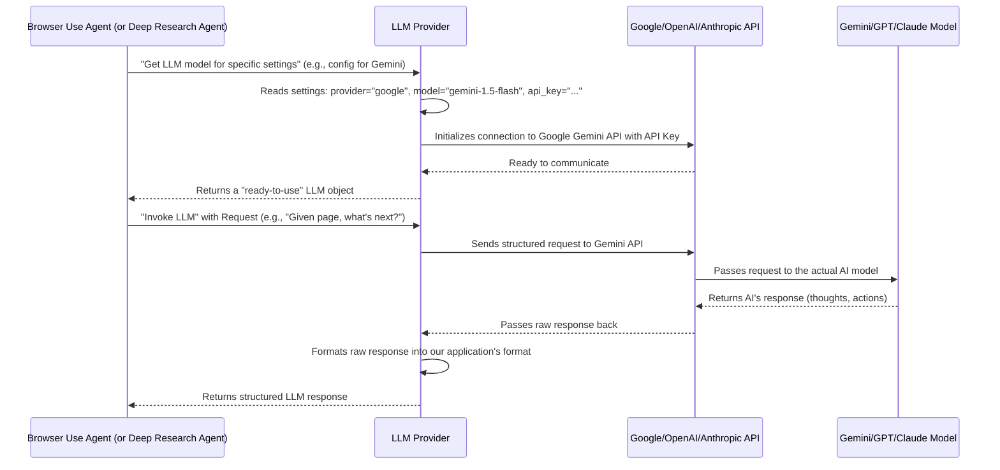

# Chapter 7: LLM Provider (Language Model Integration)

In the [previous chapter](06_custom_controller__action_registry__.md), we saw how the `Custom Controller` translates AI's decisions into concrete browser actions, like clicking a button. But where do these "decisions" come from in the first place? And how does the AI understand complicated tasks like "find the definition of AI" or "research the job market impact of AI"?

This is where the **LLM Provider (Language Model Integration)** comes in! Think of it as the application's "brain" or "translator." It allows our system to talk to powerful Artificial Intelligence models, called LLMs (Large Language Models), which are very good at understanding human language, generating text, and making smart decisions.

**Central Use Case:** Our `Browser Use Agent` (from [Chapter 3](03_browser_use_agent__browser_automation_orchestrator__.md)) needs to decide its next step while browsing. It has a screenshot of a webpage and the task "find the search bar." The LLM Provider is how it asks a powerful AI model: "Given this screenshot and this task, what should I do next?" and gets a smart answer like "Type 'search term' into the element with index 5."

The LLM Provider is the component that makes this conversation possible, allowing our application to tap into the intelligence of large AI models.

## What is the LLM Provider?

The LLM Provider is essentially a "universal adapter" for different AI brains. Imagine you have a device that can plug into many different types of wall sockets (US, EU, UK, etc.). The LLM Provider is similar – it lets our application connect to and use various Large Language Models (LLMs) from different companies (like Google Gemini, OpenAI's GPT, Anthropic Claude, etc.) without having to rewrite our code for each one.

Here's why it's so important:

*   **Intelligence Source:** It's the primary way our agents (like the [Browser Use Agent](03_browser_use_agent__browser_automation_orchestrator__.md) and [Deep Research Agent](04_deep_research_agent__.md)) get their "intelligence." They send questions or situations to the LLM, and the LLM responds with thoughts, actions, or generated text.
*   **Flexibility:** It means you can easily switch between different LLMs based on your preference, cost, or performance needs, just by changing a setting.
*   **Unified Interface:** It provides a consistent way for our application to "speak" to any LLM, no matter its underlying technology.

## How the LLM Provider Works: A Simple Scenario

Let's revisit our central use case: The `Browser Use Agent` needs to "find the search bar" on a webpage.

1.  **Agent Needs a Decision:** The `Browser Use Agent` (from [Chapter 3](03_browser_use_agent__browser_automation_orchestrator__.md)) reaches a point where it needs to decide what to do next. It has observed the browser's current state (e.g., screenshot, list of clickable elements).
2.  **Agent Prepares Question:** It puts together a question for the LLM, including:
    *   The overall task (e.g., "Find the search bar.")
    *   A description of the current webpage (e.g., "Here's a list of visible elements, including a 'search' button and an input field.")
    *   Information about the tools it can use (e.g., "I can `click` on elements, `type` text, or `extract_text`.")
3.  **Agent Requests LLM:** The `Browser Use Agent` sends this whole "context" to the LLM Provider.
4.  **LLM Provider Translates:** The LLM Provider takes this request and translates it into the specific format that the chosen LLM understands (e.g., for Google Gemini, it uses the Gemini API; for OpenAI, it uses the OpenAI API). It also adds your API key (from [Chapter 2](02_settings___configuration_.md)) to authenticate the request.
5.  **LLM Processes Request:** The LLM (e.g., Gemini) reads the context, "thinks" about the problem, and decides the best action.
6.  **LLM Provider Gets Response:** The LLM Provider receives the LLM's answer (e.g., "Thought: I should type into the search bar. Action: Type 'search term' into element with index 5").
7.  **LLM Provider Translates Back:** It translates the LLM's raw response into a structured format that our `Browser Use Agent` understands (like the `ActionModel` we saw in [Chapter 6](06_custom_controller__action_registry__.md)).
8.  **Agent Receives Decision:** The `Browser Use Agent` gets the structured decision and proceeds to execute the action using the `Custom Controller`.

## How to Configure the LLM Provider

The beautiful part of the LLM Provider is its reliance on our [Settings & Configuration](02_settings___configuration__.md). You don't write code to switch LLMs; you just change a setting in your `.env` file!

To use the LLM Provider, you need to:

1.  **Choose a Provider and Model:** Decide which LLM you want to use (e.g., `google`, `openai`, `anthropic`).
2.  **Provide an API Key:** Get an API key from your chosen LLM provider and store it securely.

Let's say you want to use Google's Gemini model.

**1. Update your `.env` file:**

Open your `.env` file (from [Chapter 2](02_settings___configuration__.md)) in the root of your project and add/modify these lines:

```dotenv
# .env file

# --- LLM Settings ---
MCP_LLM_PROVIDER=google
MCP_LLM_MODEL_NAME=gemini-1.5-flash-latest # Or another model from the list below
MCP_LLM_TEMPERATURE=0.0 # How "creative" the AI is (0.0 is more factual)

# Your API key for Google Gemini
MCP_LLM_API_KEY=YOUR_GOOGLE_GEMINI_API_KEY_HERE
# Or, if you prefer specific:
# MCP_LLM_GOOGLE_API_KEY=YOUR_GOOGLE_GEMINI_API_KEY_HERE
```
**Explanation:**

*   `MCP_LLM_PROVIDER=google`: This tells the `LLMSettings` (from `config.py`) that we want to use Google's LLMs.
*   `MCP_LLM_MODEL_NAME=gemini-1.5-flash-latest`: This specifies the exact Gemini model to use. You can find available models in `src/mcp_server_browser_use/_internal/utils/config.py` under the `model_names` dictionary for your chosen provider.
*   `MCP_LLM_TEMPERATURE=0.0`: A lower temperature makes the LLM's responses more consistent and less random, which is usually good for automation tasks.
*   `MCP_LLM_API_KEY=YOUR_GOOGLE_GEMINI_API_KEY_HERE`: **Crucially, replace `YOUR_GOOGLE_GEMINI_API_KEY_HERE` with your actual API key!** You get this from the LLM provider's website. For most providers, you can use the generic `MCP_LLM_API_KEY`, but for clarity or specific multi-LLM setups, you can use provider-specific keys like `MCP_LLM_GOOGLE_API_KEY`.

Now, when you run any command that involves an AI agent (like `run-browser-agent` or `run-deep-research`), the system will automatically use Google's Gemini model with your specified key!

You can easily switch to OpenAI by changing `MCP_LLM_PROVIDER=openai` and providing `MCP_LLM_OPENAI_API_KEY` (or `MCP_LLM_API_KEY`).

## Inside the LLM Provider: Under the Hood

The core logic for interacting with various LLMs sits in `src/mcp_server_browser_use/_internal/utils/llm_provider.py`. It uses a popular Python library called `langchain`, which is designed to make it easy to work with different LLMs.

### The Flow: A High-Level Diagram


This diagram highlights that the `LLM Provider` acts as the middleman. First, it sets up the connection to the correct LLM based on our configuration. Then, it handles all communication with that LLM, making sure requests are sent in the right format and responses are understood by our agents.

### Core Components in Code

The `llm_provider.py` file contains functions that, based on your configuration, return the correct `langchain` object for interacting with a specific LLM.

Let's look at the main function, `get_llm_model`, which is responsible for creating the LLM object.

```python
# src/mcp_server_browser_use/_internal/utils/llm_provider.py (Simplified)

from langchain_openai import ChatOpenAI
from langchain_google_genai import ChatGoogleGenerativeAI
from langchain_anthropic import ChatAnthropic
from pydantic import SecretStr

def get_llm_model(
    provider: str,
    api_key: Optional[SecretStr], # This comes from our config.settings.get_api_key_for_provider()
    model_name: str,
    temperature: float,
    base_url: Optional[str] = None,
    **kwargs: Any,
) -> BaseLanguageModel:
    """
    Returns a configured LLM model instance based on the specified provider.
    """
    api_key_val = api_key.get_secret_value() if api_key else None

    if provider == "openai":
        return ChatOpenAI(
            model=model_name,
            temperature=temperature,
            api_key=api_key_val,
            base_url=base_url,
        )
    elif provider == "anthropic":
        return ChatAnthropic(
            model=model_name,
            temperature=temperature,
            api_key=api_key_val,
            base_url=base_url,
        )
    elif provider == "google":
        return ChatGoogleGenerativeAI(
            model=model_name,
            temperature=temperature,
            api_key=api_key_val,
        )
    # ... (other providers like azure_openai, deepseek, ollama, etc.)
    else:
        raise ValueError(f"Unsupported provider: {provider}")

```
**Explanation:**

*   `get_llm_model(...)`: This function takes the LLM settings (provider, model name, API key, temperature, etc.) that our `AppSettings` object (from [Chapter 2](02_settings___configuration__.md)) has loaded from your `.env` file.
*   `api_key.get_secret_value()`: API keys are stored as `SecretStr` for security, and this line safely retrieves their actual string value.
*   `if provider == "openai": return ChatOpenAI(...)`: If the provider is `"openai"`, it creates and returns a `ChatOpenAI` object from the `langchain_openai` library, passing in the model name, temperature, and API key.
*   `elif provider == "google": return ChatGoogleGenerativeAI(...)`: Similarly, for `"google"`, it returns a `ChatGoogleGenerativeAI` object.
*   This function handles all the different `langchain` classes and their specific setup requirements, so the rest of our application doesn't have to worry about the details.

### How Our Agents Use It

Recall from [Chapter 3](03_browser_use_agent__browser_automation_orchestrator__.md) that the `Browser Use Agent` used `self.llm.invoke(messages)` to get decisions from the LLM.

```python
# src/mcp_server_browser_use/_internal/agent/browser_use/browser_use_agent.py (Simplified)

# ... inside BrowserUseAgent's initialization ...
from mcp_server_browser_use.config import settings
from mcp_server_browser_use._internal.utils import llm_provider

# Get the main LLM configuration from global settings
llm_config = settings.get_llm_config(is_planner=False)
self.llm = llm_provider.get_llm_model(**llm_config)

# ... later, when the agent needs LLM's help ...
llm_output_str: str = await self.llm.invoke(messages)
```
**Explanation:**

*   `llm_config = settings.get_llm_config(is_planner=False)`: This retrieves all the LLM-related settings (provider, model, key, etc.) from our global `settings` object.
*   `self.llm = llm_provider.get_llm_model(**llm_config)`: This line calls the `get_llm_model` function we just discussed, which returns a ready-to-use LLM object (e.g., `ChatGoogleGenerativeAI`).
*   `await self.llm.invoke(messages)`: Once the LLM object is created and assigned to `self.llm`, the agent simply calls its `invoke` method, passing the messages. The Complexity of talking to different LLM APIs is hidden away by the `llm_provider` module and `langchain`.

This setup makes our system highly modular and flexible. The intelligence of our agents truly comes from these powerful Language Models, seamlessly integrated through the LLM Provider.

## Conclusion

You've learned that the **LLM Provider (Language Model Integration)** is the essential component that connects our `mcp-browser-use` application to powerful AI Language Models. It acts as a universal adapter, allowing us to easily switch between different LLMs just by changing a setting in our `.env` file. This flexibility and intelligence are crucial for our agents to understand complex tasks, plan actions, and generate responses.

This marks the end of our journey through the core components of the `mcp-browser-use` project. You now have a solid understanding of how all these parts—from the central server to the LLM brains—work together to enable sophisticated browser automation and deep web research!

---

Generated by [AI Codebase Knowledge Builder](https://github.com/The-Pocket/Tutorial-Codebase-Knowledge)