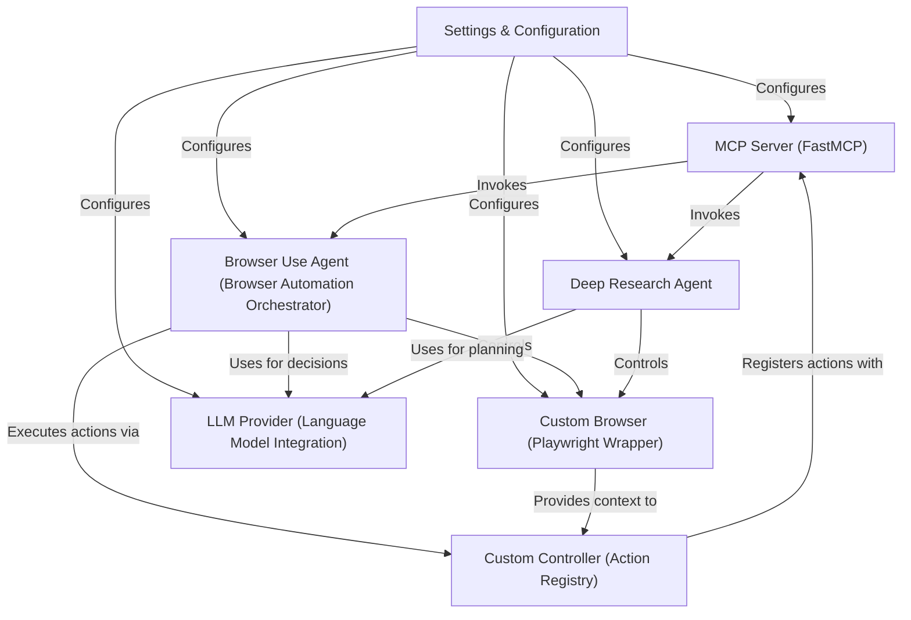

# Tutorial: mcp-browser-use

This project (**mcp-browser-use**) is an *AI-driven browser automation server* that enables large language models (LLMs) to control a web browser and perform complex web research. It acts as a central hub, receiving instructions, automating browser actions, and generating structured reports, effectively turning AI into a powerful web assistant for tasks like *web browsing* and *deep information gathering*.

**Source Repository:** [https://github.com/Saik0s/mcp-browser-use.git](https://github.com/Saik0s/mcp-browser-use.git)

## Chapters

1. [MCP Server (FastMCP)
](01_mcp_server__fastmcp__.md)
2. [Settings & Configuration
](02_settings___configuration_.md)
3. [Browser Use Agent (Browser Automation Orchestrator)
](03_browser_use_agent__browser_automation_orchestrator__.md)
4. [Deep Research Agent
](04_deep_research_agent_.md)
5. [Custom Browser (Playwright Wrapper)
](05_custom_browser__playwright_wrapper__.md)
6. [Custom Controller (Action Registry)
](06_custom_controller__action_registry__.md)
7. [LLM Provider (Language Model Integration)
](07_llm_provider__language_model_integration__.md)

---

Generated by [AI Codebase Knowledge Builder](https://github.com/The-Pocket/Tutorial-Codebase-Knowledge)