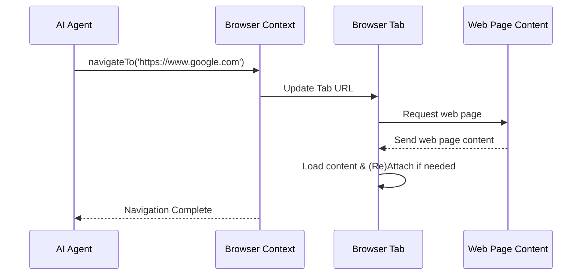

# Chapter 1: Browser Context

Imagine Nanobrowser as a super-smart assistant that can browse the internet for you. Just like you use your web browser (Chrome, Firefox, Edge) to open tabs, visit websites, and click buttons, Nanobrowser needs its own "browser" to do these things.

This is where the **Browser Context** comes in! Think of it as Nanobrowser's very own, private, and secure web browser in a box. It's the central place where Nanobrowser manages all its web interactions.

### Why do we need a Browser Context?

The problem the Browser Context solves is providing a secure and controlled environment for Nanobrowser's AI agents to interact with web pages. It's like a sandbox where the AI can "play" on the internet without messing up your actual browser or exposing your personal information.

Let's imagine you want Nanobrowser to "go to Google, search for 'cute puppies', and then take a screenshot of the results." The Browser Context is what makes this entire process possible.

### What is the Browser Context?

At its core, the Browser Context is responsible for:

*   **Managing tabs:** Opening new tabs, switching between them, and closing them.
*   **Navigating to URLs:** Going to specific web addresses.
*   **Interacting with web elements:** Clicking buttons, typing into text fields, etc.
*   **Capturing information:** Taking screenshots or understanding the structure of a web page.
*   **Security:** Ensuring the AI only accesses allowed websites and doesn't get into trouble.

Let's look at a concrete example: How would Nanobrowser "go to Google"?

### Using the Browser Context: Navigating to a URL

The primary way Nanobrowser interacts with the web is by navigating to URLs. This is a fundamental operation that the Browser Context handles.

Here's how Nanobrowser might tell its Browser Context to go to a specific URL:

```typescript
// In the background script (imagine Nanobrowser's brain)
import BrowserContext from './browser/context'; // We'll learn more about this file later!

// Create a new Browser Context (Nanobrowser's personal browser)
const browserContext = new BrowserContext({});

async function goToGoogle() {
  console.log("Nanobrowser is going to Google...");
  // Tell the browserContext to navigate to google.com
  await browserContext.navigateTo('https://www.google.com');
  console.log("Nanobrowser is now on Google!");
}

goToGoogle();
```

**Explanation:**

*   `import BrowserContext from './browser/context';`: This line simply brings in the `BrowserContext` tool we need to use.
*   `const browserContext = new BrowserContext({});`: This creates a new instance of the `BrowserContext`. Think of it as opening a new, fresh instance of a web browser for Nanobrowser.
*   `await browserContext.navigateTo('https://www.google.com');`: This is the magic line! We tell our `browserContext` to go to the `https://www.google.com` URL. The `await` simply means we wait for this action to finish before moving on.

When this code runs, Nanobrowser (behind the scenes) will open a new or use an existing tab and load `https://www.google.com` in it.

### How it Works Under the Hood (A Simplified View)

The `BrowserContext` isn't just a simple URL loader. It's a key orchestrator. Let's see a super simplified sequence of what happens when `navigateTo` is called:



**Explanation:**

1.  **AI Agent -> Browser Context: `navigateTo('URL')`**: An AI agent (like the [Navigator agent](04_ai_agents__navigator__planner__validator__.md) that decides where to go) tells the `BrowserContext` to go to a specific URL.
2.  **Browser Context -> Browser Tab: Update Tab URL**: The `BrowserContext` then tells the actual browser's tab to update its URL.
3.  **Browser Tab -> Web Page Content: Request web page**: The browser tab makes a request to the internet to fetch the content of that URL.
4.  **Web Page Content --> Browser Tab: Send web page content**: The web server sends back the website's content.
5.  **Browser Tab -> Browser Tab: Load content & (Re)Attach if needed**: The browser tab loads the content. Crucially, the `BrowserContext` then ensures it's "attached" to this tab securely, so it can monitor and interact with it.
6.  **Browser Context --> AI Agent: Navigation Complete**: Once the page is loaded and ready, the `BrowserContext` informs the AI agent that the navigation is complete.

### Diving Deeper into the Code: The `BrowserContext` Class

Let's look at some snippets from the `BrowserContext` class itself to understand its responsibilities. You can find this code in `chrome-extension/src/background/browser/context.ts`.

```typescript
// chrome-extension/src/background/browser/context.ts
import 'webextension-polyfill';
import {
  type BrowserContextConfig, // Configuration settings for the browser context
  // ... other imports ...
  URLNotAllowedError, // Error for disallowed URLs
} from './views'; // Definitions for how the browser data looks
import Page, { build_initial_state } from './page'; // Handles interactions with a single browser page/tab
import { createLogger } from '@src/background/log'; // For logging messages
import { isUrlAllowed } from './util'; // Utility to check if a URL is allowed

const logger = createLogger('BrowserContext'); // Setup logging for this part of the code

export default class BrowserContext {
  private _config: BrowserContextConfig; // Stores the configuration (like allowed/denied URLs)
  private _currentTabId: number | null = null; // The ID of the currently active tab
  private _attachedPages: Map<number, Page> = new Map(); // Stores information about tabs Nanobrowser is managing

  constructor(config: Partial<BrowserContextConfig>) {
    // When a BrowserContext is created, it merges default settings with any custom ones
    this._config = { ...DEFAULT_BROWSER_CONTEXT_CONFIG, ...config };
  }

  // ... (other methods) ...

  public async navigateTo(url: string): Promise<void> {
    // First, check if the URL is allowed by our security settings
    if (!isUrlAllowed(url, this._config.allowedUrls, this._config.deniedUrls)) {
      throw new URLNotAllowedError(`URL: ${url} is not allowed`);
    }

    // Get the current page (tab) Nanobrowser is focused on
    const page = await this.getCurrentPage();
    if (!page) {
      // If there's no current page, open a new tab for this URL
      await this.openTab(url);
      return;
    }
    // If a page is already "attached" (meaning Nanobrowser has control over it)
    if (page.attached) {
      // Use advanced tools (Puppeteer) to navigate within that attached page
      await page.navigateTo(url);
      return;
    }
    // If the page isn't attached, we use the standard Chrome browser update
    const tabId = page.tabId;
    await chrome.tabs.update(tabId, { url, active: true }); // Update the tab's URL
    await this.waitForTabEvents(tabId); // Wait for the tab to fully load

    // After navigation, re-attach to the updated page to regain control
    const updatedPage = await this._getOrCreatePage(await chrome.tabs.get(tabId), true);
    await this.attachPage(updatedPage);
    this._currentTabId = tabId;
  }

  // ... (more methods for tab management, getting state, etc.) ...
}
```

**Explanation of the `BrowserContext` code:**

*   **`_config`:** This holds important settings for the `BrowserContext`, like which websites are allowed or blocked (a "firewall"). This prevents AI from browsing to dangerous or irrelevant sites. You can see how these `allowedUrls` and `deniedUrls` are used in the `navigateTo` method.
*   **`_currentTabId`:** This keeps track of which browser tab Nanobrowser is currently "looking at" or actively controlling.
*   **`_attachedPages`:** This is a map (like a dictionary) that stores `Page` objects. Each `Page` object represents a single browser tab that Nanobrowser is actively managing.
*   **`navigateTo(url: string)`:** This is the core method for visiting a website.
    *   It first uses `isUrlAllowed` (from `./util.ts`) to check if the requested URL is safe based on the `_config`. This is a crucial security step!
    *   It then figures out if it should navigate the *current* tab or open a *new* one.
    *   If Nanobrowser already has "deep control" over the tab (`page.attached`), it uses a powerful tool called Puppeteer (which we'll hear more about in the [DOM State & Interaction](05_dom_state___interaction__builddomtree__.md) chapter) to navigate within that tab.
    *   If not, it uses standard Chrome extension APIs (`chrome.tabs.update`) and then re-establishes control (`attachPage`).

You'll notice `Page` objects being used. A `Page` (from `chrome-extension/src/background/browser/page.ts`) is a more detailed representation of an individual browser tab. It handles the low-level interactions with the web content, like actually typing or clicking. The `BrowserContext` manages *which* `Page` (tab) is active and orchestrates high-level actions.

### Firewall Settings

The `BrowserContext` also takes care of firewall settings. This is important for security and control. Nanobrowser can be configured with lists of safe and unsafe websites.

In the `background/index.ts` file (Nanobrowser's main background script), you can see how `firewallStore` settings are applied to the `browserContext`:

```typescript
// chrome-extension/src/background/index.ts
// ... (imports) ...

async function setupExecutor(taskId: string, task: string, browserContext: BrowserContext) {
  // ... (LLM setup) ...

  // Apply firewall settings to browser context
  const firewall = await firewallStore.getFirewall(); // Gets firewall rules from storage
  if (firewall.enabled) {
    browserContext.updateConfig({ // Updates the browser context's settings
      allowedUrls: firewall.allowList,
      deniedUrls: firewall.denyList,
    });
  } else {
    // If firewall is disabled, clear the lists
    browserContext.updateConfig({
      allowedUrls: [],
      deniedUrls: [],
    });
  }

  // ... (other settings and executor creation) ...
```

**Explanation:**

*   `firewallStore.getFirewall()`: This retrieves the firewall rules that a user has set up (e.g., in Nanobrowser's settings).
*   `browserContext.updateConfig(...)`: This line passes those rules to the `BrowserContext`, telling it how to manage web navigation securely. The `navigateTo` method then uses these `allowedUrls` and `deniedUrls` to prevent access to blocked sites.

### Conclusion

You've just learned about the **Browser Context**, Nanobrowser's fundamental component for interacting with the web. It manages tabs, handles navigation, and enforces security rules. It acts as Nanobrowser's secure, personal web browser, allowing AI agents to "see" and "act" on web pages without risk. Understanding the Browser Context is key to grasping how Nanobrowser performs its tasks.

Next, we'll look at how Nanobrowser executes tasks using the central orchestrator: the [Executor](02_executor_.md).

---

Generated by [AI Codebase Knowledge Builder](https://github.com/The-Pocket/Tutorial-Codebase-Knowledge)