# Chapter 2: Executor

Welcome back! In [Chapter 1: Browser Context](01_browser_context_.md), we learned how Nanobrowser gets its own special web browser to navigate and interact with websites safely. Now, let's see how Nanobrowser actually *uses* that browser to complete tasks for you.

Imagine you ask Nanobrowser to "Find the current weather in London." How does it break down that request and make things happen? This is where the **Executor** comes in!

### What Problem Does the Executor Solve?

The Executor is like the project manager or the main conductor of an orchestra. When you give Nanobrowser a big task, it's the Executor's job to:

1.  **Understand the Goal:** Figure out exactly what you want done.
2.  **Break it Down:** Divide the big task into smaller, manageable steps.
3.  **Assign Work:** Send these smaller steps to different specialized "AI agents" (who are like clever employees, we'll meet them in a later chapter!).
4.  **Oversee Progress:** Make sure everyone is working together, handling any problems, and moving towards the final goal.
5.  **Report Back:** Let you know what's happening and when the task is done.

Without the Executor, Nanobrowser would be a collection of smart tools that don't know how to work together. The Executor brings them all to life!

### Our Use Case: "Find the current weather in London"

Let's use our example: "Find the current weather in London." Here's how the Executor makes it happen:

#### How to Start a Task with the Executor

You, as the user, give Nanobrowser a task. This task is sent to the Executor.

```typescript
// Imagine this code running behind the scenes when you type a task
// We saw some of this in background/index.ts in Chapter 1!
import BrowserContext from './browser/context';
import { Executor } from './agent/executor';
import { createChatModel } from './agent/helper';
// ... other imports ...

async function runWeatherTask() {
  const browserContext = new BrowserContext({});
  const taskId = 'weather-london-123'; // A unique ID for this task
  const taskDescription = 'Find the current weather in London';

  // For now, think of 'createChatModel' as a way to get an AI brain
  // We'll learn more about LLM Providers in a later chapter:
  // [LLM Providers & Models](07_llm_providers___models_.md)
  const navigatorLLM = await createChatModel(/* ... some config ... */);

  console.log(`Starting task with Executor: "${taskDescription}"`);

  // Create our Executor, giving it the task and our BrowserContext
  const executor = new Executor(taskDescription, taskId, browserContext, navigatorLLM);

  // Tell the Executor to start doing the work!
  await executor.execute();

  console.log('Executor finished the weather task!');
}

runWeatherTask();
```

**Explanation:**

*   `const executor = new Executor(...)`: This line creates a new instance of our Executor. We give it the task description (`"Find the current weather in London"`), a unique ID, the `browserContext` (which we learned about in the previous chapter!), and an `LLM` (which is Nanobrowser's AI brain).
*   `await executor.execute()`: This is the main command that tells the Executor to start working on the task.

### How it Works Under the Hood: The Executor's Flow

When `executor.execute()` is called, the Executor kicks into action. It doesn't do everything itself; instead, it uses a team of specialized AI agents:

*   **Planner Agent:** Decides the overall strategy and next steps for the task.
*   **Navigator Agent:** Takes those steps and actually performs actions like browsing websites or clicking buttons.
*   **Validator Agent:** Checks if the task is completed correctly and if the results are good.

Let's see a simplified flow for our "Find the current weather in London" task:

```mermaid
sequenceDiagram
    participant User
    participant Ext as Executor
    participant Pl as Planner Agent
    participant Nav as Navigator Agent
    participant Val as Validator Agent
    participant BC as Browser Context
    participant Web as Internet/Webpage

    User->>Ext: Start Task: "Weather in London"
    Ext->>Ext: Initialize Agents (Pl, Nav, Val)
    Ext->>Pl: "What's the plan for 'weather in London'?"
    Pl-->>Ext: Plan: "Go to weather.com, search for London, get temperature"
    loop Until Task Done
        Ext->>Nav: "Go to weather.com"
        Nav->>BC: navigateTo('weather.com')
        BC->>Web: Fetch weather.com
        Web-->>BC: weather.com loaded
        BC-->>Nav: Page Ready
        Nav-->>Ext: Action Done
        Ext->>Nav: "Search for 'London' on weather.com"
        Nav->>BC: Type 'London', Click Search
        BC->>Web: Interact with site
        Web-->>BC: Results loaded
        BC-->>Nav: Page Ready
        Nav-->>Ext: Action Done
        Ext->>Nav: "Extract temperature"
        Nav->>BC: Read page content
        BC-->>Nav: Content provided
        Nav-->>Ext: Action Done with Temperature
        Ext->>Val: "Is 'London weather' task complete with this info?"
        Val-->>Ext: "Yes, looks good!"
    end
    Ext-->>User: Task Complete: London temperature is X°C
```



**Explanation of the Flow:**

1.  **User to Executor:** You give the Executor the task.
2.  **Executor to Planner:** The Executor asks the Planner: "How should we do this?"
3.  **Planner to Executor:** The Planner comes up with a high-level plan (e.g., "Go to weather.com, search, get temperature").
4.  **Executor to Navigator (Loop):** The Executor takes the first step from the plan and tells the Navigator to do it (e.g., "Go to weather.com").
5.  **Navigator to Browser Context:** The Navigator uses the [Browser Context](01_browser_context_.md) to actually perform the web action (like navigating to a URL).
6.  **Browser Context to Web:** The Browser Context interacts with the internet to load the page.
7.  **Web back to Navigator:** The Browser Context tells the Navigator when the page is ready.
8.  **Navigator back to Executor:** The Navigator reports back that the navigation is done.
9.  **Repeat (Executor to Navigator):** The Executor continues sending parts of the plan to the Navigator until all browsing actions are done.
10. **Executor to Validator:** Once the browsing actions seem complete and results are extracted, the Executor asks the Validator: "Did we successfully complete the original task?"
11. **Validator back to Executor:** The Validator checks and confirms (or denies!) if the task is complete.
12. **Executor to User:** Finally, the Executor reports the result to you.

This loop of planning, navigating, and validating continues until the task is successfully solved or too many errors happen.

### Diving Deeper into the Code: The `Executor` Class

You can find the `Executor` class in `chrome-extension/src/background/agent/executor.ts`. Let's look at some key parts.

#### Initializing the Executor

When we create an `Executor`, it sets up its team of agents:

```typescript
// chrome-extension/src/background/agent/executor.ts
import type { BaseChatModel } from '@langchain/core/language_models/chat_models';
import { AgentContext } from './types';
import { NavigatorAgent } from './agents/navigator';
import { PlannerAgent } from './agents/planner';
import { ValidatorAgent } from './agents/validator';
import MessageManager from './messages/service';
import type BrowserContext from '../browser/context';

export class Executor {
  private readonly navigator: NavigatorAgent;
  private readonly planner: PlannerAgent;
  private readonly validator: ValidatorAgent;
  private readonly context: AgentContext;
  private tasks: string[] = [];

  constructor(
    task: string,
    taskId: string,
    browserContext: BrowserContext,
    navigatorLLM: BaseChatModel, // The AI brain for Navigator
    extraArgs?: any, // Simplified for tutorial
  ) {
    const messageManager = new MessageManager();
    const plannerLLM = extraArgs?.plannerLLM ?? navigatorLLM;
    const validatorLLM = extraArgs?.validatorLLM ?? navigatorLLM;

    // AgentContext holds shared info like task ID, browser context, etc.
    const context = new AgentContext(
      taskId,
      browserContext,
      messageManager,
      /* ... other params ... */
    );

    this.tasks.push(task);

    // Initialize our specialized AI agents
    this.navigator = new NavigatorAgent(/* ... config ... */);
    this.planner = new PlannerAgent({ chatLLM: plannerLLM, context: context, /* ... */ });
    this.validator = new ValidatorAgent({ chatLLM: validatorLLM, context: context, /* ... */ });

    this.context = context;
    // ... more setup ...
  }

  // ... (execute method and other methods) ...
}
```

**Explanation:**

*   **`navigator`, `planner`, `validator`**: These are the main properties that hold our AI agents. The `Executor` is responsible for creating and configuring them.
*   **`context`**: This is a very important object called `AgentContext`. Think of it as a shared notepad that all agents can read from and write to. It contains information like the current task ID, the `BrowserContext` instance, and the shared [Message Manager](03_message_management_.md) (for keeping track of conversations and observations).
*   **`navigatorLLM`**: This is the AI model (or "brain") that the Navigator agent will use to make its decisions. You can see how other agents might use different AI models too!

#### The `execute` Method

This is the heart of the Executor – the method that drives the entire task execution:

```typescript
// chrome-extension/src/background/agent/executor.ts
// Inside the Executor class

  /**
   * Execute the task
   *
   * @returns {Promise<void>}
   */
  async execute(): Promise<void> {
    logger.info(`🚀 Executing task: ${this.tasks[this.tasks.length - 1]}`);
    const context = this.context;
    const allowedMaxSteps = this.context.options.maxSteps; // Max steps to prevent endless loops

    try {
      this.context.emitEvent(Actors.SYSTEM, ExecutionState.TASK_START, this.context.taskId);

      let done = false;
      for (let step = 0; step < allowedMaxSteps; step++) {
        logger.info(`🔄 Step ${step + 1} / ${allowedMaxSteps}`);

        // 1. Run Planner (if needed)
        if (this.planner && (context.nSteps % context.options.planningInterval === 0 || /* ... */)) {
          const planOutput = await this.planner.execute();
          // Process the plan, update the 'done' flag if task is complete
          done = planOutput.result.done;
          // ... update messages and webTask
        }

        // 2. Execute Navigator actions
        if (!done) {
          done = await this.navigate(); // Calls this.navigator.execute() internally
        }

        // 3. Validate output (if task seems done or planning suggests it)
        if (done && this.context.options.validateOutput && !this.context.stopped) {
          const validatorOutput = await this.validator.execute();
          if (validatorOutput.result?.is_valid) {
            logger.info('✅ Task completed successfully');
            break; // Task is truly done!
          }
          // If validation fails, it might continue for more steps
        }
      }

      if (done) {
        this.context.emitEvent(Actors.SYSTEM, ExecutionState.TASK_OK, this.context.taskId);
      } else if (step >= allowedMaxSteps) {
        logger.info('❌ Task failed: Max steps reached');
        this.context.emitEvent(Actors.SYSTEM, ExecutionState.TASK_FAIL, 'Task failed: Max steps reached');
      }
      // ... handle other states like cancel or pause
    } catch (error) {
      // Handle errors during execution
      this.context.emitEvent(Actors.SYSTEM, ExecutionState.TASK_FAIL, `Task failed: ${error.message}`);
    }
  }

  private async navigate(): Promise<boolean> {
    // This private method wraps the call to the Navigator Agent
    const navOutput = await this.navigator.execute();
    if (navOutput.error) {
        throw new Error(navOutput.error);
    }
    return navOutput.result?.done; // Returns true if navigating marks the task as complete
  }

  // ... (other methods for pause, resume, cancel, cleanup) ...
}
```

**Explanation of `execute`:**

*   **Looping Steps**: The `for` loop represents the main executive loop. The Executor continues to take "steps" until the task is `done` or it reaches a `maxSteps` limit (to prevent endless loops).
*   **`this.context.emitEvent(...)`**: This is how the Executor communicates what's happening. It sends `ExecutionState` events (like `TASK_START`, `STEP_OK`, `TASK_OK`, `TASK_FAIL`) to an `EventManager`. This allows the Nanobrowser user interface to show progress messages. We'll learn more about [Message Management](03_message_management_.md) and the Event Manager in the next chapter.
*   **`this.planner.execute()`**: If enabled, the Executor asks the `PlannerAgent` for the next strategic moves. This happens at certain intervals or if something goes wrong.
*   **`this.navigate()` (which calls `this.navigator.execute()`)**: This is where the `NavigatorAgent` does its core work of browsing the web.
*   **`this.validator.execute()`**: After web interactions, the `ValidatorAgent` checks if the task objective has been met.
*   **`done` variable**: This boolean keeps track of whether the task is considered complete based on agent feedback.

### Conclusion

The Executor is the central brain of Nanobrowser, taking your high-level tasks and breaking them down into actionable steps for its specialized AI agents. It orchestrates their work, manages communication, and ensures the task progresses towards completion, reporting its status back to you.

Now that we understand how the Executor manages the overall flow, let's dive into how these agents communicate and how Nanobrowser tracks their progress and observations. That's up next in [Chapter 3: Message Management](03_message_management_.md).

---

Generated by [AI Codebase Knowledge Builder](https://github.com/The-Pocket/Tutorial-Codebase-Knowledge)