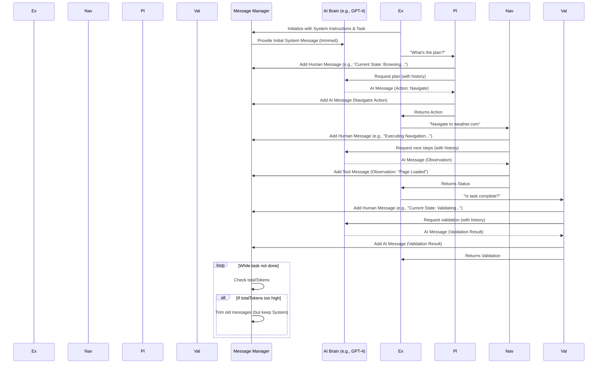

# Chapter 3: Message Management

Welcome back! In [Chapter 1: Browser Context](01_browser_context.md), we saw how Nanobrowser gets its own secure "web browser." Then, in [Chapter 2: Executor](02_executor.md), we learned how the Executor acts as the project manager, breaking down tasks and telling different AI agents what to do.

Now, imagine these AI agents are talking to each other, sharing what they see, what they plan, and what they've done. How do they keep track of all this information? How do they make sure they don't forget important details, or get overwhelmed by too much chatter?

This is where **Message Management** comes in!

### What Problem Does Message Management Solve?

Think of Message Management as a super-smart conversation recorder and editor for Nanobrowser's AI agents. It keeps track of everything:

*   **What you told the AI to do.**
*   **What the AI agents are saying to each other** (like the Planner telling the Navigator the next step).
*   **What the AI agents are seeing** (like observations from a webpage).

Why is this so important? Large Language Models (LLMs), the "brains" of our AI agents, have a limited "memory" or "context window." This means they can only process so much information at once. If you give them too much irrelevant stuff, they can get confused, perform poorly, or even "forget" important instructions.

The Message Management system makes sure the conversation history is:

1.  **Compact:** No unnecessary talk.
2.  **Relevant:** Only the important details.
3.  **Properly Formatted:** So the LLMs understand it perfectly.

It helps the AI agents stay on track, avoid getting sidetracked, and work efficiently.

### Our Use Case: Keeping the AI Focused

Let's continue our example: "Find the current weather in London." As the Executor guides the Planner, Navigator, and Validator agents, they generate a lot of internal messages:

*   **Planner:** "Okay, first, let's go to a weather website."
*   **Navigator:** "Got it! Navigating to weather.com. Page loaded."
*   **Navigator:** "I see a search bar. Now typing 'London' and clicking search."
*   **Navigator:** "Results loaded. I see 'Temperature: 15°C'."
*   **Validator:** "Yes, 15°C is a valid temperature for London. Task complete!"

The Message Manager captures all these interactions, but it also intelligently decides what to keep, what to summarize, and what to remove to keep the LLM's memory clear and focused on the immediate goal.

### Key Concepts of Message Management

Message Management in Nanobrowser involves a few key ideas:

1.  **`MessageHistory`**: This is like a special diary where all messages are recorded.
2.  **`ManagedMessage` with `MessageMetadata`**: Each message isn't just text; it also comes with extra information (metadata) like how "long" it is (in terms of tokens).
3.  **Token Counting**: A way to estimate how much "space" a message takes up in the LLM's memory.
4.  **Message Trimming**: Smartly removing old or less important messages when the "memory" gets too full.
5.  **Sensitive Data Handling**: Ensuring private information doesn't accidentally get leaked into the AI's public conversation history.

Let's look at each of these.

#### 1. `MessageHistory`: The Conversation Diary

The `MessageHistory` (found in `chrome-extension/src/background/agent/messages/views.ts`) is a list that stores all the messages. It also keeps a running total of how "long" the conversation has gotten.

Here's a simplified look at how it works:

```typescript
// chrome-extension/src/background/agent/messages/views.ts (Simplified)
import { BaseMessage } from '@langchain/core/messages';

export class MessageMetadata {
  tokens: number; // How many tokens this message uses
  message_type: string | null = null; // What kind of message it is (e.g., 'init', 'observation')

  constructor(tokens: number, message_type?: string | null) {
    this.tokens = tokens;
    this.message_type = message_type ?? null;
  }
}

export class ManagedMessage {
  message: BaseMessage; // The actual message text
  metadata: MessageMetadata; // Its associated metadata

  constructor(message: BaseMessage, metadata: MessageMetadata) {
    this.message = message;
    this.metadata = metadata;
  }
}

export class MessageHistory {
  messages: ManagedMessage[] = []; // The list of all managed messages
  totalTokens = 0; // Running total of tokens

  addMessage(message: BaseMessage, metadata: MessageMetadata, position?: number): void {
    const managedMessage: ManagedMessage = { message, metadata };
    this.messages.push(managedMessage); // Add to the list
    this.totalTokens += metadata.tokens; // Update total tokens
  }

  // ... (methods to remove messages) ...
}
```

**Explanation:**

*   `MessageHistory` holds a list of `ManagedMessage` objects.
*   Each `ManagedMessage` contains the actual `message` (what the AI said or saw) and its `metadata` (important info about that message).
*   When a message is added, its token count is added to `totalTokens`.

#### 2. Token Counting: Estimating Message Length

LLMs process information in "tokens" (like words or parts of words). `Message Management` needs to know how many tokens each message uses so it can manage the LLM's memory. Nanobrowser doesn't use a super precise token counter, but a fast estimator:

```typescript
// chrome-extension/src/background/agent/messages/service.ts (Simplified)

export default class MessageManager {
  // ... (constructor and other methods) ...
  private settings: MessageManagerSettings; // Holds settings like estimatedCharactersPerToken

  /**
   * Counts the tokens in the text
   * Roughly estimates token count for quick processing.
   * @param text - The text to count the tokens
   * @returns The approximate number of tokens
   */
  private _countTextTokens(text: string): number {
    // This is a rough estimate: 1 token for every 3 characters
    return Math.floor(text.length / this.settings.estimatedCharactersPerToken);
  }

  /**
   * Counts the tokens in a full message (text, images, tool calls)
   * @returns The number of tokens in the message
   */
  private _countTokens(message: BaseMessage): number {
    let tokens = 0;
    if (typeof message.content === 'string') {
      tokens += this._countTextTokens(message.content);
    }
    // ... handles image tokens and tool call tokens ...
    return tokens;
  }

  public addMessageWithTokens(message: BaseMessage, messageType?: string | null, position?: number): void {
    const tokens = this._countTokens(message); // First, count tokens for the message
    const metadata = new MessageMetadata(tokens, messageType);
    this.history.addMessage(message, metadata, position); // Then, add to history
  }
}
```

**Explanation:**

*   `_countTextTokens`: This function gives a quick estimate of how many tokens are in a piece of text. For simplicity, it assumes about 3 characters make up 1 token.
*   `_countTokens`: This combines text token counting with other elements a message might have, like images or special AI "tool calls," to get a total token count for that message.
*   `addMessageWithTokens`: This is the method used to officially add a message to the `MessageHistory`, making sure its token count is recorded.

#### 3. Message Trimming: Staying Within Limit

LLMs have a `maxInputTokens` limit. If the `totalTokens` in the `MessageHistory` goes over this limit, the `MessageManager` has to **cut** messages. It does this smartly, typically by removing less critical or older messages from the end of the history.

```typescript
// chrome-extension/src/background/agent/messages/service.ts (Simplified)

export default class MessageManager {
  // ... (constructor and other methods) ...

  /**
   * Cuts down the message history if total tokens exceed the max input tokens.
   * Prioritizes removing less critical content when memory is full.
   */
  public cutMessages(): void {
    let diff = this.history.totalTokens - this.settings.maxInputTokens;
    if (diff <= 0) return; // No need to cut if we're under the limit

    // Attempt to remove images first from the last message if multi-modal
    // Then, if still over, proportionally trim text from the last message.
    const lastMsg = this.history.messages[this.history.messages.length - 1];
    // ... complex logic to remove images or trim text proportionally ...

    // If still over after trimming the last message, remove oldest non-system messages
    while (diff > 0 && this.history.messages.length > 0) {
      if (this.history.messages[0].message.type === 'system') {
        // Skip system messages, as they are crucial instructions
        if (this.history.messages.length <= 1) break; // Avoid infinite loop if only system msg left
        this.history.removeMessage(1); // Remove the next non-system message
      } else {
        this.history.removeMessage(0); // Remove the oldest message
      }
      diff = this.history.totalTokens - this.settings.maxInputTokens;
    }
  }
}
```

**Explanation:**

*   `cutMessages()`: This function is called to ensure the conversation history doesn't get too long for the LLM.
*   It first checks if the `totalTokens` is over `maxInputTokens`.
*   It prioritizes removing images from the last message, then proportionally trims text from the last message.
*   If after these steps the history is *still* too long, it starts removing the oldest **non-system** messages. System messages are usually crucial instructions that the AI *must* always remember, so they are protected.

#### 4. Sensitive Data Handling: Keeping Secrets Safe

Nanobrowser might deal with sensitive information (like API keys or personal details). The Message Manager can replace this data with placeholders before it goes into the AI's messages, preventing accidental exposure.

```typescript
// chrome-extension/src/background/agent/messages/service.ts (Simplified)

export default class MessageManager {
  // ... (constructor and other methods) ...

  private _replaceSensitiveData(message: BaseMessage): BaseMessage {
    const sensitiveData = this.settings.sensitiveData;
    if (!sensitiveData) return message; // No sensitive data configured

    const replaceSensitive = (text: string): string => {
      let filteredValue = text;
      for (const [key, val] of Object.entries(sensitiveData)) {
        if (!val) continue; // Skip empty values
        filteredValue = filteredValue.replace(val, `<secret>${key}</secret>`);
      }
      return filteredValue;
    };

    if (typeof message.content === 'string') {
      message.content = replaceSensitive(message.content);
    }
    // ... handles array content ...

    return message;
  }
}
```

**Explanation:**

*   `_replaceSensitiveData`: This private method checks if any part of the message content matches values in a `sensitiveData` dictionary (e.g., a credit card number).
*   If a match is found, it replaces the actual sensitive data with a special placeholder like `<secret>API_KEY</secret>`. This way, the LLM knows *there was sensitive data here*, but never sees the actual secret.

### How it Works Under the Hood: The Message Flow

Let's imagine our Executor is running the "Find weather in London" task. Here's how the `MessageManager` interacts with the AI agents:



**Explanation of the Flow:**

1.  **Executor Initializes Message Manager:** When a task starts, the `Executor` (the main coordinator) tells the `Message Manager` about the overall goal and provides initial system instructions that the AI must always follow.
2.  **Message Manager Feeds LLM:** The `Message Manager` then crafts a prompt for the `LLM`, including these instructions.
3.  **Agents Record Their Actions/Observations:** As `Planner`, `Navigator`, and `Validator` agents do their work, they use the `Message Manager` to record their internal thoughts, actions they take (like clicking a button), and observations (like what they see on a webpage).
4.  **Message Manager Trims History:** After each interaction, the `Message Manager` checks the total length of the conversation history. If it's getting too long, it intelligently trims older, less critical messages, always protecting the vital system instructions.
5.  **LLM Gets Compact History:** When an agent needs the LLM to "think" or make a decision, the `Message Manager` provides a compact, relevant history of the conversation, ensuring the LLM has all the necessary context without being overwhelmed.
6.  **Loop Continues:** This process repeats in a loop until the task is complete.

### How the Executor Uses Message Management

The `Executor` is the main component that creates and manages the `MessageManager`. It passes the `MessageManager` instance to all the AI agents so they can add their messages.

Recall from [Chapter 2: Executor](02_executor.md), how the `Executor` is initialized:

```typescript
// chrome-extension/src/background/agent/executor.ts (Simplified)
import MessageManager from './messages/service';
import type BrowserContext from '../browser/context'; // From Chapter 1

export class Executor {
  private readonly navigator: NavigatorAgent;
  private readonly planner: PlannerAgent;
  private readonly validator: ValidatorAgent;
  private readonly context: AgentContext; // Holds shared info like MessageManager

  constructor(
    task: string,
    taskId: string,
    browserContext: BrowserContext,
    navigatorLLM: BaseChatModel, // The AI brain for Navigator
    extraArgs?: any,
  ) {
    // 1. Create a new MessageManager
    const messageManager = new MessageManager();

    // 2. Create a shared AgentContext, which includes the MessageManager
    const context = new AgentContext(
      taskId,
      browserContext,
      messageManager, // The MessageManager is passed here!
      /* ... other params ... */
    );

    // 3. Initialize agents, giving them access to the shared context
    this.navigator = new NavigatorAgent({ chatLLM: navigatorLLM, context: context });
    this.planner = new PlannerAgent({ chatLLM: navigatorLLM, context: context });
    this.validator = new ValidatorAgent({ chatLLM: navigatorLLM, context: context });

    this.context = context;
    // ... more setup ...
  }
}
```

**Explanation:**

*   Inside the `Executor`'s `constructor`, a `new MessageManager()` is created.
*   This `messageManager` is then passed into the `AgentContext`. The `AgentContext` is like a shared toolbox that all individual agents (Planner, Navigator, Validator) receive.
*   Because the `MessageManager` is part of this shared `context`, any agent can access it and add messages to the history whenever they need to communicate something.

### Conclusion

You've now seen how **Message Management** plays a crucial role in Nanobrowser. It acts as the AI's memory and communication hub, ensuring that the vast conversation between you and the AI, and among the AI agents themselves, remains organized, relevant, and concise. This intelligent management of messages is key to helping the LLMs focus, perform well, and avoid getting lost in too much information.

Next, we'll dive deeper into the AI agents themselves – the Planner, Navigator, and Validator – and see how they use this managed message flow to achieve their tasks in [Chapter 4: AI Agents (Navigator, Planner, Validator)](04_ai_agents__navigator__planner__validator_.md).

---

Generated by [AI Codebase Knowledge Builder](https://github.com/The-Pocket/Tutorial-Codebase-Knowledge)