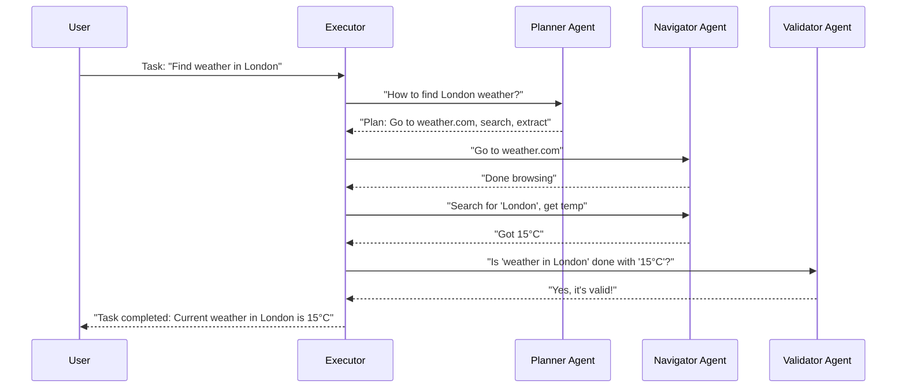

# Chapter 4: AI Agents (Navigator, Planner, Validator)

Welcome back! In [Chapter 1: Browser Context](01_browser_context_.md), we equipped Nanobrowser with its own "web browser." In [Chapter 2: Executor](02_executor_.md), we saw how the Executor pulls the strings, managing tasks and coordinating everything. And in [Chapter 3: Message Management](03_message_management_.md), we learned how the AI agents keep their conversations organized and focused.

Now, let's meet the stars of the show: the specialized **AI Agents** themselves! These are the "workers" that actually perform the different parts of a complex web task.

### What Problem Do AI Agents Solve?

Imagine you're building a house. You wouldn't ask one person to do everything – plumbing, electrical, framing, roofing. Instead, you'd hire specialists for each job. Similarly, a web task (like "Find the best flight to Hawaii") is too complex for one general AI. It needs different experts.

This is where the **AI Agents (Navigator, Planner, Validator)** come in. They break down a big problem into manageable parts, allowing each agent to focus on what it does best:

*   **Navigator:** This agent is like your web browser's personal driver. It knows how to go to websites, click buttons, fill out forms, and read information on a page. Its job is to interact directly with the web.
*   **Planner:** This agent is the strategist. When given a complex task, it thinks about the high-level steps needed to achieve the goal. It breaks down "find flights" into "go to airline website," "enter dates," "search," etc.
*   **Validator:** This agent is the quality control manager. After the Navigator has done its work, the Validator steps in to check if the task was actually completed correctly and if the results make sense. Did we really find flights? Are they for the right destination?

By having these specialized agents, Nanobrowser can handle complex tasks more efficiently and effectively.

### Our Use Case: "Find the current weather in London"

Let's revisit our ongoing example: "Find the current weather in London." How do our AI agents work together to achieve this?

#### How a Task Flows Between Agents

When you give Nanobrowser the task "Find the current weather in London," the [Executor](02_executor_.md) coordinates the dance between these three agents:

1.  **Planner's Turn:** The Executor tells the **Planner**: "Hey, how do we find weather in London?"
    *   The Planner thinks: "First, we need to go to a weather website. Then, we'll search for London. Finally, we'll extract the temperature." It sends this plan back to the Executor.
2.  **Navigator's Turn:** The Executor takes the first step from the Planner's plan (e.g., "Go to weather.com") and tells the **Navigator**: "Go do this."
    *   The Navigator interacts with the [Browser Context](01_browser_context_.md) to open `weather.com`. Once the page is loaded, it reports back to the Executor.
    *   The Executor then tells the Navigator the next step: "Now, find the search bar and type 'London' and click the search button."
    *   The Navigator performs these actions using the Browser Context and reports back the results (e.g., "Page loaded with results, found temperature 15°C").
3.  **Validator's Turn:** Once the Navigator thinks it has found the information, the Executor asks the **Validator**: "Is the task 'Find current weather in London' really done and correct based on these results?"
    *   The Validator checks the extracted information. "Yes," it confirms, "15°C looks like a valid temperature for London. Task complete." (Or "No, that's a forecast, not current weather, keep trying!").
4.  **Loop or Finish:** If the Validator says "No," the Executor might go back to the Planner for a revised plan, or tell the Navigator to refine its search. If "Yes," the Executor tells you the task is complete!

Here's a simplified sequence diagram showing this interaction (we saw a slightly more complex one in the [Executor chapter](02_executor_.md), but this focuses on the agents):



### Diving Deeper into the Code: The Agent Base Class

All three agents (Navigator, Planner, Validator) share some common features because they are all "AI brains" that communicate with Large Language Models (LLMs) and interact with the [Agent Context](chrome-extension/src/background/agent/types.ts). They inherit from a `BaseAgent` class, which handles these commonalities.

You can find the `BaseAgent` class in `chrome-extension/src/background/agent/agents/base.ts`.

```typescript
// chrome-extension/src/background/agent/agents/base.ts (simplified)
import type { BaseChatModel } from '@langchain/core/language_models/chat_models';
import type { AgentContext } from '../types';
import type { BasePrompt } from '../prompts/base';
import type { BaseMessage } from '@langchain/core/messages'; // For conversation pieces
import { createLogger } from '@src/background/log'; // For logging

const logger = createLogger('agent');

// Options for any agent
export interface BaseAgentOptions {
  chatLLM: BaseChatModel; // The AI brain (Large Language Model)
  context: AgentContext;  // Shared info for the task (like MessageManager, BrowserContext)
  prompt: BasePrompt;     // The special instructions for this agent
}

// Base class that all our agents will extend
export abstract class BaseAgent<T extends z.ZodType, M = unknown> {
  protected id: string;
  protected chatLLM: BaseChatModel;
  protected prompt: BasePrompt;
  protected context: AgentContext; // This is how agents share memories and tools!

  constructor(modelOutputSchema: T, options: BaseAgentOptions, extraOptions?: Partial<ExtraAgentOptions>) {
    this.chatLLM = options.chatLLM;
    this.prompt = options.prompt;
    this.context = options.context;
    this.id = extraOptions?.id || 'agent'; // Unique ID for logging/tracking
    // ... other setup for how the agent talks to the LLM ...
  }

  // This method sends messages to the LLM and gets its response
  async invoke(inputMessages: BaseMessage[]): Promise<this['ModelOutput']> {
    // This part handles talking to the actual AI model and parsing its output
    // It uses structured output to ensure the AI's answer is in a specific format
    // ... complex LLM interaction logic, error handling, etc. ...
    const response = await this.chatLLM.invoke(inputMessages, {
      signal: this.context.controller.signal, // Allowing task cancellation
    });
    // ... process response ...
    return response.parsed; // The AI's structured answer
  }

  // Each agent must implement its own 'execute' method
  // This is where the agent's unique logic (planning, navigating, validating) goes
  abstract execute(): Promise<AgentOutput<M>>;
}
```

**Explanation:**

*   **`chatLLM`**: This is the actual AI model (like GPT-4 or Gemini) that the agent "talks" to. It's the agent's brain!
*   **`context`**: This is the `AgentContext` object we saw in [Chapter 3: Message Management](03_message_management_.md) (and briefly in [Chapter 2: Executor](02_executor_.md)). It's vital because it contains shared tools and information, such as:
    *   The `MessageManager` (for memory and conversation history).
    *   The `BrowserContext` (for interacting with the web).
    *   Task IDs, options, and flags (like `paused` or `stopped`).
*   **`prompt`**: This is a special set of instructions or a "personality" given to the AI. It tells the AI what its role is, what kind of output is expected, and how to behave.
*   **`invoke(inputMessages)`**: This method is how the agent actually sends its "thoughts" and "observations" (as `inputMessages`) to the `chatLLM` and gets a response. The `signal: this.context.controller.signal` allows the task to be cancelled, ensuring the AI can stop if you want it to.
*   **`abstract execute()`**: Each specific agent (Navigator, Planner, Validator) *must* create its own `execute` method. This is where their unique responsibilities come to life.

### The Navigator Agent

The `NavigatorAgent` (found in `chrome-extension/src/background/agent/agents/navigator.ts`) is responsible for directly interacting with web pages. It uses the [Browser Context](01_browser_context_.md) to perform actions.

```typescript
// chrome-extension/src/background/agent/agents/navigator.ts (simplified)
import { BaseAgent, type BaseAgentOptions, type ExtraAgentOptions } from './base';
import { ActionResult, type AgentOutput } from '../types';
import type { Action } from '../actions/builder'; // Specific web actions (click, type, navigate)
import { HumanMessage } from '@langchain/core/messages';
import { Actors, ExecutionState } from '../event/types';

export class NavigatorAgent extends BaseAgent<z.ZodType, NavigatorResult> {
  private actionRegistry: NavigatorActionRegistry; // List of all possible web actions (e.g., ClickAction, TypeAction)

  constructor(
    actionRegistry: NavigatorActionRegistry, // How the Navigator knows what actions it *can* take
    options: BaseAgentOptions,
    extraOptions?: Partial<ExtraAgentOptions>,
  ) {
    super(actionRegistry.setupModelOutputSchema(), options, { ...extraOptions, id: 'navigator' });
    this.actionRegistry = actionRegistry; // Store the actions it can perform
  }

  async execute(): Promise<AgentOutput<NavigatorResult>> {
    try {
      this.context.emitEvent(Actors.NAVIGATOR, ExecutionState.STEP_START, 'Navigating...'); // Tell the UI we're starting

      // 1. Tell the AI what the current web page looks like (DOM State)
      await this.addStateMessageToMemory(); // Adds current browser info to MessageManager

      // 2. Get the full conversation history from MessageManager
      const inputMessages = this.context.messageManager.getMessages();

      // 3. Ask the LLM (AI brain) what actions to take next
      // The `invoke` method (from BaseAgent) sends `inputMessages` to the LLM.
      // The LLM responds with a structured output recommending actions.
      const modelOutput = await this.invoke(inputMessages);

      // 4. Perform the recommended actions
      const results = await this.doMultiAction(modelOutput); // This calls the actual BrowserContext methods

      // 5. Add the AI's thoughts and results to MessageManager for next round
      await this.addModelOutputToMemory(modelOutput);
      this.context.actionResults = results; // Store results for the Executor

      // Check if any action made the task "done"
      const isDone = results.some(res => res.isDone);
      return { id: this.id, result: { done: isDone } };

    } catch (error) {
      // ... Error handling, like API auth failures, etc. ...
      return { id: this.id, error: errorMessage };
    }
  }

  private async addStateMessageToMemory() {
    // This method gets the structure of the current webpage (DOM Tree)
    // and adds it to the MessageManager so the AI knows what it's "seeing".
    // We'll learn more about DOM State in [Chapter 5: DOM State & Interaction](05_dom_state___interaction__builddomtree__.md)
    const state = await this.prompt.getUserMessage(this.context); // Gets a formatted description of the current page
    this.context.messageManager.addStateMessage(state);
  }

  private async doMultiAction(response: this['ModelOutput']): Promise<ActionResult[]> {
    // This method takes the actions recommended by the LLM (e.g., "click on element X")
    // and actually tells the BrowserContext to perform them.
    // It iterates through multiple actions since the LLM might suggest a sequence.
    // ... calls this.actionRegistry.getAction(actionName).call(actionArgs) ...
    return []; // Returns the results of those actions
  }
}
```

**Explanation:**

*   **`actionRegistry`**: This is a list of all the concrete web actions the Navigator knows how to do (e.g., `ClickAction`, `TypeAction`, `NavigateAction`). When the LLM suggests an action, the Navigator looks it up in this registry and executes it.
*   **`execute()`**:
    *   It first tells the `BrowserContext` to get a snapshot of the current webpage's visible elements, which is then added to the `MessageManager` (`addStateMessageToMemory`). This is like the Navigator "looking" at the screen.
    *   It then collects the entire conversation history from the `MessageManager` and sends it to its `chatLLM` using `this.invoke()`. It asks, "Given what I see and what we've done, what action should I take next?"
    *   The LLM replies with one or more suggested web actions.
    *   The `doMultiAction` method then executes these actions using the `BrowserContext`.
    *   Finally, the Navigator adds its actions and observations back to the `MessageManager` for historical context.

### The Planner Agent

The `PlannerAgent` (found in `chrome-extension/src/background/agent/agents/planner.ts`) is the architect. Its role is to take a high-level task and break it down into strategic steps or to adjust the plan if things go wrong.

```typescript
// chrome-extension/src/background/agent/agents/planner.ts (simplified)
import { BaseAgent, type BaseAgentOptions, type ExtraAgentOptions } from './base';
import { z } from 'zod';
import type { AgentOutput } from '../types';
import { HumanMessage } from '@langchain/core/messages';
import { Actors, ExecutionState } from '../event/types';

export const plannerOutputSchema = z.object({
  observation: z.string(), // What the Planner observed
  challenges: z.string(),  // Any difficulties encountered
  done: z.boolean(),       // Is the overall task done?
  next_steps: z.string(),  // The high-level next steps
  reasoning: z.string(),   // Why the Planner chose these steps
  web_task: z.boolean(),   // Does this task involve web browsing?
});

export type PlannerOutput = z.infer<typeof plannerOutputSchema>;

export class PlannerAgent extends BaseAgent<typeof plannerOutputSchema, PlannerOutput> {
  constructor(options: BaseAgentOptions, extraOptions?: Partial<ExtraAgentOptions>) {
    super(plannerOutputSchema, options, { ...extraOptions, id: 'planner' });
  }

  async execute(): Promise<AgentOutput<PlannerOutput>> {
    try {
      this.context.emitEvent(Actors.PLANNER, ExecutionState.STEP_START, 'Planning...');

      // 1. Get the current task and history from the MessageManager
      const messages = this.context.messageManager.getMessages();
      // The planner typically looks at the overall history, ignoring some initial system messages

      // 2. Ask the LLM (AI brain) for a plan
      // The `invoke` method sends `messages` to the LLM.
      // The LLM responds with a structured `plannerOutput` (plan, next steps, etc.)
      const modelOutput = await this.invoke(messages); // Sends collected messages to the LLM

      if (!modelOutput) {
        throw new Error('Failed to validate planner output');
      }

      this.context.emitEvent(Actors.PLANNER, ExecutionState.STEP_OK, modelOutput.next_steps);

      return {
        id: this.id,
        result: modelOutput, // Return the detailed plan
      };
    } catch (error) {
      // ... Error handling ...
      return { id: this.id, error: errorMessage };
    }
  }
}
```

**Explanation:**

*   **`plannerOutputSchema`**: This `z.object` (from the Zod library) defines the exact structure that the Planner's `chatLLM` must return. This ensures the plan is always clear and understandable (e.g., `next_steps`, `done` flag, `reasoning`).
*   **`execute()`**:
    *   The Planner primarily cares about the overall `messages` from the `MessageManager`. It looks at the bigger picture: "What was the original task?", "What has happened so far?", "What are the latest observations?".
    *   It sends these messages to its `chatLLM` using `this.invoke()`.
    *   The LLM processes this information and returns a `modelOutput` (which matches the `plannerOutputSchema`). This output contains the revised plan, next steps, and whether the task seems done.
    *   This plan is then returned to the [Executor](02_executor_.md), which will then instruct the Navigator to carry out the first step of this plan.

### The Validator Agent

The `ValidatorAgent` (found in `chrome-extension/src/background/agent/agents/validator.ts`) acts as Nanobrowser's quality control. It cross-references the task goal with the current state or extracted information to confirm success.

```typescript
// chrome-extension/src/background/agent/agents/validator.ts (simplified)
import { BaseAgent, type BaseAgentOptions, type ExtraAgentOptions } from './base';
import { z } from 'zod';
import { ActionResult, type AgentOutput } from '../types';
import { Actors, ExecutionState } from '../event/types';
import { HumanMessage } from '@langchain/core/messages';

export const validatorOutputSchema = z.object({
  is_valid: z.boolean(), // Is the output correct?
  reason: z.string(),    // Why it is valid/invalid
  answer: z.string(),    // The final answer if valid
});

export type ValidatorOutput = z.infer<typeof validatorOutputSchema>;

export class ValidatorAgent extends BaseAgent<typeof validatorOutputSchema, ValidatorOutput> {
  private taskToValidate: string; // The specific task this validator must check

  constructor(options: BaseAgentOptions, extraOptions?: Partial<ExtraAgentOptions>) {
    super(validatorOutputSchema, options, { ...extraOptions, id: 'validator' });
    this.taskToValidate = extraOptions?.task ?? ''; // Initialize with the specific task goal
  }

  async execute(): Promise<AgentOutput<ValidatorOutput>> {
    try {
      this.context.emitEvent(Actors.VALIDATOR, ExecutionState.STEP_START, 'Validating...');

      // 1. Get current browser state (what it "sees" now)
      const stateMessage = await this.prompt.getUserMessage(this.context);

      // 2. Prepare messages for the LLM: System prompt + current browser state
      const systemMessage = this.prompt.getSystemMessage(); // The specific prompt for validation, including the task
      const inputMessages = [systemMessage, stateMessage];

      // 3. Ask the LLM (AI brain) to validate
      // The `invoke` method sends `inputMessages` to the LLM.
      // The LLM responds with `is_valid`, `reason`, and `answer`.
      const modelOutput = await this.invoke(inputMessages);

      if (!modelOutput) {
        throw new Error('Failed to validate task result');
      }

      if (!modelOutput.is_valid) {
        // If not valid, notify the Executor (and UI)
        this.context.emitEvent(Actors.VALIDATOR, ExecutionState.STEP_FAIL, `The answer is not yet correct. ${modelOutput.reason}.`);
      } else {
        // If valid, celebrate!
        this.context.emitEvent(Actors.VALIDATOR, ExecutionState.STEP_OK, modelOutput.answer);
      }

      return {
        id: this.id,
        result: modelOutput, // Return the validation result
      };
    } catch (error) {
      // ... Error handling ...
      return { id: this.id, error: errorMessage };
    }
  }
}
```

**Explanation:**

*   **`validatorOutputSchema`**: Similar to the Planner, this defines the expected output from the Validator's `chatLLM`, ensuring it always includes `is_valid` (true/false), a `reason`, and the `answer` if found.
*   **`execute()`**:
    *   The Validator first gets a detailed `stateMessage` from the `Browser Context` (what's currently on screen) through its prompt.
    *   It combines this with its `systemMessage` (which contains the specific task it needs to validate, e.g., "Is '15°C' the current weather in London?") and sends it to its `chatLLM`.
    *   The LLM then decides (`is_valid`) whether the task is truly complete based on the current information and the original task.
    *   It then reports this `modelOutput` back to the [Executor](02_executor_.md).

### Conclusion

You've now met the core AI Agents of Nanobrowser: the **Navigator**, who drives the browser; the **Planner**, who strategizes the path; and the **Validator**, who ensures quality. By collaborating through the [Executor](02_executor_.md) and communicating via [Message Management](03_message_management_.md), these specialized agents enable Nanobrowser to perform complex web tasks. Each agent, equipped with its own AI "brain" and specific instructions (`prompt`), contributes to solving your automated browsing needs.

Next, we'll delve deeper into how Nanobrowser actually "sees" and interacts with the web page's content, focusing on what's called the [DOM State & Interaction](05_dom_state___interaction__builddomtree__.md).

---

Generated by [AI Codebase Knowledge Builder](https://github.com/The-Pocket/Tutorial-Codebase-Knowledge)