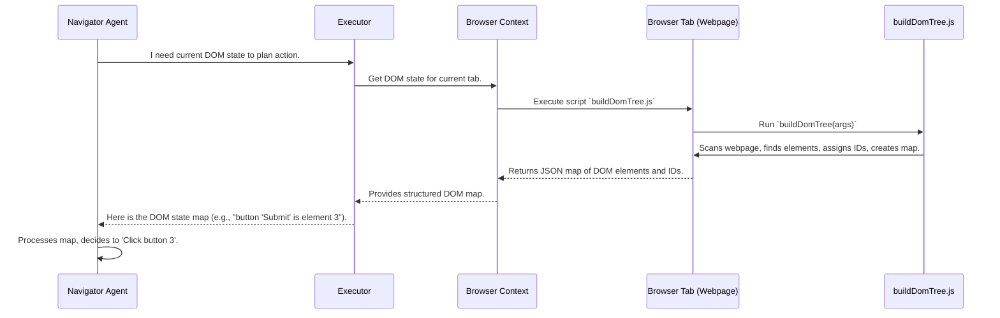

# Chapter 5: DOM State & Interaction (buildDomTree)

Welcome back! In our previous chapters, we've set up Nanobrowser with its own secure web environment ([Chapter 1: Browser Context](01_browser_context_.md)), learned how the Executor manages tasks ([Chapter 2: Executor](02_executor_.md)), and saw how AI agents keep their conversations tidy and focused ([Chapter 3: Message Management](03_message_management_.md)). Most recently, we met our team of AI agents – the Navigator, Planner, and Validator – and understood their individual roles in tackling web tasks ([Chapter 4: AI Agents (Navigator, Planner, Validator)](04_ai_agents__navigator__planner__validator__.md)).

Now, let's talk about how our AI agents, especially the **Navigator**, actually "see" and understand a webpage. When you look at a website, you see buttons, text, images, and links. You can tell what's clickable, what's a title, and what's just decorative. But how does an AI understand this? It can't "see" in the same way you do.

This is where **DOM State & Interaction (buildDomTree)** comes in. Think of it as Nanobrowser's special "camera" or "scanner" that takes a snapshot of a webpage, but instead of just an image, it creates a structured map of all the important, interactive parts.

### What Problem Does `buildDomTree` Solve?

The core problem `buildDomTree` solves is turning a complex, visual webpage into a simple, structured description that an AI can understand and act upon. An AI can't simply look at a picture of a button and know it's a button. It needs data!

Imagine you ask Nanobrowser to "Click the 'Add to Cart' button."
*   How does the Navigator agent know where that button is?
*   How does it know it's *actually* a button and not just text that says "Add to Cart"?
*   What if there are multiple "Add to Cart" texts but only one is a real button?

The `buildDomTree` script helps the AI answer these questions by providing a clear, concise map of the webpage.

### Our Use Case: "Identify and Click an Element on a Webpage"

Let's imagine a simple webpage with a single "Submit" button. Our goal for `buildDomTree` is to help the Navigator agent:

1.  **"See"** this button.
2.  **Understand** it's an interactive element.
3.  **Give it a unique ID** so the AI can refer to it.

This process is critical for any web interaction, from filling out forms to navigating menus.

### How `buildDomTree` Works: The Scanner Analogy

When an AI agent (specifically the Navigator) needs to interact with a page, it asks the `BrowserContext` to get the current DOM state. The `BrowserContext` then runs the `buildDomTree` script directly on the webpage.

This script acts like a special scanner. It goes through the webpage, looking for elements that are:

*   **Visible:** You can't click something you can't see!
*   **Interactive:** Things like buttons, links, input fields, and checkboxes.
*   **Important:** It tries to ignore purely decorative elements.

For each important, interactive, and visible element it finds, `buildDomTree` does a few key things:

1.  **Assigns a Unique ID:** It gives each of these elements a simple number (like `1`, `2`, `3`, etc.). These are called "highlight indices."
2.  **Captures Key Information:** It records information like the element's tag name (e.g., `<button>`, `<a>`, `<input>`), its attributes (like `id` or `class`), and its text content.
3.  **Maps the Page:** It creates a tree-like structure (a "DOM Tree") that shows how these elements are organized on the page.

So, when the AI gets this "map," instead of a picture, it sees something like:

```
- Page Root (body)
  - Element 1: tagName='input', type='text', placeholder='Email'
  - Element 2: tagName='input', type='password', placeholder='Password'
  - Element 3: tagName='button', text='Submit' (highlightIndex: 3)
```

Now, if the AI needs to "Click button 3," it knows exactly what that refers to!

### Key Concepts `buildDomTree` Uses

`buildDomTree` processes the live webpage using several important steps:

1.  **Traversal:** It walks through all the elements of the webpage, from top to bottom, much like reading a book.
2.  **Visibility Check:** It determines if an element is actually visible to the user. Elements hidden by CSS (like `display: none`) are ignored.
3.  **Interactivity Check:** It identifies elements that users can typically interact with (buttons, links, form fields).
4.  **Highlight Indices:** Assigns unique, simple numbers to interactive elements. These are the IDs the AI will use.
5.  **Data Extraction:** Gathers relevant HTML attributes and text content.
6.  **Snapshot Creation:** Compiles all this information into a structured, simplified representation of the DOM (Document Object Model).

#### Simplified `buildDomTree` Function in Action

Let's look at a super-simplified version of how `buildDomTree` might process an element. This script `buildDomTree.js` runs directly inside the web page in the `BrowserContext`.

```javascript
// A very simplified part of chrome-extension/public/buildDomTree.js
window.buildDomTree = (args) => {
  let highlightIndex = 0; // Starts numbering interactive elements from 0

  const processedElementsMap = {}; // Stores information about each element

  function processNode(node) {
    if (!node || node.nodeType !== Node.ELEMENT_NODE) {
      return null; // Only process actual HTML elements
    }

    // Is this element visible? (Simplified check)
    const isVisible = node.offsetWidth > 0 && node.offsetHeight > 0;
    if (!isVisible) return null; // Skip hidden elements

    // Is this element interactive? (Simplified check)
    const isInteractive = node.tagName === 'BUTTON' || node.tagName === 'A' || node.tagName === 'INPUT';

    const nodeData = {
      tagName: node.tagName.toLowerCase(),
      attributes: {}, // Collect important attributes later
      isVisible: true,
      isInteractive: isInteractive,
      highlightIndex: null, // Default: no highlight index
      children: []
    };

    if (isInteractive) {
      nodeData.highlightIndex = highlightIndex++; // Assign a unique ID
      // This is where Nanobrowser would *visually* highlight the element
    }

    // Recursively process child elements
    for (const child of node.children) {
      const childId = processNode(child);
      if (childId) {
        nodeData.children.push(childId);
      }
    }

    const uniqueId = `node_${Object.keys(processedElementsMap).length + 1}`;
    processedElementsMap[uniqueId] = nodeData;
    return uniqueId;
  }

  const rootId = processNode(document.body); // Start scanning from the body of the page

  return { rootId, map: processedElementsMap };
};
```

**Explanation:**

*   `highlightIndex`: This counter gives each interactive element its unique number.
*   `processedElementsMap`: This `buildDomTree` creates a map where each key is a unique internal ID (like `node_1`, `node_2`) and the value is all the information about that element.
*   `processNode(node)`: This is the main function that does the scanning.
    *   It checks for `isVisible` and `isInteractive` (these checks are much more complex in the real code, considering CSS styles, overlays, etc.).
    *   If an element is interactive (`isInteractive`), it gets a `highlightIndex`.
    *   It then calls itself for each of its `children` to build the tree structure.
*   `document.body`: The scanning always starts from the main content of the web page.

This simplified script shows how `buildDomTree` walks the webpage, makes decisions about elements (visible? interactive?), and assigns unique IDs to the important ones.

### How `buildDomTree` is Orchestrated

The `buildDomTree` function lives as a JavaScript file (`chrome-extension/public/buildDomTree.js`) that is **injected** into the live web page by the Nanobrowser extension. This means it runs directly in the browser's tab, allowing it to access the webpage's content, unlike the rest of Nanobrowser's code which runs in the background.

Here's how an AI agent gets the DOM state:



**Explanation of the Flow:**

1.  **Navigator Request:** The `Navigator Agent` (or sometimes the `Validator`) needs to know what's on the page. It asks the `Executor` for the current DOM state.
2.  **Executor Delegates:** The `Executor` passes this request to the `Browser Context`.
3.  **Browser Context Injects & Executes:** The `Browser Context` is powerful! It takes the `buildDomTree` JavaScript code and "injects" it directly into the currently active `Browser Tab` (the live webpage Nanobrowser is on). It then tells the tab to run this injected script.
4.  **`buildDomTree` Scans:** Inside the webpage, the `buildDomTree.js` script runs. It rapidly scans the entire page, building its internal map of elements, assigning highlight indices, and checking visibility/interactivity.
5.  **Returns JSON:** Once `buildDomTree` is done scanning, it returns the complete structured map as a JSON object back to the `Browser Context`.
6.  **Browser Context Passes On:** The `Browser Context` then provides this structured map to the `Executor`.
7.  **Executor to Navigator:** Finally, the `Executor` gives this "map" to the `Navigator Agent`. Now, the Navigator has all the information it needs to identify and interact with specific elements on the page (like "Click element 3 to submit").

### Diving Deeper into the Code: How Nanobrowser Triggers `buildDomTree`

The `BrowserContext` service (`chrome-extension/src/background/dom/service.ts`) is responsible for triggering `buildDomTree` and then processing its raw output into a more usable format for the AI agents.

Let's look at `getClickableElements` function in `dom/service.ts`:

```typescript
// chrome-extension/src/background/dom/service.ts (simplified)
import { type DOMState, type DOMElementNode, DOMTextNode } from './views'; // Output types
import type { BuildDomTreeResult } from './raw_types'; // Input type from injected script

export async function getClickableElements(
  tabId: number,
  url: string,
  showHighlightElements = true,
  focusElement = -1,
  viewportExpansion = 0,
  debugMode = false,
): Promise<DOMState> {
  const [elementTree, selectorMap] = await _buildDomTree(
    tabId, url, showHighlightElements, focusElement, viewportExpansion, debugMode,
  );
  return { elementTree, selectorMap };
}

async function _buildDomTree(
  tabId: number,
  url: string,
  showHighlightElements = true,
  focusElement = -1,
  viewportExpansion = 0,
  debugMode = false,
): Promise<[DOMElementNode, Map<number, DOMElementNode>]> {

  // This is the key line! It runs the injected `window.buildDomTree` function.
  const results = await chrome.scripting.executeScript({
    target: { tabId }, // Target the specific tab Nanobrowser is working on
    func: args => window.buildDomTree(args), // Call the injected JS function
    args: [{ showHighlightElements, focusHighlightIndex: focusElement, viewportExpansion, debugMode }],
  });

  const evalPage = results[0]?.result as BuildDomTreeResult;
  if (!evalPage || !evalPage.map || !evalPage.rootId) {
    throw new Error('Failed to build DOM tree: No result returned or invalid structure');
  }

  // After getting the raw data from `buildDomTree.js`, it constructs a usable tree
  return _constructDomTree(evalPage);
}

function _constructDomTree(evalPage: BuildDomTreeResult): [DOMElementNode, Map<number, DOMElementNode>] {
  const jsNodeMap = evalPage.map; // The `map` created by buildDomTree.js
  const jsRootId = evalPage.rootId; // The ID of the root element (usually 'body')

  const selectorMap = new Map<number, DOMElementNode>(); // This is the AI's easy lookup for elements by their highlight index
  const nodeMap: Record<string, DOMBaseNode> = {}; // Temporarily holds all nodes

  // First pass: create basic node objects from the raw data
  for (const [id, nodeData] of Object.entries(jsNodeMap)) {
    const [node] = _parse_node(nodeData);
    if (node === null) continue;
    nodeMap[id] = node;
    // If it has a highlight index, add it to the selectorMap for quick lookup
    if (node instanceof DOMElementNode && node.highlightIndex !== undefined && node.highlightIndex !== null) {
      selectorMap.set(node.highlightIndex, node);
    }
  }

  // Second pass: build the actual parent-child relationships
  for (const [id, node] of Object.entries(nodeMap)) {
    if (node instanceof DOMElementNode) {
      const nodeData = jsNodeMap[id];
      const childrenIds = 'children' in nodeData ? nodeData.children : [];
      for (const childId of childrenIds) {
        if (!(childId in nodeMap)) continue;
        const childNode = nodeMap[childId];
        childNode.parent = node; // Set the parent link
        node.children.push(childNode); // Add to children list
      }
    }
  }

  const htmlToDict = nodeMap[jsRootId];
  if (htmlToDict === undefined || !(htmlToDict instanceof DOMElementNode)) {
    throw new Error('Failed to parse HTML to dictionary');
  }
  return [htmlToDict, selectorMap];
}
```

**Explanation of `dom/service.ts`:**

*   **`getClickableElements`**: This is the main function that other parts of Nanobrowser call when they need the DOM state. It then calls the internal `_buildDomTree`.
*   **`_buildDomTree`**: This function uses `chrome.scripting.executeScript` to run the `window.buildDomTree` function directly in the target browser tab. This is how the code running in the background (Nanobrowser's core logic) can trigger code execution *inside* a live webpage.
    *   It passes `args` like `showHighlightElements` (to visually show the IDs on the screen for the user), `focusHighlightIndex` (to highlight a specific element), and `viewportExpansion` (to expand the "visible" area for scanning).
    *   The result (`evalPage`) from the injected script is a raw map of nodes and their IDs.
*   **`_constructDomTree`**: This important function takes the raw data returned by `buildDomTree.js` and transforms it into a more structured and usable format (the `DOMElementNode` and `DOMTextNode` objects). This is crucial because JavaScript's raw DOM objects are not easily passed between the webpage and the extension background. It also builds the `selectorMap`, which is a quick lookup table from the interactive element's highlight `index` (the number the AI sees) to its full `DOMElementNode` object.

### The `DOMElementNode`

The output of this whole process is a `DOMState` object, which primarily contains a `DOMElementNode` tree and a `selectorMap`.

`DOMElementNode` (found in `chrome-extension/src/background/dom/views.ts`) is a carefully designed class that represents an element on the webpage from Nanobrowser's perspective.

```typescript
// chrome-extension/src/background/dom/views.ts (simplified)
// This is the structured data that AI agents receive

export class DOMElementNode {
  tagName: string | null;            // e.g., 'button', 'input', 'a'
  xpath: string | null;              // A unique "path" to the element
  attributes: Record<string, string>; // Like { 'class': 'submit-button', 'id': 'myBtn' }
  children: DOMBaseNode[];           // Other elements inside this one
  isInteractive: boolean;           // Is this something a user can click/type into?
  isTopElement: boolean;            // Is this element on top of others?
  isInViewport: boolean;            // Is it currently visible on screen?
  highlightIndex: number | null;    // The simple ID assigned by buildDomTree (e.g., 3)
  viewportCoordinates?: CoordinateSet; // Where it is on the screen

  constructor(params: {
    tagName: string | null;
    xpath: string | null;
    attributes: Record<string, string>;
    children: DOMBaseNode[]; // Children that are also DOMBaseNode objects
    isVisible: boolean;
    isInteractive?: boolean;
    isTopElement?: boolean;
    isInViewport?: boolean;
    highlightIndex?: number | null;
    // ... many other properties for visual and interaction info ...
  }) { /* ... assigns properties from params ... */ }

  // Method to get a robust CSS selector for the element
  enhancedCssSelectorForElement(includeDynamicAttributes = true): string {
    // ... complex logic to generate a unique CSS selector based on tagName, attributes, etc. ...
    return 'button[highlightIndex="3"]'; // Example output
  }

  // Method to *hash* the element for tracking changes across pages
  async hash(): Promise<string> {
    // Uses element's attributes, xpath, and 'branch path' to create a unique identifier
    return 'someUniqueHashString';
  }
}
```

**Explanation of `DOMElementNode`:**

*   This class is the AI's concise view of a webpage element. It doesn't contain all the HTML complexity, just the relevant bits.
*   `highlightIndex`: This is the crucial property that links the AI's numerical commands (like "Click element 3") to the actual element on the page.
*   `isInteractive`, `isInViewport`, `isTopElement`: These flags help the AI quickly understand if an element is a viable target for an action.
*   `enhancedCssSelectorForElement()`: This powerful method helps Nanobrowser create a very precise way to find this element later, even if its `highlightIndex` changes (which it might if the page refreshes or changes).
*   `hash()`: This method creates a unique "fingerprint" for an element based on its content and position. This is used for tracking changes to the DOM and identifying "new" clickable elements after a page navigation or dynamic update, which is useful for the Navigator and Validator agents.

### Conclusion

You've now learned how Nanobrowser's `buildDomTree` script acts as a special scanner, turning a complex webpage into a structured, simplified map that AI agents can understand. It identifies visible, interactive elements, assigns them unique highlight indices, and captures crucial information. This process is fundamental to how the `Navigator Agent` "sees" the web and enables Nanobrowser to interact intelligently with any website.

Next, we'll explore how the AI agents use this DOM state and other information to build specific actions, like "click" or "type," in [Chapter 6: AI Action Builder](06_ai_action_builder_.md).

---

Generated by [AI Codebase Knowledge Builder](https://github.com/The-Pocket/Tutorial-Codebase-Knowledge)