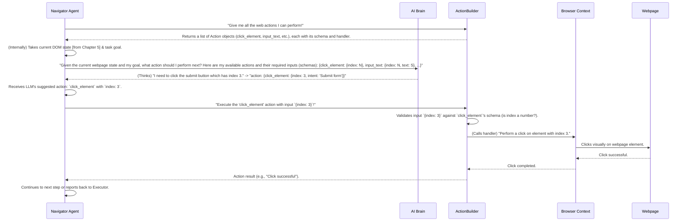

# Chapter 6: AI Action Builder

Welcome back! In our previous chapters, we've explored how Nanobrowser sets up its secure web environment ([Chapter 1: Browser Context](01_browser_context_.md)), manages tasks ([Chapter 2: Executor](02_executor_.md)), keeps its AI conversations organized ([Chapter 3: Message Management](03_message_management_.md)), and the roles of its specialized AI agents like the Navigator ([Chapter 4: AI Agents (Navigator, Planner, Validator)](04_ai_agents__navigator__planner__validator__.md)). Most recently, we learned how Nanobrowser "sees" a webpage and builds a structured map of its interactive elements using `buildDomTree` ([Chapter 5: DOM State & Interaction (builddomtree)](05_dom_state___interaction__builddomtree__.md)).

Now, let's connect all these pieces. The Navigator agent knows what's on the page (thanks to `buildDomTree`), but how does it decide **what to do** with that information? How does it know how to "click a button" or "type text"? This is where the **AI Action Builder** comes in!

### What Problem Does the AI Action Builder Solve?

Imagine you’re trying to teach a smart robot how to interact with a computer. You wouldn't just say, "Do stuff." Instead, you'd give it clear instructions like:

*   "Click the mouse at these coordinates."
*   "Type this text into the selected box."
*   "Go to this website address."

The AI Action Builder is like the robot's pre-programmed instruction manual. It defines a specific list of powerful web browsing commands that Nanobrowser's AI agents (especially the Navigator) are allowed to perform. More importantly, it also provides the "rules" for each command, telling the AI exactly what information it needs to give for that command to work.

Without the AI Action Builder, the AI would be lost. It wouldn't know how to translate its "I want to click this button" thought into an actual, executable command. The AI Action Builder makes the AI's intentions concrete actions.

### Our Use Case: "Click the 'Submit' Button"

Let's use our example: The Navigator agent has scanned a page, and it sees a "Submit" button with `highlightIndex: 3`. Now, it needs to perform the `click_element` action on this button.

The AI Action Builder helps Nanobrowser achieve this by:

1.  **Defining the `click_element` action:** It's a known, safe command.
2.  **Specifying its "schema":** It tells the AI that `click_element` *needs* an `index` (like `3`) and optionally an `xpath`.
3.  **Providing the actual code:** It links the AI's request to the real function that will perform the click using the [Browser Context](01_browser_context_.md).

### Key Concepts of the AI Action Builder

The AI Action Builder uses two main ideas:

1.  **`ActionSchema`**: This is like a blueprint for an action. It defines the name of the command (e.g., `click_element`), a short description, and most importantly, a structured `schema` that specifies exactly what inputs the action needs.
2.  **`Action` Class**: This is the actual executable command. It wraps the `ActionSchema` and contains the `handler` function – the piece of code that really *does* the action when called. It also includes methods to check if the inputs are correct according to the `schema`.

Let's look at how these work together.

#### 1. `ActionSchema`: The Blueprint

Action Schemas are defined using Zod, a library for data validation. Think of a Zod schema as a set of rules for data.

Here's an example of the `click_element` action's schema, located in `chrome-extension/src/background/agent/actions/schemas.ts`:

```typescript
// chrome-extension/src/background/agent/actions/schemas.ts (simplified)
import { z } from 'zod';

export interface ActionSchema {
  name: string;
  description: string;
  schema: z.ZodType; // This tells us what inputs the action expects
}

export const clickElementActionSchema: ActionSchema = {
  name: 'click_element',
  description: 'Click element by index',
  schema: z.object({
    intent: z.string().default('').describe('purpose of this action'),
    index: z.number().int().describe('index of the element'),
    xpath: z.string().nullable().optional().describe('xpath of the element'),
  }),
};
```

**Explanation:**

*   `name: 'click_element'`: This is the unique name the AI will use to refer to this action.
*   `description: 'Click element by index'`: A human-readable text explaining what the action does.
*   `schema: z.object(...)`: This is the crucial part!
    *   `intent: z.string().default('')`: An optional string for the AI's internal reasoning (like "purpose of this action").
    *   `index: z.number().int().describe('index of the element')`: This is a **required** input. It must be a whole number, and it represents the `highlightIndex` we learned about in the previous chapter.
    *   `xpath: z.string().nullable().optional()`: This is an **optional** input, meaning the AI doesn't *have* to provide it, and it can be a string or `null`. An `xpath` is another way to identify elements, which is more robust but harder for the AI to guess.

This `ActionSchema` acts as a contract. It tells the AI: "If you want to `click_element`, you *must* tell me its `index`."

Other common actions also have their schemas:

```typescript
// chrome-extension/src/background/agent/actions/schemas.ts (Examples)

export const goToUrlActionSchema: ActionSchema = {
  name: 'go_to_url',
  description: 'Navigate to URL in the current tab',
  schema: z.object({
    intent: z.string().default('').describe('purpose of this action'),
    url: z.string(), // Must provide a URL
  }),
};

export const inputTextActionSchema: ActionSchema = {
  name: 'input_text',
  description: 'Input text into an interactive input element',
  schema: z.object({
    intent: z.string().default('').describe('purpose of this action'),
    index: z.number().int().describe('index of the element'), // Element index
    text: z.string().describe('text to input'), // Text to put in it
    xpath: z.string().nullable().optional().describe('xpath of the element'),
  }),
};

export const scrollDownActionSchema: ActionSchema = {
  name: 'scroll_down',
  description: 'Scroll down the page by pixel amount - if no amount is specified, scroll down one page',
  schema: z.object({
    intent: z.string().default('').describe('purpose of this action'),
    amount: z.number().int().nullable().optional().describe('amount of pixels'), // Optional amount
  }),
};
```

These schemas are crucial because they ensure the AI provides all the necessary information for an action to succeed. If the AI suggests `click_element` but forgets the `index`, the Action Builder will flag it as an error!

#### 2. `Action` Class: The Executable Command

The `Action` class (found in `chrome-extension/src/background/agent/actions/builder.ts`) brings an `ActionSchema` to life. It wraps the schema and, most importantly, contains the `handler` function which is the actual code that performs the operation.

```typescript
// chrome-extension/src/background/agent/actions/builder.ts (simplified)
import { ActionResult } from '@src/background/agent/types';
import { type ActionSchema } from './schemas';
import { z } from 'zod'; // For schema validation

export class Action {
  constructor(
    // The `handler` is the actual function that performs the action!
    private readonly handler: (input: any) => Promise<ActionResult>,
    public readonly schema: ActionSchema, // The blueprint we just discussed
    public readonly hasIndex: boolean = false, // Does this action take an 'index' argument?
  ) {}

  async call(input: unknown): Promise<ActionResult> {
    // 1. Validate the input against the schema
    const parsedArgs = this.schema.schema.safeParse(input);
    if (!parsedArgs.success) {
      // If the input doesn't match the schema, throw an error!
      const errorMessage = parsedArgs.error.message;
      throw new Error(`Invalid input for action ${this.name()}: ${errorMessage}`);
    }

    // 2. If valid, execute the handler!
    return await this.handler(parsedArgs.data);
  }

  name() {
    return this.schema.name;
  }
}
```

**Explanation:**

*   **`handler`**: This is a private function that takes the validated input (like `{ index: 3 }` for `click_element`) and actually calls the lower-level functions in the [Browser Context](01_browser_context_.md) to perform the web interaction.
*   **`call(input)`**: This is the method that's publicly used to tell an Action to execute. It first validates the `input` using `this.schema.schema.safeParse(input)`. If the input doesn't match the schema (e.g., `index` is missing or is not a number), it throws an error. If it's valid, it calls the `handler`.

### How the `ActionBuilder` Creates Actions

The `ActionBuilder` class (`chrome-extension/src/background/agent/actions/builder.ts`) is responsible for *creating* a collection of these `Action` objects. It knows all the possible actions Nanobrowser can take and how to build them.

Here's how `buildDefaultActions()` method within `ActionBuilder` creates our `click_element` action:

```typescript
// chrome-extension/src/background/agent/actions/builder.ts (simplified)
import {
  clickElementActionSchema, // The schema we defined
  goToUrlActionSchema,
  inputTextActionSchema,
} from './schemas';
import { Action } from './builder'; // The Action class itself

export class ActionBuilder {
  private readonly context: AgentContext; // Provides access to BrowserContext, MessageManager etc.

  constructor(context: AgentContext, extractorLLM: BaseChatModel) {
    this.context = context;
    // ...
  }

  buildDefaultActions() {
    const actions = []; // This array will hold all our executable actions

    // Building the 'click_element' action
    const clickElement = new Action(
      async (input: z.infer<typeof clickElementActionSchema.schema>) => {
        const intent = input.intent || `Clicking element with index ${input.index}`;
        this.context.emitEvent(Actors.NAVIGATOR, ExecutionState.ACT_START, intent); // For UI updates

        const page = await this.context.browserContext.getCurrentPage(); // Get current page from BrowserContext
        const state = await page.getState(); // Get DOM State (from buildDomTree)

        const elementNode = state?.selectorMap.get(input.index); // Look up element by highlightIndex
        if (!elementNode) {
          throw new Error(`Element with index ${input.index} does not exist`);
        }

        await page.click(input.index, elementNode.xpath ?? undefined); // Perform the actual click!

        this.context.emitEvent(Actors.NAVIGATOR, ExecutionState.ACT_OK, intent);
        return new ActionResult({ isDone: false, extractedContent: `Clicked element ${input.index}` });
      },
      clickElementActionSchema, // Pass the schema (our blueprint)
      true, // This action `hasIndex`
    );
    actions.push(clickElement);

    // Building the 'input_text' action
    const inputText = new Action(
      async (input: z.infer<typeof inputTextActionSchema.schema>) => {
        const intent = input.intent || `Inputting text "${input.text}" into element ${input.index}`;
        this.context.emitEvent(Actors.NAVIGATOR, ExecutionState.ACT_START, intent);

        const page = await this.context.browserContext.getCurrentPage();
        const state = await page.getState();

        const elementNode = state?.selectorMap.get(input.index);
        if (!elementNode) {
          throw new Error(`Element with index ${input.index} does not exist`);
        }
        await page.type(input.index, input.text, elementNode.xpath ?? undefined);

        this.context.emitEvent(Actors.NAVIGATOR, ExecutionState.ACT_OK, intent);
        return new ActionResult({ isDone: false, extractedContent: `Typed "${input.text}" into element ${input.index}` });
      },
      inputTextActionSchema,
      true,
    );
    actions.push(inputText);

    // ... other actions are built here similarly ...

    return actions; // Returns the list of all executable actions
  }
}
```

**Explanation:**

*   **`buildDefaultActions()`**: This method creates a list of `Action` objects, one for each supported web command.
*   **`clickElement` Action Creation**:
    *   It creates a `new Action()`.
    *   The `handler` function inside it is where the real work happens. It gets the current page and its DOM state from the `BrowserContext` (`this.context.browserContext`), finds the element using the `index` provided by the AI (`state?.selectorMap.get(input.index)`), and then calls `page.click()` to perform the actual browser operation.
    *   Crucially, `clickElementActionSchema` is passed as the blueprint.
    *   `true` indicates this action relies on an `index`.

This collection of `Action` objects is then given to the Navigator agent.

### How it All Connects: AI Action Builder within the Navigator Agent

Recall from [Chapter 4: AI Agents (Navigator, Planner, Validator)](04_ai_agents__navigator__planner__validator__.md) that the `NavigatorAgent` is responsible for interacting with web pages. The `NavigatorAgent` uses the `ActionBuilder` (or rather, the actions *built by* the `ActionBuilder`) to guide its AI brain on what commands are available and how to execute them.



**Explanation of the Flow:**

1.  **Actions are built:** When Nanobrowser starts a task, the `ActionBuilder` creates all the possible `Action` objects (like `click_element`, `input_text`, `go_to_url`, etc.). These are essentially JavaScript functions with clear data requirements wrapped around them.
2.  **Navigator asks LLM:** The `Navigator Agent` (our web interaction expert) passes two critical pieces of information to its `LLM` (AI brain):
    *   The current state of the webpage elements (from `buildDomTree`).
    *   A list of all available actions, including their `name` and their detailed `schema` (what inputs they need). This is how the LLM knows what commands it can "speak" and how to properly format them.
3.  **LLM makes a decision:** The `LLM` processes the webpage state and the task goal. It then decides which action to take and provides the necessary arguments according to the action's `schema`. For example, it might say: `click_element` with `index: 3`. It *must* follow the schema, or its output will be rejected.
4.  **Navigator executes action:** The `Navigator Agent` takes the LLM's chosen action and its parameters. It then looks up the corresponding `Action` object (which was built by the `ActionBuilder`) and calls its `call()` method with the LLM's provided input.
5.  **Validation and Execution:** The `Action` object first validates the input against its `schema`. If valid, its internal `handler` function then directly tells the `Browser Context` to perform the interaction on the live web page.
6.  **Results back to Navigator:** The `Browser Context` performs the interaction, and the `Action` handler returns the result to the Navigator.

This entire process ensures that the AI's "thoughts" are precisely translated into executable, validated web automation commands.

### JSON Schema for LLMs

Modern Large Language Models (LLMs) can be guided to produce output in a specific structured format, often using JSON Schema. The `ActionBuilder` also provides a way to generate a big JSON schema that represents *all* the available actions. This schema is given to the LLM to help it produce its output in the exact format Nanobrowser expects.

You can see how this `jsonNavigatorOutputSchema` is defined in `chrome-extension/src/background/agent/actions/json_schema.ts` (or `json_gemini.ts` for Gemini). This schema combines all the individual `ActionSchema` definitions into one large schema that the LLM uses as a guide for its entire output for the Navigator.

```typescript
// chrome-extension/src/background/agent/actions/json_schema.ts (excerpt)
// This is used to guide the LLM's output
export const jsonNavigatorOutputSchema = {
  properties: {
    current_state: { /* ... */ },
    action: { // This section lists all possible actions
      items: {
        properties: {
          done: { /* ... */ },
          search_google: { /* ... */ },
          go_to_url: { /* ... */ },
          click_element: { // Here's our click_element action in the JSON Schema
            description: 'Click element by index',
            properties: {
              intent: { type: 'string', description: 'purpose of this action' },
              index: { type: 'integer' }, // The AI MUST provide an integer index
              xpath: { type: 'string', nullable: true },
            },
            required: ['intent', 'index'], // intent and index are required
            type: 'object',
            nullable: true,
          },
          input_text: { /* ... */ },
          // ... many other actions ...
        },
      // ...
    },
  },
  required: ['current_state', 'action'],
  type: 'object',
};
```

**Explanation:**

*   This `jsonNavigatorOutputSchema` is provided to the LLM. It's like giving the LLM a template: "Your output must be a JSON object with `current_state` and `action`. Inside `action`, you can pick one of these defined actions (`click_element`, `input_text`, etc.), and for each, here are the exact properties (like `index`) you need to include."
*   This ensures that the LLM's response is predictable and correctly formatted, making it easy for Nanobrowser to parse and execute.

### Conclusion

You've now seen how the **AI Action Builder** is the factory for web automation commands. It defines a very specific set of actions that Nanobrowser's AI agents can perform, complete with detailed "schemas" (like instruction manuals) that guide the AI on what information it needs to provide. This structured approach is essential for bridging the gap between the AI's high-level goals and the precise, step-by-step interactions needed to automate web tasks.

Next, we'll explore the "brains" behind Nanobrowser – the **LLM Providers & Models** – and delve into how Nanobrowser connects to powerful AI language models to make all these decisions.
[LLM Providers & Models](07_llm_providers___models_.md)

---

Generated by [AI Codebase Knowledge Builder](https://github.com/The-Pocket/Tutorial-Codebase-Knowledge)