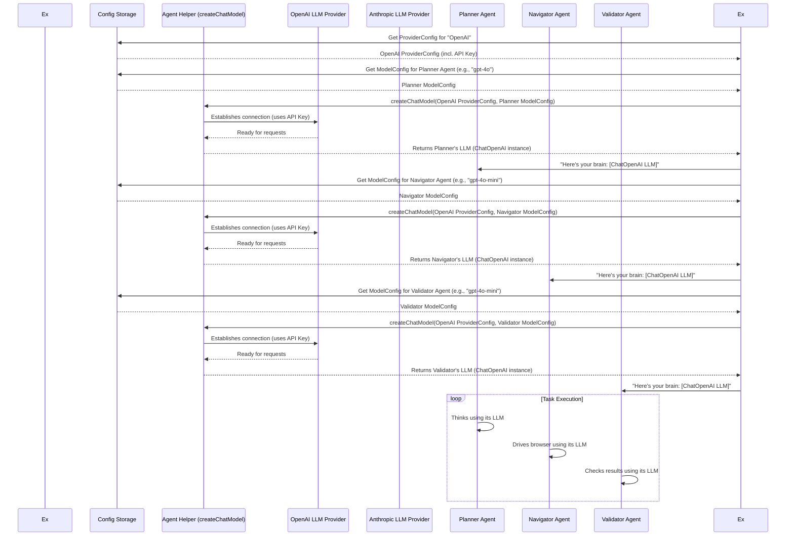

# Chapter 7: LLM Providers & Models

Welcome back! In our previous chapters, we've explored how Nanobrowser sets up its secure web environment ([Chapter 1: Browser Context](01_browser_context_.md)), manages tasks ([Chapter 2: Executor](02_executor_.md)), keeps its AI conversations organized ([Chapter 3: Message Management](03_message_management_.md)), and the roles of its specialized AI agents like the Navigator ([Chapter 4: AI Agents (Navigator, Planner, Validator)](04_ai_agents__navigator__planner__validator__.md)). We also saw how Nanobrowser "sees" a webpage ([Chapter 5: DOM State & Interaction (builddomtree)](05_dom_state___interaction__builddomtree_.md)) and how its AI agents build precise web actions ([Chapter 6: AI Action Builder](06_ai_action_builder_.md)).

Now, let's talk about the true "brains" behind Nanobrowser's impressive abilities: the Large Language Models (LLMs). These are the powerful AI models that think, plan, and decide. But Nanobrowser doesn't have its own LLMs; instead, it connects to LLMs provided by companies like OpenAI, Anthropic, or Google. This setup is managed by the **LLM Providers & Models** system.

### What Problem Do LLM Providers & Models Solve?

Imagine Nanobrowser as a super-smart robot. It has arms to click (thanks to the Navigator), legs to move around the web (Browser Context), and a great memory (Message Management). But for it to be truly smart, it needs a powerful brain to decide *what* to do and *how* to do it.

This "brain" is not built into Nanobrowser itself. Instead, Nanobrowser connects to external, highly advanced LLMs. The problem the **LLM Providers & Models** system solves is:

1.  **Connecting to Different AI Brains:** Just like you might choose between different search engines, Nanobrowser lets you choose which LLM "provider" (like OpenAI, Anthropic, Google) and "model" (like GPT-4, Claude, Gemini) it should use. This gives you flexibility and control.
2.  **Keeping Your Secrets Safe:** To use these LLMs, you usually need an "API Key," which is like a secret password. Nanobrowser handles securely storing these keys *only on your computer*, never sending them to Nanobrowser's servers.
3.  **Choosing the Right Brain for the Job:** Different LLMs might be better or cheaper for specific tasks. For example, a "Planner" AI needs a creative brain, while a "Validator" AI needs a very precise one. This system helps pick the best LLM for each of Nanobrowser's AI agents.
4.  **Balancing Cost and Performance:** Some LLMs are more powerful but also more expensive. This system helps manage which model is used to optimize between quality and cost.

In short, it's how Nanobrowser gets its intelligence, all while keeping your data private and giving you control.

### Our Use Case: Bringing Nanobrowser to Life

You've downloaded Nanobrowser, and you want it to start performing tasks. The very first thing you need to do is tell it which LLM "brain" to use. You'll typically go to Nanobrowser's settings and provide an API key for a provider like OpenAI.

The `LLM Providers & Models` system handles taking that API key and using it to create a connection to the chosen AI model whenever an AI agent needs to "think."

### Key Concepts

This system involves a few key ideas:

1.  **Providers:** These are the companies that offer LLMs (e.g., OpenAI, Anthropic, Google).
2.  **Models:** These are the specific LLMs offered by a provider (e.g., GPT-4, GPT-4o, Claude 3, Gemini Flash). Different models have different strengths, capabilities, and costs.
3.  **API Keys:** Your personal secret code for accessing a provider's models. Nanobrowser stores these locally and uses them to make requests to the LLM providers.
4.  **`ProviderConfig` & `ModelConfig`:** These are the ways Nanobrowser stores detailed settings about each provider and the specific model chosen for a task.
5.  **`createChatModel`:** This is the core function Nanobrowser uses to actually build a connection to the chosen LLM, ready for the AI agents to send their thoughts to.

Let's look at how these fit together.

#### 1. Providers and Models: Your AI Choices

Nanobrowser supports many LLM providers. You can see a list of them in the `ProviderTypeEnum` and their associated `llmProviderModelNames`:

```typescript
// packages/storage/lib/settings/types.ts (simplified)
export enum ProviderTypeEnum {
  OpenAI = 'openai',
  Anthropic = 'anthropic',
  DeepSeek = 'deepseek',
  Gemini = 'gemini',
  AzureOpenAI = 'azure_openai',
  OpenRouter = 'openrouter',
  // ... many others ...
  CustomOpenAI = 'custom_openai', // For custom OpenAI-compatible APIs
}

export const llmProviderModelNames = {
  [ProviderTypeEnum.OpenAI]: ['gpt-4.1', 'gpt-4.1-mini', 'gpt-4o', 'gpt-4o-mini'],
  [ProviderTypeEnum.Anthropic]: ['claude-sonnet-4-20250514', 'claude-3-5-sonnet-latest'],
  [ProviderTypeEnum.DeepSeek]: ['deepseek-chat', 'deepseek-reasoner'],
  [ProviderTypeEnum.Gemini]: ['gemini-2.5-flash-preview-05-20'],
  // ... and so on for other providers
};
```

**Explanation:**

*   `ProviderTypeEnum`: This lists all the different companies or types of services that offer LLMs that Nanobrowser knows how to connect to.
*   `llmProviderModelNames`: This shows the common models available from each provider. When you pick a provider in Nanobrowser's settings, it often tries to suggest models from this list.

#### 2. API Keys and `ProviderConfig`

When you set up a provider in Nanobrowser's settings, you're essentially creating a `ProviderConfig`. This is where your API Key is stored.

```typescript
// packages/storage/lib/settings/llmProviders.ts (simplified)
export interface ProviderConfig {
  name?: string; // Display name (e.g., "My OpenAI Key")
  type?: ProviderTypeEnum; // The type of provider (e.g., OpenAI)
  apiKey: string; // ✨ Your secret API key ✨
  baseUrl?: string; // Some providers allow a custom base URL
  modelNames?: string[]; // Models you've chosen or are available from this provider
  createdAt?: number; // When was this config created?
  // ... special settings for Azure OpenAI, etc. ...
}
```

**Explanation:**

*   `apiKey`: This is the most crucial part. It's the credential that allows Nanobrowser to make requests to the LLM provider on your behalf. Nanobrowser stores this in your browser's local storage, keeping it private to your machine.

#### 3. `ModelConfig`

While `ProviderConfig` stores information about *how* to connect to a provider, `ModelConfig` stores details about *which specific model* an agent should use:

```typescript
// packages/storage/lib/settings/types.ts (simplified)
export interface ModelConfig {
  provider: string; // The ID of the chosen provider
  modelName: string; // The specific model name (e.g., 'gpt-4o')
  parameters?: {
    temperature?: number; // How creative the model should be (0-1)
    topP?: number; // Another parameter for creativity/diversity (0-1)
  };
  reasoningEffort?: 'low' | 'medium' | 'high'; // For some advanced models
}
```

**Explanation:**

*   `provider`: This links to one of your configured `ProviderConfig` entries.
*   `modelName`: The exact name of the LLM model to use (e.g., `gpt-4o`).
*   `parameters`: These are settings that control the LLM's behavior, like `temperature` (how "creative" or "random" its answers are) and `topP` (another way to control randomness). Different agents (Planner, Navigator, Validator) often have different default parameters to suit their needs.

```typescript
// packages/storage/lib/settings/types.ts (from relevant code)
export const llmProviderParameters = {
  [ProviderTypeEnum.OpenAI]: {
    [AgentNameEnum.Planner]: { temperature: 0.7, topP: 0.9 }, // Planner is more creative
    [AgentNameEnum.Navigator]: { temperature: 0.3, topP: 0.85 }, // Navigator is balanced
    [AgentNameEnum.Validator]: { temperature: 0.1, topP: 0.8 }, // Validator is very precise
  },
  // ... and so on for other providers
};
```

This ensures that the Planner, Navigator, and Validator agents get the optimal "brain settings" for their specific jobs.

#### 4. `createChatModel`: The Connection Builder

This is the central function that takes the `ProviderConfig` and `ModelConfig` and actually creates a usable connection to the LLM. It uses a library called `LangChain.js`, which simplifies talking to different LLMs.

```typescript
// chrome-extension/src/background/agent/helper.ts (simplified)
import { ChatOpenAI, AzureChatOpenAI } from '@langchain/openai'; // LangChain's OpenAI connector
import { ChatAnthropic } from '@langchain/anthropic'; // LangChain's Anthropic connector
import { ChatGoogleGenerativeAI } from '@langchain/google-genai'; // LangChain's Gemini connector
import type { BaseChatModel } from '@langchain/core/language_models/chat_models';

// ... other imports and helper functions ...

export function createChatModel(providerConfig: ProviderConfig, modelConfig: ModelConfig): BaseChatModel {
  // Get temperature and topP parameters, using defaults if not specified
  const temperature = (modelConfig.parameters?.temperature ?? 0.1) as number;
  const topP = (modelConfig.parameters?.topP ?? 0.1) as number;

  switch (modelConfig.provider) { // Which kind of provider did the user choose?
    case ProviderTypeEnum.OpenAI: {
      return new ChatOpenAI({
        model: modelConfig.modelName,
        apiKey: providerConfig.apiKey,
        temperature,
        topP,
        // ... other settings ...
      });
    }
    case ProviderTypeEnum.Anthropic: {
      return new ChatAnthropic({
        model: modelConfig.modelName,
        apiKey: providerConfig.apiKey,
        temperature,
        topP,
        // ... other settings ...
      });
    }
    case ProviderTypeEnum.Gemini: {
       return new ChatGoogleGenerativeAI({
        model: modelConfig.modelName,
        apiKey: providerConfig.apiKey,
        temperature,
        topP,
       });
    }
    case ProviderTypeEnum.AzureOpenAI: {
      // Special logic for Azure, which has more setup details
      // ... calls createAzureChatModel helper ...
      return createAzureChatModel(providerConfig, modelConfig);
    }
    // ... more cases for other providers ...
    default: {
      // If it's a "CustomOpenAI" provider, or unrecognized, assume it's OpenAI-compatible
      return new ChatOpenAI({
        model: modelConfig.modelName,
        apiKey: providerConfig.apiKey,
        baseUrl: providerConfig.baseUrl, // Use custom base URL if provided
        temperature,
        topP,
      });
    }
  }
}
```

**Explanation:**

*   `createChatModel` is like a factory. It looks at the `ProviderTypeEnum` (`modelConfig.provider`) to decide which specific LangChain connector (like `ChatOpenAI`, `ChatAnthropic`, `ChatGoogleGenerativeAI`) to use.
*   It then takes the `apiKey`, `modelName`, and `parameters` (`temperature`, `topP`) from your `providerConfig` and `modelConfig` and passes them to the chosen LangChain connector.
*   The result is a `BaseChatModel` object, which is Nanobrowser's ready-to-use "brain" connection. When an AI agent needs to think, it calls `.invoke()` on this `BaseChatModel` object, sending its messages and getting a response from the LLM provider.

### How it All Connects: AI Agents Getting Their Brains

Recall from [Chapter 2: Executor](02_executor_.md) and [Chapter 4: AI Agents (Navigator, Planner, Validator)](04_ai_agents__navigator__planner__validator_.md) that the `Executor` is responsible for preparing and running the AI agents. Part of preparing them involves giving them their LLM "brain."

Here's a simplified flow for how the Executor sets up the LLM connections for its agents:



**Explanation of the Flow:**

1.  **Executor Initiates:** When a task starts, the `Executor` needs to set up the brains for its `Planner`, `Navigator`, and `Validator` agents.
2.  **Configuration Lookup:** For each agent, the `Executor` asks the `Storage` system for the `ProviderConfig` (which LLM company to use and its API key) and the `ModelConfig` (which specific model and its parameters like `temperature`).
3.  **Chat Model Creation:** The `Executor` then calls the `createChatModel` function (our `Agent Helper` in the diagram), passing it these configurations.
4.  **Connection to Provider:** `createChatModel` uses the gathered information (like the API Key) to establish a connection with the actual LLM provider (e.g., OpenAI). This connection uses the `LangChain.js` library, transparently handling the communication details.
5.  **LLM Instance Returned:** Once the connection is ready, `createChatModel` returns a `BaseChatModel` instance (the "brain") back to the `Executor`.
6.  **Brain Assignment:** The `Executor` assigns this `BaseChatModel` instance to the respective agent (Planner, Navigator, Validator). Now, each agent has its own dedicated LLM connection.
7.  **Agents "Think":** As the task progresses, when an agent needs to make a decision, plan, or validate, it sends its messages to its assigned LLM "brain" through the `BaseChatModel` instance, receives a response, and continues its work.

This sophisticated system allows Nanobrowser to be highly flexible, secure, and optimized for performance and cost by leveraging various powerful LLM providers.

### Conclusion

You've now learned how **LLM Providers & Models** form the essential "brains" of Nanobrowser. This system intelligently manages connections to external Large Language Models from various providers, securely handles your API keys, and selects the right LLM with optimal parameters for each of Nanobrowser's specialized AI agents. This private and customizable integration is what truly empowers Nanobrowser to automate complex web tasks.

Next, we'll delve into how Nanobrowser keeps track of all its settings, configurations, and crucial data: the [Storage System](08_storage_system_.md).

---

Generated by [AI Codebase Knowledge Builder](https://github.com/The-Pocket/Tutorial-Codebase-Knowledge)