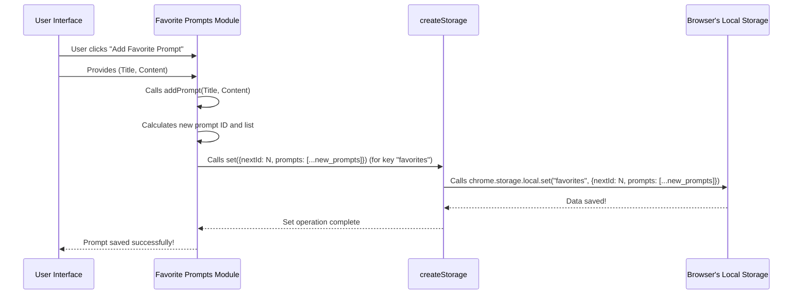

# Chapter 8: Storage System

Welcome back! In our previous chapters, we've explored how Nanobrowser sets up its secure web environment ([Chapter 1: Browser Context](01_browser_context_.md)), manages tasks ([Chapter 2: Executor](02_executor_.md)), keeps its AI conversations organized ([Chapter 3: Message Management](03_message_management_.md)), and the roles of its specialized AI agents like the Navigator ([Chapter 4: AI Agents (Navigator, Planner, Validator)](04_ai_agents__navigator__planner__validator_.md)). We also saw how Nanobrowser "sees" a webpage ([Chapter 5: DOM State & Interaction (builddomtree)](05_dom_state___interaction__builddomtree_.md)) and how its AI agents build precise web actions ([Chapter 6: AI Action Builder](06_ai_action_builder_.md)). Most recently, we demystified how Nanobrowser gets its intelligence by connecting to powerful LLMs ([Chapter 7: LLM Providers & Models](07_llm_providers___models_.md)).

Now, let's talk about how Nanobrowser remembers everything. Where does it keep your settings, your favorite prompts, or even the API keys you provide for LLMs? It needs a place to store all this important information so it doesn't forget it when you close your browser or turn off your computer.

This is where the **Storage System** comes in!

### What Problem Does the Storage System Solve?

Imagine Nanobrowser as your personal helper inside your web browser. Just like you have a wallet for your money, a filing cabinet for your documents, or a notebook for your ideas, Nanobrowser needs its own secure place to store its "stuff."

The problem the **Storage System** solves is providing a reliable, private, and persistent place for Nanobrowser to keep essential data, such as:

*   **Your LLM API keys:** These are sensitive secrets that allow Nanobrowser to use AI models from companies like OpenAI. They *must* be kept safe and private to your browser.
*   **Agent configurations:** Settings for how the [AI Agents](04_ai_agents__navigator__planner__validator__.md) behave.
*   **General preferences:** Things like your preferred dark mode setting or other UI choices.
*   **Firewall rules:** Lists of websites Nanobrowser is allowed or not allowed to visit (recall from [Chapter 1: Browser Context](01_browser_context_.md)).
*   **Chat history:** Records of what Nanobrowser has done and said.
*   **Favorite prompts:** Pre-written instructions you often use for Nanobrowser tasks.

Without a robust Storage System, Nanobrowser would be like a goldfish with no memory – it would forget everything the moment you closed it, and you'd have to set it up again every single time! The Storage System ensures your preferences are saved between sessions without needing a central server, keeping your data private to your browser.

### Our Use Case: Saving Your Favorite Prompts

Let's say you've created a really useful prompt like "Summarize the top 3 news articles on BBC.com." You don't want to type this out every time. You want to save it as a "favorite prompt" so you can easily use it again later.

The Storage System makes this possible by providing a way to:

1.  **Add** a new favorite prompt.
2.  **Retrieve** all your saved prompts.
3.  **Update** or **remove** prompts if you change your mind.

This is just one example; the same system is used for everything from your API keys to your firewall settings.

### Key Concepts of the Storage System

The Storage System in Nanobrowser uses a wrapper around your web browser's built-in storage capabilities, specifically `chrome.storage.local` for most persistent data. It's like a convenient toolkit for saving and loading data.

It involves a few key ideas:

1.  **`BaseStorage`**: This is a general "blueprint" for how different pieces of data are stored. It always has methods to `get` (read), `set` (write), `getSnapshot` (get an instant copy), and `subscribe` (listen for changes).
2.  **`createStorage`**: This is the "factory" function that uses the `BaseStorage` blueprint to create a specific storage area for a particular type of data (e.g., one for LLM settings, one for favorite prompts).
3.  **Encapsulated Data Types**: Different parts of Nanobrowser store different kinds of data (e.g., `ProviderConfig` for LLMs, `FavoritePrompt` for prompts). The Storage System wraps these up nicely.

Let's look at how these fit together.

#### 1. `BaseStorage`: The Storage Blueprint

Any piece of data Nanobrowser wants to save will use this basic set of functions. It's defined as an interface in `packages/storage/lib/base/types.ts`:

```typescript
// packages/storage/lib/base/types.ts (simplified)
export type ValueOrUpdate<D> = D | ((prev: D) => Promise<D> | D);

export type BaseStorage<D> = {
  get: () => Promise<D>; // Reads the stored data
  set: (value: ValueOrUpdate<D>) => Promise<void>; // Writes or updates the stored data
  getSnapshot: () => D | null; // Gets a quick copy of the data
  subscribe: (listener: () => void) => () => void; // Listens for changes to the data
};
```

**Explanation:**

*   `get()`: When you want to know what's saved, you call `get()`. It returns the data.
*   `set()`: This is how you update the data. You can either give it the new data directly, or give it a function that tells it *how* to update the old data.
*   `getSnapshot()`: Sometimes you just need a quick peek at the current data without waiting.
*   `subscribe()`: If you want to know immediately when the data changes (e.g., if another part of Nanobrowser updates a setting), you can `subscribe` to receive notifications.

#### 2. `createStorage`: The Storage Factory

The `createStorage` function (located in `packages/storage/lib/base/base.ts`) is the magic helper that builds a concrete storage item based on the `BaseStorage` blueprint. It handles all the technical details of using the browser's storage.

```typescript
// packages/storage/lib/base/base.ts (simplified)
import type { BaseStorage, StorageConfig, ValueOrUpdate } from './types';
import { StorageEnum } from './enums';

// The "chrome" object is how we talk to the browser's storage system
const chrome = globalThis.chrome;

export function createStorage<D = string>(key: string, fallback: D, config?: StorageConfig<D>): BaseStorage<D> {
  // 'key' is like the name of your filing cabinet drawer (e.g., 'favorite_prompts')
  // 'fallback' is the default value if nothing is saved yet
  // 'config' has extra options, like where to save it (local, sync, session)

  const storageEnum = config?.storageEnum ?? StorageEnum.Local; // Most data goes to 'local' storage

  // This part handles reading the data from the browser's storage
  const get = async (): Promise<D> => {
    // Uses `chrome.storage.local.get()` to load data
    const value = await chrome?.storage[storageEnum].get([key]);
    return value ? (value[key]) : fallback;
  };

  // This part handles writing the data to the browser's storage
  const set = async (valueOrUpdate: ValueOrUpdate<D>) => {
    // Logic to update the internal cache
    // ...
    // Uses `chrome.storage.local.set()` to save data
    await chrome?.storage[storageEnum].set({ [key]: valueOrUpdate });
    // Notifies any listeners that the data changed
    // ...
  };

  // ... (Other BaseStorage methods like getSnapshot, subscribe) ...

  return { get, set, getSnapshot, subscribe };
}
```

**Explanation:**

*   `key`: This is a unique name for what you're saving, like a label on a drawer (e.g., `"favorite_prompts"`, `"llm_providers"`).
*   `fallback`: If Nanobrowser tries to read something but finds nothing there yet, this is the default initial value it will use.
*   `StorageEnum.Local` vs. `StorageEnum.Sync`:
    *   `Local`: Data is saved on *your specific browser*. If you switch computers, it won't be there. This is good for private data like API keys.
    *   `Sync`: Data is saved to your Google account (if you're logged in). If you use Chrome on another computer, this data will sync. Good for general preferences.
    *   Nanobrowser primarily uses `Local` storage for security and privacy.
*   `chrome.storage[storageEnum].get()` and `chrome.storage[storageEnum].set()`: These are the actual commands that talk to your web browser's secure internal storage.

#### 3. Encapsulated Data Types: `FavoritePrompt` Example

For our "favorite prompts" use case, Nanobrowser first defines what a `FavoritePrompt` looks like:

```typescript
// packages/storage/lib/prompt/favorites.ts (simplified)
export interface FavoritePrompt {
  id: number;
  title: string;
  content: string;
}

export interface FavoritesStorage {
  nextId: number; // To assign unique IDs to new prompts
  prompts: FavoritePrompt[]; // The list of all your favorite prompts
}
```

Then, it creates a specialized storage manager (`createFavoritesStorage`) specifically for prompts, using `createStorage` under the hood:

```typescript
// packages/storage/lib/prompt/favorites.ts (simplified)
import { createStorage } from '../base/base';
import type { BaseStorage } from '../base/types';

// The initial state if no prompts are saved yet
const initialState: FavoritesStorage = {
  nextId: 1,
  prompts: [], // It starts empty
};

// Create the actual storage instance for favorites, using 'favorites' as the key
const favoritesStorage: BaseStorage<FavoritesStorage> = createStorage('favorites', initialState, {
  storageEnum: StorageEnum.Local, // Store locally on this browser
  liveUpdate: true, // Keep multiple parts of Nanobrowser updated if prompts change
});

export function createFavoritesStorage(): FavoritePromptsStorage {
  return {
    addPrompt: async (title: string, content: string): Promise<FavoritePrompt> => {
      // This uses `favoritesStorage.set()` internally to add a new prompt
      // ... logic to add prompt, assign ID, etc. ...
    },
    updatePrompt: async (id: number, title: string, content: string): Promise<FavoritePrompt | undefined> => {
      // This uses `favoritesStorage.set()` internally to update an existing prompt
      // ...
    },
    removePrompt: async (id: number): Promise<void> => {
      // This uses `favoritesStorage.set()` internally to remove a prompt
      // ...
    },
    getAllPrompts: async (): Promise<FavoritePrompt[]> => {
      // This uses `favoritesStorage.get()` internally to retrieve all prompts
      // ...
      const currentState = await favoritesStorage.get();
      return [...currentState.prompts].sort((a, b) => b.id - a.id);
    },
    // ... other methods like getPromptById, reorderPrompts ...
  };
}

// Export an instance for other parts of Nanobrowser to use
export default createFavoritesStorage();
```

**Explanation:**

*   `initialState`: This is the default blueprint for `FavoritesStorage` when it's first created. It means there are no prompts yet, and the next prompt added will have `id: 1`.
*   `createStorage('favorites', initialState, ...)`: This line *creates* the specific "drawer" named `"favorites"` in your browser's local storage. If this "drawer" is empty, it will start with `initialState`.
*   `addPrompt`, `updatePrompt`, `removePrompt`, `getAllPrompts`: These are user-friendly functions that wrap the core `favoritesStorage.set()` and `favoritesStorage.get()` operations. This makes it easy for other parts of Nanobrowser to manage favorite prompts without needing to know the low-level details of how `createStorage` works.

### How it Works Under the Hood: Saving a Favorite Prompt

Let's trace what happens when you add a new favorite prompt from Nanobrowser's user interface:



**Explanation of the Flow:**

1.  **User Action:** You, the user, click the "Add Favorite Prompt" button in Nanobrowser and enter a title and content.
2.  **Favorites Module `addPrompt`:** The user interface calls the `addPrompt` function provided by the `Favorite Prompts Module` (`favorites.ts`).
3.  **Calculate New State:** Inside `addPrompt`, Nanobrowser calculates what the *new* list of prompts should look like, assigning a new `id` to the prompt and adding it to the list.
4.  **`createStorage.set()`:** The `addPrompt` function then calls the conceptual `set` method of the `favoritesStorage` instance (which was created using `createStorage`). This tells the system to save the *entire updated list* of prompts.
5.  **Browser `chrome.storage.local.set()`:** The `createStorage` function translates this into a call to your web browser's built-in storage system, specifically `chrome.storage.local.set()`, telling it to save the new data under the key `"favorites"`.
6.  **Data Saved:** Your browser securely saves this data.
7.  **Confirmation:** The save operation completes, and Nanobrowser's user interface might show a confirmation message.

The next time you open Nanobrowser, it will use `favoritesStorage.get()` (which internally calls `chrome.storage.local.get()`) to retrieve your saved prompts.

### Conclusion

You've now learned how Nanobrowser's **Storage System** acts as its internal filing cabinet. By leveraging your web browser's secure local storage, it privately and persistently saves all your important settings, configurations, and data, from sensitive LLM keys to your personalized favorite prompts. This ensures that Nanobrowser remembers your preferences and can resume its tasks efficiently, without relying on external servers for your personal data.

---

Generated by [AI Codebase Knowledge Builder](https://github.com/The-Pocket/Tutorial-Codebase-Knowledge)