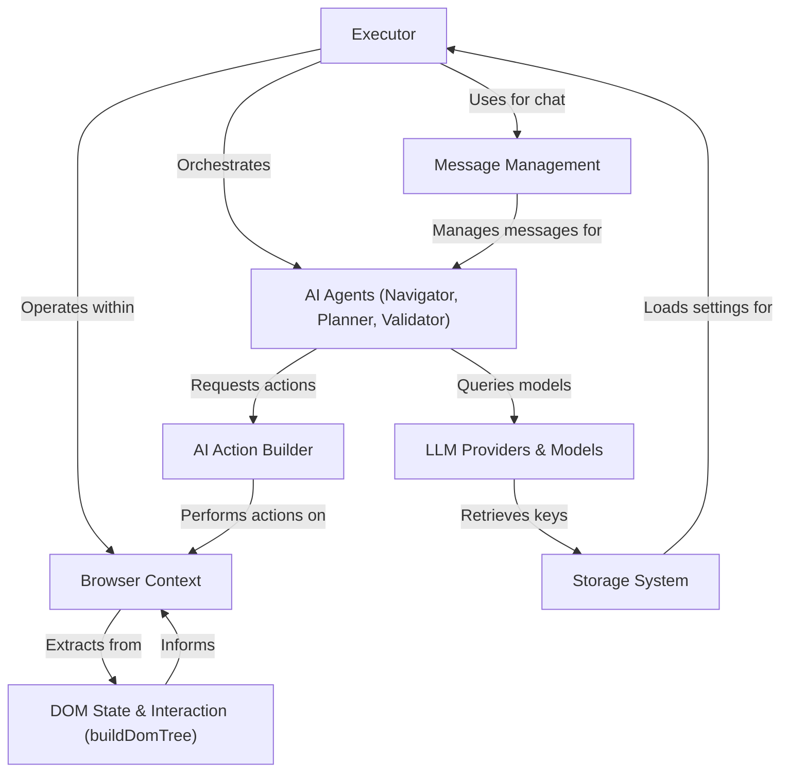

# Tutorial: nanobrowser

Nanobrowser is an **AI-powered web automation tool** that lives directly in your browser. It acts like a *smart assistant*, using AI to understand and interact with webpages to complete tasks you give it. Instead of complex coding, it *observes and executes web actions*, making web automation accessible and privacy-focused as it keeps your data local.

**Source Repository:** [https://github.com/nanobrowser/nanobrowser.git](https://github.com/nanobrowser/nanobrowser.git)

## Chapters

1. [Browser Context
](01_browser_context_.md)
2. [Executor
](02_executor_.md)
3. [Message Management
](03_message_management_.md)
4. [AI Agents (Navigator, Planner, Validator)
](04_ai_agents__navigator__planner__validator__.md)
5. [DOM State & Interaction (buildDomTree)
](05_dom_state___interaction__builddomtree__.md)
6. [AI Action Builder
](06_ai_action_builder_.md)
7. [LLM Providers & Models
](07_llm_providers___models_.md)
8. [Storage System
](08_storage_system_.md)

---

Generated by [AI Codebase Knowledge Builder](https://github.com/The-Pocket/Tutorial-Codebase-Knowledge)