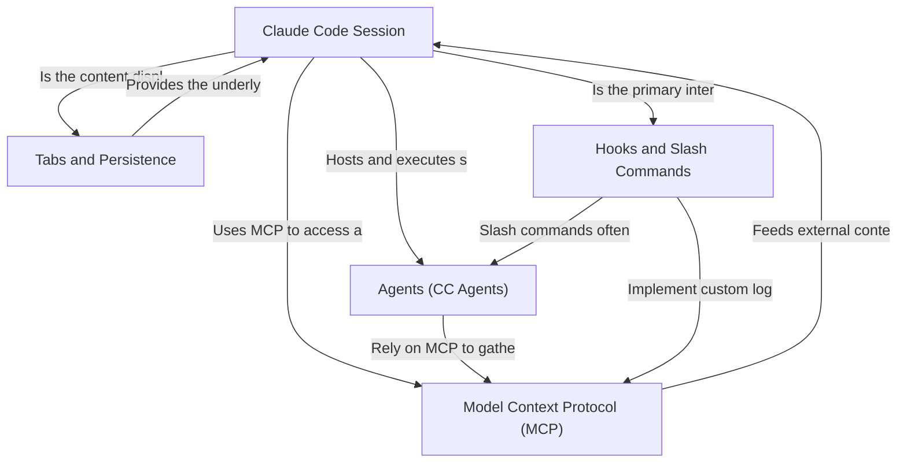

# Tutorial: opcode

Project "opcode" centers on building an enhanced developer workspace, the **Claude Code Session**, which acts as the core interactive terminal. It leverages specialized **Agents (CC Agents)** to automate repeatable tasks and uses a comprehensive **Tabs and Persistence** system to manage concurrent workflows. The entire system is highly customizable via **Hooks and Slash Commands** and integrates external tools through the **Model Context Protocol (MCP)** abstraction layer.


**Source:** https://github.com/winfunc/opcode



## Table of Contents

1. [Tabs and Persistence](#chapter-1-tabs-and-persistence)
2. [Claude Code Session](#chapter-2-claude-code-session)
3. [Agents (CC Agents)](#chapter-3-agents-cc-agents)
4. [Hooks and Slash Commands](#chapter-4-hooks-and-slash-commands)
5. [Model Context Protocol (MCP)](#chapter-5-model-context-protocol-mcp)

---

# Chapter 1: Tabs and Persistence

Welcome to the core of the Opcode user experience: the Tab System.

In this chapter, we will explore how Opcode manages multiple concurrent workspaces—like coding sessions, agent executions, and settings panels—and, crucially, how it remembers everything you were doing even after you close and reopen the application.

## 1.1 The Power of Tabs: Multi-tasking Made Easy

Imagine Opcode is like a modern web browser. You don't just open one website; you open many tabs for different tasks. Opcode uses this same mental model to allow you to work on several things at once without losing context.

### What Problem Does It Solve?

If you are debugging a project, running an AI agent, and checking your settings, you shouldn't have to navigate away from one task to start another. The tab system allows:

1.  **Context Switching:** Quickly jump between a live coding session and an agent's output log.
2.  **Organization:** Keep related tasks grouped and visible.
3.  **Efficiency:** Start a long-running process (like an agent) in one tab and continue working in another.

### How to Use Tabs

The **TabManager** component handles the visual presentation and interaction with tabs, typically found at the top of the main window.

| Action | How it Works | Example Tab Types |
| :--- | :--- | :--- |
| **Open Tab** | Click the **`+` (New Project)** button or initiate a task (like starting a new chat session). | `chat`, `agent-execution`, `projects`, `settings` |
| **Switch Tab** | Click on any tab in the tab bar. | |
| **Reorder Tab** | Click and drag a tab left or right. | |
| **Close Tab** | Click the **`X`** icon on the tab. | |

In the code, the `useTabState` hook provides simple functions for these actions:

```typescript
// src/hooks/useTabState.ts
// To create a new chat workspace:
const newTabId = createChatTab(projectId, "New Session");

// To close a specific tab:
closeTab(someTabId);

// To switch the active view:
switchToTab(anotherTabId);
```

## 1.2 Persistence: Never Lose Your Work

The most powerful feature of the tab system is its **persistence**. When you close Opcode, the application doesn't just forget you were working on five different things. It saves the entire state of your workspace.

### What Problem Does It Solve?

If your application crashes or you need to restart your computer, you would normally lose all unsaved work and the context of your open windows. Opcode's persistence ensures that upon restart, the application opens:

1.  **The exact same tabs** you had open.
2.  **The active tab** you were viewing.
3.  **The specific data** associated with each tab (e.g., the conversation history of a chat session).

### How Persistence Works (The Analogy)

Think of persistence as a trustworthy librarian who keeps track of every book you have checked out and exactly what page you were on.

1.  **The Librarian:** The `TabPersistenceService` and `SessionPersistenceService`.
2.  **The Shelf:** Your local storage (or local file system).
3.  **The Book:** A `Tab` object containing metadata (`title`, `type`, `sessionId`).
4.  **The Content:** The actual conversation data or file content.

The **`TabProvider`** is responsible for coordinating this process.

```typescript
// src/contexts/TabContext.tsx (Simplified initialization)
useEffect(() => {
    // 1. Load tabs from local storage
    const loadedTabs = TabPersistenceService.loadTabs();
    
    // 2. Set the state
    setTabs(loadedTabs.tabs);
    setActiveTabId(loadedTabs.activeTabId);
    isInitialized.current = true;
}, []);

// When tabs change, save them (debounced)
useEffect(() => {
    if (isInitialized.current) {
        // Save the current state to disk
        TabPersistenceService.saveTabs(tabs, activeTabId);
    }
}, [tabs, activeTabId]);
```

Every time you open, close, switch, or update a tab, the `TabProvider` silently updates the persistent storage, ensuring that the application state is always recoverable.

## 1.3 Internal Architecture: Providers and Hooks

The tab system relies on two main building blocks: the Context Provider and the Hook.

### 1. The TabContext and TabProvider

The `TabProvider` (in `src/contexts/TabContext.tsx`) wraps the entire application (see `src/App.tsx`) and holds the central state: the array of `tabs` and the `activeTabId`.

```tsx
// src/App.tsx
return (
    <ThemeProvider>
      <OutputCacheProvider>
        <TabProvider> {/* This makes tab state available everywhere */}
          <AppContent />
          <StartupIntro visible={showIntro} />
        </TabProvider>
      </OutputCacheProvider>
    </ThemeProvider>
  );
```

This provider also contains the core logic for adding, removing, and reordering tabs, and it integrates directly with the persistence services to load/save data.

### 2. The useTabState Hook

To interact with the tab system from any component, we use the `useTabState` hook (`src/hooks/useTabState.ts`). This hook simplifies the raw context functions into powerful, descriptive actions.

For example, instead of calling `context.addTab(...)`, you call:

```typescript
// Inside any component that needs to manage tabs
const { createProjectsTab, closeTab, activeTab } = useTabState();
```

This separation ensures that the components like `TabManager` (which displays the tab bar) and `TabContent` (which displays the content inside the active tab) remain clean and focused on presentation, while all the state management happens in the central context and hook.

---

# Chapter 2: The Claude Code Session

The **Claude Code Session** is the heart of Opcode, serving as your direct, interactive workspace with the Claude AI. Think of it as a super-powered terminal or a collaborative chat where Claude can not only talk to you but also take real-world actions like editing your code, running tests, or browsing the web.

## 2.1 The Problem: Bridging AI and Code Execution

Traditionally, using an AI for coding involves a lot of copying and pasting: you paste code into the chat, the AI suggests changes, and then you manually copy those changes back into your editor. This process is slow, error-prone, and breaks the flow of development.

**The Claude Code Session solves this by:**
1. **Giving Claude autonomy:** Claude can directly manipulate files and run commands within your project environment.
2. **Providing context:** The session maintains a complete history of your conversation and Claude's actions, so the AI always knows what happened before.
3. **Offering Control:** Features like checkpointing allow you to rewind and undo any action if Claude makes a mistake.

## 2.2 Anatomy of a Session

When you select a session from the `SessionList` (or start a new one), you enter the `ClaudeCodeSession`. This interface is primarily defined by the `src/components/ClaudeCodeSession.refactored.tsx` component.

It consists of three main elements:

### 1. The Message History (`MessageList`)

This is the central chat area where you see your prompts and Claude's responses. Crucially, Claude's responses are often structural, detailing the exact files it modified or the output of the commands it ran.

### 2. The Prompt Input (`FloatingPromptInput`)

Located at the bottom, this is where you type your instructions to Claude. This input supports rich features like slash commands (e.g., `/edit`, `/review`) to quickly tell Claude what to do.

### 3. The Timeline Navigator (`TimelineNavigator`)

This is your safety net. Every time Claude successfully completes an action (like editing a file), a **checkpoint** is created. The Timeline Navigator lets you browse these checkpoints, effectively allowing you to travel back in time to an earlier, stable state of your project.

## 2.3 Persistence and Resumption

One of the most important concepts is **persistence**.

**Analogy:** Imagine the session is a long-running video game save file.

*   You can close Opcode, open it later, and resume the session exactly where you left off.
*   All the message history, the current state of your code, and the checkpoints are saved to disk.

This is managed by the `Session` data structure, which is loaded when you click an entry in the `SessionList`.

In `src/components/ClaudeCodeSession.refactored.tsx`, the component takes a `session` object as a prop:

```typescript
interface ClaudeCodeSessionProps {
  session?: Session;
  // ... other props
}

export const ClaudeCodeSession: React.FC<ClaudeCodeSessionProps> = ({
  session,
  // ...
}) => {
  const [projectPath, setProjectPath] = useState(initialProjectPath || session?.project_path || "");
  // ...
  const { loadMessages } = useClaudeMessages(session?.id);
  // ...
```

The component uses the `session.id` to fetch the previous messages and checkpoints when it mounts, ensuring a seamless continuation of your work.

## 2.4 Checkpointing: Your Undo Button

Checkpoints are essential for safe, iterative coding with an AI.

The `useCheckpoints` hook in `src/components/ClaudeCodeSession.refactored.tsx` manages this functionality:

```typescript
// src/components/ClaudeCodeSession.refactored.tsx (snippet)
import { useCheckpoints } from "./claude-code-session/useCheckpoints";

// ... inside ClaudeCodeSession component
const {
    timelineVersion,
    handleUndo,
    handleRedo,
    handleFork, 
    // ...
} = useCheckpoints(claudeSessionId, session?.project_id);
```

*   **`timelineVersion`**: A counter that increments with every change, letting the UI know when to refresh.
*   **`handleUndo` / `handleRedo`**: These functions call the backend API (`api.undoSession`, `api.redoSession`) to revert or reapply changes to your local project files, based on the saved checkpoints.
*   **`handleFork`**: Allows you to create a *new* session branching off from a specific checkpoint, enabling parallel experimentation without disturbing the original work.

This system guarantees that no matter how complex or aggressive Claude's actions are, you always have a reliable way to revert to a previous state.

## 2.5 Real-Time Streaming Output

When Claude is actively working (e.g., running tests or applying a large code change), you don't want to wait for the entire process to finish. Opcode provides real-time feedback.

The `onStreamingChange` prop in `ClaudeCodeSession` is key to this:

```typescript
// src/components/ClaudeCodeSession.refactored.tsx (snippet)
interface ClaudeCodeSessionProps {
  // ...
  onStreamingChange?: (isStreaming: boolean, sessionId: string | null) => void;
}
```

This callback notifies the main application (`App.tsx`) whether the current session is receiving live data from Claude. This allows the UI to display indicators (like a spinning icon) and manage resources efficiently while the AI is computing.

---
**In Summary:** The Claude Code Session is an interactive, persistent, and highly controlled environment. It transforms Claude from a simple chat partner into an active, collaborative developer on your team, complete with a robust version control system baked into the conversation itself.

---

# Chapter 3: Agents (CC Agents)

Welcome to the power user level of `opcode`! In this chapter, we explore **Agents** (or CC Agents—Claude Code Agents), the feature that transforms your conversational AI tool into an automated, multi-step workflow machine.

## 3.1 The Agent Philosophy: Automation on Autopilot

Imagine you have a complex task, like "Review all my recent code changes, write a detailed commit message, and push it to GitHub." Doing this manually in a standard chat interface requires several back-and-forth prompts:

1.  "Show me my git diff."
2.  "Now, analyze the changes."
3.  "Draft a commit message following the Conventional Commits standard."
4.  "Now, execute the `git commit`."
5.  "Finally, run `git push`."

An **Agent** solves this by pre-packaging the entire workflow into a single, specialized persona.

### What Problem Do Agents Solve?

Agents take multi-step, specialized, and repeatable tasks and turn them into a single-click operation. They encapsulate:

1.  **A highly specific System Prompt:** The AI's identity and core purpose (e.g., "You are a ruthless Security Scanner.").
2.  **Required Tools:** Only the tools necessary for the job (e.g., a Git Commit Bot needs `Read` and `Write` file tools, but not necessarily network tools).
3.  **Default Model:** The best model for the job (e.g., Opus for complex security analysis, Sonnet for quick commits).

**Analogy:** If the standard chat interface is a Swiss Army Knife (versatile, but requires manual unfolding), an Agent is a specialized power tool (designed for one job, but executes it perfectly and quickly).

## 3.2 Using Agents

The `opcode` interface provides a dedicated **Agents** tab where you can manage, run, and create these specialized AI personas.

### 3.2.1 Running a Pre-Configured Agent

`opcode` comes with several built-in agents, such as the **Git Commit Bot** and the **Security Scanner**.

1.  **Select the Agent:** From the Agents list, click on the agent you wish to run (e.g., **Git Commit Bot**).
2.  **Define the Task:** The agent will present a simple input field. This is where you provide the core instruction, often called the "Default Task."

    *   **Example Input for Git Commit Bot:** "Analyze the staged changes and create a commit message."

3.  **Execute the Run:** Click the **Run** button. The agent takes over, executing its multi-step internal logic.

### 3.2.2 Monitoring Agent Execution

When an agent runs, the view switches to the **Agent Execution** screen (`AgentExecution.tsx`). This screen provides a real-time stream of the agent's actions:

*   **Tool Usage:** You'll see every time the agent decides to use a tool (like `Edit`, `Read`, or `RunCommand`). This provides transparency into the AI's "thought process."
*   **Sub-Agent Spawning:** Complex agents (like the Security Scanner) can spawn smaller, specialized sub-agents to handle specific parts of the task, making the process highly modular.

The output viewer handles various message types, ensuring clarity:

```typescript
// From src/components/AgentExecution.tsx
export interface ClaudeStreamMessage {
  type: "system" | "assistant" | "user" | "result";
  subtype?: string;
  // ... other fields
}
```

### 3.2.3 Viewing Run History

Every agent execution is logged and tracked. This is vital for auditing, debugging, and cost management.

1.  **Access History:** Agents have a **Run History** section.
2.  **View Details:** Clicking on a past run opens the `AgentRunView.tsx` component.
3.  **Metrics:** This view displays key performance indicators:
    *   **Duration:** How long the task took.
    *   **Tokens:** Total tokens consumed (input + output).
    *   **Cost:** Estimated cost in USD.

This historical tracking allows you to benchmark different agents or models for the same task.

## 3.3 Creating and Managing Your Own Agents

The true power of CC Agents lies in customization. You can create, edit, import, and export agents to share them with your team or the community.

### 3.3.1 Key Agent Configuration Fields

When creating an agent, you define its core behavior:

| Field | Description | Best Practice |
| :--- | :--- | :--- |
| **System Prompt** | The AI's identity and rules. | Be specific and mandate output format. |
| **Default Task** | The suggested input for the user. | A clear example of the agent's main function. |
| **Model** | Opus, Sonnet, or Haiku. | Use Opus for complex reasoning, Sonnet for general tasks. |
| **Tools** | Which external functions the agent can use. | Only enable necessary tools (e.g., Code, File IO). |
| **Icon** | A visual identifier (`bot`, `shield`, `code`). | Use the appropriate icon for quick identification. |

### 3.3.2 Import and Export

`opcode` uses a structured JSON format (`.opcode.json`) for agent definitions, making sharing simple.

*   **Export:** Serializes the agent configuration (prompt, model, tools) into a portable JSON file.
*   **Import:** Reads the JSON file, validates the structure, and adds the agent to your local database, ensuring version control and duplicate prevention.

This system is crucial for collaboration, allowing teams to maintain a shared library of specialized AI workflows.

## 3.4 Internal Architecture Spotlight

The Agent system is a sophisticated layer built on top of the core model interaction.

### The Execution Flow

When you click **Run**, the `AgentExecution.tsx` component orchestrates the process:

1.  **Configuration Loading:** The agent's static configuration (prompt, tools) is loaded from the SQLite database.
2.  **API Call:** A request is sent to the backend (Rust/Tauri) to initiate the stream.
3.  **Real-Time Streaming:** The backend executes the Claude API call and streams the response back to the frontend.
4.  **Frontend Rendering:** The `StreamMessage` component handles the rendering of different message types (tool calls, text, results), providing the rich, interactive output you see.

```typescript
// Simplified flow in AgentExecution.tsx
const startExecution = async () => {
    // 1. Prepare payload with agent details and user task
    // 2. Call the backend API
    await api.startAgentExecution({ agentId: agent.id, task: taskInput });
    // 3. Listen for streaming events from the backend
    unlisten = await listen("agent_stream_update", (event) => {
        // Update the messages state in real-time
        setMessages((prev) => [...prev, event.payload]);
    });
};
```

This streaming architecture ensures that even long-running, complex agent tasks feel responsive and provide immediate feedback.

---

# Chapter 4: Hooks and Slash Commands

The true power of an AI coding assistant lies not just in its ability to write code, but in its ability to seamlessly integrate into your existing development workflow. This is where **Hooks** and **Slash Commands** come in. They are the primary mechanisms for customizing and extending the AI's behavior, transforming it from a simple chat interface into a powerful, automated development partner.

## 4.1 Slash Commands: Your Custom AI Shortcuts

Imagine you frequently ask the AI to perform the same complex task, like "Review the last commit for security issues" or "Explain this complex function." Instead of typing out the full prompt every time, you can create a shortcut.

**Slash Commands** allow you to define a pre-configured prompt, tool permissions, and description, which you can trigger instantly using the `/` key.

### 4.1.1 What They Solve

Slash commands solve the problem of **repetition and inconsistency**. They ensure that complex, multi-step instructions are executed exactly the same way every time, improving reliability and saving you keystrokes.

### 4.1.2 Creating a Command: The `/review` Example

Let's create a simple command to review code.

1.  **Access the Manager:** Navigate to the Project Settings and select the "Slash Commands" tab.
2.  **Define the Command:**

| Field | Value | Description |
| :--- | :--- | :--- |
| **Name** | `review` | The command name (e.g., `/review`). |
| **Description** | `Review code for best practices` | What the command does. |
| **Prompt Content** | `Review the following code for best practices, potential issues, and improvements:\n\n@$ARGUMENTS` | The core instruction for the AI. |
| **Allowed Tools** | `Read`, `Grep` | Tools the AI can use (e.g., to read files). |

The key concept here is the placeholder **`@$ARGUMENTS`**. When you type `/review src/utils.ts`, the AI replaces `@$ARGUMENTS` with the text you typed after the command (`src/utils.ts`), allowing the command to be dynamic.

### 4.1.3 Using Slash Commands

In the main chat interface, simply type `/` to bring up the command picker:

```
/review src/components/HooksEditor.tsx
```

This instantly sends the full, structured prompt to the AI, instructing it to use its `Read` tool to examine the specified file and provide a thorough review.

## 4.2 Hooks: Automating Your Workflow

If Slash Commands are manual shortcuts, **Hooks** are automated triggers. They are shell commands that run automatically before or after the AI uses one of its internal tools (like `Edit` or `Write`).

**Analogy:** If the AI is a carpenter, a Hook is an automated quality control check. Every time the carpenter hammers a nail, a little machine runs to make sure the nail is straight.

### 4.2.1 What They Solve

Hooks ensure **code quality and workflow integration**. They allow you to integrate the AI's actions into existing developer tooling, such as:

*   **Pre-Edit:** Running a linter before the AI edits a file to provide context on existing style issues.
*   **Post-Edit:** Automatically running Prettier or ESLint after the AI completes a code change to ensure the new code conforms to project standards.

### 4.2.2 Hook Events

Hooks are triggered by specific events. The two most common are:

| Event | Trigger | Purpose |
| :--- | :--- | :--- |
| **PreToolUse** | Just before the AI executes a tool (e.g., `Edit`, `Write`). | Preparing the environment or providing context. |
| **PostToolUse** | Immediately after the AI successfully executes a tool. | Cleaning up, formatting, or running tests. |

### 4.2.3 Defining a Post-Edit Hook

Let's set up a hook to automatically format code using Prettier every time the AI modifies a file.

1.  **Select the Event:** Choose the `PostToolUse` tab in the Hooks Editor.
2.  **Define the Matcher:** Since we only care about code edits, we need to filter the tools. The matcher uses a glob pattern (like a simple regex) to select which tool names trigger the hook.

| Field | Value | Description |
| :--- | :--- | :--- |
| **Matcher** | `Edit*` | Triggers for `Edit`, `MultiEdit`, and any future tool starting with `Edit`. |

3.  **Define the Command:** This is the shell command that runs.

| Field | Value | Description |
| :--- | :--- | :--- |
| **Command** | `npx prettier --write $FILE_PATH` | Runs Prettier on the file the AI just edited. |

The placeholder **`$FILE_PATH`** is automatically replaced by the path of the file the AI just finished operating on.

### 4.2.4 Hook Scopes (Project vs. Local)

Hooks, like Slash Commands, can be defined in different scopes, which determines where they are stored and who they affect:

| Scope | Storage Location | Sharing | Use Case |
| :--- | :--- | :--- | :--- |
| **Project** | `.claude/settings.json` (Commit to Git) | Shared with the entire team. | Mandatory code formatting rules (Prettier/ESLint). |
| **Local** | `.claude/settings.local.json` (Git-ignored) | Only on your machine. | Personal debugging scripts or local environment setup. |

It is crucial to keep local settings out of version control, which is why the application often reminds you to add `.claude/settings.local.json` to your `.gitignore` file.

## 4.3 Under the Hood: The Manager

Both Hooks and Slash Commands rely on a central management system (`HooksManager` and `SlashCommandsManager`).

### 4.3.1 Hook Merging

Because hooks can be defined at the user, project, and local levels, the system must determine which ones to run. The `HooksManager` uses a merging strategy:

```typescript
// Priority: local > project > user
HooksManager.mergeConfigs(userConfig, projectConfig, localConfig);
```

For tool-related events (`PreToolUse`, `PostToolUse`), if two scopes define the same matcher pattern, the higher-priority scope (local) takes precedence. This allows you to temporarily override team-wide hooks for local testing.

### 4.3.2 Safety and Validation

Since hooks execute arbitrary shell commands, they pose a security risk. The `HooksManager` includes crucial validation steps:

1.  **Dangerous Pattern Check:** It scans commands for known dangerous patterns (e.g., `rm -rf /`, `curl | bash`) and issues warnings to the user.
2.  **Shell Injection Warnings:** It checks for unquoted shell variables (e.g., `$FILE_PATH` instead of `"$FILE_PATH"`) which could allow a malicious file name to inject code into the shell command.

These checks are essential to maintain a secure execution environment when running automated scripts.

```typescript
// Simplified check
const warnings = HooksManager.checkDangerousPatterns(commandString);

if (warnings.length > 0) {
    // Show security warning to user
}
```

---

# Chapter 5: Model Context Protocol (MCP)

In the previous chapters, we focused on how Claude Code helps you write and manage code projects locally. But what if your project needs to talk to the outside world? What if it needs to query a database, interact with a running service, or fetch real-time data from a custom API?

This is where the **Model Context Protocol (MCP)** comes in.

---

## 5.1 What is the Model Context Protocol (MCP)?

The Model Context Protocol (MCP) is an abstraction layer that allows Claude Code, and more specifically the underlying AI model, to securely and reliably interact with **external tools and services**.

Think of MCP as a universal translator and secure bridge:

*   **The Problem:** The AI model is powerful, but it's isolated. It can't natively run external programs, connect to networks, or access a database outside of its sandbox.
*   **The Solution (MCP):** MCP defines a standard way for you to define and configure these external tools (called "MCP Servers"). The AI knows how to communicate using the MCP standard, and Claude Code (the application) handles the secure execution and data transfer.

**Analogy:** If Claude Code is a brilliant chef, MCP is the network of delivery services and specialized suppliers (like a fishmonger or a spice importer) that the chef can call upon to get ingredients or perform specialized tasks that aren't done in the kitchen.

---

## 5.2 Using the MCP Manager

To manage these external connections, Claude Code provides the **MCP Manager**.

### 5.2.1 Accessing the Manager

In the main application, the `MCPManager` component is integrated into the user interface, typically accessible via a dedicated view or settings panel:

```tsx
// --- src/App.tsx (Simplified) ---
type View = 
  // ... other views
  | "mcp" // Dedicated view for MCP
  | "tabs"; 

function AppContent() {
  const [view, setView] = useState<View>("tabs");
  // ...
  
  if (view === "mcp") {
    return <MCPManager />; // Renders the MCP management interface
  }
  // ...
}
```

### 5.2.2 Adding a New Server

MCP currently supports two main methods for communication, or "transports":

1.  **Standard I/O (stdio):** Used for running local commands or scripts. The AI sends requests via standard input (stdin), and the tool sends responses via standard output (stdout).
2.  **Server-Sent Events (SSE):** Used for connecting to external web services or APIs that stream data over HTTP.

The `MCPAddServer` component handles the configuration for both:

```tsx
// --- src/components/MCPAddServer.tsx (Simplified) ---
const handleAddStdioServer = async () => {
  // 1. Collect configuration (name, command, args, environment variables)
  
  // 2. Call the API to register the server
  await api.mcpAddServer({
    name: stdioName,
    transport: "stdio",
    command: stdioCommand,
    args: stdioArgs.split(/\s+/).filter(a => a),
    env: // ... map environment variables
  });
  
  // 3. Notify success
  onServerAdded();
};
```

**Example: StdIO Server (Database Query Tool)**

Imagine you have a custom command-line tool named `db-connector` that queries your local development database.

| Field | Value | Description |
| :--- | :--- | :--- |
| **Name** | `Local Postgres` | How the AI will reference the tool. |
| **Command** | `/usr/local/bin/db-connector` | The executable path. |
| **Arguments** | `--config /path/to/db.conf` | Any required startup arguments. |
| **Scope** | `local` | Only available in the current project. |

When the AI decides it needs database access, it will use the MCP to send a request to `db-connector`, which then executes the query and returns the results to the AI.

---

## 5.3 Managing and Monitoring Servers

The `MCPServerList` component provides a view of all configured MCP servers, grouped by their scope (local, project, or user).

```tsx
// --- src/components/MCPServerList.tsx (Simplified) ---
export const MCPServerList: React.FC<MCPServerListProps> = ({ servers, onRefresh }) => {
  // Group servers by scope (local, project, user)
  const serversByScope = servers.reduce(/* ... grouping logic ... */);

  return (
    <div className="p-6">
      {/* Display refresh button */}
      <Button onClick={onRefresh}>Refresh</Button>
      
      {/* Iterate and display servers grouped by scope */}
      {Object.entries(serversByScope).map(([scope, scopeServers]) => (
        <div key={scope} className="space-y-3">
          {/* Display scope header (e.g., "Local (this project only)") */}
          {/* List all servers in this scope */}
          {scopeServers.map(renderServerItem)}
        </div>
      ))}
    </div>
  );
};
```

This list allows users to:

1.  **View Status:** See if the server is running or connected.
2.  **Test Connection:** Manually verify that the external tool is reachable.
3.  **Remove:** Delete the configuration if it's no longer needed.

---

## 5.4 Internal Implementation (The Bridge)

From a code perspective, the MCP system relies on the `api` layer to communicate with the application's backend service, which is responsible for the actual secure execution.

The core data structure is the `MCPServer` type:

```typescript
// --- src/lib/api.ts (Conceptual) ---
export interface MCPServer {
  name: string;
  transport: "stdio" | "sse"; // How to communicate
  scope: "local" | "project" | "user"; // Visibility
  status: "ready" | "error" | "running";
  // Specific configuration based on transport:
  command?: string; // For stdio
  url?: string; // For sse
}
```

When a user adds a server through `MCPAddServer`, the frontend calls:

```typescript
// Call to the backend through the API utility
await api.mcpAddServer(config); 
```

The application backend then securely stores this configuration and acts as the runtime environment. When the AI model generates a request for the `Local Postgres` tool, the backend intercepts this request, translates it into the appropriate command (`/usr/local/bin/db-connector ...`), executes it, captures the output, and feeds the result back to the AI.

This separation ensures that the AI remains safe within its environment while gaining access to real-world capabilities defined and controlled by the developer. MCP is the key to building complex, real-world applications with Claude Code.

---

Generated by [AI Codebase Knowledge Builder](https://github.com/The-Pocket/Tutorial-Codebase-Knowledge)
