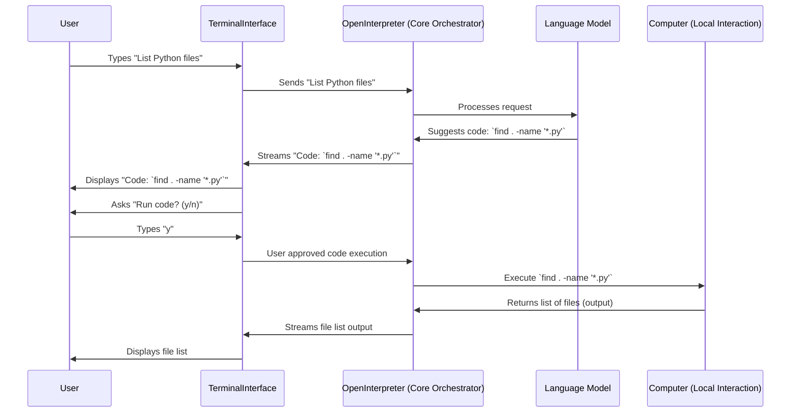

# Chapter 1: TerminalInterface (CLI User Interaction)

Welcome to the world of Open Interpreter! If you've ever wished you could just *tell* your computer what to do in plain English, you're in the right place. Open Interpreter acts as a bridge, letting a powerful AI control your computer to accomplish tasks you describe.

But how do you *talk* to this AI? That's where our first key concept comes in: the **TerminalInterface**.

Imagine you want to find out how many text files are on your Desktop. Instead of manually opening folders and counting, or writing a script, you want to ask Open Interpreter. The `TerminalInterface` is the "chat window" in your computer's terminal where this conversation happens.

## What is the TerminalInterface?

Think of the `TerminalInterface` (often called the CLI, or Command Line Interface) as the main dashboard or control panel for Open Interpreter. It's where:
1.  You type your instructions (like "How many text files are on my Desktop?").
2.  You see the AI's responses, thoughts, and questions.
3.  You see any code the AI wants to run on your computer.
4.  You see the results of that code.
5.  You can use special commands (we call them "magic commands") to control the session.

It's your primary way of interacting with Open Interpreter, all within the familiar environment of your terminal.

## Your First Conversation

Let's see it in action! First, you'll need to have Open Interpreter installed. Once it is, open your terminal and type:

```bash
interpreter
```

After a moment, you'll see a prompt, usually `> `. This is the `TerminalInterface` waiting for your command!

Let's try asking it a simple question:

```text
> What time is it?
```

Here's a simplified idea of what happens next:
1.  **You:** Type `What time is it?` and press Enter.
2.  **TerminalInterface:** Takes your message.
3.  **Open Interpreter (Behind the Scenes):** The AI figures out it needs to run some code to get the time. It might decide to use Python.
4.  **TerminalInterface:** Shows you the Python code the AI wants to run, for example:
    ```python
    import datetime
    print(datetime.datetime.now())
    ```
5.  **TerminalInterface:** Asks for your permission: `Would you like to run this code? (y/n)` (This happens if `auto_run` is not enabled, which is the default for safety).
6.  **You:** Type `y` and press Enter.
7.  **Open Interpreter (Behind the Scenes):** Runs the code.
8.  **TerminalInterface:** Shows you the output, for example:
    `2023-10-27 14:35:10.123456`
9.  **TerminalInterface:** Might also show a friendly message from the AI, like "The current time is 2023-10-27 14:35:10."

And just like that, you've had your first interaction! The `TerminalInterface` managed this whole conversation.

## Key Features of the TerminalInterface

Let's break down what the `TerminalInterface` does.

### 1. Taking Your Commands

When you see the `> ` prompt, the `TerminalInterface` is ready for your input. You just type your request and hit Enter.

```python
# Simplified from interpreter/terminal_interface/utils/cli_input.py
# This is a glimpse of how Open Interpreter gets your text

def get_user_input():
    message = input("> ") # Python's built-in way to ask for user input
    return message
```
The `input("> ")` function is the workhorse here, capturing whatever you type.

**Multi-line Messages:** Sometimes your instructions are long. You can type multi-line messages by starting and ending with `"""` (three double quotes):

```text
> """
Can you please do two things for me:
1. Tell me the current date.
2. List all Python files in my current directory.
"""
```
The `TerminalInterface` (using a helper function like `cli_input` from `interpreter/terminal_interface/utils/cli_input.py`) will gather all the lines until it sees the closing `"""`.

### 2. Displaying Responses

The `TerminalInterface` is responsible for showing you everything that's happening:
*   **AI Messages:** Friendly text, questions, or explanations from the AI are displayed directly.
*   **Code Blocks:** When the AI wants to run code, it's shown in a nicely formatted block, often with syntax highlighting.
*   **Code Output:** The results of running code (like the time in our example, or a list of files) are also displayed.

These are handled by components like `MessageBlock` for text and `CodeBlock` for code and its output, found in `interpreter/terminal_interface/components/`.

### 3. Managing the Session (Interactivity)

A crucial part of the `TerminalInterface` is making the process interactive and safe. The most common example is **code execution approval**.

By default, Open Interpreter won't run any code without asking you first.

```python
# Simplified from interpreter/terminal_interface/terminal_interface.py
# This snippet shows the confirmation logic

# if a chunk from the AI is a 'confirmation' request:
#   if not interpreter.auto_run: # If auto_run is False
#       code_to_run = chunk["content"]["content"] # Get the code
#       language = chunk["content"]["format"]
#       print(f"Code to run ({language}):\n{code_to_run}")
#       response = input("  Would you like to run this code? (y/n)\n\n  ")
#       if response.strip().lower() == "y":
#           # User approved! Proceed to tell the core to run it.
#           pass 
#       else:
#           # User declined. Inform the AI.
#           interpreter.messages.append({"role": "user", "content": "I declined."})
```
This interactive step is a key safety feature, and the `TerminalInterface` manages this dialogue. If you want to bypass this for every command, you can start Open Interpreter with the `-y` flag (e.g., `interpreter -y`), which sets `auto_run` to true.

### 4. Special "Magic Commands"

Sometimes you want to control Open Interpreter itself, not just tell it to do tasks. For this, we have "magic commands." These are special instructions for the `TerminalInterface` that always start with a percent sign (`%`) or double percent (`%%`).

Here are a few common ones:
*   `%help`: Shows a list of all available magic commands and what they do.
*   `%reset`: Clears the current conversation history and starts fresh. It's like hitting a reset button on your chat.
*   `%undo`: Removes the last thing you said and the AI's response to it. Useful if you make a typo or want to try a different approach.
*   `%verbose`: Toggles verbose mode. When on, you'll see more detailed internal logs about what Open Interpreter is doing.
*   `%% [shell_command]`: Runs a command directly in your system's shell (like `%% ls -l` on Linux/macOS or `%% dir` on Windows). The output is shown directly.

When you type a magic command, the `TerminalInterface` intercepts it before it goes to the AI.

```python
# Simplified from interpreter/terminal_interface/magic_commands.py

def handle_magic_command(interpreter_instance, user_input):
    command_text = user_input[1:] # Remove the '%'
    
    if command_text == "help":
        # Call a function to display help
        handle_help(interpreter_instance, "") 
    elif command_text == "reset":
        interpreter_instance.reset()
        interpreter_instance.display_message("> Reset Done")
    # ... and so on for other magic commands
    elif user_input.startswith("%%"):
        shell_command = user_input[2:].strip()
        # Code to run the shell_command using the Computer layer
        interpreter_instance.computer.run("shell", shell_command)
```
The `handle_magic_command` function (from `interpreter/terminal_interface/magic_commands.py`) acts like a dispatcher, figuring out which magic command you typed and running the appropriate action.

## How It Works Under the Hood (A Gentle Peek)

Let's visualize the basic flow when you interact with Open Interpreter through the `TerminalInterface`.

1.  **You type a message** (e.g., "List Python files in my downloads folder") or a magic command (e.g., `%reset`).
2.  The main loop in `interpreter/terminal_interface/terminal_interface.py` reads your input.
3.  **Magic Command?** If your input starts with `%`, the `handle_magic_command` function (from `interpreter/terminal_interface/magic_commands.py`) is called to process it directly. The flow might end here (e.g., after `%reset`).
4.  **Regular Command?** If it's a regular instruction, the `TerminalInterface` passes it to the [OpenInterpreter (Core Orchestrator)](02_openinterpreter__core_orchestrator__.md). This is the central "brain" of the system.
5.  The Core Orchestrator then communicates with a Large Language Model (LLM) via the [Llm (Language Model Interaction)](03_llm__language_model_interaction__.md) component.
6.  The LLM processes your request and sends back its thoughts, which might include text responses or code to execute.
7.  If there's code to run (e.g., to list files), the Core Orchestrator might use the [Computer (Local Machine Interaction Layer)](04_computer__local_machine_interaction_layer__.md) to actually run that code on your system.
8.  All these pieces – AI messages, code suggestions, confirmation prompts, code outputs – are streamed back through the Core Orchestrator to the `TerminalInterface`.
9.  The `TerminalInterface` then displays these pieces to you in a structured way.

Here's a simplified diagram of this interaction:



## Starting Open Interpreter with Options (CLI Arguments)

When you run `interpreter` from your command line, you can add various flags (arguments) to customize its behavior right from the start. For example:

*   `interpreter --model gpt-4o-mini`: Tells Open Interpreter to use the `gpt-4o-mini` language model.
*   `interpreter -y` or `interpreter --auto_run`: Enables "auto run" mode, so Open Interpreter will execute code without asking for your confirmation each time (use with caution!).
*   `interpreter --profile local`: Loads a specific configuration profile, in this case, one set up for local models. We'll learn more about [Profiles (Configuration Management)](06_profiles__configuration_management__.md) in a later chapter.

These arguments are parsed by the `start_terminal_interface` function in `interpreter/terminal_interface/start_terminal_interface.py`.

```python
# Simplified concept from interpreter/terminal_interface/start_terminal_interface.py

def start_terminal_interface(interpreter_instance):
    # Uses a library (argparse) to define and read command-line arguments
    # For example, if you run: interpreter -y --model gpt-4o-mini

    # args.auto_run would be True
    if parsed_args.auto_run:
        interpreter_instance.auto_run = True
    
    # args.model would be "gpt-4o-mini"
    if parsed_args.model:
        interpreter_instance.llm.model = parsed_args.model
        
    # ... other arguments are processed ...

    # Finally, start the chat loop
    interpreter_instance.chat() 
```
These command-line arguments allow you to fine-tune how the `TerminalInterface` and the entire Open Interpreter system behave for your session.

## Conclusion

The `TerminalInterface` is your gateway to the power of Open Interpreter. It's more than just a simple input/output screen; it's an interactive environment that manages your conversation with the AI, handles code execution safely, and provides helpful tools like magic commands. You've seen how it takes your requests, shows you what the AI is doing, and helps you manage the whole process.

Now that you understand *how* you communicate with Open Interpreter, you might be wondering what's happening just beyond that interface. What coordinates the AI, the code execution, and all the other pieces? That's the job of the [OpenInterpreter (Core Orchestrator)](02_openinterpreter__core_orchestrator__.md), which we'll explore in the next chapter!

---

Generated by [AI Codebase Knowledge Builder](https://github.com/The-Pocket/Tutorial-Codebase-Knowledge)