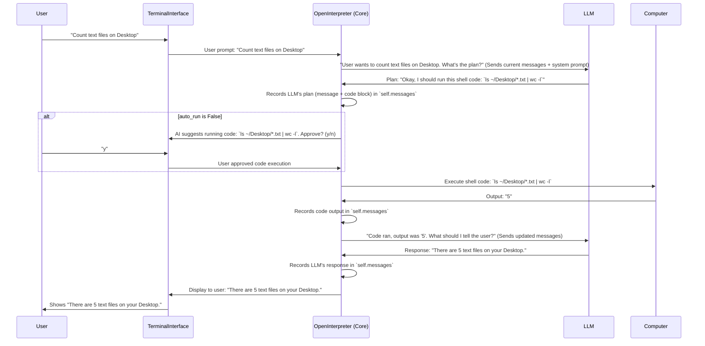

# Chapter 2: OpenInterpreter (Core Orchestrator)

In [Chapter 1: TerminalInterface (CLI User Interaction)](01_terminalinterface__cli_user_interaction__.md), we learned how you, the user, can talk to Open Interpreter using the command line. You type your requests, see what the AI is thinking, approve code, and view results, all within your terminal.

But who is actually "thinking"? Who decides what to do with your request like "How many text files are on my Desktop?" Who coordinates between the AI's brain and your computer's ability to *do* things?

That's where the **OpenInterpreter (Core Orchestrator)** comes in. It's the main brain of the entire operation, the project manager that makes everything work together.

## What is the OpenInterpreter (Core Orchestrator)?

Imagine you're managing a complex project. You have a brilliant strategist (the Language Model or LLM) who can come up with plans, and you have a skilled worker (the Computer) who can execute tasks. Your job as the project manager is to:
1.  Receive the overall goal (your prompt from the [TerminalInterface (CLI User Interaction)](01_terminalinterface__cli_user_interaction__.md)).
2.  Discuss the goal with the strategist (LLM) to break it down into actionable steps, possibly involving code.
3.  If code needs to be run, pass it to the worker (Computer).
4.  Get the results from the worker (Computer) and show them to the strategist (LLM) for review or further planning.
5.  Keep track of the entire conversation and all actions taken.
6.  Communicate progress and final results back to whoever gave you the goal.

The `OpenInterpreter` class (often just called `interpreter` in the code) is exactly this project manager. It's the central hub connecting the [TerminalInterface (CLI User Interaction)](01_terminalinterface__cli_user_interaction__.md), the [Llm (Language Model Interaction)](03_llm__language_model_interaction__.md), and the [Computer (Local Machine Interaction Layer)](04_computer__local_machine_interaction_layer__.md).

Let's revisit our example: "How many text files are on my Desktop?"
*   You type this into the [TerminalInterface (CLI User Interaction)](01_terminalinterface__cli_user_interaction__.md).
*   The `TerminalInterface` passes this task to the `OpenInterpreter` (our project manager).
*   The `OpenInterpreter` then takes charge of getting it done.

## How the Orchestrator Works: A High-Level View

When you give `OpenInterpreter` a task, it doesn't just blindly execute commands. It intelligently coordinates between different components:

1.  **Receives Your Prompt:** The `OpenInterpreter` gets your request (e.g., "Count text files on Desktop") from the `TerminalInterface`.
2.  **Consults the Language Model (LLM):** It sends your prompt, along with the conversation history and some general instructions, to a powerful [Llm (Language Model Interaction)](03_llm__language_model_interaction__.md). The LLM thinks about your request and might say, "To do that, we should run this shell command: `ls ~/Desktop/*.txt | wc -l`".
3.  **Handles Code:**
    *   The `OpenInterpreter` receives this code suggestion from the LLM.
    *   If you haven't enabled `auto_run`, it will use the `TerminalInterface` to show you the code and ask for your approval (`y/n`).
4.  **Interacts with Your Computer:**
    *   Once approved (or if `auto_run` is on), the `OpenInterpreter` passes the code to the [Computer (Local Machine Interaction Layer)](04_computer__local_machine_interaction_layer__.md). This component is responsible for actually running the code on your machine.
    *   The `Computer` executes the command and gets the output (e.g., "5").
5.  **Relays Results & Iterates:**
    *   The `OpenInterpreter` takes the output ("5") from the `Computer` and usually sends it *back* to the LLM, saying something like, "The command ran and the output was '5'. What should we tell the user?"
    *   The LLM then formulates a user-friendly response, like, "There are 5 text files on your Desktop."
6.  **Displays Final Answer:** The `OpenInterpreter` sends this final message to the `TerminalInterface` to show it to you.

This back-and-forth between the LLM and the Computer, managed by `OpenInterpreter`, continues until your task is complete.

## Key Responsibilities and Structure

The `OpenInterpreter` object is the heart of the system. Let's look at how it's set up and how it manages its duties.

### 1. Initialization: Setting up the Project Manager

When Open Interpreter starts (for example, when you type `interpreter` in your terminal), an `OpenInterpreter` object is created. This is like hiring your project manager and giving them their tools.

```python
# Simplified from interpreter/core/core.py

# These are other important parts we'll learn about soon!
from interpreter.core.llm import Llm 
from interpreter.core.computer import Computer

class OpenInterpreter:
    def __init__(self, auto_run=False, model_name="gpt-4o-mini", system_message="You are a helpful assistant..."):
        self.messages = []  # This list will store the entire conversation history
        self.auto_run = auto_run  # Should code run without asking for 'y/n'?
        
        # The "thinking" part: our connection to the Language Model
        self.llm = Llm(self) # We'll explore Llm in Chapter 3!
        self.llm.model = model_name # Tells the Llm which specific AI model to use
        
        # The "doing" part: our connection to the Computer
        self.computer = Computer(self) # We'll explore Computer in Chapter 4!
        
        # Initial instructions for the LLM (like a job description for the AI)
        self.system_message = system_message 
        
        # ... many other settings like max_output, safe_mode, etc. ...

# When Open Interpreter starts, an instance of this class is created:
# This line is conceptually what happens from interpreter/__init__.py
interpreter_instance = OpenInterpreter() 
```

In this setup:
*   `self.messages`: An empty list that will keep track of everything said by you, by the AI, any code generated, and any code output. It's the official record of the "project."
*   `self.auto_run`: A flag telling the manager if they need to ask for permission before running any code.
*   `self.llm`: An object that handles all communication with the [Llm (Language Model Interaction)](03_llm__language_model_interaction__.md). The `OpenInterpreter` tells this object what to ask the AI.
*   `self.computer`: An object that handles running code on your local machine via the [Computer (Local Machine Interaction Layer)](04_computer__local_machine_interaction_layer__.md).
*   `self.system_message`: A special message sent to the LLM at the very beginning of a conversation to set the context, telling it how it should behave (e.g., "You are Open Interpreter, an AI that can control a computer...").

### 2. Receiving a Task: The `.chat()` Method

Once the `OpenInterpreter` (our project manager) is set up, it's ready to receive tasks. This typically happens through its `chat()` method.

```python
# Simplified from interpreter/core/core.py
class OpenInterpreter:
    # ... (init method from above) ...

    def chat(self, user_prompt_text):
        # 1. Add the user's new request to our conversation history
        new_message = {"role": "user", "type": "message", "content": user_prompt_text}
        self.messages.append(new_message)

        # 2. Start the main thinking and acting loop (the core of the orchestrator)
        # This method will coordinate with the LLM and Computer.
        # The actual implementation streams results piece by piece.
        # For simplicity here, let's say it handles the full exchange.
        self._start_orchestration_loop() 

        # 3. After the loop finishes, self.messages contains the whole exchange.
        # We can return the new messages generated (AI replies, code, output).
        return self.messages[len(self.messages) - (len(self.messages) - initial_message_count):] # Return new messages
```
When `TerminalInterface` gets your prompt (e.g., "How many text files...?"), it calls `interpreter_instance.chat("How many text files...?")`.
The `chat` method first records your message and then kicks off the main orchestration process.

### 3. The Core Orchestration Loop: `_start_orchestration_loop()`

This is where the project manager truly shines. The `_start_orchestration_loop()` method (a conceptual name for the logic primarily found in `interpreter/core/respond.py`) is a cycle that continues until your task is done.

Here's a simplified step-by-step of what this loop does:



Let's look at the logic conceptually, as the actual code in `interpreter/core/respond.py` is quite detailed to handle streaming and various edge cases.

```python
# Highly simplified conceptual view of the loop in interpreter/core/respond.py
# The real 'respond' function in Open Interpreter is a generator that yields information piece by piece.

class OpenInterpreter:
    # ... (init and chat methods) ...

    def _start_orchestration_loop(self): # Represents logic in interpreter/core/respond.py
        while True: # Keep working until the main task is resolved
            # 1. Prepare all messages for the LLM
            # This includes your system_message and the entire conversation history (self.messages)
            messages_to_send_to_llm = self._prepare_messages_for_llm()

            # 2. Send to the LLM for its next thought/action
            # (This is handled by self.llm, see Chapter 3)
            llm_response_chunks = self.llm.run(messages_to_send_to_llm) 
            
            # The LLM responds in chunks. We gather them into a complete message.
            # This message could be simple text, or it could contain code.
            full_llm_message = self._accumulate_llm_chunks(llm_response_chunks)
            self.messages.append(full_llm_message) # Add LLM's response to history

            if "code" in full_llm_message: # Did the LLM provide code?
                code_details = full_llm_message["code"] # e.g., {"language": "python", "content": "print('Hello')"}
                
                # (If not self.auto_run, TerminalInterface would ask for 'y/n' confirmation here)
                # For simplicity, let's assume approval or auto_run is true.

                # 3. Execute the code using the Computer
                # (This is handled by self.computer, see Chapter 4)
                code_output_chunks = self.computer.run(code_details["language"], code_details["content"])
                
                full_code_output = self._accumulate_computer_chunks(code_output_chunks)
                self.messages.append(full_code_output) # Add code output to history
                
                # Now that code has run, we usually loop back to tell the LLM the results.
                # The 'while True' will take care of this.
            
            elif "The task is done" in full_llm_message.get("content", ""):
                # If LLM indicates the task is finished, we can stop.
                break
            else:
                # If it's just a text message from the LLM, and not the end,
                # the loop will continue, effectively waiting for your next prompt or
                # if the LLM was expecting further internal steps.
                # In a typical chat, if the LLM just sends a message, it then waits for the user.
                break # For simplicity in this conceptual loop, we break. Real OI might wait.
```

**Key takeaways from this loop:**
*   **It's iterative:** The `OpenInterpreter` goes back and forth between "thinking" (LLM) and "doing" (Computer).
*   **Message-driven:** Everything is tracked in `self.messages`. This history is crucial for the LLM to have context.
*   **Component-based:** It delegates tasks: `self.llm` for AI communication, `self.computer` for code execution.
*   **User-in-the-loop (optional):** Through `auto_run` and the `TerminalInterface`, you can control code execution.

The actual `respond` function in `interpreter/core/respond.py` is a Python generator. This means it `yields` information piece by piece (like individual words of an AI message, or lines of code output) rather than returning everything at once. This is what allows the [TerminalInterface (CLI User Interaction)](01_terminalinterface__cli_user_interaction__.md) to display information in real-time, making it feel like a conversation.

## Why is this Orchestration Important?

Without a central orchestrator like the `OpenInterpreter` class:
*   There would be no way to decide when to talk to the AI versus when to run code.
*   Managing the conversation history and providing context to the AI would be chaotic.
*   Coordinating safety features like asking for permission to run code would be difficult.
*   Integrating new capabilities (like different AIs or new tools for the computer) would be much harder.

The `OpenInterpreter` provides a clean, organized way to manage the complex interactions required to let an AI control your computer. It's the glue that holds all the other pieces together.

## Conclusion

The `OpenInterpreter` class is the true "project manager" of the Open Interpreter system. It takes your high-level goals, consults with a powerful Language Model for a plan, interacts with your computer to execute parts of that plan, and keeps everything organized. It's the central coordinator that enables a seamless flow from your plain English requests to tangible actions on your computer.

You've now seen how you talk to Open Interpreter via the [TerminalInterface (CLI User Interaction)](01_terminalinterface__cli_user_interaction__.md) and how the `OpenInterpreter` core orchestrates the main process. But how exactly does it "talk" to the AI? What happens inside that `self.llm.run()` call? That's what we'll explore in the next chapter: [Llm (Language Model Interaction)](03_llm__language_model_interaction__.md).

---

Generated by [AI Codebase Knowledge Builder](https://github.com/The-Pocket/Tutorial-Codebase-Knowledge)