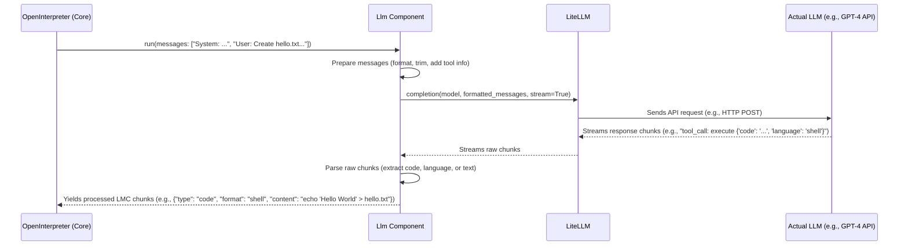

# Chapter 3: Llm (Language Model Interaction)

In the [previous chapter on the OpenInterpreter (Core Orchestrator)](02_openinterpreter__core_orchestrator__.md), we learned about the "project manager" that coordinates everything within Open Interpreter. It takes your requests, figures out a plan, and gets things done. A big part of "figuring out a plan" involves consulting a "strategist" – a powerful AI.

But how does the Core Orchestrator actually *talk* to this AI strategist? If the AI is like a brilliant thinker who only speaks a specific, highly structured language (or several different ones, depending on which AI you're using!), you need a specialized communicator. That's where the **Llm (Language Model Interaction)** component comes in.

## The "Brain's Communicator": Why We Need the `Llm` Component

Imagine you want Open Interpreter to "write a Python script that renames all .jpg files in my Pictures folder to include today's date."
The [OpenInterpreter (Core Orchestrator)](02_openinterpreter__core_orchestrator__.md) knows it needs an AI to figure out *how* to write that script. But:
*   How should it phrase the request to the AI (like GPT-4, Claude, or a local model via Ollama)?
*   How does it send this request over the internet (or locally) to the AI?
*   How does it understand the AI's response, especially if the AI wants to provide code?
*   What if you switch from using GPT-4 to a different AI model? Does everything break?

The `Llm` component is designed to solve these problems. Think of it as a highly skilled **translator and diplomat** for the Core Orchestrator. It knows:
1.  How to format your requests so the chosen AI can understand them.
2.  The specific "protocols" for talking to different AI providers.
3.  How to receive the AI's thoughts (which might be text, or a structured request to run code) and present them in a way the Core Orchestrator can use.

Without the `Llm` component, the Core Orchestrator would need to know the nitty-gritty details of every AI model and API out there, which would be incredibly complex!

## What is a Large Language Model (LLM)? (A Quick Refresher)

Before we dive into Open Interpreter's `Llm` component, let's quickly remember what a Large Language Model (LLM) is. An LLM (like GPT-4, Llama, Claude, Gemini, etc.) is an AI that's been trained on a massive amount of text and code. It's excellent at:
*   Understanding human language.
*   Generating human-like text.
*   Writing code.
*   Answering questions.
*   Summarizing information.
*   And much more!

In Open Interpreter, the LLM is the "thinking" part. It doesn't *do* things on your computer directly, but it *figures out what to do* and often *writes the code* to do it.

## Meet the `Llm` Component in Open Interpreter

The `Llm` class in Open Interpreter (found primarily in `interpreter/core/llm/llm.py`) is a dedicated module responsible for all interactions with the chosen LLM.

Its main jobs are:
*   **Sending Requests:** Taking the conversation history and the current user request (prepared by the Core Orchestrator) and sending it to the configured LLM.
*   **Receiving Responses:** Capturing what the LLM sends back. This could be a simple text message, or it could be a structured "function call" or "tool call" asking Open Interpreter to execute some code.
*   **Provider Agnostic:** Using a library called `LiteLLM`, it can talk to a wide variety of LLM providers (OpenAI, Azure, Anthropic, local models via Ollama, and many more) without the Core Orchestrator needing to know the specific details of each one.
*   **Formatting and Parsing:** Ensuring messages are in the right format for the LLM, and then parsing the LLM's response back into a format Open Interpreter can use (like extracting code blocks).

When the [OpenInterpreter (Core Orchestrator)](02_openinterpreter__core_orchestrator__.md) needs to "think" or get instructions from the AI, it turns to its `Llm` instance.

```python
# Simplified from interpreter/core/core.py (OpenInterpreter's __init__)

from interpreter.core.llm import Llm # Importing the Llm class

class OpenInterpreter:
    def __init__(self):
        # ... other initializations ...
        
        # Each OpenInterpreter instance has its own Llm instance
        self.llm = Llm(self) # 'self' here is the OpenInterpreter instance
        self.llm.model = "gpt-4o-mini" # Example: Set the default AI model
        
        # ... other initializations ...
```
In this snippet, when an `OpenInterpreter` object is created, it also creates an `Llm` object, storing it in `self.llm`. This `self.llm` object will handle all future AI communications.

## How Open Interpreter Uses the `Llm` Component

The primary way the Core Orchestrator interacts with the `Llm` component is through the `Llm.run()` method.

1.  **Prepare Messages:** The Core Orchestrator gathers all the messages in the current conversation (your prompts, previous AI responses, code outputs, etc.) and the "system message" (which tells the AI its role and how to behave).
2.  **Call `llm.run()`:** It passes these messages to `self.llm.run(messages)`.
3.  **Process Streamed Output:** The `Llm.run()` method doesn't return everything at once. It *streams* the LLM's response back in small chunks. This is why you see the AI's messages appearing word by word in the terminal. These chunks can be pieces of text or parts of a code block.

```python
# Simplified conceptual view of how OpenInterpreter uses Llm
# (Actual logic is in interpreter/core/respond.py)

class OpenInterpreter:
    # ... (init method from above) ...

    def _get_ai_response(self):
        messages_for_llm = self._prepare_messages_for_llm() # Gathers history, system prompt
        
        # The Llm component does the heavy lifting here!
        response_chunks = self.llm.run(messages_for_llm) # This is a generator
        
        for chunk in response_chunks:
            # 'chunk' could be {'type': 'message', 'content': 'Hello!'}
            # or {'type': 'code', 'format': 'python', 'content': 'print("Hi")'}
            self._process_ai_chunk(chunk) # Display it, or prepare to run code
```
The Core Orchestrator doesn't need to know if it's talking to GPT-4, Claude, or a local Ollama model. It just gives the messages to `self.llm.run()` and gets back standardized chunks of information.

## Key Features Handled by the `Llm` Component

Let's look at some important tasks the `Llm` component manages:

### 1. Message Formatting: Speaking the AI's Language

Different LLMs (and even different ways of using the same LLM, like with or without function calling) expect messages in a specific format. For example, OpenAI's API expects a list of message objects, each with a "role" (like "system", "user", or "assistant") and "content".

The `Llm` component uses helper functions, primarily `convert_to_openai_messages` (from `interpreter/core/llm/utils/convert_to_openai_messages.py`), to transform Open Interpreter's internal message list into the format required by the target LLM.

```python
# Conceptual: What convert_to_openai_messages helps achieve
# (Actual function is more complex)

def convert_my_messages_to_llm_format(internal_messages):
    llm_api_messages = []
    for msg in internal_messages:
        if msg["type"] == "user_prompt":
            llm_api_messages.append({"role": "user", "content": msg["text"]})
        elif msg["type"] == "ai_response":
            llm_api_messages.append({"role": "assistant", "content": msg["text"]})
        # ... and handles code, function calls, system messages, images etc.
    return llm_api_messages
```
This conversion ensures the AI gets the information in a way it can easily process. It also handles special content like images, converting them to a format the LLM can "see" if it's a vision-capable model.

### 2. Provider Abstraction (via LiteLLM): One Interface, Many AIs

You can tell Open Interpreter to use various LLMs from different providers (OpenAI, Anthropic, Google) or local models (via Ollama, LM Studio). The `Llm` component achieves this flexibility by using a fantastic library called `LiteLLM`.

`LiteLLM` acts as a standardized interface to over 100 different LLM APIs. The `Llm` component tells `LiteLLM` *which* model it wants to use (e.g., `"gpt-4o-mini"`, `"ollama/llama3"`, `"claude-3-opus"`), and `LiteLLM` handles the specific API calls, authentication, and other details for that provider.

```python
# Simplified from interpreter/core/llm/llm.py (inside Llm.run)
# Shows conceptual use of LiteLLM by the Llm component

import litellm # The magic library for talking to many LLMs

class Llm:
    # ... (other Llm methods) ...
    def run(self, messages):
        # ... (message preparation) ...
        
        params_for_litellm = {
            "model": self.model, # e.g., "gpt-4o-mini" or "ollama/llama3"
            "messages": formatted_messages, # Prepared by convert_to_openai_messages
            "stream": True, # We want responses chunk by chunk
            # ... other settings like temperature, api_key, api_base ...
        }
        
        # LiteLLM handles the actual call to the LLM provider
        response_stream = litellm.completion(**params_for_litellm)
        
        for chunk in response_stream:
            # Process 'chunk' and yield it in Open Interpreter's format
            # ... (parsing logic) ...
            yield processed_chunk 
```
This is a huge benefit! It means Open Interpreter can easily support new LLMs as `LiteLLM` adds support for them, without needing major changes in Open Interpreter's own code.

### 3. Function/Tool Calling vs. Text Prompts: Getting Structured Code

Modern LLMs often support "function calling" or "tool calling." This is a way for the LLM to not just respond with text, but to ask the application (Open Interpreter, in this case) to run a specific function with specific arguments. Open Interpreter uses this so the LLM can say, "Please execute this Python code: `print('Hello')`" in a structured way.

The `Llm` component, in conjunction with files like `interpreter/core/llm/run_tool_calling_llm.py` (or `run_function_calling_llm.py` for older OpenAI models), handles this:
*   It tells the LLM about the `execute` function that Open Interpreter provides (which can run code in different languages).
*   When the LLM responds with a "tool call" to `execute`, these scripts parse out the language and the code.

If an LLM *doesn't* support tool calling, Open Interpreter falls back to a text-based approach using `interpreter/core/llm/run_text_llm.py`. In this mode, the LLM is instructed to write code inside Markdown code blocks (e.g., ```python ... ```), and `run_text_llm.py` extracts the language and code from these blocks.

The `Llm.run()` method intelligently detects if the configured model supports tool/function calling and uses the appropriate strategy.

### 4. Context Management: Keeping the AI Focused (and Saving Costs!)

LLMs have a "context window" – a limit on how much text (conversation history + current prompt) they can consider at once. If the conversation gets too long, you can't send the whole thing.

The `Llm` component uses a library called `tokentrim` to intelligently shorten the conversation history if it exceeds the model's context window, usually by removing older messages while trying to preserve the most important information (like the system message and recent interactions). This is crucial for long conversations and also helps manage costs, as most LLM APIs charge based on the amount of text processed. This happens within the `Llm.run()` method before calling `litellm.completion()`.

## Under the Hood: A Call to the AI

Let's trace a simplified path of your request, "Create a file named hello.txt with 'Hello World' inside," once it reaches the `Llm` component.



**Step-by-step:**
1.  **Core Orchestrator calls `Llm.run()`:** It passes the current conversation history and system prompt.
2.  **`Llm` Prepares:**
    *   It uses `convert_to_openai_messages` to get messages into the right structure.
    *   It ensures the messages fit within the LLM's context window using `tokentrim`.
    *   It adds information about the `execute` tool if the LLM supports tool calling.
    *   (From `llm.py`): It checks if the model is loaded (e.g., for local Ollama models, it might need to ensure the model is pulled and running).
3.  **`Llm` calls `litellm.completion()`:** It passes the model name, formatted messages, and other parameters (like `stream=True`, API keys if needed, etc.) to `LiteLLM`.
4.  **`LiteLLM` Does its Magic:** `LiteLLM` identifies the provider based on the model name, constructs the correct API request for that specific provider, and sends it.
5.  **LLM Responds:** The actual LLM processes the request and starts streaming back its response (e.g., a decision to call the `execute` tool with shell code).
6.  **`LiteLLM` Streams Back:** `LiteLLM` receives these raw chunks and passes them back to the `Llm` component.
7.  **`Llm` Parses and Yields:**
    *   The `Llm` component (using helpers like `run_tool_calling_llm.py` or `run_text_llm.py`) processes these raw chunks.
    *   If it's a tool call for `execute`, it extracts the language and code.
    *   If it's a plain text response, it extracts the text.
    *   It then `yields` these processed pieces in Open Interpreter's standard "Language Model Conversation" (LMC) format (e.g., `{'type': 'code', 'format': 'shell', 'content': "echo 'Hello World' > hello.txt"}`) back to the Core Orchestrator.

This entire process ensures that the Core Orchestrator can communicate effectively with a wide range of LLMs without getting bogged down in the specific implementation details of each one.

```python
# Highly simplified snippet from Llm.run() in interpreter/core/llm/llm.py
# Illustrating the call to litellm and processing

class Llm:
    def run(self, messages):
        # 1. Prepare messages (conversion, trimming)
        openai_messages = convert_to_openai_messages(messages, ...) 
        trimmed_messages = tokentrim.trim(openai_messages, ...)
        
        request_params = {
            "model": self.model,
            "messages": trimmed_messages,
            "stream": True,
            # ... other params like api_key, temperature ...
        }

        # 2. Call LiteLLM
        llm_response_stream = self.completions(**request_params) # self.completions uses litellm.completion

        # 3. Process the stream (delegating to helper functions)
        if self.supports_functions: # Does the model support tool/function calls?
            # Uses run_tool_calling_llm to parse structured code calls
            yield from run_tool_calling_llm(self, request_params) 
        else:
            # Uses run_text_llm to parse code from Markdown blocks
            yield from run_text_llm(self, request_params)
```
The `run_tool_calling_llm` and `run_text_llm` functions are responsible for interpreting the specific format of the LLM's output and converting it into the LMC chunks that the rest of Open Interpreter understands.

## Conclusion

The **Llm (Language Model Interaction)** component is Open Interpreter's skilled diplomat and translator, enabling smooth and flexible communication with the AI "brain." It handles the complexities of different AI models and APIs, message formatting, and context management, primarily by leveraging the power of `LiteLLM`. This allows the [OpenInterpreter (Core Orchestrator)](02_openinterpreter__core_orchestrator__.md) to focus on the high-level task of managing the conversation and actions, rather than the specifics of AI communication.

So, the AI has now (via the `Llm` component) suggested some code to run. For example, it might suggest `echo 'Hello World' > hello.txt`. How does this code actually get executed on your computer? That's the job of our next component: the [Computer (Local Machine Interaction Layer)](04_computer__local_machine_interaction_layer__.md).

---

Generated by [AI Codebase Knowledge Builder](https://github.com/The-Pocket/Tutorial-Codebase-Knowledge)