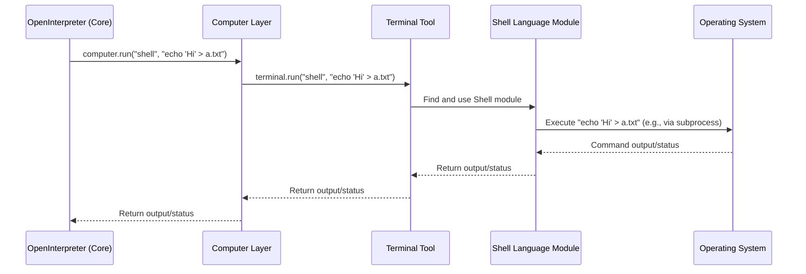

# Chapter 4: Computer (Local Machine Interaction Layer)

In [Chapter 3: Llm (Language Model Interaction)](03_llm__language_model_interaction__.md), we saw how Open Interpreter uses a Large Language Model (LLM) as its "brain." The LLM is brilliant at understanding your requests and figuring out *what* needs to be done, often by suggesting code.

But how does that suggested code actually run? If the LLM says, "Create a file named `my_notes.txt` and write 'Hello Open Interpreter!' into it," what part of Open Interpreter actually *does* the creating and writing?

That's where the **Computer (Local Machine Interaction Layer)** comes in. This is the "hands and feet" of Open Interpreter, allowing it to interact with your actual computer.

## What is the Computer Layer? The Universal Remote for Your PC

Imagine you have a super-smart assistant (the LLM) who can tell you exactly which buttons to press on a universal remote control to get your TV, sound system, and lights to do what you want. The **Computer** layer in Open Interpreter is like that universal remote.

It's a collection of tools that the [OpenInterpreter (Core Orchestrator)](02_openinterpreter__core_orchestrator__.md) can use to:
*   **Run Code:** Execute scripts in various languages like Python, Shell (the command line on your Mac, Linux, or Windows), JavaScript, and more.
*   **Control Your Mouse and Keyboard:** Click buttons, type text, and move the mouse pointer.
*   **View Your Screen:** Take screenshots to "see" what's on your display.
*   **Manage Files:** Create, read, write, and delete files and folders.
*   **Access Applications:** Interact with your web browser, calendar, email, and other programs.

Essentially, the `Computer` layer provides a safe and structured way for the LLM (through the Core Orchestrator) to perform actions on your local machine.

Let's say our LLM decides the best way to create `my_notes.txt` is to use a shell command. The `Computer` layer is what takes that shell command and makes it happen.

## The "Buttons" on Our Universal Remote: Sub-Modules of `Computer`

The `Computer` object isn't just one giant "do everything" button. It's more like a remote control with many specialized buttons, each for a different kind of task. In Open Interpreter, these "buttons" are actually different sub-modules or tools that the `Computer` object manages.

Here are some of the most important ones:

*   **`Terminal`**: This is probably the most used tool. It's responsible for running code in different programming languages. If the LLM wants to execute a Python script or a shell command, it goes through the `Terminal`.
*   **`Mouse`**: Lets Open Interpreter control your mouse cursor – moving it, clicking, double-clicking, etc. (e.g., `computer.mouse.click("Submit Button")`).
*   **`Keyboard`**: Allows Open Interpreter to simulate typing on your keyboard (e.g., `computer.keyboard.write("Hello there!")`).
*   **`Display`**: Enables Open Interpreter to "see" your screen by taking screenshots (e.g., `computer.display.view()`) or finding text/icons on it.
*   **`Files`**: Provides functions for working with files and directories, like creating, reading, or deleting them (e.g., `computer.files.create("path/to/file.txt", "content")`).
*   **`Browser`**: Specifically for interacting with web browsers – opening URLs, searching, etc. (e.g., `computer.browser.search("latest news")`).

There are other tools too, for things like your calendar (`Calendar`), operating system tasks (`Os`), and even using AI for vision (`Vision`).

When Open Interpreter starts, the `Computer` object gets all these tools ready:

```python
# Simplified from interpreter/core/computer/computer.py
# This is what happens when the 'Computer' object is created

# Import the tools (like Terminal, Mouse, etc.)
from .terminal.terminal import Terminal
from .mouse.mouse import Mouse
from .keyboard.keyboard import Keyboard
from .display.display import Display
from .files.files import Files
# ... and others

class Computer:
    def __init__(self, interpreter):
        self.interpreter = interpreter # A way to talk back to the main orchestrator
        
        # Initialize its "tools"
        self.terminal = Terminal(self) # For running code
        self.mouse = Mouse(self)       # For controlling the mouse
        self.keyboard = Keyboard(self) # For controlling the keyboard
        self.display = Display(self)   # For screen interactions
        self.files = Files(self)       # For file system tasks
        # ... and more tools are initialized here.
```
This means that if the [OpenInterpreter (Core Orchestrator)](02_openinterpreter__core_orchestrator__.md) wants to run code, it can use `self.computer.terminal`. If it wants to click something, it uses `self.computer.mouse`, and so on.

## How Does the LLM Know What "Buttons" to Press?

A crucial part of the `Computer` layer is its ability to tell the LLM what it can do. When the `Computer` object is initialized, it creates a special "system message" that lists many of its available tools and how to use them. This message is like the instruction manual for our universal remote.

```python
# Conceptual snippet of the system message sent to the LLM
# (Generated by _get_all_computer_tools_signature_and_description in computer.py)

# THE COMPUTER API
# A python `computer` module is ALREADY IMPORTED, and can be used for many tasks:
# computer.os.say(text_to_speak) # Speaks text aloud using the operating system's text-to-speech.
# computer.files.create(path, content) # Creates a file at the specified path with the given content.
# computer.browser.search(query) # Searches the web for the specified query and returns the results.
# computer.mouse.click(text_to_click_on) # Clicks on the specified text on the screen.
# computer.keyboard.write(text_to_type) # Types the specified text.
# ... and many more commands
```
This "manual" is sent to the LLM (as part of the prompt we discussed in [Chapter 3](03_llm__language_model_interaction__.md)), so the LLM knows it can ask Open Interpreter to perform actions like `computer.files.create(...)` or `computer.terminal.run("shell", "...")`.

## Using the `Computer` Layer: Creating a File

Let's go back to our example: The LLM wants to create a file `my_notes.txt` with "Hello Open Interpreter!" inside. It decides the best way is a shell command: `echo "Hello Open Interpreter!" > my_notes.txt`.

Here's how the [OpenInterpreter (Core Orchestrator)](02_openinterpreter__core_orchestrator__.md) uses the `Computer` layer to make this happen:

1.  The LLM, through the [Llm (Language Model Interaction)](03_llm__language_model_interaction__.md) component, tells the Core Orchestrator: "I need to run a shell command: `echo "Hello Open Interpreter!" > my_notes.txt`".
2.  The Core Orchestrator has an instance of `Computer` (let's call it `interpreter.computer`).
3.  It then calls the `run` method on its `computer` object, specifying the language ("shell") and the code to execute:

    ```python
    # This happens inside the Core Orchestrator
    language = "shell"
    code_to_run = 'echo "Hello Open Interpreter!" > my_notes.txt'
    
    # Ask the Computer layer to run this code
    output = interpreter.computer.run(language, code_to_run)
    # 'output' will contain any messages from the command, like errors or printouts.
    ```
    If this command runs successfully, a file named `my_notes.txt` will appear in the current directory with "Hello Open Interpreter!" written inside it. If there's an error (e.g., no permission to write), `output` would contain the error message.

This `computer.run(language, code)` is a very common way the `Computer` layer is used, especially for executing code suggested by the LLM.

## A Peek Inside: How `computer.run()` Works

When `interpreter.computer.run("shell", "echo ...")` is called, what happens under the hood?

The `Computer` object's `run` method is often a direct shortcut to its `Terminal` tool.

```python
# Simplified from interpreter/core/computer/computer.py
class Computer:
    # ... (init method with self.terminal = Terminal(self) etc.) ...

    def run(self, language, code, stream=False, display=False):
        """
        Shortcut for computer.terminal.run
        """
        # It just passes the request to its terminal tool!
        return self.terminal.run(language, code, stream=stream, display=display)
```
So, `computer.run(...)` actually calls `computer.terminal.run(...)`. The `Terminal` tool is specialized in handling code execution.

Here's a simplified conceptual flow:



Let's look at the `Terminal`'s job more closely:

```python
# Simplified from interpreter/core/computer/terminal/terminal.py
# These are the classes for Python, Shell, etc. that actually run the code
from .languages.python import Python
from .languages.shell import Shell
# ... and other languages

class Terminal:
    def __init__(self, computer):
        self.computer = computer
        # A list of available language "experts"
        self.languages = [Python, Shell, JavaScript, ...] 
        self._active_languages = {} # Keeps track of active language environments

    def run(self, language_name, code, stream=False, display=False):
        # 1. Find the right "expert" for the requested language
        language_expert_class = self._get_language_expert(language_name) # Helper finds Shell class
        
        # 2. If this expert isn't already "active", set it up
        if language_name not in self._active_languages:
            # Create an instance of the Shell class (or Python, etc.)
            self._active_languages[language_name] = language_expert_class(self.computer)
        
        active_expert_instance = self._active_languages[language_name]
        
        # 3. Ask the expert instance to run the code
        # This is where the code actually gets executed!
        # It yields chunks of output (like print statements or errors)
        for chunk in active_expert_instance.run(code):
            # ... process and collect these chunks of output ...
            yield chunk # Send output back piece by piece
        
        # The real method handles collecting these chunks if not streaming
```
In simple terms:
1.  The `Terminal` gets the request: "Run this `shell` code: `echo "Hello..."`".
2.  It looks up its list of language "experts" (like `Shell`, `Python`, `JavaScript` classes). It finds the `Shell` expert.
3.  It gets an instance of this `Shell` expert ready.
4.  It hands the code (`echo "Hello..."`) to the `Shell` expert instance and says, "Run this!"
5.  The `Shell` expert instance then does the actual work of running the shell command using your computer's operating system. We'll learn more about these "experts" in the [next chapter](05_codeexecution_languages__the_runtimes__.md)!
6.  Any output or errors from the command are sent back up the chain.

## Other "Buttons": Interacting with the GUI and Files

Besides running code via `computer.terminal.run()`, the LLM can request other actions using the `Computer` layer's tools.

*   **Viewing the screen:**
    ```python
    # LLM might ask to see what's on the screen
    # Orchestrator calls:
    pil_image_of_screen = interpreter.computer.display.view() 
    # pil_image_of_screen is an image object that can be shown or analyzed
    ```
    This helps the LLM understand the current visual context.

*   **Clicking the mouse:**
    If the LLM, after seeing the screen, identifies a button with the text "Login", it might ask to click it.
    ```python
    # LLM: "Click on the 'Login' button."
    # Orchestrator calls:
    interpreter.computer.mouse.click("Login") 
    # This will try to find "Login" on screen and click it.
    # It can also click specific coordinates: interpreter.computer.mouse.click(x=100, y=250)
    ```

*   **Typing with the keyboard:**
    ```python
    # LLM: "Type 'myusername' into the focused field."
    # Orchestrator calls:
    interpreter.computer.keyboard.write("myusername")
    ```

*   **Listing files:**
    ```python
    # LLM: "What files are in the current directory?"
    # Orchestrator calls:
    list_of_files_and_folders = interpreter.computer.files.list_files(".") # "." means current directory
    # The result would be a list like ['my_notes.txt', 'another_folder', ...]
    ```

These are just a few examples. The `Computer` layer provides a rich set of tools for local interaction, all accessible via Python methods that the LLM can request.

## Safety and Structure

It's important that the LLM can't just do *anything* on your computer without some oversight. The `Computer` layer helps by:
*   **Providing specific functions:** The LLM calls defined functions (like `computer.files.delete()`) rather than having raw, unrestricted access.
*   **Logging:** Actions taken by the `Computer` layer are typically logged, so you can see what Open Interpreter has been doing.
*   **Permissions:** Some actions might still require your operating system's permissions (e.g., modifying system files).
*   **User Confirmation (via [TerminalInterface](01_terminalinterface__cli_user_interaction__.md)):** For code execution, Open Interpreter usually asks for your `y/n` approval before running anything, unless you've enabled `auto_run`.

This structured approach makes interactions safer and more predictable than giving an AI direct, uncontrolled access to your machine.

## Conclusion

The **Computer (Local Machine Interaction Layer)** is the essential bridge between the LLM's "thoughts" and actual "actions" on your computer. It acts like a universal remote, with various tools (`Terminal`, `Mouse`, `Keyboard`, `Display`, `Files`, etc.) that allow Open Interpreter to run code, control your GUI, manage files, and much more, all based on the LLM's instructions. It provides these capabilities in a structured and relatively safe manner.

We've seen that when the `Computer` layer needs to run code (e.g., `computer.terminal.run("python", "print('Hello')")`), it passes the task to a specific "language expert" or runtime. But what are these runtimes, and how do they actually execute code in Python, Shell, JavaScript, and other languages?

That's exactly what we'll explore in our next chapter: [Chapter 5: CodeExecution Languages (The Runtimes)](05_codeexecution_languages__the_runtimes__.md).

---

Generated by [AI Codebase Knowledge Builder](https://github.com/The-Pocket/Tutorial-Codebase-Knowledge)