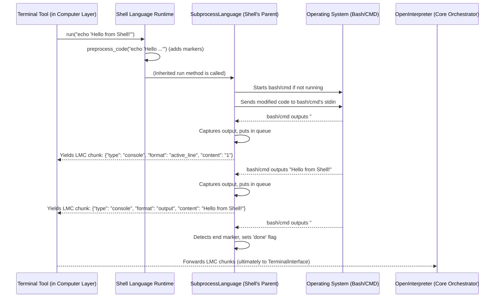

# Chapter 5: CodeExecution Languages (The Runtimes)

In [Chapter 4: Computer (Local Machine Interaction Layer)](04_computer__local_machine_interaction_layer__.md), we explored how Open Interpreter uses its `Computer` layer to interact with your machine. We saw that a key part of this is the `computer.terminal.run(language, code)` method, which is responsible for actually executing code snippets suggested by the LLM.

But how does `computer.terminal.run("python", "print('Hello from Python!')")` actually *run* Python code? And how does it handle Shell commands, JavaScript, or potentially other languages? This is where **CodeExecution Languages (The Runtimes)** come into play. They are the specialized engines under the hood that bring code to life.

## The "Language Experts" for Your Code

Imagine the `Computer` layer's `Terminal` tool is like a workshop manager. When the LLM sends a piece of Python code, the manager doesn't try to figure out Python itself. Instead, it hands the code to a "Python Expert" in the workshop. If it's a Shell command, it goes to a "Shell Expert."

These "experts" are what we call **CodeExecution Languages** or **Runtimes**. Each runtime is a specialized component within Open Interpreter that knows everything about:
1.  Taking a string of code for a specific language (like Python, Shell, JavaScript).
2.  Executing that code in the correct environment.
3.  Capturing any output produced by the code (like text printed to the console, error messages, or even images generated by a Python script).
4.  Sending this output back to the [OpenInterpreter (Core Orchestrator)](02_openinterpreter__core_orchestrator__.md) in a standardized way, so the LLM can see the results.

Let's say the LLM wants to find out the current date using Python. It might suggest:
```python
import datetime
print(datetime.date.today())
```
The `Computer` layer's `Terminal` tool would pass this code and the language "python" to the Python runtime. The Python runtime executes it, captures the output (e.g., `2023-10-27`), and sends it back.

## The Blueprint: `BaseLanguage`

To keep things organized and allow Open Interpreter to easily support new languages in the future, all language runtimes are built from a common blueprint. This blueprint is a Python class called `BaseLanguage` (found in `interpreter/core/computer/terminal/base_language.py`).

Think of `BaseLanguage` as a contract that every "language expert" must follow. It defines what basic things each expert must be able to do.

```python
# Simplified from interpreter/core/computer/terminal/base_language.py
class BaseLanguage:
    # How the LLM refers to this language (e.g., "python", "shell")
    name = "baselanguage" 
    # Default file extension (optional, used for some features like code scanning)
    file_extension = "txt" 
    # Other names the LLM might use for this language (optional)
    aliases = []    

    def run(self, code_string):
        """
        The most important method! Executes the code.
        It must 'yield' results piece by piece in a standard format.
        Example output chunk: 
        {"type": "console", "format": "output", "content": "Hello from code!"}
        """
        # A real language runtime would override this to actually run code.
        yield {"type": "console", "format": "output", "content": "Code ran (default BaseLanguage behavior)"}
    
    def stop(self):
        """ Tells the runtime to try and stop the currently running code. """
        pass 
    
    def terminate(self):
        """ Tells the runtime to clean up completely (e.g., close any running processes). """
        pass
```
**Key takeaways from `BaseLanguage`:**
*   `name`, `file_extension`, `aliases`: Help identify the language.
*   `run(code_string)`: This is the core method. It takes the code as a string, runs it, and `yields` any output. The output is structured (we call this the Language Model Conversation or LMC format), often as dictionary chunks like `{"type": "console", "format": "output", "content": "..."}`. This allows the [TerminalInterface (CLI User Interaction)](01_terminalinterface__cli_user_interaction__.md) to display different kinds of output correctly (text, images, active line numbers, etc.).
*   `stop()` and `terminate()`: Methods to control the execution, like stopping a long-running script or shutting down the language environment.

Any new language Open Interpreter wants to support (say, Ruby or R) would have its own class that "inherits" from `BaseLanguage` and provides the specific logic for the `run` method for that language.

## Common Case: Running Code in a Subprocess (`SubprocessLanguage`)

Many programming languages are run as separate programs (processes) on your computer. For example, when you run a shell script, your operating system starts a shell process. When you run a JavaScript file with Node.js, it starts a `node` process.

To handle these common cases, Open Interpreter has another helpful parent class called `SubprocessLanguage` (found in `interpreter/core/computer/terminal/languages/subprocess_language.py`). It inherits from `BaseLanguage` and provides a lot of the common machinery for:
*   Starting an external process (like `bash` or `node`).
*   Sending code to that process's input (stdin).
*   Reading output from its standard output (stdout) and standard error (stderr).
*   Knowing when the code has finished executing.

Languages like Shell and JavaScript in Open Interpreter use `SubprocessLanguage` as their direct parent.

```python
# Highly simplified concept of SubprocessLanguage
# interpreter/core/computer/terminal/languages/subprocess_language.py
import subprocess # For running external programs
import queue      # For collecting output from the process
import threading  # To read output without freezing the main program

class SubprocessLanguage(BaseLanguage): # It's a type of BaseLanguage
    def __init__(self):
        super().__init__()
        self.start_cmd = [] # e.g., ["bash"] for Shell, or ["node", "-i"] for JavaScript
        self.process = None # This will hold the running subprocess (like bash)
        self.output_queue = queue.Queue() # Output lines go here
        self.done = threading.Event() # A flag to signal when execution is finished

    def start_process(self):
        # This method (simplified here) would:
        # 1. Create self.process = subprocess.Popen(self.start_cmd, stdin=PIPE, stdout=PIPE, ...)
        # 2. Start background threads to continuously read self.process.stdout and
        #    self.process.stderr, putting each line into self.output_queue.
        # 3. These threads also watch for special "end of execution" markers.
        print(f"Starting subprocess with: {self.start_cmd}") # Placeholder
        pass 

    def preprocess_code(self, code):
        # Child classes (like Shell) often override this to add special markers
        # to the code, like an "echo '##END_OF_EXECUTION##'" command.
        # This helps know when the specific block of code is done.
        return code 

    def run(self, code):
        processed_code = self.preprocess_code(code)
        
        # If the process isn't running, or if it crashed, start it.
        if not self.process or self.process.poll() is not None:
            self.start_process()

        self.done.clear() # Reset the "done" flag for this new execution
        self.process.stdin.write(processed_code + "\n") # Send code to the process
        self.process.stdin.flush() # Make sure it's sent

        # Collect output from the queue until the 'done' flag is set
        # or the queue is empty after being done.
        while not self.done.is_set() or not self.output_queue.empty():
            try:
                output_chunk = self.output_queue.get(timeout=0.05) # Get an output line
                yield output_chunk # Send it back to Open Interpreter
            except queue.Empty: # If the queue is empty for a moment
                if self.done.is_set(): # And we know execution finished
                    break # Then exit the loop
```
This class handles a lot of the tricky parts of managing external processes. Individual language runtimes like `Shell` just need to tell `SubprocessLanguage` *how* to start the process (the `start_cmd`) and how to `preprocess_code` with any special markers.

### Example: The `Shell` Runtime

Let's see how the `Shell` runtime (in `interpreter/core/computer/terminal/languages/shell.py`) uses `SubprocessLanguage`.

```python
# Simplified from interpreter/core/computer/terminal/languages/shell.py
import platform # To check if Windows, Mac, Linux
import os       # For os.environ.get to find default shell
from .subprocess_language import SubprocessLanguage # Our parent class

# A helper function (simplified) to prepare shell code
def internal_preprocess_shell_code(code_string):
    # Adds shell commands to track active lines and signal completion.
    # For example, it might turn "ls -l" into:
    # echo "##active_line1##"
    # ls -l
    # echo "##end_of_execution##"
    return f'echo "##active_line1##"\n{code_string}\necho "##end_of_execution##"'

class Shell(SubprocessLanguage): # Inherits from SubprocessLanguage
    name = "Shell"
    aliases = ["bash", "sh", "zsh", "batch", "bat"] # Names LLM can use

    def __init__(self):
        super().__init__() # Initialize the SubprocessLanguage parent
        # Set the command to start a shell based on the Operating System
        if platform.system() == "Windows":
            self.start_cmd = ["cmd.exe"] # Use Command Prompt on Windows
        else:
            self.start_cmd = [os.environ.get("SHELL", "bash")] # Use user's SHELL or bash
    
    def preprocess_code(self, code):
        # Use our helper to add necessary shell commands for tracking
        return internal_preprocess_shell_code(code)
```
When the `Computer` layer asks to run shell code like `ls -l`:
1.  The `Terminal` tool finds the `Shell` runtime instance.
2.  It calls `shell_runtime.run("ls -l")`.
3.  The `Shell` runtime's `preprocess_code` (via `internal_preprocess_shell_code`) turns "ls -l" into something like `echo "##active_line1##"\nls -l\necho "##end_of_execution##"`.
4.  The `run` method (inherited from `SubprocessLanguage`) sends this modified code to the running shell process (e.g., `bash`).
5.  The `SubprocessLanguage` machinery captures the output from `bash` (the active line marker, the file listing, and the end of execution marker) and yields it back as LMC chunks.

## The Special Case: Python (with Jupyter)

Running Python code in Open Interpreter is a bit more sophisticated. Instead of just a simple subprocess, Open Interpreter uses a **Jupyter Kernel** behind the scenes. This is handled by the `JupyterLanguage` class (in `interpreter/core/computer/terminal/languages/jupyter_language.py`), which the `Python` runtime class inherits from.

Why Jupyter?
*   **Rich Output:** Jupyter kernels can output not just text, but also images (like Matplotlib plots), HTML, and other rich media. Open Interpreter can capture these and show them to you or even send images to vision-enabled LLMs.
*   **Persistent State:** A Jupyter kernel keeps its state (variables, imported modules) between code executions in the same session. This is how you can define a variable in one Python block and use it in the next.
*   **Interactive Features:** Better support for things that might require input during execution (though this is complex).

Here's a highly conceptual look at how `JupyterLanguage` works:

```python
# Highly Conceptual & Simplified from interpreter/core/computer/terminal/languages/jupyter_language.py
from jupyter_client import KernelManager # Manages the Jupyter kernel process
# from ..base_language import BaseLanguage # (already imported by parent)

class JupyterLanguage(BaseLanguage): # Python runtime class inherits this
    name = "Python" # (This is actually set in the Python class itself)

    def __init__(self, computer_reference): # Needs a reference to the Computer for settings
        self.computer = computer_reference
        # Start a Jupyter kernel (like a hidden Python interpreter)
        self.kernel_manager = KernelManager(kernel_name="python3")
        self.kernel_manager.start_kernel()
        # Create a client to talk to this kernel
        self.kernel_client = self.kernel_manager.client()
        self.kernel_client.start_channels() 
        # ... (code to wait for kernel to be fully ready & set up things like matplotlib) ...

    def run(self, code_string):
        # Optional: Preprocess code_string (e.g., to add active line tracking)
        # preprocessed_code = self.preprocess_python_code(code_string)
        
        self.kernel_client.execute(code_string) # Send the code to the Jupyter kernel

        # Loop to get all messages (output, errors, images) back from the kernel
        while True:
            try:
                # Get a message from the kernel's communication channel
                message = self.kernel_client.iopub_channel.get_msg(timeout=0.1)
            except Exception: # Usually queue.Empty if no message quickly
                # If kernel is idle and no more messages, we might be done for this execution.
                # (Real logic here is more complex to reliably detect end of output for current code block)
                if self.is_kernel_idle_and_finished_output(message): # Pseudocode for check
                    break 
                continue # Keep trying to get messages

            # Process the 'message' (which is a complex dictionary)
            # and 'yield' it in Open Interpreter's standard LMC format.
            # For example, if it's text output:
            #   yield {"type": "console", "format": "output", "content": text_from_message}
            # If it's a PNG image (e.g., from matplotlib):
            #   yield {"type": "image", "format": "base64.png", "content": png_data_from_message}
            yield self.convert_jupyter_message_to_lmc(message) # Pseudocode

    # ... (helper methods like is_kernel_idle_and_finished_output, convert_jupyter_message_to_lmc) ...

    def terminate(self):
        # Properly shut down the Jupyter kernel and its communication channels
        self.kernel_client.stop_channels()
        self.kernel_manager.shutdown_kernel(now=True)

# Then, in interpreter/core/computer/terminal/languages/python.py:
# class Python(JupyterLanguage):
#     # It mostly just uses all the features from JupyterLanguage!
#     pass 
```
When the `Python` runtime (which uses `JupyterLanguage`) gets code like `print("Hello from Python!")`:
1.  The code is sent to the active Jupyter kernel.
2.  The kernel runs it.
3.  The `JupyterLanguage` instance listens for messages from the kernel.
4.  When the kernel sends a message saying "text output: 'Hello from Python!'", the `JupyterLanguage` instance converts this into an LMC chunk (`{"type": "console", "format": "output", "content": "Hello from Python!"}`) and yields it.
5.  If the Python code was `import matplotlib.pyplot as plt; plt.plot([1,2,3]); plt.show()`, the kernel would send an image message, which `JupyterLanguage` would convert to an LMC image chunk.

## The Journey of Code Execution

Let's trace how a command like `computer.terminal.run("shell", "echo 'Hello from Shell!'")` flows through these layers:


This diagram shows how the `Terminal` tool uses the specific `ShellRuntime`, which in turn relies on `SubprocessLanguage` to interact with the operating system's shell. The output comes back as structured LMC chunks.

## Conclusion

The CodeExecution Languages (Runtimes) are the specialized workhorses that actually execute the code suggested by the LLM. Each language (Python, Shell, JavaScript, etc.) has its own runtime class, typically inheriting from `BaseLanguage` or the more specific `SubprocessLanguage`.
*   The `BaseLanguage` class defines the common interface all runtimes must implement, especially the `run()` method that executes code and yields output in a standard LMC format.
*   `SubprocessLanguage` provides a robust foundation for languages that run as external command-line processes.
*   The Python runtime, using `JupyterLanguage`, leverages Jupyter kernels for rich output and persistent state, making Python interactions particularly powerful.

These runtimes are the final link in the chain, turning the LLM's abstract code suggestions into concrete actions and results on your computer. They ensure that code is executed correctly for its language and that all output is captured and reported back.

Now that we've seen how Open Interpreter talks to you via the [TerminalInterface (CLI User Interaction)](01_terminalinterface__cli_user_interaction__.md), how the [OpenInterpreter (Core Orchestrator)](02_openinterpreter__core_orchestrator__.md) manages the flow, how it consults the [Llm (Language Model Interaction)](03_llm__language_model_interaction__.md), and how the [Computer (Local Machine Interaction Layer)](04_computer__local_machine_interaction_layer__.md) uses these Runtimes to act, you might be wondering: how do we configure all these different parts? How do we tell Open Interpreter which LLM to use, whether to ask for permission before running code (`auto_run`), or set other preferences? That's where our next chapter comes in: [Chapter 6: Profiles (Configuration Management)](06_profiles__configuration_management__.md).

---

Generated by [AI Codebase Knowledge Builder](https://github.com/The-Pocket/Tutorial-Codebase-Knowledge)