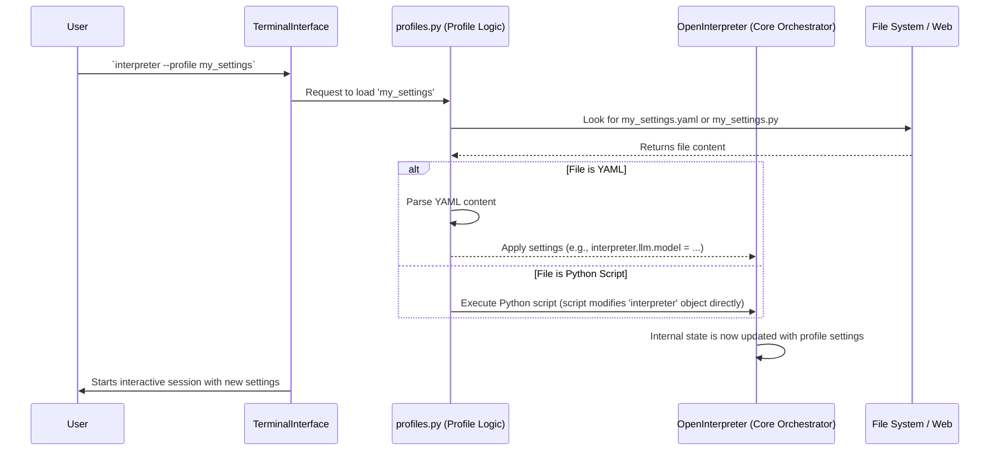

# Chapter 6: Profiles (Configuration Management)

Welcome to Chapter 6! In the [previous chapter on CodeExecution Languages (The Runtimes)](05_codeexecution_languages__the_runtimes__.md), we saw the specialized "engines" that actually run the code suggested by the AI. We've now journeyed through how you talk to Open Interpreter, how it thinks, how it acts, and how that action (code) gets executed.

But with all these powerful components, you might be wondering: "How can I customize Open Interpreter for my specific needs? What if I always want to use a particular AI model? Or what if I'm working on a sensitive project and want to be extra cautious, or the opposite, I'm experimenting and want it to run code without asking me every time?"

This is where **Profiles** come in. They are your way to personalize Open Interpreter.

## What Problem Do Profiles Solve? Your Personal Settings Manager

Imagine you have a favorite way to work. Maybe you prefer a specific brand of pen, a certain type of notebook, and a particular chair. When you start a new task, you want all your favorite tools ready to go.

Profiles in Open Interpreter are like that. They let you define a "set of personalized settings" or "presets" for how Open Interpreter behaves. Instead of telling Open Interpreter your preferences every single time you start it (like "use this AI model," "don't ask me to confirm code execution," "give the AI these special instructions"), you can save these preferences in a Profile.

**Central Use Case:** Let's say you often work with local AI models running on your own computer because you want to keep your data private. You also prefer the AI to be very direct and concise. Without profiles, you might have to type something like `interpreter --model ollama/llama3 --system_message "Be concise." -y` every time. With a profile, you can save these settings and just run `interpreter --profile local_concise` (or even make it your default!).

## What Exactly Are Profiles?

Profiles are essentially configuration files that Open Interpreter reads when it starts. These files tell Open Interpreter how you want it to be set up for the session.
*   **Personalized Settings:** They store your preferred settings, like which Large Language Model (LLM) to use (e.g., GPT-4o, Claude, a local model via Ollama), custom instructions for the AI, or whether to automatically run code without asking for your `y/n` confirmation.
*   **Different "Modes":** Think of them as different "modes" or "configurations" you can quickly switch between. You might have a "cautious_mode" profile for when you're working with important files, and an "experimental_mode" profile for when you're trying out new things.
*   **File-Based:** These settings are typically stored in files in a special directory. The most common format is **YAML** (which stands for "YAML Ain't Markup Language" - it's a human-friendly way to write structured data). Profiles can also be **Python files** for more advanced setups.

Think of them like different user accounts on your computer (each with its own wallpaper and app settings) or different "save slots" in a video game, each remembering specific progress and settings.

## Why Should You Use Profiles?

1.  **Consistency:** You get the same, predictable behavior from Open Interpreter every time you use a specific profile. No more forgetting to set your favorite model!
2.  **Convenience:** Say goodbye to typing long command-line options like `--model gpt-4o --auto_run --system_message "You are a Python expert"` every time. Just load your profile!
3.  **Customization:** You can create different profiles for different types of tasks or projects.
    *   A `data_analyst` profile that uses a powerful model and has custom instructions about generating charts.
    *   A `quick_local_tasks` profile that uses a fast, local LLM and automatically runs code for simple file operations.
    *   An `os_control_expert` profile for when you want Open Interpreter to interact with your computer's GUI.
4.  **Sharing (Potentially):** If you craft a profile that's perfect for a certain workflow, you could share the configuration file with a colleague.

## Finding and Understanding Your Profiles

Open Interpreter keeps its profile files in a dedicated folder on your computer. This folder is usually located within a directory named `.open-interpreter` or `Open Interpreter` inside your user's configuration or application data area. The exact path can vary slightly based on your operating system, but the key part is a subfolder named `profiles`.

Inside this `profiles` folder, you'll find your profile files. The most important one to know about is **`default.yaml`**. This is the profile Open Interpreter uses automatically if you just type `interpreter` without specifying any other profile.

### A Peek Inside `default.yaml`

Let's look at a simplified version of what a `default.yaml` file might contain. YAML files use a simple `key: value` structure, and indentation is important to show hierarchy (like categories and sub-categories).

```yaml
# This is a simplified example of a profile file (like default.yaml)

# Settings for the Large Language Model (LLM)
llm:
  model: "gpt-4o-mini"  # Which AI model to use
  # temperature: 0      # Controls AI's creativity (0 = more factual, 1 = more creative)
  # api_key: "sk-..."   # Your API key if the model needs one

# Should Open Interpreter run code without asking for 'y/n' permission?
auto_run: False  # False means it WILL ask for permission

# Special instructions to give the AI at the start of the conversation
# custom_instructions: "You are a friendly assistant. Always explain your code."

# What version of the profile format is this? (Open Interpreter manages this)
version: 0.2.5
```

**Explanation of some common settings:**

*   `llm:`: This section groups all settings related to the [Llm (Language Model Interaction)](03_llm__language_model_interaction__.md).
    *   `model: "gpt-4o-mini"`: Tells Open Interpreter to use the "gpt-4o-mini" model. You could change this to `"ollama/llama3"` if you have Ollama set up with Llama 3, or any other supported model.
    *   `temperature:` (often commented out with `#` by default): A number between 0 and 1 (or sometimes 2) that controls how "creative" or "random" the AI's responses are. Lower is more predictable.
    *   `api_key:`: If your chosen LLM (like one from OpenAI) requires an API key for access, you'd put it here.
*   `auto_run: False`: This is a very important setting!
    *   `False` (the default and recommended for safety) means Open Interpreter will show you the code it wants to run and ask for your `y/n` approval via the [TerminalInterface (CLI User Interaction)](01_terminalinterface__cli_user_interaction__.md).
    *   If you change this to `auto_run: True`, Open Interpreter will execute code immediately without asking. Use this with caution!
*   `custom_instructions:`: Any text you put here will be added to the main instructions (the "system message") given to the AI. This is great for guiding the AI's personality or focusing its expertise (e.g., "You are a Python expert. Prefer to use the `requests` library for web tasks.").
*   `version:`: Open Interpreter uses this to manage changes to the profile format over time. You generally don't need to change this yourself.

If you wanted Open Interpreter to always use the `gpt-4o` model and to always run code without asking, you could edit your `default.yaml` to look like this (again, be careful with `auto_run: True`):

```yaml
# Modified default.yaml
llm:
  model: "gpt-4o" # Changed to a more powerful model

auto_run: True # Changed to automatically run code!

version: 0.2.5
```
Save the file, and the next time you run `interpreter`, these settings will apply.

## Creating and Using Different Profiles

While editing `default.yaml` is useful, the real power comes from having *multiple* profiles.

Let's say you want to create a special profile for when you're doing web development. You want to use a specific model, give it some instructions about web tech, and maybe allow it to automatically run code related to web servers.

1.  **Create a new YAML file:** In your `profiles` directory, create a new file, for example, `web_dev_assistant.yaml`.
2.  **Add your settings to the file:**

    ```yaml
    # In your profiles/web_dev_assistant.yaml file

    llm:
      model: "gpt-4o" # A good model for coding
      temperature: 0.2

    auto_run: False # Let's still be cautious with web server commands initially

    custom_instructions: |
      You are a web development expert.
      Focus on Python (Flask/Django), JavaScript (React/Vue), HTML, and CSS.
      When suggesting server commands, explain them clearly.
      Always consider security best practices.

    # We can also tell the computer which languages we primarily want to use
    computer:
      languages: ["python", "javascript", "shell", "html"]

    version: 0.2.5
    ```
    (The `|` after `custom_instructions:` allows for multi-line text.)

3.  **Run Open Interpreter with your new profile:**
    Open your terminal and type:
    ```bash
    interpreter --profile web_dev_assistant
    ```
    Or, if your file is in a subdirectory like `my_work_profiles/web_dev_assistant.yaml` within the main `profiles` folder, you can use the relative path:
    ```bash
    interpreter --profile my_work_profiles/web_dev_assistant.yaml
    ```

Now, Open Interpreter will start with the settings from `web_dev_assistant.yaml` for this session!

Open Interpreter also comes with some pre-defined profiles you can try, like:
*   `interpreter --profile local`: Sets up Open Interpreter to try and use a local LLM (like one served by Ollama or LM Studio) and operate in a more offline-friendly way. (This corresponds to `interpreter/terminal_interface/profiles/defaults/local.py`)
*   `interpreter --profile os`: Configures Open Interpreter with settings optimized for controlling your operating system (mouse, keyboard, screen viewing). It usually defaults to a powerful vision-capable model like `gpt-4o` and enables `auto_run`. (This corresponds to `interpreter/terminal_interface/profiles/defaults/os.py`)

## Python Profiles: For Ultimate Customization

Sometimes, YAML isn't enough. What if you want to run some Python code to set up your environment when Open Interpreter starts? Or dynamically decide on a setting based on, for example, the current day of the week? For this, you can use **Python profiles**.

A Python profile is simply a `.py` file in your `profiles` directory. When Open Interpreter loads a Python profile, it executes the script. Inside this script, you have access to the main `interpreter` object and can change its settings directly.

Here's a very simple example. Let's say you create `my_python_profile.py`:

```python
# In your profiles/my_python_profile.py

# The 'interpreter' object is automatically made available to this script.
# You don't need to import it or create it yourself here.

print("My Custom Python Profile is loading!")

interpreter.llm.model = "ollama/codellama" # Set the AI model
interpreter.auto_run = True                # Enable auto-run
interpreter.custom_instructions = "You are a code llama. Write amazing code."

# You can even change settings on sub-components:
if interpreter.computer: # Check if computer module is loaded
    interpreter.computer.verbose = True # Make computer interactions more talkative

print(f"Python profile loaded. Model set to: {interpreter.llm.model}")
```

To use it:
```bash
interpreter --profile my_python_profile.py
```
When Open Interpreter starts, it will run this Python script. You'll see "My Custom Python Profile is loading!" and "Python profile loaded..." printed in your terminal, and the `model`, `auto_run`, and `custom_instructions` will be set as defined in the script.

The `local.py` and `os.py` profiles that come with Open Interpreter are examples of Python profiles. For instance, `local.py` includes logic like `interpreter.local_setup()` and sets `interpreter.offline = True`.

## How Open Interpreter Loads a Profile (A Peek Under the Hood)

When you run `interpreter` with a `--profile` flag (or just `interpreter` to use `default.yaml`), here's a simplified idea of what happens, managed by code in `interpreter/terminal_interface/profiles/profiles.py`:

1.  **You Start Open Interpreter:** You type `interpreter --profile awesome_mode` in your terminal.
2.  **Find the Profile:** The [TerminalInterface (CLI User Interaction)](01_terminalinterface__cli_user_interaction__.md) tells the profile loading mechanism (in `profiles.py`) to find `awesome_mode`.
    *   It first looks for `awesome_mode.yaml`, `awesome_mode.py`, or `awesome_mode.json` in your user's `profiles` directory.
    *   It also checks if `awesome_mode` matches one of the built-in default profile names (like `local` or `os`).
    *   It can even load profiles from a URL!
3.  **Read the Profile:**
    *   If it's a YAML file (e.g., `awesome_mode.yaml`), it reads the content and parses it into a data structure (like a Python dictionary).
    *   If it's a Python file (e.g., `awesome_mode.py`), it prepares to execute the script's content.
4.  **Apply the Settings:** The loaded settings (from YAML) or the Python script are then applied to the main `interpreter` object (our [OpenInterpreter (Core Orchestrator)](02_openinterpreter__core_orchestrator__.md)) and its various components (like `interpreter.llm` or `interpreter.computer`).
    *   For YAML, it goes through each key-value pair and updates the corresponding attribute on the `interpreter` object. For example, `llm: { model: "gpt-4" }` would set `interpreter.llm.model = "gpt-4"`.
    *   For Python profiles, the script itself directly modifies the `interpreter` object.
5.  **Ready to Go:** The `interpreter` object is now configured, and your chat session begins with these personalized settings.

Here's a simplified sequence diagram:



Let's look at a tiny, conceptual piece of how settings from a YAML file might be applied from `interpreter/terminal_interface/profiles/profiles.py`:

```python
# Very simplified concept from interpreter/terminal_interface/profiles/profiles.py

def apply_profile_settings(interpreter_object, settings_from_yaml):
    """
    Applies settings from a parsed YAML file to the interpreter object.
    """
    for key, value in settings_from_yaml.items():
        if key == "llm" and isinstance(value, dict):
            # Special handling for nested 'llm' settings
            for llm_key, llm_value in value.items():
                setattr(interpreter_object.llm, llm_key, llm_value)
                # e.g., interpreter_object.llm.model = "gpt-4o"
        elif key == "computer" and isinstance(value, dict):
            # Special handling for nested 'computer' settings
             for computer_key, computer_value in value.items():
                setattr(interpreter_object.computer, computer_key, computer_value)
        elif hasattr(interpreter_object, key):
            # Simple top-level setting like 'auto_run'
            setattr(interpreter_object, key, value)
            # e.g., interpreter_object.auto_run = True
        # ... (real code handles more cases and nesting more robustly)

# When a YAML profile is loaded, something like this happens:
# profile_data = {"llm": {"model": "gpt-4o"}, "auto_run": True}
# apply_profile_settings(interpreter, profile_data)
```
The actual `apply_profile_to_object` function in `profiles.py` is more general and can recursively apply settings to nested objects, making it quite flexible. For Python profiles, the `profile` function in `profiles.py` identifies if there's a `start_script` (from a `.py` file) and uses `exec()` to run it, making the `interpreter` object available within that script's scope.

The `profile()` function in `profiles.py` is the main entry point called by the CLI when you use `--profile`. It orchestrates finding, loading, and applying the profile. It also handles migrations if your profile file is from an older version of Open Interpreter, usually asking you if you want to update it.

## Managing Your Profiles

*   **Creating:** Simply create new `.yaml` or `.py` files in your `profiles` directory.
*   **Editing:** Open the YAML or Python files in a text editor and make your changes.
*   **Resetting to Default:** If you've changed `default.yaml` and want to go back to the original factory settings, you can run:
    ```bash
    interpreter --reset_profile
    ```
    This will usually ask for confirmation before resetting your `default.yaml` to the standard one that ships with Open Interpreter. (It's a good idea to back up your `default.yaml` if you've customized it heavily before running this).
*   **Listing/Exploring:** You can just look in your `profiles` directory to see what profiles you have.

## Conclusion

Profiles are a powerful and convenient way to manage Open Interpreter's configuration. They act as personalized presets, allowing you to define default behaviors for everything from the AI model used, to custom instructions, to whether code runs automatically. By using YAML or Python files, you can create different "modes" for Open Interpreter, tailoring it perfectly for various tasks and workflows. This saves you time and ensures a consistent experience.

We've now covered the main user interface, the core orchestrator, how Open Interpreter talks to LLMs, how it interacts with your computer, the runtimes that execute code, and how to configure it all with profiles. You have a solid understanding of the fundamental building blocks!

But Open Interpreter can do even more. What about complex, multi-step tasks that might require the AI to work more autonomously, perhaps even running a server to offer its capabilities or using more advanced tools? In the [next chapter, Chapter 7: AsyncServer & ComputerUse Tools (Advanced Agentic Loop)](07_asyncserver___computeruse_tools__advanced_agentic_loop__.md), we'll touch on some of these more advanced concepts that enable Open Interpreter to act as a more sophisticated agent.

---

Generated by [AI Codebase Knowledge Builder](https://github.com/The-Pocket/Tutorial-Codebase-Knowledge)