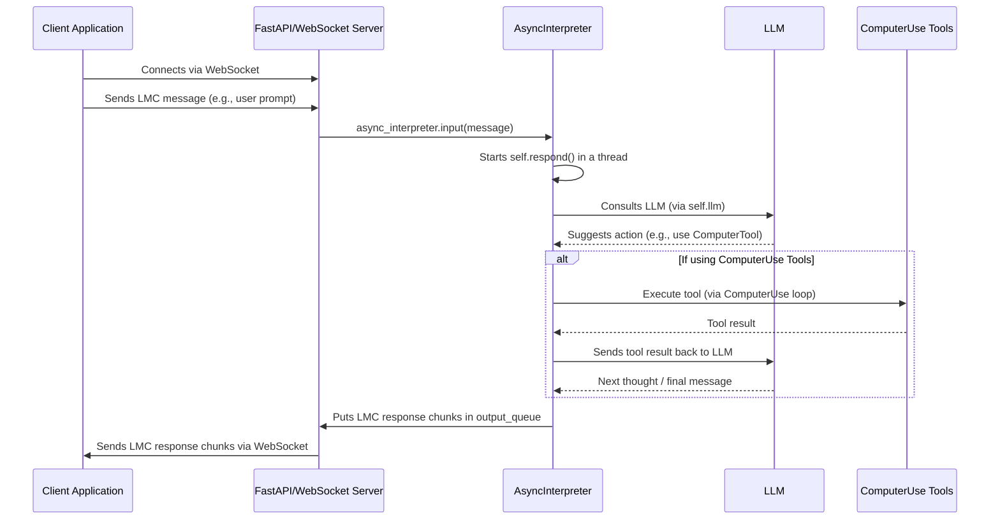

# Chapter 7: AsyncServer & ComputerUse Tools (Advanced Agentic Loop)

Welcome to the final chapter of our Open Interpreter journey! In [Chapter 6: Profiles (Configuration Management)](06_profiles__configuration_management__.md), we learned how to customize Open Interpreter's behavior using profiles, tailoring it to different tasks and preferences.

Now, we're going to explore a more advanced way Open Interpreter can operate. What if you want Open Interpreter to run continuously, perhaps as the backend for a custom application, or to handle complex, multi-step tasks that require very fine-grained control over your computer? This is where the `AsyncServer` and a specialized set of "ComputerUse" tools come into play, forming an advanced "agentic loop."

## What Problem Do These Solve? The Always-On, Fine-Grained Assistant

Imagine you want to build a custom desktop application where users can type instructions in a chat window, and Open Interpreter carries them out. Or, perhaps you want Open Interpreter to perform a long-running task like "Monitor my 'Work_Projects' folder. If any new '.docx' file appears, automatically convert it to '.pdf' and email it to my 'project_updates' email address."

For these kinds of scenarios:
1.  You need Open Interpreter to be "always on," listening for instructions or events, rather than just running once when you type `interpreter` in the terminal. This is where the **`AsyncServer`** helps.
2.  For really complex tasks that involve many small steps on your computer (like clicking specific buttons, typing in text fields, checking the screen, then running a command), you might want an AI that's especially good at planning and executing these "computer use" actions. The **`ComputerUse` tools** are designed for this.

Together, they enable a more powerful, persistent, and potentially interactive way for an AI to control your computer, almost like a dedicated digital assistant working in the background.

## Key Concept 1: The `AsyncServer` - Open Interpreter as a Service

Think of the regular Open Interpreter you run from the command line as a consultant you call in for specific tasks. The `AsyncServer` turns Open Interpreter into a full-time employee, always ready and listening for jobs.

*   **What is it?** The `AsyncServer` (`AsyncInterpreter` and its `Server` component) allows Open Interpreter to run as a background service that communicates using **WebSockets**. WebSockets are a technology that allows for real-time, two-way communication between a server (Open Interpreter) and a client (another program, like a desktop app or a web interface).
*   **Why use it?**
    *   **Remote Control:** Other applications can send instructions to Open Interpreter and receive results. This is perfect for building custom UIs or integrating Open Interpreter into larger systems.
    *   **Continuous Operation:** It can run indefinitely, waiting for tasks.
    *   **Asynchronous Tasks:** The "Async" part means it can handle operations without freezing, making it more responsive.
*   **How does it work (simply)?** When you start Open Interpreter in server mode, it listens on a specific network "address" (like a phone number). Other programs can connect to this address and "talk" to Open Interpreter using a structured message format called LMC (Language Model Conversation), which we've seen in previous chapters is how Open Interpreter internally represents messages, code, and outputs.

### Starting the Server

You can start Open Interpreter in server mode directly from your terminal:

```bash
interpreter --server
```

When you run this, Open Interpreter will start up and print a message like:
```text
Server will run at http://127.0.0.1:8000
```
This means Open Interpreter is now listening for WebSocket connections on your local computer at port `8000`. Another program (a "client") could then connect to `ws://127.0.0.1:8000/` to send it tasks and receive responses.

The `Dockerfile` in the Open Interpreter project shows an example of setting this up to run inside a Docker container, exposing this server capability.

```dockerfile
# Simplified from Dockerfile
# ... (setup steps) ...

# Expose port 8000
EXPOSE 8000

# Install server dependencies
RUN pip install ".[server]"

# Start the server
ENTRYPOINT ["interpreter", "--server"]
```
This Dockerfile sets up an environment where Open Interpreter starts in server mode automatically.

## Key Concept 2: `ComputerUse` Tools - Precision OS Control

While the [Computer (Local Machine Interaction Layer)](04_computer__local_machine_interaction_layer__.md) we discussed in Chapter 4 provides a general way for the LLM to request actions, the `computer_use` tools are a more specialized set, often used with AI models that are particularly good at breaking down tasks into fine-grained computer interactions.

Think of it as the difference between giving general instructions to a helper ("clean the room") versus giving very specific steps to a robot ("move to X,Y; pick up object A; place in bin B").

*   **What are they?** A collection of tools (`BashTool`, `ComputerTool`, `EditTool`) designed for an AI to interact with an operating system in a structured way. This system is often associated with Anthropic's Claude models, which can be trained to use these tools effectively in what's called an "agentic loop."
*   **The Agentic Loop:**
    1.  The AI (LLM) receives a task.
    2.  It decides which `computer_use` tool to use and with what parameters (e.g., `ComputerTool` action `mouse_move` to coordinate `100,200`).
    3.  The tool is executed.
    4.  The result of the tool (e.g., "mouse moved successfully," or a screenshot) is sent back to the AI.
    5.  The AI processes the result and decides the next step, repeating the cycle until the task is complete.
*   **Key Tools:**
    *   **`ComputerTool`** (`interpreter/computer_use/tools/computer.py`): This is for direct GUI interaction.
        *   `key`, `type`: Simulates keyboard presses or typing text.
        *   `mouse_move`, `left_click`, `right_click`, `double_click`, `left_click_drag`: Controls the mouse.
        *   `screenshot`: Takes a picture of the screen, which can be sent back to a vision-capable AI.
        *   `cursor_position`: Gets the current mouse coordinates.
    *   **`BashTool`** (`interpreter/computer_use/tools/bash.py`): For running shell commands. It maintains a persistent shell session.
    *   **`EditTool`** (`interpreter/computer_use/tools/edit.py`): For programmatic file editing with commands like:
        *   `view`: See file content or list directory content.
        *   `create`: Make a new file with given text.
        *   `str_replace`: Find and replace a unique string in a file.
        *   `insert`: Insert text at a specific line.
        *   `undo_edit`: Revert the last change to a file.

### Example: Using `ComputerTool`

Imagine the AI needs to click a button on the screen that says "Submit" after filling a form. It might decide to use the `ComputerTool`.

```python
# Conceptual use by the agentic loop
# (This code would be run by the logic in interpreter/computer_use/loop.py)

# AI decides: "I need to click on 'Submit'."
# The loop might translate this to:
tool_name = "computer"
action_parameters = {"action": "left_click", "coordinate": [500, 350]} # Assuming 'Submit' is at 500,350

# ... The loop then calls the ComputerTool ...
# result = computer_tool_instance(**action_parameters)
# 'result' would contain success/failure and maybe a new screenshot.
```
The AI doesn't directly write `pyautogui.click()`. Instead, it requests the `computer` tool to perform a `left_click` at certain coordinates. The `ComputerTool` then translates this into actual `pyautogui` calls. After most actions, `ComputerTool` automatically takes a screenshot and sends it back as part of the result, so the AI can "see" what happened.

### How `interpreter --os` Relates

When you run Open Interpreter with the `--os` flag (or load the `os` [Profile](06_profiles__configuration_management__.md)), it often uses these `computer_use` tools with a compatible LLM (like Claude 3.5 Sonnet). This mode is optimized for OS control tasks. The `sampling_loop` in `interpreter/computer_use/loop.py` is central to this functionality, managing the interaction with the LLM and these specialized tools.

## How the Server and Tools Can Work Together

While `AsyncServer` and `ComputerUse` tools are distinct, they can be combined:
1.  You could run `AsyncInterpreter` as a server.
2.  A client application could send a complex task to this server.
3.  The `AsyncInterpreter` instance, if configured with an LLM and tools suitable for `computer_use` (like when using the `os` profile), would then use the `ComputerUse` agentic loop (e.g., the `sampling_loop`) to break down the task and execute it using `BashTool`, `ComputerTool`, etc.

This setup allows for powerful, remotely-triggered agentic behavior.

## Under the Hood: A Glimpse into the Mechanisms

Let's briefly look at how these advanced components are structured.

### 1. `AsyncServer` Internals

The server functionality is primarily in `interpreter/core/async_core.py`.

*   **`AsyncInterpreter(OpenInterpreter)`:**
    *   This class inherits from the standard `OpenInterpreter` (our [Core Orchestrator](02_openinterpreter__core_orchestrator__.md)).
    *   It overrides methods like `input()` and adds `output()` to work asynchronously.
    *   It uses a `threading.Thread` to run the `respond()` method (which does the thinking and acting) in the background, so the server doesn't freeze.
    *   It uses `janus.Queue` to safely pass messages between the asynchronous server part and the synchronous `OpenInterpreter` core logic.

    ```python
    # Simplified from interpreter/core/async_core.py
    class AsyncInterpreter(OpenInterpreter):
        async def input(self, chunk): # Receives messages from the client
            # ... accumulates message chunks ...
            if "end" in chunk: # User/client finished sending a message block
                self.stop_event.clear()
                # Run the main response logic in a separate thread
                self.respond_thread = threading.Thread(target=self.respond)
                self.respond_thread.start()

        async def output(self): # Sends messages back to the client
            if self.output_queue is None:
                self.output_queue = janus.Queue() # For async communication
            return await self.output_queue.async_q.get() # Get next message chunk
    ```

*   **`Server` Class:**
    *   Uses `FastAPI` (a web framework) to create the web server and `Uvicorn` to run it.
    *   Defines a WebSocket endpoint (usually at `/`).
    *   When a client connects via WebSocket, the `websocket_endpoint` function handles:
        *   Receiving messages (LMC chunks) from the client.
        *   Passing these messages to `async_interpreter.input()`.
        *   Continuously getting messages from `async_interpreter.output()` and sending them back to the client.

    ```python
    # Simplified concept from create_router in interpreter/core/async_core.py
    # @router.websocket("/")
    async def websocket_endpoint(websocket: WebSocket, async_interpreter: AsyncInterpreter):
        await websocket.accept()
        
        async def receive_input_from_client():
            while True: # Keep listening for client messages
                data = await websocket.receive_json() # Or receive_text/bytes
                await async_interpreter.input(data) # Pass to interpreter
        
        async def send_output_to_client():
            while True: # Keep sending interpreter's output
                chunk = await async_interpreter.output() # Get output
                await websocket.send_json(chunk) # Send to client
                if chunk.get("content") == "complete": break # End of a response sequence
        
        # Run both tasks concurrently
        await asyncio.gather(receive_input_from_client(), send_output_to_client())
    ```

A simplified flow:


### 2. `ComputerUse` Tools Internals

These tools are primarily found in `interpreter/computer_use/tools/` and are orchestrated by `interpreter/computer_use/loop.py`.

*   **`sampling_loop` (`interpreter/computer_use/loop.py`):**
    *   This asynchronous function is the heart of the agentic behavior for `computer_use`.
    *   It takes the current conversation `messages`.
    *   It calls an LLM (typically an Anthropic model like Claude, using `client.beta.messages.create`) with the messages and the list of available `computer_use` tools.
    *   The LLM responds. If the response includes a request to use a tool (a "tool_use" content block):
        *   The `sampling_loop` extracts the tool name and input parameters.
        *   It uses `ToolCollection` to find and run the correct tool (e.g., `ComputerTool`, `BashTool`).
        *   The tool executes its action (e.g., `pyautogui.click()` for `ComputerTool`).
        *   The tool returns a `ToolResult` (output, error, maybe a screenshot).
        *   This `ToolResult` is formatted and added to the `messages`.
        *   The loop continues, sending the updated `messages` (including the tool result) back to the LLM for the next step.
    *   If the LLM responds with a text message, it's yielded back to the caller (e.g., to be displayed to the user).

```python
# Highly simplified concept of the sampling_loop from interpreter/computer_use/loop.py
async def sampling_loop(messages, llm_client, tool_collection):
    while True:
        # 1. Call LLM with current messages and tool definitions
        llm_response = await llm_client.beta.messages.create(messages=messages, tools=tool_collection.to_params(), ...)
        
        assistant_message_content = [] # To store what the LLM said/did
        tool_results_for_next_iteration = []

        for content_block in llm_response.content:
            if content_block.type == "text":
                # AI sent a text message
                assistant_message_content.append({"type": "text", "text": content_block.text})
                # (yield this text to be displayed)
            elif content_block.type == "tool_use":
                # AI wants to use a tool
                tool_name = content_block.name
                tool_input = content_block.input
                tool_use_id = content_block.id
                
                # 2. Execute the requested tool
                result = await tool_collection.run(name=tool_name, tool_input=tool_input)
                
                # 3. Prepare tool result for next LLM call
                tool_results_for_next_iteration.append(
                    {"type": "tool_result", "tool_use_id": tool_use_id, "content": result.output, ...}
                )
                # (yield tool execution details to be displayed)
        
        messages.append({"role": "assistant", "content": assistant_message_content}) # Add AI's text to history
        if not tool_results_for_next_iteration:
            break # Task is done if no more tools were called
        
        messages.append({"role": "user", "content": tool_results_for_next_iteration}) # Add tool results for LLM context
```

*   **Individual Tools (e.g., `ComputerTool` in `interpreter/computer_use/tools/computer.py`):**
    *   Each tool class (like `ComputerTool`, `BashTool`, `EditTool`) inherits from `BaseAnthropicTool`.
    *   It implements an `async def __call__(self, **kwargs)` method that takes parameters specific to that tool's actions (e.g., `action`, `coordinate` for `ComputerTool`).
    *   Inside `__call__`, it performs the actual OS interaction (e.g., using `pyautogui` for mouse/keyboard, `subprocess` for shell commands).
    *   It returns a `ToolResult` object, which can include text output, error messages, and even base64 encoded image data (for screenshots).

    ```python
    # Simplified from interpreter/computer_use/tools/computer.py
    class ComputerTool(BaseAnthropicTool):
        async def __call__(self, action: str, text: str = None, coordinate: tuple = None, **kwargs):
            if action == "left_click":
                # (Scale coordinates if needed)
                pyautogui.click(button="left") # Actual OS interaction
                # (Take screenshot)
                # return ToolResult(base64_image=screenshot_data, output="Clicked left mouse button.")
            elif action == "type":
                pyautogui.write(text)
                # (Take screenshot)
                # return ToolResult(base64_image=screenshot_data, output=f"Typed: {text}")
            # ... other actions ...
    ```

This agentic loop with `ComputerUse` tools allows for a very detailed, step-by-step execution of tasks, where the AI continuously observes (via screenshots or command outputs) and acts.

## Conclusion

The `AsyncServer` and `ComputerUse` tools represent a significant step up in Open Interpreter's capabilities, moving it from a command-line utility to a more versatile and powerful AI agent.
*   The **`AsyncServer`** allows Open Interpreter to run as a persistent service, interactable via WebSockets, making it suitable as a backend for other applications.
*   The **`ComputerUse` tools** provide a framework for fine-grained OS interaction, enabling AI models (especially those trained for tool use, like some Claude models) to perform complex, multi-step tasks on your computer by directly controlling the mouse, keyboard, shell, and file editor in a tight feedback loop.

These advanced features open up exciting possibilities for building sophisticated applications and autonomous agents powered by Open Interpreter. While they are more complex than the basic CLI usage, they unlock a new level of power and flexibility.

This marks the end of our tutorial series on the core concepts of Open Interpreter. We hope this journey has given you a solid understanding of how Open Interpreter works, from its user interface to its deep internals, and inspires you to explore its potential further!

---

Generated by [AI Codebase Knowledge Builder](https://github.com/The-Pocket/Tutorial-Codebase-Knowledge)