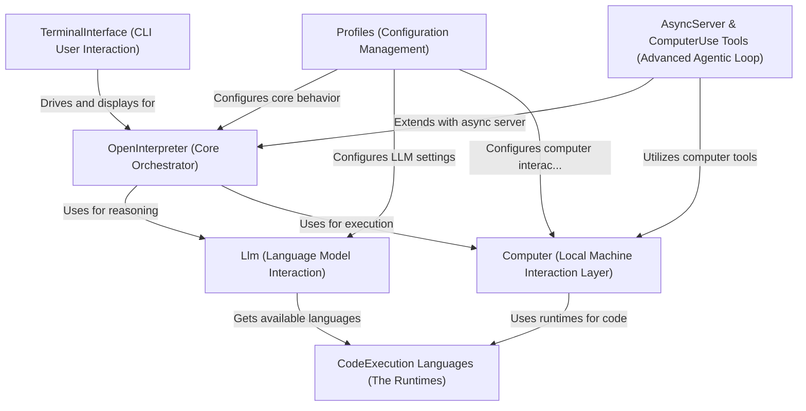

# Tutorial: open-interpreter

Open Interpreter acts as an *AI assistant* that can operate your computer. You give it instructions as **text prompts**, and it uses a Large Language Model (LLM) to understand these prompts and generate code. This code is then executed on your *local machine* to perform a wide variety of tasks, from file manipulation to controlling applications. It offers a command-line interface and can be configured using profiles.

**Source Repository:** [https://github.com/OpenInterpreter/open-interpreter.git](https://github.com/OpenInterpreter/open-interpreter.git)

## Chapters

1. [TerminalInterface (CLI User Interaction)
](01_terminalinterface__cli_user_interaction__.md)
2. [OpenInterpreter (Core Orchestrator)
](02_openinterpreter__core_orchestrator__.md)
3. [Llm (Language Model Interaction)
](03_llm__language_model_interaction__.md)
4. [Computer (Local Machine Interaction Layer)
](04_computer__local_machine_interaction_layer__.md)
5. [CodeExecution Languages (The Runtimes)
](05_codeexecution_languages__the_runtimes__.md)
6. [Profiles (Configuration Management)
](06_profiles__configuration_management__.md)
7. [AsyncServer & ComputerUse Tools (Advanced Agentic Loop)
](07_asyncserver___computeruse_tools__advanced_agentic_loop__.md)

---

Generated by [AI Codebase Knowledge Builder](https://github.com/The-Pocket/Tutorial-Codebase-Knowledge)