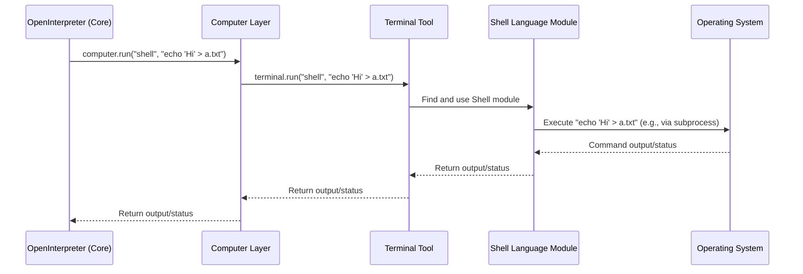
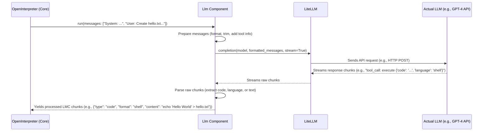
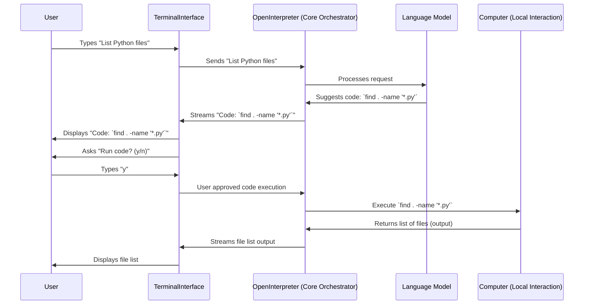
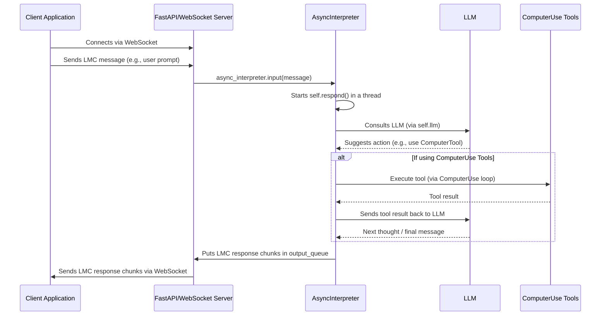
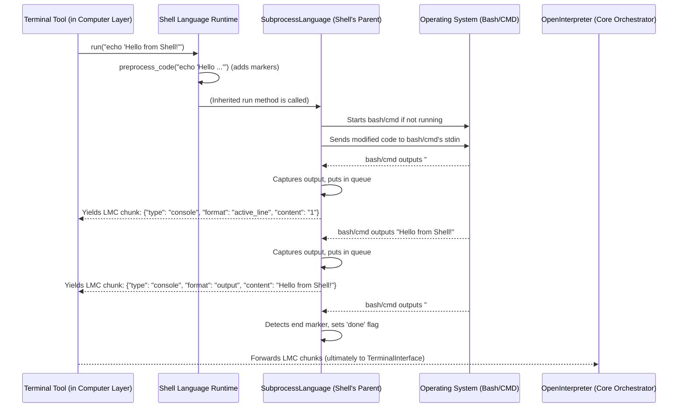
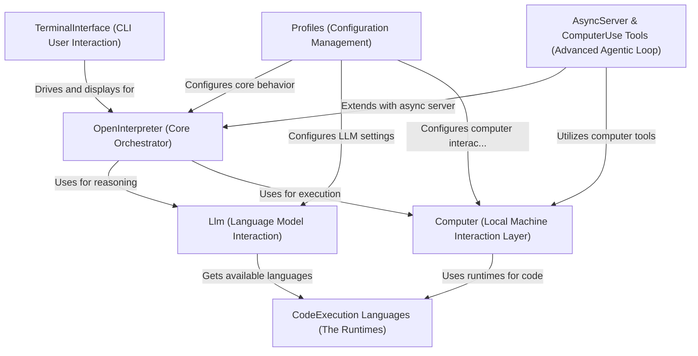
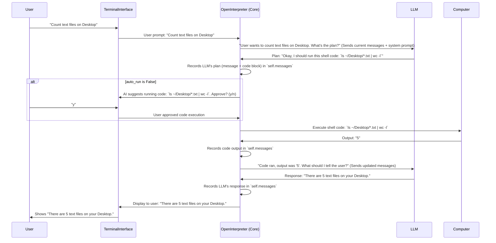

This file is a merged representation of the entire codebase, combining all repository files into a single document.
Generated by Repomix on: 2025-05-23 14:16:15

# File Summary

## Purpose:

This file contains a packed representation of the entire repository's contents.
It is designed to be easily consumable by AI systems for analysis, code review,
or other automated processes.

## File Format:

The content is organized as follows:
1. This summary section
2. Repository information
3. Repository structure
4. Multiple file entries, each consisting of:
   a. A header with the file path (## File: path/to/file)
   b. The full contents of the file in a code block

## Usage Guidelines:

- This file should be treated as read-only. Any changes should be made to the
  original repository files, not this packed version.
- When processing this file, use the file path to distinguish
  between different files in the repository.
- Be aware that this file may contain sensitive information. Handle it with
  the same level of security as you would the original repository.

## Notes:

- Some files may have been excluded based on .gitignore rules and Repomix's
  configuration.
- Binary files are not included in this packed representation. Please refer to
  the Repository Structure section for a complete list of file paths, including
  binary files.

## Additional Information:

For more information about Repomix, visit: https://github.com/andersonby/python-repomix


# Repository Structure

```
04_computer__local_machine_interaction_layer__.md
03_llm__language_model_interaction__.md
01_terminalinterface__cli_user_interaction__.md
07_asyncserver___computeruse_tools__advanced_agentic_loop__.md
06_profiles__configuration_management__.md
05_codeexecution_languages__the_runtimes__.md
index.md
02_openinterpreter__core_orchestrator__.md
```

# Repository Files


## 04_computer__local_machine_interaction_layer__.md

````markdown
# Chapter 4: Computer (Local Machine Interaction Layer)

In [Chapter 3: Llm (Language Model Interaction)](03_llm__language_model_interaction__.md), we saw how Open Interpreter uses a Large Language Model (LLM) as its "brain." The LLM is brilliant at understanding your requests and figuring out *what* needs to be done, often by suggesting code.

But how does that suggested code actually run? If the LLM says, "Create a file named `my_notes.txt` and write 'Hello Open Interpreter!' into it," what part of Open Interpreter actually *does* the creating and writing?

That's where the **Computer (Local Machine Interaction Layer)** comes in. This is the "hands and feet" of Open Interpreter, allowing it to interact with your actual computer.

## What is the Computer Layer? The Universal Remote for Your PC

Imagine you have a super-smart assistant (the LLM) who can tell you exactly which buttons to press on a universal remote control to get your TV, sound system, and lights to do what you want. The **Computer** layer in Open Interpreter is like that universal remote.

It's a collection of tools that the [OpenInterpreter (Core Orchestrator)](02_openinterpreter__core_orchestrator__.md) can use to:
*   **Run Code:** Execute scripts in various languages like Python, Shell (the command line on your Mac, Linux, or Windows), JavaScript, and more.
*   **Control Your Mouse and Keyboard:** Click buttons, type text, and move the mouse pointer.
*   **View Your Screen:** Take screenshots to "see" what's on your display.
*   **Manage Files:** Create, read, write, and delete files and folders.
*   **Access Applications:** Interact with your web browser, calendar, email, and other programs.

Essentially, the `Computer` layer provides a safe and structured way for the LLM (through the Core Orchestrator) to perform actions on your local machine.

Let's say our LLM decides the best way to create `my_notes.txt` is to use a shell command. The `Computer` layer is what takes that shell command and makes it happen.

## The "Buttons" on Our Universal Remote: Sub-Modules of `Computer`

The `Computer` object isn't just one giant "do everything" button. It's more like a remote control with many specialized buttons, each for a different kind of task. In Open Interpreter, these "buttons" are actually different sub-modules or tools that the `Computer` object manages.

Here are some of the most important ones:

*   **`Terminal`**: This is probably the most used tool. It's responsible for running code in different programming languages. If the LLM wants to execute a Python script or a shell command, it goes through the `Terminal`.
*   **`Mouse`**: Lets Open Interpreter control your mouse cursor – moving it, clicking, double-clicking, etc. (e.g., `computer.mouse.click("Submit Button")`).
*   **`Keyboard`**: Allows Open Interpreter to simulate typing on your keyboard (e.g., `computer.keyboard.write("Hello there!")`).
*   **`Display`**: Enables Open Interpreter to "see" your screen by taking screenshots (e.g., `computer.display.view()`) or finding text/icons on it.
*   **`Files`**: Provides functions for working with files and directories, like creating, reading, or deleting them (e.g., `computer.files.create("path/to/file.txt", "content")`).
*   **`Browser`**: Specifically for interacting with web browsers – opening URLs, searching, etc. (e.g., `computer.browser.search("latest news")`).

There are other tools too, for things like your calendar (`Calendar`), operating system tasks (`Os`), and even using AI for vision (`Vision`).

When Open Interpreter starts, the `Computer` object gets all these tools ready:

```python
# Simplified from interpreter/core/computer/computer.py
# This is what happens when the 'Computer' object is created

# Import the tools (like Terminal, Mouse, etc.)
from .terminal.terminal import Terminal
from .mouse.mouse import Mouse
from .keyboard.keyboard import Keyboard
from .display.display import Display
from .files.files import Files
# ... and others

class Computer:
    def __init__(self, interpreter):
        self.interpreter = interpreter # A way to talk back to the main orchestrator
        
        # Initialize its "tools"
        self.terminal = Terminal(self) # For running code
        self.mouse = Mouse(self)       # For controlling the mouse
        self.keyboard = Keyboard(self) # For controlling the keyboard
        self.display = Display(self)   # For screen interactions
        self.files = Files(self)       # For file system tasks
        # ... and more tools are initialized here.
```
This means that if the [OpenInterpreter (Core Orchestrator)](02_openinterpreter__core_orchestrator__.md) wants to run code, it can use `self.computer.terminal`. If it wants to click something, it uses `self.computer.mouse`, and so on.

## How Does the LLM Know What "Buttons" to Press?

A crucial part of the `Computer` layer is its ability to tell the LLM what it can do. When the `Computer` object is initialized, it creates a special "system message" that lists many of its available tools and how to use them. This message is like the instruction manual for our universal remote.

```python
# Conceptual snippet of the system message sent to the LLM
# (Generated by _get_all_computer_tools_signature_and_description in computer.py)

# THE COMPUTER API
# A python `computer` module is ALREADY IMPORTED, and can be used for many tasks:
# computer.os.say(text_to_speak) # Speaks text aloud using the operating system's text-to-speech.
# computer.files.create(path, content) # Creates a file at the specified path with the given content.
# computer.browser.search(query) # Searches the web for the specified query and returns the results.
# computer.mouse.click(text_to_click_on) # Clicks on the specified text on the screen.
# computer.keyboard.write(text_to_type) # Types the specified text.
# ... and many more commands
```
This "manual" is sent to the LLM (as part of the prompt we discussed in [Chapter 3](03_llm__language_model_interaction__.md)), so the LLM knows it can ask Open Interpreter to perform actions like `computer.files.create(...)` or `computer.terminal.run("shell", "...")`.

## Using the `Computer` Layer: Creating a File

Let's go back to our example: The LLM wants to create a file `my_notes.txt` with "Hello Open Interpreter!" inside. It decides the best way is a shell command: `echo "Hello Open Interpreter!" > my_notes.txt`.

Here's how the [OpenInterpreter (Core Orchestrator)](02_openinterpreter__core_orchestrator__.md) uses the `Computer` layer to make this happen:

1.  The LLM, through the [Llm (Language Model Interaction)](03_llm__language_model_interaction__.md) component, tells the Core Orchestrator: "I need to run a shell command: `echo "Hello Open Interpreter!" > my_notes.txt`".
2.  The Core Orchestrator has an instance of `Computer` (let's call it `interpreter.computer`).
3.  It then calls the `run` method on its `computer` object, specifying the language ("shell") and the code to execute:

    ```python
    # This happens inside the Core Orchestrator
    language = "shell"
    code_to_run = 'echo "Hello Open Interpreter!" > my_notes.txt'
    
    # Ask the Computer layer to run this code
    output = interpreter.computer.run(language, code_to_run)
    # 'output' will contain any messages from the command, like errors or printouts.
    ```
    If this command runs successfully, a file named `my_notes.txt` will appear in the current directory with "Hello Open Interpreter!" written inside it. If there's an error (e.g., no permission to write), `output` would contain the error message.

This `computer.run(language, code)` is a very common way the `Computer` layer is used, especially for executing code suggested by the LLM.

## A Peek Inside: How `computer.run()` Works

When `interpreter.computer.run("shell", "echo ...")` is called, what happens under the hood?

The `Computer` object's `run` method is often a direct shortcut to its `Terminal` tool.

```python
# Simplified from interpreter/core/computer/computer.py
class Computer:
    # ... (init method with self.terminal = Terminal(self) etc.) ...

    def run(self, language, code, stream=False, display=False):
        """
        Shortcut for computer.terminal.run
        """
        # It just passes the request to its terminal tool!
        return self.terminal.run(language, code, stream=stream, display=display)
```
So, `computer.run(...)` actually calls `computer.terminal.run(...)`. The `Terminal` tool is specialized in handling code execution.

Here's a simplified conceptual flow:



Let's look at the `Terminal`'s job more closely:

```python
# Simplified from interpreter/core/computer/terminal/terminal.py
# These are the classes for Python, Shell, etc. that actually run the code
from .languages.python import Python
from .languages.shell import Shell
# ... and other languages

class Terminal:
    def __init__(self, computer):
        self.computer = computer
        # A list of available language "experts"
        self.languages = [Python, Shell, JavaScript, ...] 
        self._active_languages = {} # Keeps track of active language environments

    def run(self, language_name, code, stream=False, display=False):
        # 1. Find the right "expert" for the requested language
        language_expert_class = self._get_language_expert(language_name) # Helper finds Shell class
        
        # 2. If this expert isn't already "active", set it up
        if language_name not in self._active_languages:
            # Create an instance of the Shell class (or Python, etc.)
            self._active_languages[language_name] = language_expert_class(self.computer)
        
        active_expert_instance = self._active_languages[language_name]
        
        # 3. Ask the expert instance to run the code
        # This is where the code actually gets executed!
        # It yields chunks of output (like print statements or errors)
        for chunk in active_expert_instance.run(code):
            # ... process and collect these chunks of output ...
            yield chunk # Send output back piece by piece
        
        # The real method handles collecting these chunks if not streaming
```
In simple terms:
1.  The `Terminal` gets the request: "Run this `shell` code: `echo "Hello..."`".
2.  It looks up its list of language "experts" (like `Shell`, `Python`, `JavaScript` classes). It finds the `Shell` expert.
3.  It gets an instance of this `Shell` expert ready.
4.  It hands the code (`echo "Hello..."`) to the `Shell` expert instance and says, "Run this!"
5.  The `Shell` expert instance then does the actual work of running the shell command using your computer's operating system. We'll learn more about these "experts" in the [next chapter](05_codeexecution_languages__the_runtimes__.md)!
6.  Any output or errors from the command are sent back up the chain.

## Other "Buttons": Interacting with the GUI and Files

Besides running code via `computer.terminal.run()`, the LLM can request other actions using the `Computer` layer's tools.

*   **Viewing the screen:**
    ```python
    # LLM might ask to see what's on the screen
    # Orchestrator calls:
    pil_image_of_screen = interpreter.computer.display.view() 
    # pil_image_of_screen is an image object that can be shown or analyzed
    ```
    This helps the LLM understand the current visual context.

*   **Clicking the mouse:**
    If the LLM, after seeing the screen, identifies a button with the text "Login", it might ask to click it.
    ```python
    # LLM: "Click on the 'Login' button."
    # Orchestrator calls:
    interpreter.computer.mouse.click("Login") 
    # This will try to find "Login" on screen and click it.
    # It can also click specific coordinates: interpreter.computer.mouse.click(x=100, y=250)
    ```

*   **Typing with the keyboard:**
    ```python
    # LLM: "Type 'myusername' into the focused field."
    # Orchestrator calls:
    interpreter.computer.keyboard.write("myusername")
    ```

*   **Listing files:**
    ```python
    # LLM: "What files are in the current directory?"
    # Orchestrator calls:
    list_of_files_and_folders = interpreter.computer.files.list_files(".") # "." means current directory
    # The result would be a list like ['my_notes.txt', 'another_folder', ...]
    ```

These are just a few examples. The `Computer` layer provides a rich set of tools for local interaction, all accessible via Python methods that the LLM can request.

## Safety and Structure

It's important that the LLM can't just do *anything* on your computer without some oversight. The `Computer` layer helps by:
*   **Providing specific functions:** The LLM calls defined functions (like `computer.files.delete()`) rather than having raw, unrestricted access.
*   **Logging:** Actions taken by the `Computer` layer are typically logged, so you can see what Open Interpreter has been doing.
*   **Permissions:** Some actions might still require your operating system's permissions (e.g., modifying system files).
*   **User Confirmation (via [TerminalInterface](01_terminalinterface__cli_user_interaction__.md)):** For code execution, Open Interpreter usually asks for your `y/n` approval before running anything, unless you've enabled `auto_run`.

This structured approach makes interactions safer and more predictable than giving an AI direct, uncontrolled access to your machine.

## Conclusion

The **Computer (Local Machine Interaction Layer)** is the essential bridge between the LLM's "thoughts" and actual "actions" on your computer. It acts like a universal remote, with various tools (`Terminal`, `Mouse`, `Keyboard`, `Display`, `Files`, etc.) that allow Open Interpreter to run code, control your GUI, manage files, and much more, all based on the LLM's instructions. It provides these capabilities in a structured and relatively safe manner.

We've seen that when the `Computer` layer needs to run code (e.g., `computer.terminal.run("python", "print('Hello')")`), it passes the task to a specific "language expert" or runtime. But what are these runtimes, and how do they actually execute code in Python, Shell, JavaScript, and other languages?

That's exactly what we'll explore in our next chapter: [Chapter 5: CodeExecution Languages (The Runtimes)](05_codeexecution_languages__the_runtimes__.md).

---

Generated by [AI Codebase Knowledge Builder](https://github.com/The-Pocket/Tutorial-Codebase-Knowledge)
````

## 03_llm__language_model_interaction__.md

````markdown
# Chapter 3: Llm (Language Model Interaction)

In the [previous chapter on the OpenInterpreter (Core Orchestrator)](02_openinterpreter__core_orchestrator__.md), we learned about the "project manager" that coordinates everything within Open Interpreter. It takes your requests, figures out a plan, and gets things done. A big part of "figuring out a plan" involves consulting a "strategist" – a powerful AI.

But how does the Core Orchestrator actually *talk* to this AI strategist? If the AI is like a brilliant thinker who only speaks a specific, highly structured language (or several different ones, depending on which AI you're using!), you need a specialized communicator. That's where the **Llm (Language Model Interaction)** component comes in.

## The "Brain's Communicator": Why We Need the `Llm` Component

Imagine you want Open Interpreter to "write a Python script that renames all .jpg files in my Pictures folder to include today's date."
The [OpenInterpreter (Core Orchestrator)](02_openinterpreter__core_orchestrator__.md) knows it needs an AI to figure out *how* to write that script. But:
*   How should it phrase the request to the AI (like GPT-4, Claude, or a local model via Ollama)?
*   How does it send this request over the internet (or locally) to the AI?
*   How does it understand the AI's response, especially if the AI wants to provide code?
*   What if you switch from using GPT-4 to a different AI model? Does everything break?

The `Llm` component is designed to solve these problems. Think of it as a highly skilled **translator and diplomat** for the Core Orchestrator. It knows:
1.  How to format your requests so the chosen AI can understand them.
2.  The specific "protocols" for talking to different AI providers.
3.  How to receive the AI's thoughts (which might be text, or a structured request to run code) and present them in a way the Core Orchestrator can use.

Without the `Llm` component, the Core Orchestrator would need to know the nitty-gritty details of every AI model and API out there, which would be incredibly complex!

## What is a Large Language Model (LLM)? (A Quick Refresher)

Before we dive into Open Interpreter's `Llm` component, let's quickly remember what a Large Language Model (LLM) is. An LLM (like GPT-4, Llama, Claude, Gemini, etc.) is an AI that's been trained on a massive amount of text and code. It's excellent at:
*   Understanding human language.
*   Generating human-like text.
*   Writing code.
*   Answering questions.
*   Summarizing information.
*   And much more!

In Open Interpreter, the LLM is the "thinking" part. It doesn't *do* things on your computer directly, but it *figures out what to do* and often *writes the code* to do it.

## Meet the `Llm` Component in Open Interpreter

The `Llm` class in Open Interpreter (found primarily in `interpreter/core/llm/llm.py`) is a dedicated module responsible for all interactions with the chosen LLM.

Its main jobs are:
*   **Sending Requests:** Taking the conversation history and the current user request (prepared by the Core Orchestrator) and sending it to the configured LLM.
*   **Receiving Responses:** Capturing what the LLM sends back. This could be a simple text message, or it could be a structured "function call" or "tool call" asking Open Interpreter to execute some code.
*   **Provider Agnostic:** Using a library called `LiteLLM`, it can talk to a wide variety of LLM providers (OpenAI, Azure, Anthropic, local models via Ollama, and many more) without the Core Orchestrator needing to know the specific details of each one.
*   **Formatting and Parsing:** Ensuring messages are in the right format for the LLM, and then parsing the LLM's response back into a format Open Interpreter can use (like extracting code blocks).

When the [OpenInterpreter (Core Orchestrator)](02_openinterpreter__core_orchestrator__.md) needs to "think" or get instructions from the AI, it turns to its `Llm` instance.

```python
# Simplified from interpreter/core/core.py (OpenInterpreter's __init__)

from interpreter.core.llm import Llm # Importing the Llm class

class OpenInterpreter:
    def __init__(self):
        # ... other initializations ...
        
        # Each OpenInterpreter instance has its own Llm instance
        self.llm = Llm(self) # 'self' here is the OpenInterpreter instance
        self.llm.model = "gpt-4o-mini" # Example: Set the default AI model
        
        # ... other initializations ...
```
In this snippet, when an `OpenInterpreter` object is created, it also creates an `Llm` object, storing it in `self.llm`. This `self.llm` object will handle all future AI communications.

## How Open Interpreter Uses the `Llm` Component

The primary way the Core Orchestrator interacts with the `Llm` component is through the `Llm.run()` method.

1.  **Prepare Messages:** The Core Orchestrator gathers all the messages in the current conversation (your prompts, previous AI responses, code outputs, etc.) and the "system message" (which tells the AI its role and how to behave).
2.  **Call `llm.run()`:** It passes these messages to `self.llm.run(messages)`.
3.  **Process Streamed Output:** The `Llm.run()` method doesn't return everything at once. It *streams* the LLM's response back in small chunks. This is why you see the AI's messages appearing word by word in the terminal. These chunks can be pieces of text or parts of a code block.

```python
# Simplified conceptual view of how OpenInterpreter uses Llm
# (Actual logic is in interpreter/core/respond.py)

class OpenInterpreter:
    # ... (init method from above) ...

    def _get_ai_response(self):
        messages_for_llm = self._prepare_messages_for_llm() # Gathers history, system prompt
        
        # The Llm component does the heavy lifting here!
        response_chunks = self.llm.run(messages_for_llm) # This is a generator
        
        for chunk in response_chunks:
            # 'chunk' could be {'type': 'message', 'content': 'Hello!'}
            # or {'type': 'code', 'format': 'python', 'content': 'print("Hi")'}
            self._process_ai_chunk(chunk) # Display it, or prepare to run code
```
The Core Orchestrator doesn't need to know if it's talking to GPT-4, Claude, or a local Ollama model. It just gives the messages to `self.llm.run()` and gets back standardized chunks of information.

## Key Features Handled by the `Llm` Component

Let's look at some important tasks the `Llm` component manages:

### 1. Message Formatting: Speaking the AI's Language

Different LLMs (and even different ways of using the same LLM, like with or without function calling) expect messages in a specific format. For example, OpenAI's API expects a list of message objects, each with a "role" (like "system", "user", or "assistant") and "content".

The `Llm` component uses helper functions, primarily `convert_to_openai_messages` (from `interpreter/core/llm/utils/convert_to_openai_messages.py`), to transform Open Interpreter's internal message list into the format required by the target LLM.

```python
# Conceptual: What convert_to_openai_messages helps achieve
# (Actual function is more complex)

def convert_my_messages_to_llm_format(internal_messages):
    llm_api_messages = []
    for msg in internal_messages:
        if msg["type"] == "user_prompt":
            llm_api_messages.append({"role": "user", "content": msg["text"]})
        elif msg["type"] == "ai_response":
            llm_api_messages.append({"role": "assistant", "content": msg["text"]})
        # ... and handles code, function calls, system messages, images etc.
    return llm_api_messages
```
This conversion ensures the AI gets the information in a way it can easily process. It also handles special content like images, converting them to a format the LLM can "see" if it's a vision-capable model.

### 2. Provider Abstraction (via LiteLLM): One Interface, Many AIs

You can tell Open Interpreter to use various LLMs from different providers (OpenAI, Anthropic, Google) or local models (via Ollama, LM Studio). The `Llm` component achieves this flexibility by using a fantastic library called `LiteLLM`.

`LiteLLM` acts as a standardized interface to over 100 different LLM APIs. The `Llm` component tells `LiteLLM` *which* model it wants to use (e.g., `"gpt-4o-mini"`, `"ollama/llama3"`, `"claude-3-opus"`), and `LiteLLM` handles the specific API calls, authentication, and other details for that provider.

```python
# Simplified from interpreter/core/llm/llm.py (inside Llm.run)
# Shows conceptual use of LiteLLM by the Llm component

import litellm # The magic library for talking to many LLMs

class Llm:
    # ... (other Llm methods) ...
    def run(self, messages):
        # ... (message preparation) ...
        
        params_for_litellm = {
            "model": self.model, # e.g., "gpt-4o-mini" or "ollama/llama3"
            "messages": formatted_messages, # Prepared by convert_to_openai_messages
            "stream": True, # We want responses chunk by chunk
            # ... other settings like temperature, api_key, api_base ...
        }
        
        # LiteLLM handles the actual call to the LLM provider
        response_stream = litellm.completion(**params_for_litellm)
        
        for chunk in response_stream:
            # Process 'chunk' and yield it in Open Interpreter's format
            # ... (parsing logic) ...
            yield processed_chunk 
```
This is a huge benefit! It means Open Interpreter can easily support new LLMs as `LiteLLM` adds support for them, without needing major changes in Open Interpreter's own code.

### 3. Function/Tool Calling vs. Text Prompts: Getting Structured Code

Modern LLMs often support "function calling" or "tool calling." This is a way for the LLM to not just respond with text, but to ask the application (Open Interpreter, in this case) to run a specific function with specific arguments. Open Interpreter uses this so the LLM can say, "Please execute this Python code: `print('Hello')`" in a structured way.

The `Llm` component, in conjunction with files like `interpreter/core/llm/run_tool_calling_llm.py` (or `run_function_calling_llm.py` for older OpenAI models), handles this:
*   It tells the LLM about the `execute` function that Open Interpreter provides (which can run code in different languages).
*   When the LLM responds with a "tool call" to `execute`, these scripts parse out the language and the code.

If an LLM *doesn't* support tool calling, Open Interpreter falls back to a text-based approach using `interpreter/core/llm/run_text_llm.py`. In this mode, the LLM is instructed to write code inside Markdown code blocks (e.g., ```python ... ```), and `run_text_llm.py` extracts the language and code from these blocks.

The `Llm.run()` method intelligently detects if the configured model supports tool/function calling and uses the appropriate strategy.

### 4. Context Management: Keeping the AI Focused (and Saving Costs!)

LLMs have a "context window" – a limit on how much text (conversation history + current prompt) they can consider at once. If the conversation gets too long, you can't send the whole thing.

The `Llm` component uses a library called `tokentrim` to intelligently shorten the conversation history if it exceeds the model's context window, usually by removing older messages while trying to preserve the most important information (like the system message and recent interactions). This is crucial for long conversations and also helps manage costs, as most LLM APIs charge based on the amount of text processed. This happens within the `Llm.run()` method before calling `litellm.completion()`.

## Under the Hood: A Call to the AI

Let's trace a simplified path of your request, "Create a file named hello.txt with 'Hello World' inside," once it reaches the `Llm` component.



**Step-by-step:**
1.  **Core Orchestrator calls `Llm.run()`:** It passes the current conversation history and system prompt.
2.  **`Llm` Prepares:**
    *   It uses `convert_to_openai_messages` to get messages into the right structure.
    *   It ensures the messages fit within the LLM's context window using `tokentrim`.
    *   It adds information about the `execute` tool if the LLM supports tool calling.
    *   (From `llm.py`): It checks if the model is loaded (e.g., for local Ollama models, it might need to ensure the model is pulled and running).
3.  **`Llm` calls `litellm.completion()`:** It passes the model name, formatted messages, and other parameters (like `stream=True`, API keys if needed, etc.) to `LiteLLM`.
4.  **`LiteLLM` Does its Magic:** `LiteLLM` identifies the provider based on the model name, constructs the correct API request for that specific provider, and sends it.
5.  **LLM Responds:** The actual LLM processes the request and starts streaming back its response (e.g., a decision to call the `execute` tool with shell code).
6.  **`LiteLLM` Streams Back:** `LiteLLM` receives these raw chunks and passes them back to the `Llm` component.
7.  **`Llm` Parses and Yields:**
    *   The `Llm` component (using helpers like `run_tool_calling_llm.py` or `run_text_llm.py`) processes these raw chunks.
    *   If it's a tool call for `execute`, it extracts the language and code.
    *   If it's a plain text response, it extracts the text.
    *   It then `yields` these processed pieces in Open Interpreter's standard "Language Model Conversation" (LMC) format (e.g., `{'type': 'code', 'format': 'shell', 'content': "echo 'Hello World' > hello.txt"}`) back to the Core Orchestrator.

This entire process ensures that the Core Orchestrator can communicate effectively with a wide range of LLMs without getting bogged down in the specific implementation details of each one.

```python
# Highly simplified snippet from Llm.run() in interpreter/core/llm/llm.py
# Illustrating the call to litellm and processing

class Llm:
    def run(self, messages):
        # 1. Prepare messages (conversion, trimming)
        openai_messages = convert_to_openai_messages(messages, ...) 
        trimmed_messages = tokentrim.trim(openai_messages, ...)
        
        request_params = {
            "model": self.model,
            "messages": trimmed_messages,
            "stream": True,
            # ... other params like api_key, temperature ...
        }

        # 2. Call LiteLLM
        llm_response_stream = self.completions(**request_params) # self.completions uses litellm.completion

        # 3. Process the stream (delegating to helper functions)
        if self.supports_functions: # Does the model support tool/function calls?
            # Uses run_tool_calling_llm to parse structured code calls
            yield from run_tool_calling_llm(self, request_params) 
        else:
            # Uses run_text_llm to parse code from Markdown blocks
            yield from run_text_llm(self, request_params)
```
The `run_tool_calling_llm` and `run_text_llm` functions are responsible for interpreting the specific format of the LLM's output and converting it into the LMC chunks that the rest of Open Interpreter understands.

## Conclusion

The **Llm (Language Model Interaction)** component is Open Interpreter's skilled diplomat and translator, enabling smooth and flexible communication with the AI "brain." It handles the complexities of different AI models and APIs, message formatting, and context management, primarily by leveraging the power of `LiteLLM`. This allows the [OpenInterpreter (Core Orchestrator)](02_openinterpreter__core_orchestrator__.md) to focus on the high-level task of managing the conversation and actions, rather than the specifics of AI communication.

So, the AI has now (via the `Llm` component) suggested some code to run. For example, it might suggest `echo 'Hello World' > hello.txt`. How does this code actually get executed on your computer? That's the job of our next component: the [Computer (Local Machine Interaction Layer)](04_computer__local_machine_interaction_layer__.md).

---

Generated by [AI Codebase Knowledge Builder](https://github.com/The-Pocket/Tutorial-Codebase-Knowledge)
````

## 01_terminalinterface__cli_user_interaction__.md

````markdown
# Chapter 1: TerminalInterface (CLI User Interaction)

Welcome to the world of Open Interpreter! If you've ever wished you could just *tell* your computer what to do in plain English, you're in the right place. Open Interpreter acts as a bridge, letting a powerful AI control your computer to accomplish tasks you describe.

But how do you *talk* to this AI? That's where our first key concept comes in: the **TerminalInterface**.

Imagine you want to find out how many text files are on your Desktop. Instead of manually opening folders and counting, or writing a script, you want to ask Open Interpreter. The `TerminalInterface` is the "chat window" in your computer's terminal where this conversation happens.

## What is the TerminalInterface?

Think of the `TerminalInterface` (often called the CLI, or Command Line Interface) as the main dashboard or control panel for Open Interpreter. It's where:
1.  You type your instructions (like "How many text files are on my Desktop?").
2.  You see the AI's responses, thoughts, and questions.
3.  You see any code the AI wants to run on your computer.
4.  You see the results of that code.
5.  You can use special commands (we call them "magic commands") to control the session.

It's your primary way of interacting with Open Interpreter, all within the familiar environment of your terminal.

## Your First Conversation

Let's see it in action! First, you'll need to have Open Interpreter installed. Once it is, open your terminal and type:

```bash
interpreter
```

After a moment, you'll see a prompt, usually `> `. This is the `TerminalInterface` waiting for your command!

Let's try asking it a simple question:

```text
> What time is it?
```

Here's a simplified idea of what happens next:
1.  **You:** Type `What time is it?` and press Enter.
2.  **TerminalInterface:** Takes your message.
3.  **Open Interpreter (Behind the Scenes):** The AI figures out it needs to run some code to get the time. It might decide to use Python.
4.  **TerminalInterface:** Shows you the Python code the AI wants to run, for example:
    ```python
    import datetime
    print(datetime.datetime.now())
    ```
5.  **TerminalInterface:** Asks for your permission: `Would you like to run this code? (y/n)` (This happens if `auto_run` is not enabled, which is the default for safety).
6.  **You:** Type `y` and press Enter.
7.  **Open Interpreter (Behind the Scenes):** Runs the code.
8.  **TerminalInterface:** Shows you the output, for example:
    `2023-10-27 14:35:10.123456`
9.  **TerminalInterface:** Might also show a friendly message from the AI, like "The current time is 2023-10-27 14:35:10."

And just like that, you've had your first interaction! The `TerminalInterface` managed this whole conversation.

## Key Features of the TerminalInterface

Let's break down what the `TerminalInterface` does.

### 1. Taking Your Commands

When you see the `> ` prompt, the `TerminalInterface` is ready for your input. You just type your request and hit Enter.

```python
# Simplified from interpreter/terminal_interface/utils/cli_input.py
# This is a glimpse of how Open Interpreter gets your text

def get_user_input():
    message = input("> ") # Python's built-in way to ask for user input
    return message
```
The `input("> ")` function is the workhorse here, capturing whatever you type.

**Multi-line Messages:** Sometimes your instructions are long. You can type multi-line messages by starting and ending with `"""` (three double quotes):

```text
> """
Can you please do two things for me:
1. Tell me the current date.
2. List all Python files in my current directory.
"""
```
The `TerminalInterface` (using a helper function like `cli_input` from `interpreter/terminal_interface/utils/cli_input.py`) will gather all the lines until it sees the closing `"""`.

### 2. Displaying Responses

The `TerminalInterface` is responsible for showing you everything that's happening:
*   **AI Messages:** Friendly text, questions, or explanations from the AI are displayed directly.
*   **Code Blocks:** When the AI wants to run code, it's shown in a nicely formatted block, often with syntax highlighting.
*   **Code Output:** The results of running code (like the time in our example, or a list of files) are also displayed.

These are handled by components like `MessageBlock` for text and `CodeBlock` for code and its output, found in `interpreter/terminal_interface/components/`.

### 3. Managing the Session (Interactivity)

A crucial part of the `TerminalInterface` is making the process interactive and safe. The most common example is **code execution approval**.

By default, Open Interpreter won't run any code without asking you first.

```python
# Simplified from interpreter/terminal_interface/terminal_interface.py
# This snippet shows the confirmation logic

# if a chunk from the AI is a 'confirmation' request:
#   if not interpreter.auto_run: # If auto_run is False
#       code_to_run = chunk["content"]["content"] # Get the code
#       language = chunk["content"]["format"]
#       print(f"Code to run ({language}):\n{code_to_run}")
#       response = input("  Would you like to run this code? (y/n)\n\n  ")
#       if response.strip().lower() == "y":
#           # User approved! Proceed to tell the core to run it.
#           pass 
#       else:
#           # User declined. Inform the AI.
#           interpreter.messages.append({"role": "user", "content": "I declined."})
```
This interactive step is a key safety feature, and the `TerminalInterface` manages this dialogue. If you want to bypass this for every command, you can start Open Interpreter with the `-y` flag (e.g., `interpreter -y`), which sets `auto_run` to true.

### 4. Special "Magic Commands"

Sometimes you want to control Open Interpreter itself, not just tell it to do tasks. For this, we have "magic commands." These are special instructions for the `TerminalInterface` that always start with a percent sign (`%`) or double percent (`%%`).

Here are a few common ones:
*   `%help`: Shows a list of all available magic commands and what they do.
*   `%reset`: Clears the current conversation history and starts fresh. It's like hitting a reset button on your chat.
*   `%undo`: Removes the last thing you said and the AI's response to it. Useful if you make a typo or want to try a different approach.
*   `%verbose`: Toggles verbose mode. When on, you'll see more detailed internal logs about what Open Interpreter is doing.
*   `%% [shell_command]`: Runs a command directly in your system's shell (like `%% ls -l` on Linux/macOS or `%% dir` on Windows). The output is shown directly.

When you type a magic command, the `TerminalInterface` intercepts it before it goes to the AI.

```python
# Simplified from interpreter/terminal_interface/magic_commands.py

def handle_magic_command(interpreter_instance, user_input):
    command_text = user_input[1:] # Remove the '%'
    
    if command_text == "help":
        # Call a function to display help
        handle_help(interpreter_instance, "") 
    elif command_text == "reset":
        interpreter_instance.reset()
        interpreter_instance.display_message("> Reset Done")
    # ... and so on for other magic commands
    elif user_input.startswith("%%"):
        shell_command = user_input[2:].strip()
        # Code to run the shell_command using the Computer layer
        interpreter_instance.computer.run("shell", shell_command)
```
The `handle_magic_command` function (from `interpreter/terminal_interface/magic_commands.py`) acts like a dispatcher, figuring out which magic command you typed and running the appropriate action.

## How It Works Under the Hood (A Gentle Peek)

Let's visualize the basic flow when you interact with Open Interpreter through the `TerminalInterface`.

1.  **You type a message** (e.g., "List Python files in my downloads folder") or a magic command (e.g., `%reset`).
2.  The main loop in `interpreter/terminal_interface/terminal_interface.py` reads your input.
3.  **Magic Command?** If your input starts with `%`, the `handle_magic_command` function (from `interpreter/terminal_interface/magic_commands.py`) is called to process it directly. The flow might end here (e.g., after `%reset`).
4.  **Regular Command?** If it's a regular instruction, the `TerminalInterface` passes it to the [OpenInterpreter (Core Orchestrator)](02_openinterpreter__core_orchestrator__.md). This is the central "brain" of the system.
5.  The Core Orchestrator then communicates with a Large Language Model (LLM) via the [Llm (Language Model Interaction)](03_llm__language_model_interaction__.md) component.
6.  The LLM processes your request and sends back its thoughts, which might include text responses or code to execute.
7.  If there's code to run (e.g., to list files), the Core Orchestrator might use the [Computer (Local Machine Interaction Layer)](04_computer__local_machine_interaction_layer__.md) to actually run that code on your system.
8.  All these pieces – AI messages, code suggestions, confirmation prompts, code outputs – are streamed back through the Core Orchestrator to the `TerminalInterface`.
9.  The `TerminalInterface` then displays these pieces to you in a structured way.

Here's a simplified diagram of this interaction:



## Starting Open Interpreter with Options (CLI Arguments)

When you run `interpreter` from your command line, you can add various flags (arguments) to customize its behavior right from the start. For example:

*   `interpreter --model gpt-4o-mini`: Tells Open Interpreter to use the `gpt-4o-mini` language model.
*   `interpreter -y` or `interpreter --auto_run`: Enables "auto run" mode, so Open Interpreter will execute code without asking for your confirmation each time (use with caution!).
*   `interpreter --profile local`: Loads a specific configuration profile, in this case, one set up for local models. We'll learn more about [Profiles (Configuration Management)](06_profiles__configuration_management__.md) in a later chapter.

These arguments are parsed by the `start_terminal_interface` function in `interpreter/terminal_interface/start_terminal_interface.py`.

```python
# Simplified concept from interpreter/terminal_interface/start_terminal_interface.py

def start_terminal_interface(interpreter_instance):
    # Uses a library (argparse) to define and read command-line arguments
    # For example, if you run: interpreter -y --model gpt-4o-mini

    # args.auto_run would be True
    if parsed_args.auto_run:
        interpreter_instance.auto_run = True
    
    # args.model would be "gpt-4o-mini"
    if parsed_args.model:
        interpreter_instance.llm.model = parsed_args.model
        
    # ... other arguments are processed ...

    # Finally, start the chat loop
    interpreter_instance.chat() 
```
These command-line arguments allow you to fine-tune how the `TerminalInterface` and the entire Open Interpreter system behave for your session.

## Conclusion

The `TerminalInterface` is your gateway to the power of Open Interpreter. It's more than just a simple input/output screen; it's an interactive environment that manages your conversation with the AI, handles code execution safely, and provides helpful tools like magic commands. You've seen how it takes your requests, shows you what the AI is doing, and helps you manage the whole process.

Now that you understand *how* you communicate with Open Interpreter, you might be wondering what's happening just beyond that interface. What coordinates the AI, the code execution, and all the other pieces? That's the job of the [OpenInterpreter (Core Orchestrator)](02_openinterpreter__core_orchestrator__.md), which we'll explore in the next chapter!

---

Generated by [AI Codebase Knowledge Builder](https://github.com/The-Pocket/Tutorial-Codebase-Knowledge)
````

## 07_asyncserver___computeruse_tools__advanced_agentic_loop__.md

````markdown
# Chapter 7: AsyncServer & ComputerUse Tools (Advanced Agentic Loop)

Welcome to the final chapter of our Open Interpreter journey! In [Chapter 6: Profiles (Configuration Management)](06_profiles__configuration_management__.md), we learned how to customize Open Interpreter's behavior using profiles, tailoring it to different tasks and preferences.

Now, we're going to explore a more advanced way Open Interpreter can operate. What if you want Open Interpreter to run continuously, perhaps as the backend for a custom application, or to handle complex, multi-step tasks that require very fine-grained control over your computer? This is where the `AsyncServer` and a specialized set of "ComputerUse" tools come into play, forming an advanced "agentic loop."

## What Problem Do These Solve? The Always-On, Fine-Grained Assistant

Imagine you want to build a custom desktop application where users can type instructions in a chat window, and Open Interpreter carries them out. Or, perhaps you want Open Interpreter to perform a long-running task like "Monitor my 'Work_Projects' folder. If any new '.docx' file appears, automatically convert it to '.pdf' and email it to my 'project_updates' email address."

For these kinds of scenarios:
1.  You need Open Interpreter to be "always on," listening for instructions or events, rather than just running once when you type `interpreter` in the terminal. This is where the **`AsyncServer`** helps.
2.  For really complex tasks that involve many small steps on your computer (like clicking specific buttons, typing in text fields, checking the screen, then running a command), you might want an AI that's especially good at planning and executing these "computer use" actions. The **`ComputerUse` tools** are designed for this.

Together, they enable a more powerful, persistent, and potentially interactive way for an AI to control your computer, almost like a dedicated digital assistant working in the background.

## Key Concept 1: The `AsyncServer` - Open Interpreter as a Service

Think of the regular Open Interpreter you run from the command line as a consultant you call in for specific tasks. The `AsyncServer` turns Open Interpreter into a full-time employee, always ready and listening for jobs.

*   **What is it?** The `AsyncServer` (`AsyncInterpreter` and its `Server` component) allows Open Interpreter to run as a background service that communicates using **WebSockets**. WebSockets are a technology that allows for real-time, two-way communication between a server (Open Interpreter) and a client (another program, like a desktop app or a web interface).
*   **Why use it?**
    *   **Remote Control:** Other applications can send instructions to Open Interpreter and receive results. This is perfect for building custom UIs or integrating Open Interpreter into larger systems.
    *   **Continuous Operation:** It can run indefinitely, waiting for tasks.
    *   **Asynchronous Tasks:** The "Async" part means it can handle operations without freezing, making it more responsive.
*   **How does it work (simply)?** When you start Open Interpreter in server mode, it listens on a specific network "address" (like a phone number). Other programs can connect to this address and "talk" to Open Interpreter using a structured message format called LMC (Language Model Conversation), which we've seen in previous chapters is how Open Interpreter internally represents messages, code, and outputs.

### Starting the Server

You can start Open Interpreter in server mode directly from your terminal:

```bash
interpreter --server
```

When you run this, Open Interpreter will start up and print a message like:
```text
Server will run at http://127.0.0.1:8000
```
This means Open Interpreter is now listening for WebSocket connections on your local computer at port `8000`. Another program (a "client") could then connect to `ws://127.0.0.1:8000/` to send it tasks and receive responses.

The `Dockerfile` in the Open Interpreter project shows an example of setting this up to run inside a Docker container, exposing this server capability.

```dockerfile
# Simplified from Dockerfile
# ... (setup steps) ...

# Expose port 8000
EXPOSE 8000

# Install server dependencies
RUN pip install ".[server]"

# Start the server
ENTRYPOINT ["interpreter", "--server"]
```
This Dockerfile sets up an environment where Open Interpreter starts in server mode automatically.

## Key Concept 2: `ComputerUse` Tools - Precision OS Control

While the [Computer (Local Machine Interaction Layer)](04_computer__local_machine_interaction_layer__.md) we discussed in Chapter 4 provides a general way for the LLM to request actions, the `computer_use` tools are a more specialized set, often used with AI models that are particularly good at breaking down tasks into fine-grained computer interactions.

Think of it as the difference between giving general instructions to a helper ("clean the room") versus giving very specific steps to a robot ("move to X,Y; pick up object A; place in bin B").

*   **What are they?** A collection of tools (`BashTool`, `ComputerTool`, `EditTool`) designed for an AI to interact with an operating system in a structured way. This system is often associated with Anthropic's Claude models, which can be trained to use these tools effectively in what's called an "agentic loop."
*   **The Agentic Loop:**
    1.  The AI (LLM) receives a task.
    2.  It decides which `computer_use` tool to use and with what parameters (e.g., `ComputerTool` action `mouse_move` to coordinate `100,200`).
    3.  The tool is executed.
    4.  The result of the tool (e.g., "mouse moved successfully," or a screenshot) is sent back to the AI.
    5.  The AI processes the result and decides the next step, repeating the cycle until the task is complete.
*   **Key Tools:**
    *   **`ComputerTool`** (`interpreter/computer_use/tools/computer.py`): This is for direct GUI interaction.
        *   `key`, `type`: Simulates keyboard presses or typing text.
        *   `mouse_move`, `left_click`, `right_click`, `double_click`, `left_click_drag`: Controls the mouse.
        *   `screenshot`: Takes a picture of the screen, which can be sent back to a vision-capable AI.
        *   `cursor_position`: Gets the current mouse coordinates.
    *   **`BashTool`** (`interpreter/computer_use/tools/bash.py`): For running shell commands. It maintains a persistent shell session.
    *   **`EditTool`** (`interpreter/computer_use/tools/edit.py`): For programmatic file editing with commands like:
        *   `view`: See file content or list directory content.
        *   `create`: Make a new file with given text.
        *   `str_replace`: Find and replace a unique string in a file.
        *   `insert`: Insert text at a specific line.
        *   `undo_edit`: Revert the last change to a file.

### Example: Using `ComputerTool`

Imagine the AI needs to click a button on the screen that says "Submit" after filling a form. It might decide to use the `ComputerTool`.

```python
# Conceptual use by the agentic loop
# (This code would be run by the logic in interpreter/computer_use/loop.py)

# AI decides: "I need to click on 'Submit'."
# The loop might translate this to:
tool_name = "computer"
action_parameters = {"action": "left_click", "coordinate": [500, 350]} # Assuming 'Submit' is at 500,350

# ... The loop then calls the ComputerTool ...
# result = computer_tool_instance(**action_parameters)
# 'result' would contain success/failure and maybe a new screenshot.
```
The AI doesn't directly write `pyautogui.click()`. Instead, it requests the `computer` tool to perform a `left_click` at certain coordinates. The `ComputerTool` then translates this into actual `pyautogui` calls. After most actions, `ComputerTool` automatically takes a screenshot and sends it back as part of the result, so the AI can "see" what happened.

### How `interpreter --os` Relates

When you run Open Interpreter with the `--os` flag (or load the `os` [Profile](06_profiles__configuration_management__.md)), it often uses these `computer_use` tools with a compatible LLM (like Claude 3.5 Sonnet). This mode is optimized for OS control tasks. The `sampling_loop` in `interpreter/computer_use/loop.py` is central to this functionality, managing the interaction with the LLM and these specialized tools.

## How the Server and Tools Can Work Together

While `AsyncServer` and `ComputerUse` tools are distinct, they can be combined:
1.  You could run `AsyncInterpreter` as a server.
2.  A client application could send a complex task to this server.
3.  The `AsyncInterpreter` instance, if configured with an LLM and tools suitable for `computer_use` (like when using the `os` profile), would then use the `ComputerUse` agentic loop (e.g., the `sampling_loop`) to break down the task and execute it using `BashTool`, `ComputerTool`, etc.

This setup allows for powerful, remotely-triggered agentic behavior.

## Under the Hood: A Glimpse into the Mechanisms

Let's briefly look at how these advanced components are structured.

### 1. `AsyncServer` Internals

The server functionality is primarily in `interpreter/core/async_core.py`.

*   **`AsyncInterpreter(OpenInterpreter)`:**
    *   This class inherits from the standard `OpenInterpreter` (our [Core Orchestrator](02_openinterpreter__core_orchestrator__.md)).
    *   It overrides methods like `input()` and adds `output()` to work asynchronously.
    *   It uses a `threading.Thread` to run the `respond()` method (which does the thinking and acting) in the background, so the server doesn't freeze.
    *   It uses `janus.Queue` to safely pass messages between the asynchronous server part and the synchronous `OpenInterpreter` core logic.

    ```python
    # Simplified from interpreter/core/async_core.py
    class AsyncInterpreter(OpenInterpreter):
        async def input(self, chunk): # Receives messages from the client
            # ... accumulates message chunks ...
            if "end" in chunk: # User/client finished sending a message block
                self.stop_event.clear()
                # Run the main response logic in a separate thread
                self.respond_thread = threading.Thread(target=self.respond)
                self.respond_thread.start()

        async def output(self): # Sends messages back to the client
            if self.output_queue is None:
                self.output_queue = janus.Queue() # For async communication
            return await self.output_queue.async_q.get() # Get next message chunk
    ```

*   **`Server` Class:**
    *   Uses `FastAPI` (a web framework) to create the web server and `Uvicorn` to run it.
    *   Defines a WebSocket endpoint (usually at `/`).
    *   When a client connects via WebSocket, the `websocket_endpoint` function handles:
        *   Receiving messages (LMC chunks) from the client.
        *   Passing these messages to `async_interpreter.input()`.
        *   Continuously getting messages from `async_interpreter.output()` and sending them back to the client.

    ```python
    # Simplified concept from create_router in interpreter/core/async_core.py
    # @router.websocket("/")
    async def websocket_endpoint(websocket: WebSocket, async_interpreter: AsyncInterpreter):
        await websocket.accept()
        
        async def receive_input_from_client():
            while True: # Keep listening for client messages
                data = await websocket.receive_json() # Or receive_text/bytes
                await async_interpreter.input(data) # Pass to interpreter
        
        async def send_output_to_client():
            while True: # Keep sending interpreter's output
                chunk = await async_interpreter.output() # Get output
                await websocket.send_json(chunk) # Send to client
                if chunk.get("content") == "complete": break # End of a response sequence
        
        # Run both tasks concurrently
        await asyncio.gather(receive_input_from_client(), send_output_to_client())
    ```

A simplified flow:


### 2. `ComputerUse` Tools Internals

These tools are primarily found in `interpreter/computer_use/tools/` and are orchestrated by `interpreter/computer_use/loop.py`.

*   **`sampling_loop` (`interpreter/computer_use/loop.py`):**
    *   This asynchronous function is the heart of the agentic behavior for `computer_use`.
    *   It takes the current conversation `messages`.
    *   It calls an LLM (typically an Anthropic model like Claude, using `client.beta.messages.create`) with the messages and the list of available `computer_use` tools.
    *   The LLM responds. If the response includes a request to use a tool (a "tool_use" content block):
        *   The `sampling_loop` extracts the tool name and input parameters.
        *   It uses `ToolCollection` to find and run the correct tool (e.g., `ComputerTool`, `BashTool`).
        *   The tool executes its action (e.g., `pyautogui.click()` for `ComputerTool`).
        *   The tool returns a `ToolResult` (output, error, maybe a screenshot).
        *   This `ToolResult` is formatted and added to the `messages`.
        *   The loop continues, sending the updated `messages` (including the tool result) back to the LLM for the next step.
    *   If the LLM responds with a text message, it's yielded back to the caller (e.g., to be displayed to the user).

```python
# Highly simplified concept of the sampling_loop from interpreter/computer_use/loop.py
async def sampling_loop(messages, llm_client, tool_collection):
    while True:
        # 1. Call LLM with current messages and tool definitions
        llm_response = await llm_client.beta.messages.create(messages=messages, tools=tool_collection.to_params(), ...)
        
        assistant_message_content = [] # To store what the LLM said/did
        tool_results_for_next_iteration = []

        for content_block in llm_response.content:
            if content_block.type == "text":
                # AI sent a text message
                assistant_message_content.append({"type": "text", "text": content_block.text})
                # (yield this text to be displayed)
            elif content_block.type == "tool_use":
                # AI wants to use a tool
                tool_name = content_block.name
                tool_input = content_block.input
                tool_use_id = content_block.id
                
                # 2. Execute the requested tool
                result = await tool_collection.run(name=tool_name, tool_input=tool_input)
                
                # 3. Prepare tool result for next LLM call
                tool_results_for_next_iteration.append(
                    {"type": "tool_result", "tool_use_id": tool_use_id, "content": result.output, ...}
                )
                # (yield tool execution details to be displayed)
        
        messages.append({"role": "assistant", "content": assistant_message_content}) # Add AI's text to history
        if not tool_results_for_next_iteration:
            break # Task is done if no more tools were called
        
        messages.append({"role": "user", "content": tool_results_for_next_iteration}) # Add tool results for LLM context
```

*   **Individual Tools (e.g., `ComputerTool` in `interpreter/computer_use/tools/computer.py`):**
    *   Each tool class (like `ComputerTool`, `BashTool`, `EditTool`) inherits from `BaseAnthropicTool`.
    *   It implements an `async def __call__(self, **kwargs)` method that takes parameters specific to that tool's actions (e.g., `action`, `coordinate` for `ComputerTool`).
    *   Inside `__call__`, it performs the actual OS interaction (e.g., using `pyautogui` for mouse/keyboard, `subprocess` for shell commands).
    *   It returns a `ToolResult` object, which can include text output, error messages, and even base64 encoded image data (for screenshots).

    ```python
    # Simplified from interpreter/computer_use/tools/computer.py
    class ComputerTool(BaseAnthropicTool):
        async def __call__(self, action: str, text: str = None, coordinate: tuple = None, **kwargs):
            if action == "left_click":
                # (Scale coordinates if needed)
                pyautogui.click(button="left") # Actual OS interaction
                # (Take screenshot)
                # return ToolResult(base64_image=screenshot_data, output="Clicked left mouse button.")
            elif action == "type":
                pyautogui.write(text)
                # (Take screenshot)
                # return ToolResult(base64_image=screenshot_data, output=f"Typed: {text}")
            # ... other actions ...
    ```

This agentic loop with `ComputerUse` tools allows for a very detailed, step-by-step execution of tasks, where the AI continuously observes (via screenshots or command outputs) and acts.

## Conclusion

The `AsyncServer` and `ComputerUse` tools represent a significant step up in Open Interpreter's capabilities, moving it from a command-line utility to a more versatile and powerful AI agent.
*   The **`AsyncServer`** allows Open Interpreter to run as a persistent service, interactable via WebSockets, making it suitable as a backend for other applications.
*   The **`ComputerUse` tools** provide a framework for fine-grained OS interaction, enabling AI models (especially those trained for tool use, like some Claude models) to perform complex, multi-step tasks on your computer by directly controlling the mouse, keyboard, shell, and file editor in a tight feedback loop.

These advanced features open up exciting possibilities for building sophisticated applications and autonomous agents powered by Open Interpreter. While they are more complex than the basic CLI usage, they unlock a new level of power and flexibility.

This marks the end of our tutorial series on the core concepts of Open Interpreter. We hope this journey has given you a solid understanding of how Open Interpreter works, from its user interface to its deep internals, and inspires you to explore its potential further!

---

Generated by [AI Codebase Knowledge Builder](https://github.com/The-Pocket/Tutorial-Codebase-Knowledge)
````

## 05_codeexecution_languages__the_runtimes__.md

````markdown
# Chapter 5: CodeExecution Languages (The Runtimes)

In [Chapter 4: Computer (Local Machine Interaction Layer)](04_computer__local_machine_interaction_layer__.md), we explored how Open Interpreter uses its `Computer` layer to interact with your machine. We saw that a key part of this is the `computer.terminal.run(language, code)` method, which is responsible for actually executing code snippets suggested by the LLM.

But how does `computer.terminal.run("python", "print('Hello from Python!')")` actually *run* Python code? And how does it handle Shell commands, JavaScript, or potentially other languages? This is where **CodeExecution Languages (The Runtimes)** come into play. They are the specialized engines under the hood that bring code to life.

## The "Language Experts" for Your Code

Imagine the `Computer` layer's `Terminal` tool is like a workshop manager. When the LLM sends a piece of Python code, the manager doesn't try to figure out Python itself. Instead, it hands the code to a "Python Expert" in the workshop. If it's a Shell command, it goes to a "Shell Expert."

These "experts" are what we call **CodeExecution Languages** or **Runtimes**. Each runtime is a specialized component within Open Interpreter that knows everything about:
1.  Taking a string of code for a specific language (like Python, Shell, JavaScript).
2.  Executing that code in the correct environment.
3.  Capturing any output produced by the code (like text printed to the console, error messages, or even images generated by a Python script).
4.  Sending this output back to the [OpenInterpreter (Core Orchestrator)](02_openinterpreter__core_orchestrator__.md) in a standardized way, so the LLM can see the results.

Let's say the LLM wants to find out the current date using Python. It might suggest:
```python
import datetime
print(datetime.date.today())
```
The `Computer` layer's `Terminal` tool would pass this code and the language "python" to the Python runtime. The Python runtime executes it, captures the output (e.g., `2023-10-27`), and sends it back.

## The Blueprint: `BaseLanguage`

To keep things organized and allow Open Interpreter to easily support new languages in the future, all language runtimes are built from a common blueprint. This blueprint is a Python class called `BaseLanguage` (found in `interpreter/core/computer/terminal/base_language.py`).

Think of `BaseLanguage` as a contract that every "language expert" must follow. It defines what basic things each expert must be able to do.

```python
# Simplified from interpreter/core/computer/terminal/base_language.py
class BaseLanguage:
    # How the LLM refers to this language (e.g., "python", "shell")
    name = "baselanguage" 
    # Default file extension (optional, used for some features like code scanning)
    file_extension = "txt" 
    # Other names the LLM might use for this language (optional)
    aliases = []    

    def run(self, code_string):
        """
        The most important method! Executes the code.
        It must 'yield' results piece by piece in a standard format.
        Example output chunk: 
        {"type": "console", "format": "output", "content": "Hello from code!"}
        """
        # A real language runtime would override this to actually run code.
        yield {"type": "console", "format": "output", "content": "Code ran (default BaseLanguage behavior)"}
    
    def stop(self):
        """ Tells the runtime to try and stop the currently running code. """
        pass 
    
    def terminate(self):
        """ Tells the runtime to clean up completely (e.g., close any running processes). """
        pass
```
**Key takeaways from `BaseLanguage`:**
*   `name`, `file_extension`, `aliases`: Help identify the language.
*   `run(code_string)`: This is the core method. It takes the code as a string, runs it, and `yields` any output. The output is structured (we call this the Language Model Conversation or LMC format), often as dictionary chunks like `{"type": "console", "format": "output", "content": "..."}`. This allows the [TerminalInterface (CLI User Interaction)](01_terminalinterface__cli_user_interaction__.md) to display different kinds of output correctly (text, images, active line numbers, etc.).
*   `stop()` and `terminate()`: Methods to control the execution, like stopping a long-running script or shutting down the language environment.

Any new language Open Interpreter wants to support (say, Ruby or R) would have its own class that "inherits" from `BaseLanguage` and provides the specific logic for the `run` method for that language.

## Common Case: Running Code in a Subprocess (`SubprocessLanguage`)

Many programming languages are run as separate programs (processes) on your computer. For example, when you run a shell script, your operating system starts a shell process. When you run a JavaScript file with Node.js, it starts a `node` process.

To handle these common cases, Open Interpreter has another helpful parent class called `SubprocessLanguage` (found in `interpreter/core/computer/terminal/languages/subprocess_language.py`). It inherits from `BaseLanguage` and provides a lot of the common machinery for:
*   Starting an external process (like `bash` or `node`).
*   Sending code to that process's input (stdin).
*   Reading output from its standard output (stdout) and standard error (stderr).
*   Knowing when the code has finished executing.

Languages like Shell and JavaScript in Open Interpreter use `SubprocessLanguage` as their direct parent.

```python
# Highly simplified concept of SubprocessLanguage
# interpreter/core/computer/terminal/languages/subprocess_language.py
import subprocess # For running external programs
import queue      # For collecting output from the process
import threading  # To read output without freezing the main program

class SubprocessLanguage(BaseLanguage): # It's a type of BaseLanguage
    def __init__(self):
        super().__init__()
        self.start_cmd = [] # e.g., ["bash"] for Shell, or ["node", "-i"] for JavaScript
        self.process = None # This will hold the running subprocess (like bash)
        self.output_queue = queue.Queue() # Output lines go here
        self.done = threading.Event() # A flag to signal when execution is finished

    def start_process(self):
        # This method (simplified here) would:
        # 1. Create self.process = subprocess.Popen(self.start_cmd, stdin=PIPE, stdout=PIPE, ...)
        # 2. Start background threads to continuously read self.process.stdout and
        #    self.process.stderr, putting each line into self.output_queue.
        # 3. These threads also watch for special "end of execution" markers.
        print(f"Starting subprocess with: {self.start_cmd}") # Placeholder
        pass 

    def preprocess_code(self, code):
        # Child classes (like Shell) often override this to add special markers
        # to the code, like an "echo '##END_OF_EXECUTION##'" command.
        # This helps know when the specific block of code is done.
        return code 

    def run(self, code):
        processed_code = self.preprocess_code(code)
        
        # If the process isn't running, or if it crashed, start it.
        if not self.process or self.process.poll() is not None:
            self.start_process()

        self.done.clear() # Reset the "done" flag for this new execution
        self.process.stdin.write(processed_code + "\n") # Send code to the process
        self.process.stdin.flush() # Make sure it's sent

        # Collect output from the queue until the 'done' flag is set
        # or the queue is empty after being done.
        while not self.done.is_set() or not self.output_queue.empty():
            try:
                output_chunk = self.output_queue.get(timeout=0.05) # Get an output line
                yield output_chunk # Send it back to Open Interpreter
            except queue.Empty: # If the queue is empty for a moment
                if self.done.is_set(): # And we know execution finished
                    break # Then exit the loop
```
This class handles a lot of the tricky parts of managing external processes. Individual language runtimes like `Shell` just need to tell `SubprocessLanguage` *how* to start the process (the `start_cmd`) and how to `preprocess_code` with any special markers.

### Example: The `Shell` Runtime

Let's see how the `Shell` runtime (in `interpreter/core/computer/terminal/languages/shell.py`) uses `SubprocessLanguage`.

```python
# Simplified from interpreter/core/computer/terminal/languages/shell.py
import platform # To check if Windows, Mac, Linux
import os       # For os.environ.get to find default shell
from .subprocess_language import SubprocessLanguage # Our parent class

# A helper function (simplified) to prepare shell code
def internal_preprocess_shell_code(code_string):
    # Adds shell commands to track active lines and signal completion.
    # For example, it might turn "ls -l" into:
    # echo "##active_line1##"
    # ls -l
    # echo "##end_of_execution##"
    return f'echo "##active_line1##"\n{code_string}\necho "##end_of_execution##"'

class Shell(SubprocessLanguage): # Inherits from SubprocessLanguage
    name = "Shell"
    aliases = ["bash", "sh", "zsh", "batch", "bat"] # Names LLM can use

    def __init__(self):
        super().__init__() # Initialize the SubprocessLanguage parent
        # Set the command to start a shell based on the Operating System
        if platform.system() == "Windows":
            self.start_cmd = ["cmd.exe"] # Use Command Prompt on Windows
        else:
            self.start_cmd = [os.environ.get("SHELL", "bash")] # Use user's SHELL or bash
    
    def preprocess_code(self, code):
        # Use our helper to add necessary shell commands for tracking
        return internal_preprocess_shell_code(code)
```
When the `Computer` layer asks to run shell code like `ls -l`:
1.  The `Terminal` tool finds the `Shell` runtime instance.
2.  It calls `shell_runtime.run("ls -l")`.
3.  The `Shell` runtime's `preprocess_code` (via `internal_preprocess_shell_code`) turns "ls -l" into something like `echo "##active_line1##"\nls -l\necho "##end_of_execution##"`.
4.  The `run` method (inherited from `SubprocessLanguage`) sends this modified code to the running shell process (e.g., `bash`).
5.  The `SubprocessLanguage` machinery captures the output from `bash` (the active line marker, the file listing, and the end of execution marker) and yields it back as LMC chunks.

## The Special Case: Python (with Jupyter)

Running Python code in Open Interpreter is a bit more sophisticated. Instead of just a simple subprocess, Open Interpreter uses a **Jupyter Kernel** behind the scenes. This is handled by the `JupyterLanguage` class (in `interpreter/core/computer/terminal/languages/jupyter_language.py`), which the `Python` runtime class inherits from.

Why Jupyter?
*   **Rich Output:** Jupyter kernels can output not just text, but also images (like Matplotlib plots), HTML, and other rich media. Open Interpreter can capture these and show them to you or even send images to vision-enabled LLMs.
*   **Persistent State:** A Jupyter kernel keeps its state (variables, imported modules) between code executions in the same session. This is how you can define a variable in one Python block and use it in the next.
*   **Interactive Features:** Better support for things that might require input during execution (though this is complex).

Here's a highly conceptual look at how `JupyterLanguage` works:

```python
# Highly Conceptual & Simplified from interpreter/core/computer/terminal/languages/jupyter_language.py
from jupyter_client import KernelManager # Manages the Jupyter kernel process
# from ..base_language import BaseLanguage # (already imported by parent)

class JupyterLanguage(BaseLanguage): # Python runtime class inherits this
    name = "Python" # (This is actually set in the Python class itself)

    def __init__(self, computer_reference): # Needs a reference to the Computer for settings
        self.computer = computer_reference
        # Start a Jupyter kernel (like a hidden Python interpreter)
        self.kernel_manager = KernelManager(kernel_name="python3")
        self.kernel_manager.start_kernel()
        # Create a client to talk to this kernel
        self.kernel_client = self.kernel_manager.client()
        self.kernel_client.start_channels() 
        # ... (code to wait for kernel to be fully ready & set up things like matplotlib) ...

    def run(self, code_string):
        # Optional: Preprocess code_string (e.g., to add active line tracking)
        # preprocessed_code = self.preprocess_python_code(code_string)
        
        self.kernel_client.execute(code_string) # Send the code to the Jupyter kernel

        # Loop to get all messages (output, errors, images) back from the kernel
        while True:
            try:
                # Get a message from the kernel's communication channel
                message = self.kernel_client.iopub_channel.get_msg(timeout=0.1)
            except Exception: # Usually queue.Empty if no message quickly
                # If kernel is idle and no more messages, we might be done for this execution.
                # (Real logic here is more complex to reliably detect end of output for current code block)
                if self.is_kernel_idle_and_finished_output(message): # Pseudocode for check
                    break 
                continue # Keep trying to get messages

            # Process the 'message' (which is a complex dictionary)
            # and 'yield' it in Open Interpreter's standard LMC format.
            # For example, if it's text output:
            #   yield {"type": "console", "format": "output", "content": text_from_message}
            # If it's a PNG image (e.g., from matplotlib):
            #   yield {"type": "image", "format": "base64.png", "content": png_data_from_message}
            yield self.convert_jupyter_message_to_lmc(message) # Pseudocode

    # ... (helper methods like is_kernel_idle_and_finished_output, convert_jupyter_message_to_lmc) ...

    def terminate(self):
        # Properly shut down the Jupyter kernel and its communication channels
        self.kernel_client.stop_channels()
        self.kernel_manager.shutdown_kernel(now=True)

# Then, in interpreter/core/computer/terminal/languages/python.py:
# class Python(JupyterLanguage):
#     # It mostly just uses all the features from JupyterLanguage!
#     pass 
```
When the `Python` runtime (which uses `JupyterLanguage`) gets code like `print("Hello from Python!")`:
1.  The code is sent to the active Jupyter kernel.
2.  The kernel runs it.
3.  The `JupyterLanguage` instance listens for messages from the kernel.
4.  When the kernel sends a message saying "text output: 'Hello from Python!'", the `JupyterLanguage` instance converts this into an LMC chunk (`{"type": "console", "format": "output", "content": "Hello from Python!"}`) and yields it.
5.  If the Python code was `import matplotlib.pyplot as plt; plt.plot([1,2,3]); plt.show()`, the kernel would send an image message, which `JupyterLanguage` would convert to an LMC image chunk.

## The Journey of Code Execution

Let's trace how a command like `computer.terminal.run("shell", "echo 'Hello from Shell!'")` flows through these layers:


This diagram shows how the `Terminal` tool uses the specific `ShellRuntime`, which in turn relies on `SubprocessLanguage` to interact with the operating system's shell. The output comes back as structured LMC chunks.

## Conclusion

The CodeExecution Languages (Runtimes) are the specialized workhorses that actually execute the code suggested by the LLM. Each language (Python, Shell, JavaScript, etc.) has its own runtime class, typically inheriting from `BaseLanguage` or the more specific `SubprocessLanguage`.
*   The `BaseLanguage` class defines the common interface all runtimes must implement, especially the `run()` method that executes code and yields output in a standard LMC format.
*   `SubprocessLanguage` provides a robust foundation for languages that run as external command-line processes.
*   The Python runtime, using `JupyterLanguage`, leverages Jupyter kernels for rich output and persistent state, making Python interactions particularly powerful.

These runtimes are the final link in the chain, turning the LLM's abstract code suggestions into concrete actions and results on your computer. They ensure that code is executed correctly for its language and that all output is captured and reported back.

Now that we've seen how Open Interpreter talks to you via the [TerminalInterface (CLI User Interaction)](01_terminalinterface__cli_user_interaction__.md), how the [OpenInterpreter (Core Orchestrator)](02_openinterpreter__core_orchestrator__.md) manages the flow, how it consults the [Llm (Language Model Interaction)](03_llm__language_model_interaction__.md), and how the [Computer (Local Machine Interaction Layer)](04_computer__local_machine_interaction_layer__.md) uses these Runtimes to act, you might be wondering: how do we configure all these different parts? How do we tell Open Interpreter which LLM to use, whether to ask for permission before running code (`auto_run`), or set other preferences? That's where our next chapter comes in: [Chapter 6: Profiles (Configuration Management)](06_profiles__configuration_management__.md).

---

Generated by [AI Codebase Knowledge Builder](https://github.com/The-Pocket/Tutorial-Codebase-Knowledge)
````

## index.md

````markdown
# Tutorial: open-interpreter

Open Interpreter acts as an *AI assistant* that can operate your computer. You give it instructions as **text prompts**, and it uses a Large Language Model (LLM) to understand these prompts and generate code. This code is then executed on your *local machine* to perform a wide variety of tasks, from file manipulation to controlling applications. It offers a command-line interface and can be configured using profiles.


**Source Repository:** [https://github.com/OpenInterpreter/open-interpreter.git](https://github.com/OpenInterpreter/open-interpreter.git)



## Chapters

1. [TerminalInterface (CLI User Interaction)
](01_terminalinterface__cli_user_interaction__.md)
2. [OpenInterpreter (Core Orchestrator)
](02_openinterpreter__core_orchestrator__.md)
3. [Llm (Language Model Interaction)
](03_llm__language_model_interaction__.md)
4. [Computer (Local Machine Interaction Layer)
](04_computer__local_machine_interaction_layer__.md)
5. [CodeExecution Languages (The Runtimes)
](05_codeexecution_languages__the_runtimes__.md)
6. [Profiles (Configuration Management)
](06_profiles__configuration_management__.md)
7. [AsyncServer & ComputerUse Tools (Advanced Agentic Loop)
](07_asyncserver___computeruse_tools__advanced_agentic_loop__.md)


---

Generated by [AI Codebase Knowledge Builder](https://github.com/The-Pocket/Tutorial-Codebase-Knowledge)
````

## 02_openinterpreter__core_orchestrator__.md

````markdown
# Chapter 2: OpenInterpreter (Core Orchestrator)

In [Chapter 1: TerminalInterface (CLI User Interaction)](01_terminalinterface__cli_user_interaction__.md), we learned how you, the user, can talk to Open Interpreter using the command line. You type your requests, see what the AI is thinking, approve code, and view results, all within your terminal.

But who is actually "thinking"? Who decides what to do with your request like "How many text files are on my Desktop?" Who coordinates between the AI's brain and your computer's ability to *do* things?

That's where the **OpenInterpreter (Core Orchestrator)** comes in. It's the main brain of the entire operation, the project manager that makes everything work together.

## What is the OpenInterpreter (Core Orchestrator)?

Imagine you're managing a complex project. You have a brilliant strategist (the Language Model or LLM) who can come up with plans, and you have a skilled worker (the Computer) who can execute tasks. Your job as the project manager is to:
1.  Receive the overall goal (your prompt from the [TerminalInterface (CLI User Interaction)](01_terminalinterface__cli_user_interaction__.md)).
2.  Discuss the goal with the strategist (LLM) to break it down into actionable steps, possibly involving code.
3.  If code needs to be run, pass it to the worker (Computer).
4.  Get the results from the worker (Computer) and show them to the strategist (LLM) for review or further planning.
5.  Keep track of the entire conversation and all actions taken.
6.  Communicate progress and final results back to whoever gave you the goal.

The `OpenInterpreter` class (often just called `interpreter` in the code) is exactly this project manager. It's the central hub connecting the [TerminalInterface (CLI User Interaction)](01_terminalinterface__cli_user_interaction__.md), the [Llm (Language Model Interaction)](03_llm__language_model_interaction__.md), and the [Computer (Local Machine Interaction Layer)](04_computer__local_machine_interaction_layer__.md).

Let's revisit our example: "How many text files are on my Desktop?"
*   You type this into the [TerminalInterface (CLI User Interaction)](01_terminalinterface__cli_user_interaction__.md).
*   The `TerminalInterface` passes this task to the `OpenInterpreter` (our project manager).
*   The `OpenInterpreter` then takes charge of getting it done.

## How the Orchestrator Works: A High-Level View

When you give `OpenInterpreter` a task, it doesn't just blindly execute commands. It intelligently coordinates between different components:

1.  **Receives Your Prompt:** The `OpenInterpreter` gets your request (e.g., "Count text files on Desktop") from the `TerminalInterface`.
2.  **Consults the Language Model (LLM):** It sends your prompt, along with the conversation history and some general instructions, to a powerful [Llm (Language Model Interaction)](03_llm__language_model_interaction__.md). The LLM thinks about your request and might say, "To do that, we should run this shell command: `ls ~/Desktop/*.txt | wc -l`".
3.  **Handles Code:**
    *   The `OpenInterpreter` receives this code suggestion from the LLM.
    *   If you haven't enabled `auto_run`, it will use the `TerminalInterface` to show you the code and ask for your approval (`y/n`).
4.  **Interacts with Your Computer:**
    *   Once approved (or if `auto_run` is on), the `OpenInterpreter` passes the code to the [Computer (Local Machine Interaction Layer)](04_computer__local_machine_interaction_layer__.md). This component is responsible for actually running the code on your machine.
    *   The `Computer` executes the command and gets the output (e.g., "5").
5.  **Relays Results & Iterates:**
    *   The `OpenInterpreter` takes the output ("5") from the `Computer` and usually sends it *back* to the LLM, saying something like, "The command ran and the output was '5'. What should we tell the user?"
    *   The LLM then formulates a user-friendly response, like, "There are 5 text files on your Desktop."
6.  **Displays Final Answer:** The `OpenInterpreter` sends this final message to the `TerminalInterface` to show it to you.

This back-and-forth between the LLM and the Computer, managed by `OpenInterpreter`, continues until your task is complete.

## Key Responsibilities and Structure

The `OpenInterpreter` object is the heart of the system. Let's look at how it's set up and how it manages its duties.

### 1. Initialization: Setting up the Project Manager

When Open Interpreter starts (for example, when you type `interpreter` in your terminal), an `OpenInterpreter` object is created. This is like hiring your project manager and giving them their tools.

```python
# Simplified from interpreter/core/core.py

# These are other important parts we'll learn about soon!
from interpreter.core.llm import Llm 
from interpreter.core.computer import Computer

class OpenInterpreter:
    def __init__(self, auto_run=False, model_name="gpt-4o-mini", system_message="You are a helpful assistant..."):
        self.messages = []  # This list will store the entire conversation history
        self.auto_run = auto_run  # Should code run without asking for 'y/n'?
        
        # The "thinking" part: our connection to the Language Model
        self.llm = Llm(self) # We'll explore Llm in Chapter 3!
        self.llm.model = model_name # Tells the Llm which specific AI model to use
        
        # The "doing" part: our connection to the Computer
        self.computer = Computer(self) # We'll explore Computer in Chapter 4!
        
        # Initial instructions for the LLM (like a job description for the AI)
        self.system_message = system_message 
        
        # ... many other settings like max_output, safe_mode, etc. ...

# When Open Interpreter starts, an instance of this class is created:
# This line is conceptually what happens from interpreter/__init__.py
interpreter_instance = OpenInterpreter() 
```

In this setup:
*   `self.messages`: An empty list that will keep track of everything said by you, by the AI, any code generated, and any code output. It's the official record of the "project."
*   `self.auto_run`: A flag telling the manager if they need to ask for permission before running any code.
*   `self.llm`: An object that handles all communication with the [Llm (Language Model Interaction)](03_llm__language_model_interaction__.md). The `OpenInterpreter` tells this object what to ask the AI.
*   `self.computer`: An object that handles running code on your local machine via the [Computer (Local Machine Interaction Layer)](04_computer__local_machine_interaction_layer__.md).
*   `self.system_message`: A special message sent to the LLM at the very beginning of a conversation to set the context, telling it how it should behave (e.g., "You are Open Interpreter, an AI that can control a computer...").

### 2. Receiving a Task: The `.chat()` Method

Once the `OpenInterpreter` (our project manager) is set up, it's ready to receive tasks. This typically happens through its `chat()` method.

```python
# Simplified from interpreter/core/core.py
class OpenInterpreter:
    # ... (init method from above) ...

    def chat(self, user_prompt_text):
        # 1. Add the user's new request to our conversation history
        new_message = {"role": "user", "type": "message", "content": user_prompt_text}
        self.messages.append(new_message)

        # 2. Start the main thinking and acting loop (the core of the orchestrator)
        # This method will coordinate with the LLM and Computer.
        # The actual implementation streams results piece by piece.
        # For simplicity here, let's say it handles the full exchange.
        self._start_orchestration_loop() 

        # 3. After the loop finishes, self.messages contains the whole exchange.
        # We can return the new messages generated (AI replies, code, output).
        return self.messages[len(self.messages) - (len(self.messages) - initial_message_count):] # Return new messages
```
When `TerminalInterface` gets your prompt (e.g., "How many text files...?"), it calls `interpreter_instance.chat("How many text files...?")`.
The `chat` method first records your message and then kicks off the main orchestration process.

### 3. The Core Orchestration Loop: `_start_orchestration_loop()`

This is where the project manager truly shines. The `_start_orchestration_loop()` method (a conceptual name for the logic primarily found in `interpreter/core/respond.py`) is a cycle that continues until your task is done.

Here's a simplified step-by-step of what this loop does:



Let's look at the logic conceptually, as the actual code in `interpreter/core/respond.py` is quite detailed to handle streaming and various edge cases.

```python
# Highly simplified conceptual view of the loop in interpreter/core/respond.py
# The real 'respond' function in Open Interpreter is a generator that yields information piece by piece.

class OpenInterpreter:
    # ... (init and chat methods) ...

    def _start_orchestration_loop(self): # Represents logic in interpreter/core/respond.py
        while True: # Keep working until the main task is resolved
            # 1. Prepare all messages for the LLM
            # This includes your system_message and the entire conversation history (self.messages)
            messages_to_send_to_llm = self._prepare_messages_for_llm()

            # 2. Send to the LLM for its next thought/action
            # (This is handled by self.llm, see Chapter 3)
            llm_response_chunks = self.llm.run(messages_to_send_to_llm) 
            
            # The LLM responds in chunks. We gather them into a complete message.
            # This message could be simple text, or it could contain code.
            full_llm_message = self._accumulate_llm_chunks(llm_response_chunks)
            self.messages.append(full_llm_message) # Add LLM's response to history

            if "code" in full_llm_message: # Did the LLM provide code?
                code_details = full_llm_message["code"] # e.g., {"language": "python", "content": "print('Hello')"}
                
                # (If not self.auto_run, TerminalInterface would ask for 'y/n' confirmation here)
                # For simplicity, let's assume approval or auto_run is true.

                # 3. Execute the code using the Computer
                # (This is handled by self.computer, see Chapter 4)
                code_output_chunks = self.computer.run(code_details["language"], code_details["content"])
                
                full_code_output = self._accumulate_computer_chunks(code_output_chunks)
                self.messages.append(full_code_output) # Add code output to history
                
                # Now that code has run, we usually loop back to tell the LLM the results.
                # The 'while True' will take care of this.
            
            elif "The task is done" in full_llm_message.get("content", ""):
                # If LLM indicates the task is finished, we can stop.
                break
            else:
                # If it's just a text message from the LLM, and not the end,
                # the loop will continue, effectively waiting for your next prompt or
                # if the LLM was expecting further internal steps.
                # In a typical chat, if the LLM just sends a message, it then waits for the user.
                break # For simplicity in this conceptual loop, we break. Real OI might wait.
```

**Key takeaways from this loop:**
*   **It's iterative:** The `OpenInterpreter` goes back and forth between "thinking" (LLM) and "doing" (Computer).
*   **Message-driven:** Everything is tracked in `self.messages`. This history is crucial for the LLM to have context.
*   **Component-based:** It delegates tasks: `self.llm` for AI communication, `self.computer` for code execution.
*   **User-in-the-loop (optional):** Through `auto_run` and the `TerminalInterface`, you can control code execution.

The actual `respond` function in `interpreter/core/respond.py` is a Python generator. This means it `yields` information piece by piece (like individual words of an AI message, or lines of code output) rather than returning everything at once. This is what allows the [TerminalInterface (CLI User Interaction)](01_terminalinterface__cli_user_interaction__.md) to display information in real-time, making it feel like a conversation.

## Why is this Orchestration Important?

Without a central orchestrator like the `OpenInterpreter` class:
*   There would be no way to decide when to talk to the AI versus when to run code.
*   Managing the conversation history and providing context to the AI would be chaotic.
*   Coordinating safety features like asking for permission to run code would be difficult.
*   Integrating new capabilities (like different AIs or new tools for the computer) would be much harder.

The `OpenInterpreter` provides a clean, organized way to manage the complex interactions required to let an AI control your computer. It's the glue that holds all the other pieces together.

## Conclusion

The `OpenInterpreter` class is the true "project manager" of the Open Interpreter system. It takes your high-level goals, consults with a powerful Language Model for a plan, interacts with your computer to execute parts of that plan, and keeps everything organized. It's the central coordinator that enables a seamless flow from your plain English requests to tangible actions on your computer.

You've now seen how you talk to Open Interpreter via the [TerminalInterface (CLI User Interaction)](01_terminalinterface__cli_user_interaction__.md) and how the `OpenInterpreter` core orchestrates the main process. But how exactly does it "talk" to the AI? What happens inside that `self.llm.run()` call? That's what we'll explore in the next chapter: [Llm (Language Model Interaction)](03_llm__language_model_interaction__.md).

---

Generated by [AI Codebase Knowledge Builder](https://github.com/The-Pocket/Tutorial-Codebase-Knowledge)
````

## Statistics

- Total Files: 7
- Total Characters: 119306
- Total Tokens: 0
