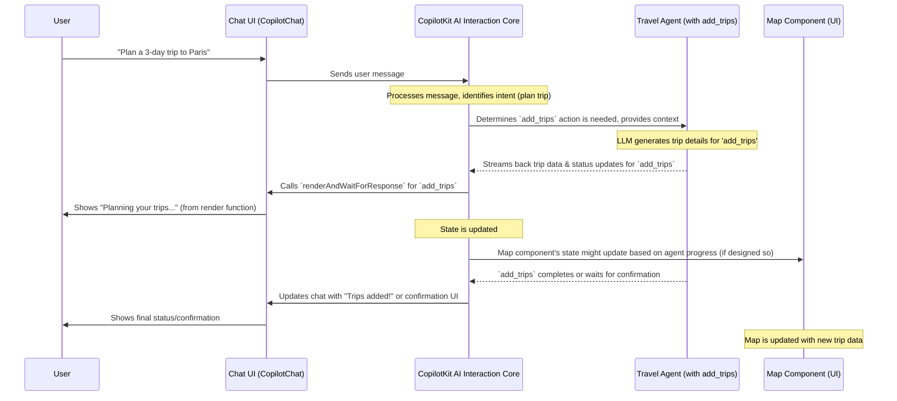

# Chapter 1: CopilotKit AI Interaction Core

Welcome to your first step in mastering the `open-multi-agent-canvas` project! In this chapter, we'll explore the very heart of our AI application: the **CopilotKit AI Interaction Core**.

Imagine you're building an app where users can chat with an AI to get things done – maybe plan a trip, research a topic, or control different parts of the application. How does the chat message get to the AI? How does the AI tell the app what to do? And how does the app show you what the AI is doing in real-time? This is where the CopilotKit AI Interaction Core shines!

**What Problem Does It Solve?**

Building interactive AI experiences can get complicated quickly. You need a way for:
1.  Users to chat with an AI.
2.  The AI to understand and decide to perform specific tasks (like searching for information or updating something on the screen).
3.  The application's user interface (UI) to show what the AI is doing and the results of its actions, all smoothly and in real-time.

The CopilotKit AI Interaction Core is like the **central nervous system** of our application. It handles all this communication and coordination, making it much simpler to build these complex features.

**Our Goal for This Chapter:**

Let's say we want our AI to help us plan a vacation. A user might type: "Hey, can you find some cool places in Paris and add them to my trip plan?"
We want to understand how CopilotKit Core helps:
*   Take this chat message.
*   Understand that it needs to use a "travel agent" to find places.
*   Allow this travel agent to "add trips" to our map.
*   Show the user that the agent is working and then display the new trip on the map.

Let's dive in!

## What is the CopilotKit AI Interaction Core?

The CopilotKit AI Interaction Core is the foundational framework that:
*   **Enables AI-powered chat:** It provides the mechanics for the chat interface.
*   **Defines how agents perform actions:** It allows different AI "agents" (specialized AI helpers) to have specific functions they can perform, like our `add_trips` example.
*   **Manages state synchronization:** It ensures that what the user sees on the screen (the UI) is always in sync with what the AI agents are doing and their results.

Think of it as an **orchestra conductor**. The user gives a request (the musical score), the conductor (CopilotKit Core) interprets it and directs different sections of the orchestra (the AI agents) to play their parts (perform actions). The beautiful music (the updated UI and results) is what the audience (the user) experiences.

## Key Components at Play

To make this magic happen, a few key pieces work together:

1.  **`<CopilotKit />` Provider:** This is the main wrapper that sets up the entire CopilotKit environment in your application. It's like plugging in the main power supply for the nervous system.
2.  **Chat Interface (`<CopilotChat />`):** This is the visual chat box where users type their requests.
3.  **Agent Actions (`useCopilotAction`):** This is how we tell CopilotKit Core about special functions our AI agents can perform. For example, a `TravelAgent` might have an `add_trips` action.
4.  **Agent State (`useCoAgent`):** This allows agents to have their own internal memory or data, which can also be synchronized with the UI. We'll explore this more in [Frontend Agent Orchestration](02_frontend_agent_orchestration_.md).

## Setting Up the Core: The `<CopilotKit />` Provider

Everything starts with wrapping your application (or relevant parts of it) with the `<CopilotKit>` component. This component initializes the core system.

Let's look at a simplified version of how it's used in `frontend/src/providers/Providers.tsx`:

```typescript
// frontend/src/providers/Providers.tsx
"use client";

import React from "react";
import { CopilotKit } from "@copilotkit/react-core";
// ... other imports ...

export default function Providers({ children }: { children: React.ReactNode }) {
  return (
    // ... other providers like QueryClientProvider ...
      <CopilotKit
        // You can turn this on for helpful debugging information!
        showDevConsole={false}
        // Your API key for Copilot Cloud services
        publicApiKey={process.env.NEXT_PUBLIC_COPILOT_CLOUD_API_KEY}
      >
        {/* The rest of your application components go here */}
        {children}
      </CopilotKit>
    // ...
  );
}
```

**Explanation:**
*   `import { CopilotKit } from "@copilotkit/react-core";`: We import the main component from the CopilotKit library.
*   `<CopilotKit ...>`: We use it like any other React component. It wraps `children`, which means all components nested inside it will have access to the CopilotKit features.
*   `publicApiKey`: This is necessary to connect to Copilot Cloud, which helps with managing the AI interactions, especially the Large Language Model (LLM) communication.

By adding this, we've laid the groundwork. The "nervous system" is now active!

## The User's Gateway: `<CopilotChat />`

Now that the core is set up, how does the user talk to the AI? Through a chat interface! CopilotKit provides a ready-to-use component for this.

Here's a peek at `frontend/src/components/chat-window.tsx`:

```typescript
// frontend/src/components/chat-window.tsx
"use client";
import { CopilotChat } from "@copilotkit/react-ui";
import "@copilotkit/react-ui/styles.css"; // Basic styling
// ... other imports for icons ...
import { FC } from "react";

export const ChatWindow: FC = () => {
  return (
    <CopilotChat
      className="h-full flex flex-col" // Styling for the chat window
      // Instructions for the AI, telling it about available agents
      instructions="Always use the MCP Agent if you need to use the MCP Servers..."
      labels={{ placeholder: "Type your message here..." }}
      // ... You can customize icons too! ...
    />
  );
};
```

**Explanation:**
*   `import { CopilotChat } from "@copilotkit/react-ui";`: We import the chat component.
*   `<CopilotChat ... />`: This single component renders a full chat interface (input box, send button, message display area).
*   `instructions`: This is a very important prop! It's where you give the AI initial context, tell it about its purpose, and what tools or agents it has at its disposal.

When a user types a message here, the `<CopilotChat>` component automatically sends it to the CopilotKit Core for processing.

## Empowering Agents: Defining Actions with `useCopilotAction`

Okay, the user can chat, and the Core receives the message. But how does the AI actually *do* something, like adding trips to a map? This is where **Actions** come in. We define functions that our AI can decide to call.

Let's look at how the `add_trips` action might be defined in `frontend/src/components/map-container.tsx`:

```typescript
// frontend/src/components/map-container.tsx
// ... other imports ...
import { useCopilotAction } from "@copilotkit/react-core";

export default function MapComponent() {
  // ... component state and other logic ...

  useCopilotAction({
    name: "add_trips", // The AI will look for this name
    description: "Add some trips to the map, including places within each trip.",
    parameters: [ /* Defines what data the AI needs to provide for this action */ ],
    // This function controls what the user sees while the action is running
    renderAndWaitForResponse({ args, status, respond }) {
      // 'args' contains data from the AI (e.g., the trip details)
      // 'status' tells us if it's "inProgress", "executing", "complete", or "error"
      if (status === "inProgress") return <p>Planning your trips...</p>;
      if (status === "executing") {
        // Here you might update your actual map with 'args.trips'
        // And show confirm/cancel buttons using 'respond'
        return <p>Showing trips. Please confirm.</p>;
      }
      if (status === "complete") return <p>Trips added to the map!</p>;
      return <p>Working on trips...</p>;
    },
  });

  // ... rest of the map component to display points ...
  return ( /* JSX for the map display */ );
}
```

**Explanation:**
*   `useCopilotAction({ ... });`: This is a React hook from CopilotKit.
*   `name: "add_trips"`: This is crucial. It's the unique name the AI will use to identify and call this specific function.
*   `description`: This tells the AI what this function does, helping it decide when to use it.
*   `parameters`: This defines the data structure the AI should provide when calling this action (e.g., a list of trips, with each trip having a name, places, coordinates, etc.). This ensures the AI sends data in a format your function can understand.
*   `renderAndWaitForResponse`: This is a powerful feature!
    *   It's a function that gets called by CopilotKit when the AI decides to use this `add_trips` action.
    *   It receives the `status` of the action (is it just starting, is it waiting for user confirmation, is it done?).
    *   It receives `args` (the data the AI generated, like the list of trips).
    *   It returns JSX (React UI elements) that will be displayed in the chat window, showing the progress or asking for confirmation. This is how the UI stays in sync with the agent's work!
    *   The `respond` function (not fully shown in the snippet) allows you to send a signal back to the AI, for example, if the user confirms or cancels the action.

When the user types "plan a trip to Paris with 3 places", the CopilotKit Core (with the help of an LLM) understands the intent, sees that `add_trips` is a relevant action, generates the necessary trip data based on its knowledge and the `parameters` definition, and then triggers the `renderAndWaitForResponse` function.

## Under the Hood: How It All Connects

Let's trace the flow for our "plan a trip to Paris" example:



**Step-by-Step Breakdown:**

1.  **User Input:** The user types their request into the `<CopilotChat>` interface.
2.  **Message to Core:** The chat interface sends this message to the CopilotKit AI Interaction Core.
3.  **Intent Recognition & Action Dispatch:** The Core, often with the help of a Large Language Model (LLM) in the background (managed by Copilot Cloud or your own backend), analyzes the message. It understands the user wants to plan a trip and sees that an action named `add_trips` (which we defined using `useCopilotAction`) is suitable.
4.  **Agent Execution:** The Core "invokes" the `add_trips` action. The LLM might generate the actual trip details (like place names, descriptions) based on the `parameters` we defined for the action.
5.  **Real-time UI Updates:**
    *   The `renderAndWaitForResponse` function associated with `add_trips` is called.
    *   This function gets the `args` (the trip data from the AI) and the `status` (e.g., "inProgress").
    *   It returns UI elements that are displayed directly in the chat, keeping the user informed (e.g., "Planning your trips...").
    *   Simultaneously, the actual `MapComponent` can use the `args` (trip data) to update the map on the screen. This is part of the state synchronization – the UI reflects what the agent is doing.
6.  **Completion/Confirmation:** Once the agent has prepared the data, the `status` in `renderAndWaitForResponse` might change to "executing" (if it needs user confirmation) or "complete". The UI updates accordingly. If confirmation is needed, the user can interact with buttons provided by the `renderAndWaitForResponse` function.

**Key Files Involved:**

*   `frontend/src/providers/Providers.tsx`: This is where `<CopilotKit>` is initialized, bootstrapping the entire system.
    ```typescript
    // frontend/src/providers/Providers.tsx (Simplified)
    // ...
    <CopilotKit publicApiKey={process.env.NEXT_PUBLIC_COPILOT_CLOUD_API_KEY}>
      {children}
    </CopilotKit>
    // ...
    ```
    This wraps your app, making the Core available.

*   `frontend/src/components/chat-window.tsx`: Provides the `<CopilotChat>` UI component.
    ```typescript
    // frontend/src/components/chat-window.tsx (Simplified)
    // ...
    <CopilotChat instructions="You are a helpful travel planner..." />
    // ...
    ```
    This is the user's direct line to the AI.

*   `frontend/src/components/map-container.tsx`: This is where `useCopilotAction` for `add_trips` is defined.
    ```typescript
    // frontend/src/components/map-container.tsx (Conceptual)
    useCopilotAction({
      name: "add_trips",
      // ... parameters ...
      renderAndWaitForResponse({ args, status, respond }) {
        // Update UI in chat based on status
        // Use args.trips to update the actual map component's state
      }
    });
    ```
    This tells the Core: "Hey, there's an action called `add_trips` that an AI can use, and here's how to show its progress in the chat and get data to update the app."

*   `frontend/src/components/coagents-provider.tsx`: This file (which we'll explore more in [Frontend Agent Orchestration](02_frontend_agent_orchestration_.md)) uses `useCoAgent` to manage the state of different agents. The CopilotKit Core uses this to interact with the correct agent and keep its state updated.
    ```typescript
    // frontend/src/components/coagents-provider.tsx (Conceptual)
    // ...
    const { state: travelAgentState } = useCoAgent({
      name: AvailableAgents.TRAVEL_AGENT,
    });
    // ...
    ```
    This hook connects an agent's data (like `travelAgentState.trips`) to the CopilotKit Core, allowing for two-way synchronization. If the `add_trips` action modifies `travelAgentState.trips`, components reading this state will update.

The beauty of this system is that CopilotKit AI Interaction Core handles the complex plumbing of LLM communication, function calling, and UI updates, letting you focus on defining what your AI agents *can do* and how their actions should be reflected to the user.

## Conclusion

You've just taken your first look at the CopilotKit AI Interaction Core, the engine that powers the interactive AI capabilities in `open-multi-agent-canvas`. You've learned:

*   It's the **central nervous system** that connects user chat, AI logic, and UI updates.
*   The `<CopilotKit>` provider initializes this system.
*   `<CopilotChat>` offers a ready-made UI for users to interact with the AI.
*   `useCopilotAction` allows you to define functions (actions) that your AI agents can perform, complete with custom UI rendering for progress and confirmation.
*   This core system manages the flow of information, making it easier to build applications where AI agents can take action and the UI reflects these actions in real-time.

This core framework is essential for enabling sophisticated interactions. But what happens when you have multiple, specialized AI agents? How do they work together?

That's exactly what we'll explore in the next chapter! Get ready to learn about [Frontend Agent Orchestration](02_frontend_agent_orchestration_.md).

---

Generated by [AI Codebase Knowledge Builder](https://github.com/The-Pocket/Tutorial-Codebase-Knowledge)