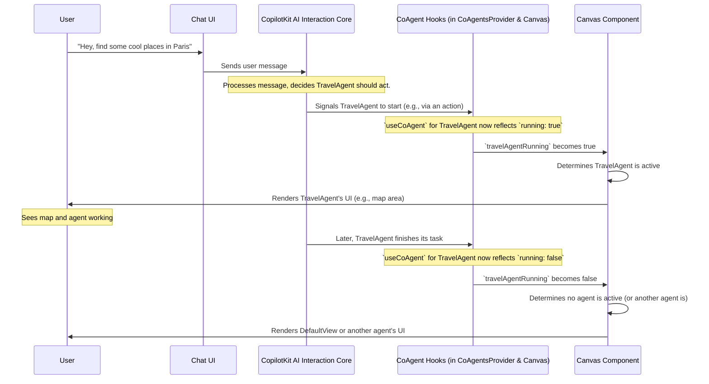

# Chapter 2: Frontend Agent Orchestration

Welcome back! In [Chapter 1: CopilotKit AI Interaction Core](01_copilotkit_ai_interaction_core_.md), we saw how CopilotKit forms the backbone of our AI chat, allowing users to talk to an AI and letting the AI trigger actions within our application. That's fantastic for a single, general-purpose AI.

But what if we want our application to have *multiple* specialized AI assistants? Imagine one AI agent that's an expert in planning travel, another that excels at in-depth research, and perhaps a third that helps manage technical configurations. How do we manage all these different "actors" in a single chat interface? How do we ensure the right agent takes the stage when needed, and how do we display information relevant to that specific agent's task?

This is where **Frontend Agent Orchestration** comes in.

**What Problem Does It Solve?**

Think of our application as a theater. We have several talented actors (our AI agents), each with a unique role:
*   A **Travel Agent** who can find destinations and display them on a map.
*   An **AI Researcher** who can gather information and present it as a structured report.
*   A **Master Control Program (MCP) Agent** who can interact with backend services.

If the user says, "Plan a trip to Hawaii," we want the Travel Agent to step forward. If they ask, "Research the latest advancements in quantum computing," the AI Researcher should take the cue. We also need to change the "scenery" (the User Interface) to match the active agent – showing a map for the Travel Agent, or a document view for the Researcher.

Frontend Agent Orchestration is like a skilled **theater stage manager**. It:
1.  Listens to the user's requests (via the chat).
2.  Decides which agent (actor) is best suited for the current task.
3.  Ensures only that agent is "active" or "on stage."
4.  Dynamically changes the UI to display visual components relevant to the active agent's performance (e.g., a map for the Travel Agent, a report for the AI Researcher).

Our goal for this chapter is to understand how `open-multi-agent-canvas` manages these different AI agents within the frontend, deciding who is active and what UI they present.

## What is Frontend Agent Orchestration?

Frontend Agent Orchestration is the system responsible for managing multiple AI agents within a single, dynamic chat interface. It determines which agent is currently "in focus" or "running" and ensures that the user interface (UI) appropriately reflects that agent's specific tools and information.

In `open-multi-agent-canvas`, this means that when the Travel Agent is active, you might see a map. When the AI Researcher is working, you might see a space for its report. If no specific agent is active, you might see a welcoming default screen.

CopilotKit plays a key role here. It provides tools to monitor the activity of different agents, allowing our application to react and render the correct visual components.

## Key Ideas: The Stage Manager's Toolkit

1.  **Multiple Specialized Agents:** Our application isn't limited to one AI. We can define several, like `TravelAgent`, `AIResearchAgent`, and `MCPAgent`, each with its own expertise. These are defined using an `enum` for easy reference:

    ```typescript
    // frontend/src/lib/available-agents.ts (Simplified)
    export enum AvailableAgents {
      TRAVEL_AGENT = "travel",
      RESEARCH_AGENT = "research_agent",
      MCP_AGENT = "mcp-agent",
    }
    ```
    This helps us refer to our agents by consistent names.

2.  **Knowing Who's "On Stage": `useCoAgent` Hook**
    CopilotKit provides a React hook called `useCoAgent`. We use this hook to "connect" to an agent and find out if it's currently `running` (i.e., actively processing a task).

3.  **The Main Stage: `Canvas.tsx`**
    The `frontend/src/components/canvas.tsx` file acts as our main stage area. It's responsible for:
    *   Checking which agent is currently `running`.
    *   Displaying the UI specific to that running agent.
    *   Showing a default view if no agent is active.

4.  **Setting Up Our Actors: `CoAgentsProvider`**
    Before our `Canvas` can manage agents, they need to be "initialized" and their states made available. This happens in `frontend/src/components/coagents-provider.tsx`. It uses `useCoAgent` to set up each agent we want to make available in the application.

## How It Works: Deciding Who's in the Spotlight

Let's imagine the user types "Find flights to London" into the chat.

1.  The message goes to the [CopilotKit AI Interaction Core](01_copilotkit_ai_interaction_core_.md).
2.  The Core, possibly with its LLM, determines that the `TravelAgent` should handle this. It "activates" the Travel Agent (perhaps by calling one of its actions).
3.  The `useCoAgent` hook connected to the `TravelAgent` will now report that `travelAgentRunning` is `true`.
4.  Our main `Canvas` component sees this change.
5.  The `Canvas` then displays the UI components specifically designed for the `TravelAgent` (e.g., a map, flight search results area) and hides UIs for other agents or the default view.

### The `Canvas.tsx` Component: Our Stage Director

The `Canvas.tsx` component is central to this orchestration. Here's a simplified look at how it manages which agent's view is shown:

First, it uses the `useCoAgent` hook for each agent to track their status:

```typescript
// frontend/src/components/canvas.tsx (Simplified)
import { useCoAgent } from "@copilotkit/react-core";
import { AvailableAgents } from "@/lib/available-agents";
// ... import Agent UI components ...

export default function Canvas() {
  const { running: travelAgentRunning } = useCoAgent({
    name: AvailableAgents.TRAVEL_AGENT,
  });
  const { running: aiResearchAgentRunning } = useCoAgent({
    name: AvailableAgents.RESEARCH_AGENT,
  });
  // ... and for other agents like MCPAgent ...

  // ... logic to determine which agent is currently active ...
  // ... logic to render the correct UI ...
}
```
*   `useCoAgent({ name: ... })`: For each agent (like `TRAVEL_AGENT`), we call this hook.
*   `running: travelAgentRunning`: We get a boolean value (`travelAgentRunning`) that tells us if this specific agent is currently active.

Then, it determines which agent, if any, is the `currentlyRunningAgent`:

```typescript
// frontend/src/components/canvas.tsx (Simplified Continued)

// A helper to find the active agent
const getCurrentlyRunningAgent = (agentsStatuses) => {
  return agentsStatuses.find(agent => agent.status);
};

// Inside the Canvas component:
  const agentStatuses = [
    { status: travelAgentRunning, name: AvailableAgents.TRAVEL_AGENT, View: Agents.TravelAgent },
    { status: aiResearchAgentRunning, name: AvailableAgents.RESEARCH_AGENT, View: Agents.AIResearchAgent },
    // ... other agents
  ];
  const currentlyRunningAgent = getCurrentlyRunningAgent(agentStatuses);
```
*   This logic checks each agent's `running` status. If one is `true`, that agent is considered the active one.

Finally, it renders the UI based on who is active:

```typescript
// frontend/src/components/canvas.tsx (Simplified Continued)

// Inside the Canvas component's return statement:
  return (
    <div className="main-display-area">
      {currentlyRunningAgent ? (
        <currentlyRunningAgent.View /> // Show the active agent's UI
      ) : (
        <DefaultView /> // Or show a default screen
      )}
      {/* The ChatWindow is usually alongside this */}
    </div>
  );
```
*   If `currentlyRunningAgent` is found, its specific UI component (e.g., `<Agents.TravelAgent />`) is rendered.
*   Otherwise, a `<DefaultView />` is shown.

This dynamic rendering ensures the user always sees the most relevant interface.

### The `CoAgentsProvider`: Preparing the Actors

The `CoAgentsProvider` component (found in `frontend/src/components/coagents-provider.tsx`) is responsible for initializing the states for all our agents. It wraps parts of our application, making these agent states accessible.

```typescript
// frontend/src/components/coagents-provider.tsx (Simplified)
import { useCoAgent } from "@copilotkit/react-core";
import { AvailableAgents } from "@/lib/available-agents";
// ... other imports ...

export const CoAgentsProvider = ({ children }) => {
  useCoAgent({ name: AvailableAgents.TRAVEL_AGENT });
  useCoAgent({ name: AvailableAgents.RESEARCH_AGENT, initialState: { /* ... */ } });
  useCoAgent({ name: AvailableAgents.MCP_AGENT, initialState: { /* ... */ } });

  // ... context provider setup to pass agent data down (not shown for simplicity) ...
  return <>{children}</>;
};
```
*   Inside `CoAgentsProvider`, `useCoAgent` is called for each agent (e.g., `TRAVEL_AGENT`, `RESEARCH_AGENT`).
*   This "registers" the agents with CopilotKit, allowing their state (like `running` status or any internal data) to be managed and monitored.
*   `initialState`: For some agents, we can provide an initial set of data they should start with.

This provider ensures that when `Canvas.tsx` calls `useCoAgent` for `TRAVEL_AGENT`, it's getting the status of the *same* Travel Agent instance initialized here.

## Under the Hood: The Orchestration Flow

Let's visualize the sequence of events when a user interacts and an agent becomes active:



**Step-by-Step:**

1.  **User Request:** The user types a command into the `<CopilotChat />` interface.
2.  **Core Processing:** The [CopilotKit AI Interaction Core](01_copilotkit_ai_interaction_core_.md) receives the message. It (often with an LLM) identifies the intent and determines which agent is best suited (e.g., `TravelAgent`).
3.  **Agent Activation:** The Core signals the chosen agent to begin its task. This could involve triggering an action defined by that agent.
4.  **Status Update via `useCoAgent`:** The `useCoAgent` hook associated with the activated agent (both in `CoAgentsProvider` and where it's monitored in `Canvas.tsx`) updates its `running` status to `true`.
5.  **Canvas Reacts:** The `Canvas.tsx` component, which is constantly monitoring the `running` status of all its agents, detects this change.
6.  **Dynamic UI Rendering:** The `Canvas` updates its display. It hides any other agent's UI or the `DefaultView` and shows the specific UI component associated with the now-active `TravelAgent`.
7.  **Task Completion & UI Reversion:** When the agent completes its task, its `running` status (via `useCoAgent`) flips back to `false`. The `Canvas` detects this and might revert to the `DefaultView` or switch to another agent if one becomes active.

This orchestration ensures a smooth and context-aware user experience, where the interface intelligently adapts to the AI's current focus.

**Key Files Involved:**

*   `frontend/src/lib/available-agents.ts`: Defines the names of our agents.
    ```typescript
    // Example:
    export enum AvailableAgents {
      TRAVEL_AGENT = "travel",
      // ... other agents
    }
    ```
*   `frontend/src/components/coagents-provider.tsx`: Initializes agents using `useCoAgent`.
    ```typescript
    // Conceptual snippet:
    useCoAgent({ name: AvailableAgents.TRAVEL_AGENT });
    // This makes the Travel Agent known to the CopilotKit system.
    ```
*   `frontend/src/components/canvas.tsx`: Monitors agent statuses and renders the appropriate UI.
    ```typescript
    // Conceptual snippet for monitoring:
    const { running: isTravelAgentActive } = useCoAgent({ name: AvailableAgents.TRAVEL_AGENT });

    // Conceptual snippet for rendering:
    if (isTravelAgentActive) {
      return <TravelAgentUIComponent />;
    } else {
      return <DefaultScreen />;
    }
    ```
    This is the core logic for switching views.
*   `frontend/src/components/agents/index.tsx` (and individual agent files like `travel.tsx`): These files would contain the actual UI components for each agent (e.g., `<TravelAgent />`, `<AIResearchAgent />`). We'll explore these in more detail in the next chapter.

## Conclusion

You've now learned about Frontend Agent Orchestration – the "stage manager" for our AI application. You've seen:

*   Why it's important when dealing with multiple specialized AI agents.
*   How `open-multi-agent-canvas` uses CopilotKit's `useCoAgent` hook to track which agent is active.
*   How the `Canvas.tsx` component acts as the orchestrator, dynamically changing the displayed UI based on the active agent.
*   The role of `CoAgentsProvider` in setting up and making these agents available.

This ability to seamlessly switch between different AI agents and their corresponding UIs is crucial for building a versatile and intuitive multi-agent system.

But what do these "agent-specific UIs" actually look like? How do we build the map for the Travel Agent or the report view for the AI Researcher? That's precisely what we'll dive into next!

Get ready to explore [Agent-Specific UI Views](03_agent_specific_ui_views_.md) in Chapter 3!

---

Generated by [AI Codebase Knowledge Builder](https://github.com/The-Pocket/Tutorial-Codebase-Knowledge)