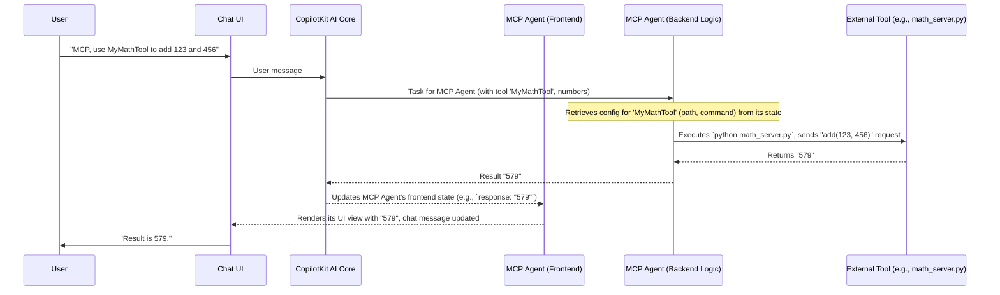

# Chapter 4: MCP Agent & Service Integration

Welcome back! In [Chapter 3: Agent-Specific UI Views](03_agent_specific_ui_views_.md), we saw how each agent can have its own dedicated user interface, like a map for the Travel Agent. Now, we're going to explore a very powerful agent: the **MCP Agent**.

Imagine you want your AI chat to do more than just plan trips or research. What if you need it to perform a specific calculation using a custom math script you wrote? Or maybe you want it to interact with a special tool running on your computer or a remote server. How can the chat application connect to these external capabilities? This is where the **MCP Agent & Service Integration** shines!

**Our Goal for This Chapter:**

Let's say you want to ask the AI: "Hey, what is 123 plus 456?"
We want to understand how the MCP Agent can:
1.  Be configured to know about an external "calculator" service.
2.  Receive your math question.
3.  Use the external calculator service to find the answer.
4.  Present the answer back to you in the chat.

## What is the MCP Agent?

The **MCP Agent** is a versatile, general-purpose agent within `open-multi-agent-canvas`. Think of it as a **universal adapter plug**. Your main device is the chat application, and you have many specialized appliances (like a Python script for math, a tool for image processing, etc.). The MCP Agent is the adapter that can connect your chat application to these different "appliances."

It doesn't perform all tasks by itself. Instead, it acts as a **bridge** to various external tools and services. To communicate with these external services, it uses something called the **Multi-Channel Protocol (MCP)**.

## Key Concepts

Let's break down the main ideas:

1.  **MCP Agent:** As we said, it's our universal adapter. It's an AI agent specialized in talking to other services.

2.  **MCP (Multi-Channel Protocol):** This is like a common language or a standard connector type (think USB or Wi-Fi). It's a set of rules that the MCP Agent and the external services use to understand each other. You don't need to know the deep details of MCP itself, just that it enables communication.

3.  **MCP Servers:** These are the external tools or "appliances" our MCP Agent can connect to. An MCP Server could be:
    *   A simple Python script running on your local computer (e.g., `math_server.py`).
    *   A more complex web service running elsewhere.
    These servers are designed to "speak" MCP.

4.  **Server Configuration (The Modal):** How does the MCP Agent know which external tools exist and how to reach them? You tell it! There's a configuration panel (a "modal" dialog) in the application where you can:
    *   Give a name to each external service (e.g., "MyLocalCalculator").
    *   Specify how to connect to it. Two common ways are:
        *   **Standard I/O (stdio):** For running local command-line scripts. The agent sends input to the script, and the script prints output back.
        *   **Server-Sent Events (SSE):** For connecting to web services that can stream data back to the agent.

## Using the MCP Agent: A Calculator Example

Let's walk through our "123 + 456" example.

### Step 1: Create an MCP Server (Our Calculator)

First, we need an external tool that can do addition. Let's imagine we have a simple Python script called `math_server.py` that acts as an MCP server.

```python
# agent/math_server.py (Simplified)
from mcp.server.fastmcp import FastMCP # MCP library
mcp = FastMCP("Math") # Name our server

@mcp.tool() # Mark 'add' as a tool the agent can use
def add(a: int, b: int) -> int:
    """Add two numbers"""
    return a + b

if __name__ == "__main__":
    # This makes the script listen for commands via standard input/output
    mcp.run(transport="stdio")
```
*   This script uses an MCP library to define a "Math" server with one tool called `add`.
*   When run, it waits for instructions (like "add 123 and 456") via its input, performs the action, and sends the result back via its output.

### Step 2: Configure the MCP Agent

Now, we need to tell our MCP Agent in the chat application about this `math_server.py`.

1.  In the `open-multi-agent-canvas` interface, you'll find a button, often labeled "MCP Servers" (usually in the top right). Clicking this opens the **MCP Server Configuration modal**.

     <!-- Conceptual image, not from project -->

2.  Inside the modal, you'd click "Add Server" and fill in the details:
    *   **Server Name:** `MyMathTool` (you can choose any name)
    *   **Connection Type:** `Standard IO` (because our script uses command-line input/output)
    *   **Command:** `python` (or `python3`, depending on your system)
    *   **Arguments:** `path/to/your/agent/math_server.py` (the actual path to the script)

    This configuration is managed by `frontend/src/components/mcp-config-modal.tsx`.

    ```typescript
    // frontend/src/components/mcp-config-modal.tsx (Conceptual handling of adding a config)
    // This is a simplified view of how new configs might be added.
    const addConfigToList = (name, type, command, args_string, url) => {
      let newConfigEntry;
      if (type === "stdio") {
        newConfigEntry = { command, args: args_string.split(' '), transport: "stdio" };
      } else { /* sse config */ }
      // This new entry would be saved to the agent's state and localStorage
      // setConfigs(prev => ({ ...prev, [name]: newConfigEntry }));
      console.log(`Config for '${name}' would be added.`);
    };
    ```
    *   When you save this, the MCP Agent now knows about `MyMathTool` and how to run it. This configuration is also saved in your browser's local storage, so you don't have to set it up every time (more on this in [MCP Server Configuration Persistence](06_mcp_server_configuration_persistence_.md)).

### Step 3: Chat with the AI

Now, you can ask the AI to use this tool:

**You:** "Hey MCP Agent, can you use MyMathTool to add 123 and 456?"

Here's what happens:
1.  Your message goes to the [CopilotKit AI Interaction Core](01_copilotkit_ai_interaction_core_.md).
2.  The system understands you want to use the MCP Agent and its tool `MyMathTool`.
3.  The MCP Agent's backend logic (which we'll explore in [LangGraph Agent Logic Flow (MCP Agent Backend)](05_langgraph_agent_logic_flow__mcp_agent_backend__.md)) looks up the configuration for `MyMathTool`.
4.  It executes the command: `python path/to/your/agent/math_server.py`.
5.  It sends instructions to the script, effectively asking it to `add(123, 456)`.
6.  The `math_server.py` script calculates `579` and sends this result back.
7.  The MCP Agent receives "579".
8.  The AI, through the chat interface, tells you: "The result of adding 123 and 456 using MyMathTool is 579."
9.  The MCP Agent's specific UI view (see [Agent-Specific UI Views](03_agent_specific_ui_views_.md)) might show some logs or the final response, like "Response: 579".

You've successfully used an external Python script through the chat AI!

## Under the Hood: How It Connects

Let's trace the simplified flow of information:



**Key Code Connections:**

1.  **Frontend: Storing Configuration (`mcp-config-modal.tsx`)**
    The modal uses CopilotKit's `useCoAgent` hook to manage the `mcp_config` state for the MCP Agent. When you add a server, this state is updated.

    ```typescript
    // frontend/src/components/mcp-config-modal.tsx (Simplified state update)
    // 'setAgentState' comes from useCoAgent for the MCP_AGENT
    const { setState: setAgentState } = useCoAgent({ /* ... name: AvailableAgents.MCP_AGENT ... */ });

    const addConfig = (/* server details */) => {
      const newServerEntry = { /* ... config for the new server ... */ };
      setAgentState((prevState) => ({
        ...prevState!,
        mcp_config: { ...prevState!.mcp_config, ["MyMathTool"]: newServerEntry },
      }));
      // This also saves to localStorage via setSavedConfigs
    };
    ```
    This means the MCP Agent's state in the frontend now holds the connection details for `MyMathTool`.

2.  **Frontend: Initializing MCP Agent with Config (`frontend/src/components/agents/mcp-agent.tsx`)**
    The MCP Agent's UI component also uses `useCoAgent`. When it initializes, it loads any saved configurations (like the one for `MyMathTool`) into its state. This state, including `mcp_config`, is accessible by the backend.

    ```typescript
    // frontend/src/components/agents/mcp-agent.tsx (Simplified state init)
    // configsRef.current would hold configs loaded from localStorage
    const { state: mcpAgentState } = useCoAgent<MCPAgentState>({
      name: AvailableAgents.MCP_AGENT,
      initialState: {
        response: "",
        logs: [],
        mcp_config: configsRef.current, // Loads saved configs
      },
    });
    ```

3.  **Backend: Using the Configuration (`agent/mcp-agent/agent.py`)**
    The real magic happens in the MCP Agent's backend Python code. This code receives the `mcp_config` from the frontend agent state.

    ```python
    # agent/mcp-agent/agent.py (Simplified state definition)
    class AgentState(CopilotKitState): # CopilotKitState allows frontend sync
        # This mcp_config will be populated from the frontend
        mcp_config: Optional[MCPConfig]
    ```
    When the backend agent needs to use a tool, it uses this `mcp_config` to know *how* to connect.

    ```python
    # agent/mcp-agent/agent.py (Simplified client usage)
    async def chat_node(state: AgentState, /* ... */):
        # Get the actual configuration for MCP servers
        # If mcp_config is in 'state', use it, otherwise use a default
        current_mcp_configs = state.get("mcp_config", DEFAULT_MCP_CONFIG)

        # MultiServerMCPClient uses these configs to talk to servers
        async with MultiServerMCPClient(current_mcp_configs) as mcp_client:
            # mcp_client can now list tools like 'MyMathTool.add'
            available_tools = mcp_client.get_tools()
            # The AI decides which tool to use (e.g., MyMathTool.add)
            # ... then calls it ...
    ```
    *   `AgentState` defines that our agent's state can include `mcp_config`.
    *   `current_mcp_configs` gets the server configurations you set up in the modal.
    *   `MultiServerMCPClient` is a helper from a library that takes these configurations and makes the actual connections to your external tools (like running `math_server.py`).
    *   The `available_tools` (like `MyMathTool.add`) become usable by the AI.

The MCP Agent, through these frontend configurations and backend logic, effectively extends the AI's capabilities by allowing it to tap into a vast array of external tools and services.

## Conclusion

You've now learned about the **MCP Agent** and how it acts as a powerful bridge to external tools and services. We've covered:
*   The MCP Agent is like a **universal adapter**, connecting your chat to external "appliances" (MCP Servers).
*   It uses the **Multi-Channel Protocol (MCP)** as a common language.
*   You can configure connections to local scripts (**stdio**) or remote services (**SSE**) through a user-friendly **modal**.
*   This configuration is passed from the frontend to the MCP Agent's backend, allowing it to dynamically use these external tools.

This is incredibly powerful! But how does the MCP Agent's backend *decide* which tool to use, and how does it manage the conversation flow when interacting with these tools? That's where LangGraph comes in.

Get ready to dive into the "brain" of the MCP Agent in the next chapter: [LangGraph Agent Logic Flow (MCP Agent Backend)](05_langgraph_agent_logic_flow__mcp_agent_backend__.md).

---

Generated by [AI Codebase Knowledge Builder](https://github.com/The-Pocket/Tutorial-Codebase-Knowledge)