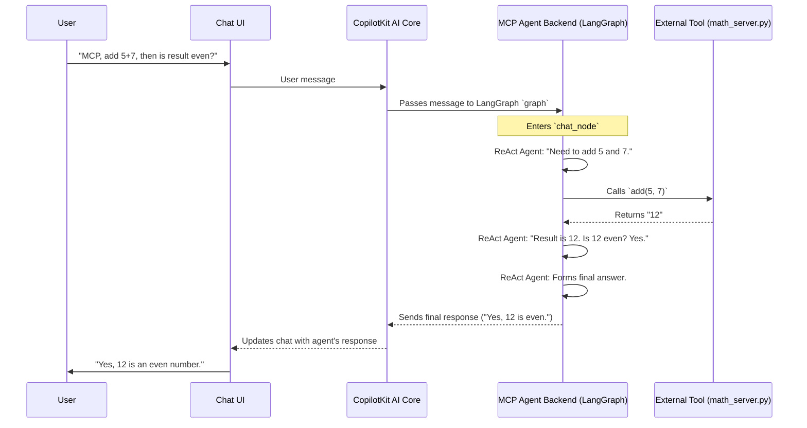

# Chapter 5: LangGraph Agent Logic Flow (MCP Agent Backend)

Welcome to Chapter 5! In [Chapter 4: MCP Agent & Service Integration](04_mcp_agent___service_integration_.md), we learned how the MCP Agent can connect to external tools, like a local Python script for calculations. We saw how you can configure these tools through the UI. But how does the MCP Agent actually *decide* to use a specific tool? How does it string together multiple steps if needed? This is where its "brain" comes into play, powered by **LangGraph**.

Imagine you ask the MCP Agent: "Hey, can you use MyMathTool to add 5 and 7, and then tell me if the result is an even number?"
This isn't a single-step task. The agent needs to:
1.  Understand it needs to add 5 and 7 using `MyMathTool`.
2.  Call `MyMathTool` and get the result (which would be 12).
3.  Then, figure out if 12 is an even number.
4.  Finally, answer your question.

How does the agent manage this sequence of thoughts and actions? That's what we'll explore in this chapter!

## What is LangGraph?

**LangGraph** is a library that helps us build the decision-making process for AI agents. Think of it like creating a **detailed operational blueprint** or a **sophisticated flowchart** for the agent. This blueprint dictates:
*   How the agent understands your request.
*   How it decides whether to use one or more of its configured MCP tools (like `MyMathTool`).
*   How it interacts with those tools.
*   And how it then formulates a final response.

In essence, LangGraph provides the structure for the MCP Agent's backend logic, defining its flow of operations.

## Key Concepts of LangGraph (The Agent's Blueprint)

To understand how LangGraph works, let's look at its main building blocks:

1.  **Graph:** This is the overall blueprint or flowchart. It defines all the possible steps and paths the agent can take.
2.  **State:** This is the agent's memory. It keeps track of important information during a conversation, such as:
    *   The history of messages between you and the agent.
    *   The current configuration of MCP tools (which we set up in Chapter 4).
    *   Any results it got from using a tool.
3.  **Nodes:** These are the individual steps or stages in our flowchart. A node could represent:
    *   The agent thinking about what to do next.
    *   The agent calling an external tool.
    *   The agent preparing its final answer.
4.  **Edges:** These are the arrows connecting the nodes in our flowchart. They tell the agent which step to go to next, based on the current situation (the state).
5.  **Tools:** These are the actual capabilities the agent can use. In our MCP Agent, these tools are the MCP services we configured (e.g., `MyMathTool.add`). The agent, through LangGraph, decides *when* and *how* to use these tools.

Think of it like a recipe:
*   The **Graph** is the entire recipe.
*   The **State** is your current set of ingredients and what you've done so far (e.g., "flour and sugar mixed").
*   **Nodes** are individual steps in the recipe (e.g., "Mix dry ingredients," "Add eggs," "Bake").
*   **Edges** are the instructions telling you to go from "Mix dry ingredients" to "Add eggs."
*   **Tools** are your kitchen appliances (e.g., mixer, oven).

## How LangGraph Powers the MCP Agent's Logic

Let's revisit our example: "MCP Agent, use MyMathTool to add 5 and 7, and then tell me if the result is an even number."

Here's a simplified idea of how the MCP Agent, using its LangGraph blueprint, might handle this:

1.  **Receive Request:** Your message enters the LangGraph flow. The current `State` includes your message.
2.  **Thinking Node (Chat Node):**
    *   The agent (specifically, a powerful LLM guided by LangGraph and a special prompt) looks at your message and its available `Tools` (like `MyMathTool.add`).
    *   It decides: "First, I need to add 5 and 7. I have a tool for that."
3.  **Tool Call:**
    *   The agent "calls" the `MyMathTool.add` function with inputs 5 and 7.
    *   The external `math_server.py` (from Chapter 4) runs, calculates 12, and sends it back.
4.  **Update State:** The result "12" is added to the agent's `State` (its memory).
5.  **Thinking Node (Again):**
    *   The agent looks at the original request ("...is the result an even number?") and its current `State` (which now includes "result is 12").
    *   It thinks: "Okay, the result is 12. Now I need to check if 12 is even." (The LLM has general knowledge to do this or could be programmed with another tool for this).
6.  **Formulate Response:** The agent determines that 12 is indeed even.
7.  **Final Answer Node:** The agent prepares the final message: "Yes, 12 is an even number." This response is sent back to you.

LangGraph provides the framework for this entire decision-making loop, including calling tools and reasoning about the results.

### The MCP Agent's State

In our project, the MCP Agent's state is defined in `agent/mcp-agent/agent.py`. It needs to remember a few key things:

```python
# agent/mcp-agent/agent.py (Simplified State Definition)
from typing import Optional, Dict, Union, List
from copilotkit import CopilotKitState # Base for agent state

# ... (StdioConnection, SSEConnection type definitions from Chapter 4) ...
MCPConfig = Dict[str, Union[StdioConnection, SSEConnection]]

class AgentState(CopilotKitState):
    # mcp_config stores how to connect to tools like MyMathTool
    mcp_config: Optional[MCPConfig]
    # 'messages' (from CopilotKitState) stores the conversation history
```
*   `mcp_config`: This is how the agent knows about `MyMathTool` and other services you configured in the [MCP Agent & Service Integration](04_mcp_agent___service_integration_.md). It's passed from the frontend.
*   `messages`: This field (inherited from `CopilotKitState`) stores the list of all messages in the current chat, so the agent has context.

### The Core Logic: The `chat_node`

The MCP Agent in `open-multi-agent-canvas` uses a relatively simple LangGraph graph. It has one primary "thinking" node called `chat_node`. This node is very powerful because it uses a pre-built LangGraph component called `create_react_agent`. This "ReAct" (Reason + Act) agent can:
1.  **Reason** about the user's request.
2.  Decide which **Act**ion to take (e.g., call a tool).
3.  Observe the result.
4.  Repeat this process until it has a final answer.

Here's a snippet showing how this `chat_node` is set up:

```python
# agent/mcp-agent/agent.py (Simplified chat_node setup)
from langgraph.prebuilt import create_react_agent
from langchain_openai import ChatOpenAI
from langchain_mcp_adapters.client import MultiServerMCPClient

# ... (AgentState, DEFAULT_MCP_CONFIG, MULTI_TOOL_REACT_PROMPT are defined above) ...

async def chat_node(state: AgentState, /*...other args...*/):
    # 1. Get tool configurations (from state or default)
    mcp_config = state.get("mcp_config", DEFAULT_MCP_CONFIG)

    # 2. Initialize client to talk to MCP tools
    async with MultiServerMCPClient(mcp_config) as mcp_client:
        mcp_tools = mcp_client.get_tools() # Get tools like MyMathTool.add

        # 3. Set up the LLM and the ReAct agent
        model = ChatOpenAI(model="gpt-4o") # Or your preferred model
        # MULTI_TOOL_REACT_PROMPT tells the LLM how to think and use tools
        react_agent_executor = create_react_agent(model, mcp_tools, prompt=MULTI_TOOL_REACT_PROMPT)

        # 4. Run the ReAct agent with the current conversation messages
        agent_response = await react_agent_executor.ainvoke({"messages": state["messages"]})
        
        # 5. Update conversation history and prepare to end
        # ... (update state["messages"] with agent_response["messages"]) ...
        # ... (signal to LangGraph that this is the END of this turn) ...
        return # ... (Command to update state and go to END) ...
```
**Explanation:**
1.  **Get Config:** It fetches the `mcp_config` we discussed in Chapter 4 from the `AgentState`.
2.  **Tool Client:** It sets up `MultiServerMCPClient` using this config. This client can then discover and list all available tools (e.g., `MyMathTool.add`, `MyMathTool.multiply`).
3.  **ReAct Agent:** This is the core. `create_react_agent` combines:
    *   An **LLM** (like GPT-4o) for reasoning.
    *   The `mcp_tools` it just discovered.
    *   A `MULTI_TOOL_REACT_PROMPT` (defined elsewhere in the file) which is a special set of instructions telling the LLM how to think step-by-step, use tools, and format its thoughts and actions.
4.  **Invoke Agent:** It runs the `react_agent_executor` with the current conversation history (`state["messages"]`). The ReAct agent will now go through its "Reason -> Act -> Observe" loop, potentially calling `MyMathTool` multiple times if needed.
5.  **Update & End:** The `agent_response` will contain the LLM's final answer and any intermediate thoughts/actions. The `chat_node` updates the `AgentState` with these new messages and tells LangGraph that this cycle is complete.

### Defining the Workflow (The Graph)

Finally, the LangGraph workflow itself is defined very simply for this agent:

```python
# agent/mcp-agent/agent.py (Simplified Workflow Definition)
from langgraph.graph import StateGraph, END
# ... (AgentState, chat_node are defined above) ...

workflow = StateGraph(AgentState) # Create a graph that uses our AgentState
workflow.add_node("chat_node", chat_node) # Add our main thinking node
workflow.set_entry_point("chat_node") # Start all tasks at chat_node

# Compile the graph to make it runnable
# MemorySaver helps remember state across turns
graph = workflow.compile(MemorySaver())
```
*   `StateGraph(AgentState)`: Creates a new flowchart definition using our `AgentState`.
*   `workflow.add_node("chat_node", chat_node)`: Adds our main `chat_node` to this flowchart.
*   `workflow.set_entry_point("chat_node")`: Tells LangGraph that whenever a new request comes in, it should always start at the `chat_node`.
*   Because there are no other nodes or complex edges defined, after `chat_node` finishes (and signals `END`), the agent's turn is over.

Even though this graph looks simple (just one main node), the `create_react_agent` inside `chat_node` handles all the complex multi-step reasoning and tool use internally.

## Under the Hood: Processing a Request

Let's trace the simplified flow when you send a message to the MCP Agent:



**Step-by-Step:**
1.  You send a message.
2.  It goes through the [CopilotKit AI Interaction Core](01_copilotkit_ai_interaction_core_.md) to the MCP Agent's backend.
3.  The LangGraph `graph` starts execution at `chat_node`.
4.  Inside `chat_node`, the `react_agent_executor` takes over:
    *   It reasons about your request using the LLM and its prompt.
    *   It identifies that `MyMathTool.add(5, 7)` is needed.
    *   It calls `MyMathTool` via the `MultiServerMCPClient`.
    *   It gets back "12".
    *   It reasons again: "12 is even."
    *   It formulates the final answer.
5.  The `chat_node` completes, updating the `AgentState` with the conversation.
6.  The final answer is relayed back to you via CopilotKit and the Chat UI.

This entire structured decision-making process is orchestrated by LangGraph.

## Conclusion

You've now peeked into the "brain" of the MCP Agent and learned how **LangGraph** provides the **backend logic flow**. You've seen:
*   LangGraph acts as a **blueprint** for the agent's decision-making.
*   Key concepts include `State` (memory), `Nodes` (steps), and `Tools` (capabilities).
*   The MCP Agent uses a primary `chat_node` powered by a `create_react_agent` to handle complex reasoning and multi-step tool use.
*   The `AgentState` holds crucial information like `mcp_config` (from [Chapter 4: MCP Agent & Service Integration](04_mcp_agent___service_integration_.md)) and conversation history.
*   LangGraph enables the agent to interpret requests, decide on actions, interact with tools, and formulate responses in a structured way.

The `mcp_config` we've mentioned is vital. How does the agent remember these configurations even after you close your browser and come back later? That's what we'll explore next!

Get ready to learn about [Chapter 6: MCP Server Configuration Persistence](06_mcp_server_configuration_persistence_.md).

---

Generated by [AI Codebase Knowledge Builder](https://github.com/The-Pocket/Tutorial-Codebase-Knowledge)