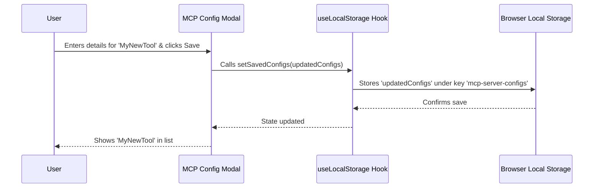
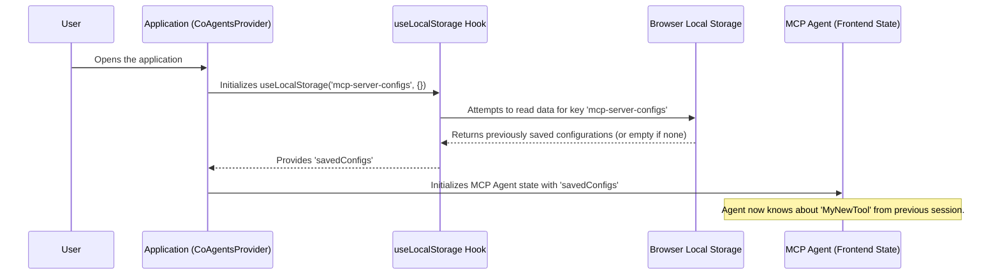

# Chapter 6: MCP Server Configuration Persistence

Welcome to the final chapter in this part of our journey! In [Chapter 5: LangGraph Agent Logic Flow (MCP Agent Backend)](05_langgraph_agent_logic_flow__mcp_agent_backend__.md), we explored the "brain" of the MCP Agent, seeing how it uses LangGraph to decide which tools to use and how to respond to your requests. We saw that the MCP Agent relies on configurations you set up for its tools, like our `MyMathTool` example.

But imagine if you had to re-enter the details for `MyMathTool` (like its command and path) every single time you opened the `open-multi-agent-canvas` application. That would be quite annoying and inefficient, wouldn't it?

**What Problem Does It Solve?**

This is where **MCP Server Configuration Persistence** comes to the rescue! It provides a way for the application to remember your custom MCP server configurations.

Think of it like your web browser:
*   It remembers your bookmarks, so you don't have to type in your favorite websites every time.
*   It remembers your preferred settings, like the default zoom level or font size.

Similarly, MCP Server Configuration Persistence ensures that once you set up a connection to an external tool (an MCP Server like a Stdio script or an SSE service), the application remembers those details for your next session. You don't need to re-enter them every time. This makes for a much smoother and more personalized experience.

**Our Goal for This Chapter:**

We want to understand how `open-multi-agent-canvas` saves your MCP server configurations and automatically loads them when you return to the app, so you can immediately use your favorite tools without any extra setup.

## What is Browser Local Storage? (The App's Little Notebook)

The magic behind this persistence is a feature built into modern web browsers called **Local Storage**.

Imagine your browser has a small, private notebook for each website you visit. When `open-multi-agent-canvas` wants to remember your MCP server configurations, it writes them down in this notebook. When you open the app again, it looks up what it wrote in the notebook and loads your settings.

*   **Persistent:** The data stays in the notebook even if you close the browser tab or shut down your computer.
*   **Private:** The notebook for `open-multi-agent-canvas` can only be read by `open-multi-agent-canvas`. Other websites can't see its notes.
*   **Limited Size:** It's meant for small amounts of data, like settings or preferences, not for huge files.

## How It Works in `open-multi-agent-canvas`

The process is quite seamless for you as a user:

1.  **You Configure a Server:**
    *   You open the "MCP Server Configuration" modal (as seen in [MCP Agent & Service Integration](04_mcp_agent___service_integration_.md)).
    *   You add a new server, let's say `MyTextAnalyzer`, providing its command and arguments.
    *   When you save it, the application not only tells the MCP Agent about this new tool but also **writes the details of `MyTextAnalyzer` into the browser's local storage.**

2.  **You Close and Reopen the App:**
    *   Later, you close your browser or navigate away.
    *   When you come back and open `open-multi-agent-canvas` again, the application **checks its "notebook" (local storage) first.**
    *   It finds the details for `MyTextAnalyzer` that it saved earlier.
    *   It automatically loads these configurations. Now, the MCP Agent knows about `MyTextAnalyzer` without you having to do anything!

This means your personalized list of MCP tools is always ready for you.

## Key Code Components Involved

Let's look at the main pieces of code that make this happen.

### 1. The `useLocalStorage` Hook: Our Notebook Helper

There's a special helper function (a "custom hook" in React) in `frontend/src/hooks/use-local-storage.tsx`. This hook is responsible for the actual reading from and writing to the browser's local storage.

```typescript
// frontend/src/hooks/use-local-storage.tsx (Simplified)
export function useLocalStorage<T>(key: string, initialValue: T): [T, (value: T) => void] {
  // ... (logic to get initial value from localStorage or use initialValue) ...
  const [storedValue, setStoredValue] = useState(/* ... */);

  const setValue = (value: T) => {
    // ... (logic to update state) ...
    window.localStorage.setItem(key, JSON.stringify(valueToStore)); // Writes to local storage!
  };

  return [storedValue, setValue];
}
```
*   `key`: This is like the title of the page in our notebook (e.g., `mcp-server-configs`).
*   `window.localStorage.setItem(key, ...)`: This is the command to write data to local storage.
*   `window.localStorage.getItem(key)` (used internally): This is the command to read data.

This hook makes it easy for other parts of the app to use local storage without worrying about the low-level details.

### 2. The MCP Configuration Modal: Saving Your Changes

The `frontend/src/components/mcp-config-modal.tsx` is where you add, edit, or remove server configurations. When you make changes here, it uses our `useLocalStorage` hook.

```typescript
// frontend/src/components/mcp-config-modal.tsx (Simplified saving)
import { useLocalStorage } from "@/hooks/use-local-storage";
import { MCP_STORAGE_KEY } from "@/lib/mcp-config-types"; // Key is "mcp-server-configs"

export function MCPConfigModal({ /* ... */ }) {
  const [savedConfigs, setSavedConfigs] = useLocalStorage(MCP_STORAGE_KEY, {});

  const addConfigToList = (newServerDetails) => {
    // ... (creates a new 'allConfigs' object with the new server) ...
    setSavedConfigs(allConfigs); // This uses the hook to save to local storage!
  };
  // ...
}
```
*   `setSavedConfigs(allConfigs)`: When you add a server and this line runs, the `useLocalStorage` hook updates its state AND writes the entire `allConfigs` object to local storage under the key `MCP_STORAGE_KEY`.

### 3. Initializing the MCP Agent: Loading Your Saved Settings

When the application starts, or specifically when the MCP Agent related components are set up, they need to load these saved configurations. This happens in places like `frontend/src/components/coagents-provider.tsx` and `frontend/src/components/agents/mcp-agent.tsx`.

In `CoAgentsProvider`, which sets up our agents:
```typescript
// frontend/src/components/coagents-provider.tsx (Simplified loading)
import { useLocalStorage } from "@/hooks/use-local-storage";
import { MCP_STORAGE_KEY, ServerConfig } from "@/lib/mcp-config-types";

export const CoAgentsProvider = ({ children }) => {
  const configsRef = useRef<Record<string, ServerConfig>>({});
  const [savedConfigs] = useLocalStorage(MCP_STORAGE_KEY, {}); // Reads from local storage!

  if (Object.keys(savedConfigs).length > 0) {
    configsRef.current = savedConfigs; // Store loaded configs
  }

  useCoAgent({ // For the MCP Agent
    name: AvailableAgents.MCP_AGENT,
    initialState: {
      mcp_config: configsRef.current, // Pass loaded configs to the agent
      // ... other initial state ...
    },
  });
  // ...
};
```
*   `const [savedConfigs] = useLocalStorage(MCP_STORAGE_KEY, {});`: When this line runs as the component loads, the `useLocalStorage` hook tries to read data from local storage using `MCP_STORAGE_KEY`.
*   `initialState: { mcp_config: configsRef.current, ... }`: The loaded configurations are then passed as the starting `mcp_config` for the MCP Agent.

A similar pattern is used in `frontend/src/components/agents/mcp-agent.tsx` to ensure its local reference to configurations is also initialized from local storage.

## Under the Hood: The Save and Load Flow

Let's visualize what happens.

**Scenario 1: Adding a New Server Configuration**


1.  **User Action:** You add server details in the modal and save.
2.  **Modal Update:** The `MCPConfigModal` calls `setSavedConfigs` (which comes from the `useLocalStorage` hook).
3.  **Hook Saves:** The `useLocalStorage` hook updates its internal state and then writes the new list of configurations to the browser's actual Local Storage.
4.  **Confirmation:** The UI updates to show your new server.

**Scenario 2: Application Loading**


1.  **App Start:** You open `open-multi-agent-canvas`.
2.  **Provider Initializes:** Components like `CoAgentsProvider` (or `MCPAgent` UI) initialize. During this, they call `useLocalStorage` for the `MCP_STORAGE_KEY`.
3.  **Hook Loads:** The `useLocalStorage` hook reads from the browser's Local Storage.
4.  **Data Passed:** The retrieved configurations are passed to the MCP Agent as part of its initial setup.
5.  **Agent Ready:** The MCP Agent now has access to all the server configurations you saved in previous sessions!

This simple yet effective mechanism ensures your carefully configured tools are always just a click away.

## Conclusion

You've now learned about **MCP Server Configuration Persistence** and how `open-multi-agent-canvas` remembers your tool setups! You've seen:

*   This feature saves you from re-entering server details every time, much like browser bookmarks.
*   It uses the **browser's Local Storage** as a "notebook" to store these configurations.
*   The `useLocalStorage` custom hook is a key helper for reading and writing this data.
*   When you add or remove servers in the **MCP Configuration Modal**, changes are saved to Local Storage.
*   When the application loads, these saved configurations are automatically retrieved and used to initialize the **MCP Agent**.

This persistence is a small but vital feature for a good user experience, making the `open-multi-agent-canvas` feel more like *your* personalized tool.

This concludes our initial tour through some of the core frontend and MCP-related concepts in `open-multi-agent-canvas`. We hope these chapters have given you a friendly introduction to how this powerful project works! Happy exploring and building!

---

Generated by [AI Codebase Knowledge Builder](https://github.com/The-Pocket/Tutorial-Codebase-Knowledge)