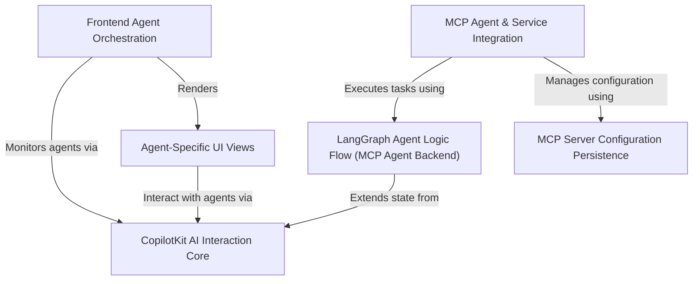

# Tutorial: open-multi-agent-canvas

This project, **Open Multi-Agent Canvas**, is a *smart chat application* where you can talk to different AI assistants (called agents) all in one place.
These agents can help with various tasks, like a *Travel Agent* for planning trips or a *Research Agent* for gathering information.
It also features a special **MCP Agent** that can connect to and use *custom tools or external services* you define.
The application conveniently *remembers your custom tool configurations* using your browser's local storage, making it easier to use them again.

**Source Repository:** [https://github.com/CopilotKit/open-multi-agent-canvas.git](https://github.com/CopilotKit/open-multi-agent-canvas.git)

## Chapters

1. [CopilotKit AI Interaction Core
](01_copilotkit_ai_interaction_core_.md)
2. [Frontend Agent Orchestration
](02_frontend_agent_orchestration_.md)
3. [Agent-Specific UI Views
](03_agent_specific_ui_views_.md)
4. [MCP Agent & Service Integration
](04_mcp_agent___service_integration_.md)
5. [LangGraph Agent Logic Flow (MCP Agent Backend)
](05_langgraph_agent_logic_flow__mcp_agent_backend__.md)
6. [MCP Server Configuration Persistence
](06_mcp_server_configuration_persistence_.md)

---

Generated by [AI Codebase Knowledge Builder](https://github.com/The-Pocket/Tutorial-Codebase-Knowledge)