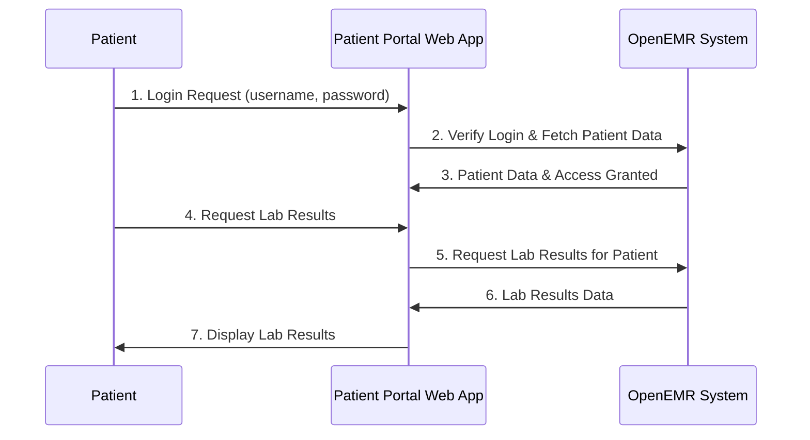

# Chapter 1: Patient Portal

Welcome to your first chapter in understanding OpenEMR! We'll start with a core concept that directly affects how patients interact with their own health data: the **Patient Portal**.

Have you ever logged into a bank's website to check your balance, or an online shopping site to track an order? The Patient Portal is very similar! It's an **online "front door" for patients** to securely access parts of their medical records.

Think of it this way: instead of calling the clinic for every little thing, a patient can log in and:
*   View their lab results.
*   See upcoming appointments.
*   Send a secure message to their doctor.
*   Update their personal information.

The Patient Portal makes healthcare more convenient for patients and helps clinics run more smoothly by reducing phone calls and paperwork.

---

### Key Concepts of the Patient Portal

The Patient Portal isn't just one big piece of software; it's made up of several important parts working together. Let's break down the main ideas:

1.  **Patient-Facing Web Application:** This is the part the patient actually sees and interacts with in their web browser. It's designed to be simple and easy to use.
2.  **Secure Access:** Since health information is private, strong security is essential. Patients need to log in with a username and password, and all communication is encrypted.
3.  **Data Display:** The portal fetches information (like allergies, medications, or visit summaries) from OpenEMR and displays it clearly for the patient.
4.  **Data Updates:** Patients can sometimes update their own information (like address or phone number) through the portal. These updates then get sent back to OpenEMR.
5.  **Messaging:** A secure way for patients to communicate with their healthcare providers without using regular email.

---

### How Patients Use the Portal: A Simple Example

Let's imagine a patient named "Jane Doe" wants to check her recent lab results.

**Use Case: Jane wants to view her lab results.**

1.  **Jane logs into the Patient Portal website.** She enters her username and password.
2.  **The system verifies her login.** If successful, she gains access to her personal health information dashboard.
3.  **Jane navigates to the "Lab Results" section.**
4.  **The portal requests Jane's lab results from the OpenEMR system.**
5.  **OpenEMR sends the results back to the portal.**
6.  **The portal displays the results** in an easy-to-understand format for Jane.

---

### Under the Hood: How the Portal Works

Let's simplify how this works. Think of it like a restaurant:

*   **Jane (Patient):** The customer who wants food (data).
*   **Patient Portal Website:** The waiter who takes Jane's order and brings her food.
*   **OpenEMR System:** The kitchen where all the food (data) is stored and prepared.

Here's a simplified flow:



In this diagram:
1.  The Patient (P) tries to log in.
2.  The Patient Portal Web App (PP) sends this to the OpenEMR System (O) to check if the user is valid and get basic patient info.
3.  OpenEMR sends back confirmation and some patient data.
4.  Patient then asks the Patient Portal for specific information, like lab results.
5.  The Patient Portal asks OpenEMR for those results.
6.  OpenEMR provides the results.
7.  Finally, the Patient Portal displays them to the Patient.

---

### A Glimpse at the Code: How the Portal Displays Data

The Patient Portal web application uses technologies like `JavaScript` and `Backbone.js` to manage and display information. Don't worry if these terms are new; we'll keep it super simple!

When Jane's lab results are fetched, the Patient Portal uses special parts of its code to organize and show this data.

Let's look at `portal/patient/scripts/view.js` and `portal/patient/scripts/model.js` files.

#### `model.js`: Data Handlers

The `model.js` file is like a "data manager." It defines how the Patient Portal understands and organizes different pieces of health information, like patient details or lab results.

Here's a simplified look at how `model.js` defines a "collection" of patient data:

```javascript
// From portal/patient/scripts/model.js (simplified)
var model = {};

model.AbstractCollection = Backbone.Collection.extend({
    // ... code for handling data collections ...
    parse: function(response, options) {
        // This part helps organize data received from OpenEMR
        var rows;
        if (response.currentPage) {
            rows = response.rows;
            // ... lots of other page info here ...
        } else {
            rows = response;
        }
        return rows;
    }
});

// A specific type of collection for patient data
model.PortalPatientCollection = model.AbstractCollection.extend({
    url: 'api/portalpatientdata', // Where to get patient data from OpenEMR
    model: model.PortalPatientModel // What a single patient data item looks like
});
```
**Explanation:** The `model.js` file defines how to talk to OpenEMR to get patient data. It uses something called `Backbone.Collection` which is a way to handle lists of things (like a list of lab results or a list of patients). The `url` part tells it *where* to get the data (e.g., `api/portalpatientdata`), and `model.PortalPatientModel` describes the structure of *each individual patient's data*.

#### `view.js`: Displaying Data

The `view.js` file is all about *what the patient sees*. It takes the data managed by `model.js` and turns it into HTML that the web browser can display.

```javascript
// From portal/patient/scripts/view.js (simplified)
var view = {
    // ... other view functions ...

    CollectionView: Backbone.View.extend({
        template: null, // This is where the visual layout (HTML) goes
        templateEl: null, // Points to the HTML template
        collection: null, // The list of data to display

        initialize: function(options) {
            // When the view starts, it listens for changes in the data
            this.listenTo(this.collection,'add', this.handleCollectionAdd);
            // ... more listeners ...
        },

        render: function() {
            // This prepares the visual layout and fills it with data
            var html = this.template({
                items: this.collection, // The data from the model
                page: { /* ... pagination info ... */ }
            });
            $(this.el).html(html); // Puts the generated HTML onto the page
            this.trigger('rendered'); // Tells other parts that it's done
        }
    })
};
```
**Explanation:** The `view.js` file contains `CollectionView`. This part is responsible for taking a collection of data (like Jane's lab results, handled by `model.js`) and showing it to the customer (Jane)! The `render` function is the key here; it basically takes a template (which is like a blueprint for how the data should look) and fills it with the actual data, then puts that on the web page.

#### `app/patientdata.js`: Connecting the Pieces

This file, `portal/patient/scripts/app/patientdata.js`, acts like the "control center" for the patient profile section. It brings together the models (data) and views (display) to create the interactive Patient Portal experience.

```javascript
// From portal/patient/scripts/app/patientdata.js (simplified)
var page = {
    patientData: new model.PatientCollection(), // Our patient data container
    collectionView: null, // Our display manager
    // ... other variables ...

    init: function () {
        // This runs when the page loads
        this.collectionView = new view.CollectionView({
            el: $("#patientCollectionContainer"), // Where to put the display
            templateEl: $("#patientCollectionTemplate"), // The display blueprint
            collection: page.patientData // The data to display
        });

        this.collectionView.on('rendered', function () {
            // After the display is drawn, we can show details
            var m = page.patientData.first();
            page.showDetailForm(m);
        });

        // Get the patient data when the page starts
        this.fetchPatientData({page: 1, patientId: cpid});
    },

    fetchPatientData: function(params, hideLoader) {
        // This asks the patientData collection to get data from OpenEMR
        page.patientData.fetch({
            data: params,
            success: function() {
                // When data arrives, the view automatically updates!
                console.log('Patient data fetched!');
            },
            error: function(m, r) { /* ... error handling ... */ }
        });
    }
};
```
**Explanation:** This `patientdata.js` file is the orchestrator. When the patient portal page loads, its `init` function runs. It creates a `CollectionView` (from `view.js`) and tells it to use the `patientData` (from `model.PatientCollection`). Then, it calls `fetchPatientData` to actually go and get the patient's information from OpenEMR. Once the data arrives, the `CollectionView` automatically updates to show the patient's details!

---

### Conclusion

The Patient Portal is a vital component of OpenEMR, providing patients with secure, convenient access to their health information. It works by combining data management (models) and display logic (views) with a central control script to fetch, show, and update patient data. This allows patients to manage their health more actively, improving their experience with the healthcare system.

In the next chapter, we'll explore the **Telehealth Module**, another exciting way OpenEMR connects patients and providers!

[Next Chapter: Telehealth Module](02_telehealth_module_.md)

---

Generated by [AI Codebase Knowledge Builder](https://github.com/The-Pocket/Tutorial-Codebase-Knowledge)