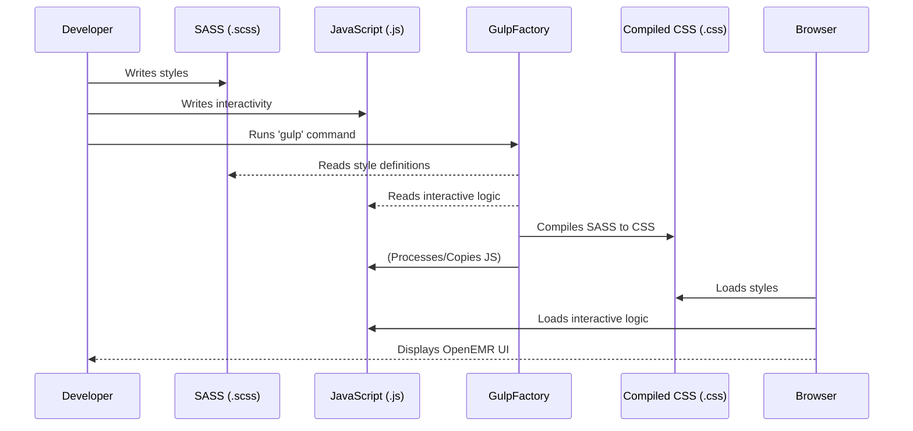

# Chapter 1: User Interface (UI) Components & Styling

Welcome to the world of OpenEMR! Imagine you're building a house. You need different parts like bricks, windows, and doors, and then you want to paint them with different colors and textures. In the digital world of OpenEMR, creating what you see on your screen (the User Interface, or UI) is quite similar.

This chapter will teach you about the "bricks" and "paint" of OpenEMR's UI: **UI Components and Styling**. By the end, you'll understand how OpenEMR creates its visual appearance and how you can even customize it.

### The Problem: Making OpenEMR Look Good and Work Well

Imagine you are a doctor and you need to see a patient’s health record. You open OpenEMR, and you see fields for name, date of birth, previous diagnoses, and maybe even a button to add new medication. How does OpenEMR know to display these fields and buttons, and how does it make them look organized and professional?

The challenge is to create a dynamic and flexible interface that can be easily changed, updated, or even customized to look different for various users or clinics. We want to avoid manually drawing every single line and box on the screen each time. That would be a nightmare!

### The Solution: Building with LEGOs and Painting Them!

OpenEMR solves this by using a "component-based approach" with "themes."

Think of it like this:

*   **LEGO Bricks (Components):** Each piece of the user interface, like a button, a text input box, or even a whole navigation menu, is a separate, reusable "LEGO brick." These are our **UI Components**.
*   **Paint Colors (Styling & Themes):** We don't just have plain gray LEGOs! We can "paint" these bricks using different styles and group these styles into **Themes**. This lets the whole interface change its look and feel with a few clicks.

Let's break down these concepts.

#### Key Concept 1: SASS - The Smart Paintbrush

When you want to paint your LEGO bricks, you don't just use one big bucket of paint. You might mix specific colors, add textures, or apply them in a special way. In OpenEMR, we use something called **SASS (Syntactically Awesome Style Sheets)** for styling.

SASS is like a super-powered version of regular CSS (Cascading Style Sheets), which is the standard language for describing how web pages look.

*   **Why SASS?** SASS allows us to write styles more efficiently, reuse bits of styling code, and organize our "paint colors" in a much smarter way. For example, if all your buttons need to be a certain shade of blue, you can define that blue once and use it everywhere. If you want to change that blue later, you change it in one place, and all buttons update automatically!

Here's an analogy:
Imagine you have a recipe for mixing a specific shade of blue paint for *all* your window frames. Instead of writing down the exact proportions for every window frame individually (`2 parts sky blue, 1 part ocean blue, drop of white`), SASS lets you create a variable like `$openemr-blue: #3498db;` and then you just say `color: $openemr-blue;` for all windows. Much easier to manage!

In OpenEMR, SASS files often end with `.scss`. You can see mentions of `.scss` files in the `interface/README.md` file describing how the UI is built.

```markdown
# OpenEMR-interface

The OpenEMR UI is built with [SASS](https://sass-lang.com/) on top of a bootstrap base (compiled with [gulp](https://gulpjs.com/)).
```
This snippet from the `interface/README.md` file tells us that SASS is the foundation for OpenEMR's UI styles.

#### Key Concept 2: JavaScript - The Interactive Builder

While SASS is great for how things *look*, the user interface also needs to *do* things. When you click a button, something should happen. When you fill out a form, the system needs to react. This "doing" part is handled by **JavaScript**.

JavaScript adds interactivity to our LEGO bricks. It's like adding hinges to a door brick so it can open and close, or making a light switch brick actually turn a light on!

You can see references to JavaScript files in the `interface/super/rules/www/js/cdr-multiselect/jquery.switchButton.js` and `interface/modules/zend_modules/public/js/lib/jquery-ui.custom.js` files. These files contain code that makes parts of the UI interactive, like a special kind of switch button or calendar components.

```javascript
/*
 * Meant to be used on a <input type="checkbox">, this widget will replace the receiver element with an iPhone-style
 * switch button with two states: "on" and "off".
 */
(function($) {
    $.widget("sylightsUI.switchButton", {
        options: {
            checked: undefined,         // State of the switch
            show_labels: true,          // Should we show the on and off labels?
            labels_placement: "both",   // Position of the labels: "both", "left" or "right"
            on_label: "ON",             // Text to be displayed when checked
            off_label: "OFF",           // Text to be displayed when unchecked
            // ... (other options) ...
        },
        _create: function() { /* ... */ },
        _initLayout: function() { /* ... */ }
        // ... (more functions for interactivity) ...
    });
})(jQuery);
```
This is a small part of a JavaScript file. It shows how OpenEMR uses jQuery (a popular JavaScript library) to create a "switch button" (like an on/off toggle). This component is interactive; clicking it changes its state and performs actions.

#### Key Concept 3: Gulp - The Automated Factory

Imagine you have all your LEGO bricks and all your paint colors. How do you efficiently assemble them, paint them, and get them ready for use? You wouldn't do it by hand for thousands of bricks! You'd use a small factory.

In OpenEMR, **Gulp** is an automated factory that takes all your SASS files (raw paint colors) and JavaScript files, processes them, and turns them into the final CSS and JavaScript files that web browsers can understand. This process is called "compilation."

The `gulpfile.js` file is the recipe for this factory. It tells Gulp exactly what to do.

```javascript
// configuration
let config = {
    // ...
    // Source file locations
    src: {
        styles: {
            style_tabs: 'interface/themes/tabs_style_*.scss',
            style_uni: 'interface/themes/oe-styles/style_*.scss',
            style_color: 'interface/themes/colors/*.scss',
            directional: 'interface/themes/directional.scss',
            misc: 'interface/themes/misc/**/*.scss',
            style_other: 'interface/themes/style*.scss'
        }
    },
    dist: {
        assets: 'public/assets/'
    },
    dest: {
        themes: 'public/themes',
        misc_themes: 'public/themes/misc'
    }
};
// ...
function styles_style_uni() {
    let isSuccess = true;
    return gulp.src(config.src.styles.style_uni) // Takes SASS files
        // ... processes them with sass() and postcss() ...
        .pipe(gulp.dest(config.dest.themes)) // Puts the finished CSS here
        .on('end', () => {
            if (isSuccess) {
                console.log(logprefix + "Finished compiling OpenEMR base themes");
            }
        });
}
```
This snippet from `gulpfile.js` shows how Gulp is configured to find source SASS files (`.scss`) and compile them into CSS (`.css`) files, which are then placed in the `public/themes` directory. The `styles_style_uni` function specifically handles compiling the "universal" theme styles.

You can trigger this factory using commands like `npm run dev` or `npm run build` from your terminal, as mentioned in the `interface/README.md`.

#### Visualizing the Process

Let's visualize how these pieces work together:


This diagram shows the flow: A developer writes SASS and JavaScript. Gulp then uses these files to produce the final CSS and JavaScript that the web browser understands and uses to display the OpenEMR user interface.

### Themes: Different Looks for Your LEGO House

OpenEMR uses themes to change the overall visual style. Just like you might have different "collections" of LEGOs (e.g., Star Wars, City, Technic) that dictate the look of your models, OpenEMR has different themes.

From `interface/README.md`:

```markdown
### Themes

Different `themes` share a common `core` and have their own overrides to customize the appearance of OpenEMR.

There are three different types of themes:
* The `light` theme is the default modern theme
* The `manila` theme is a combination of OpenEMR's legacy themes (which have all been removed) with some modern elements.
* The other themes (called `colors`) are the same `color_base` theme with different color palettes.
```

This explains that themes allow OpenEMR to have a consistent base style (`core`) but then apply specific "overrides" (like different paint choices) to create distinct appearances. The `light` theme is the standard, while `manila` offers a more classic feel, and `colors` allow for simple color palette changes.

### Conclusion: Building blocks for a Dynamic Interface

In this chapter, we've learned that OpenEMR's user interface is built like a house of LEGOs.

*   **UI Components** are the reusable "bricks" like buttons and input fields.
*   **SASS** is our smart paintbrush for styling these components efficiently.
*   **JavaScript** adds interactivity, making components functional.
*   **Gulp** is the automated factory that processes and compiles these pieces into functional web elements.
*   **Themes** allow OpenEMR to offer different visual styles, much like different paint palettes for your house.

This modular approach makes OpenEMR's UI flexible, maintainable, and customizable. Understanding these foundational concepts is crucial as we delve deeper into specific parts of OpenEMR.

Next, we'll explore how OpenEMR manages patient data, focusing on the client-side aspects of how this information is handled directly in your browser.

[Core Patient Data Management (Client-Side)](02_core_patient_data_management__client_side__.md)

---

Generated by [AI Codebase Knowledge Builder](https://github.com/The-Pocket/Tutorial-Codebase-Knowledge)