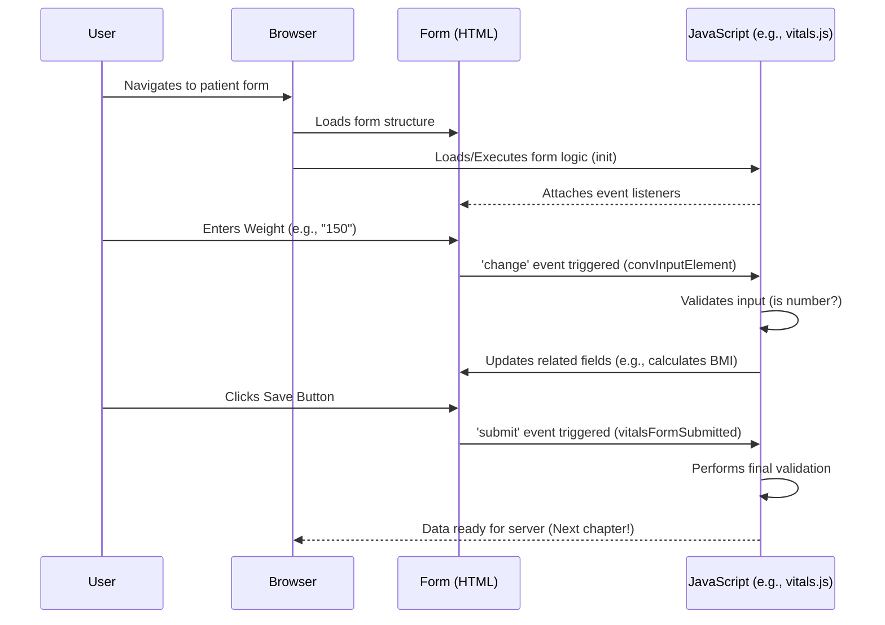

# Chapter 2: Core Patient Data Management (Client-Side)

Welcome back! In [Chapter 1: User Interface (UI) Components & Styling](01_user_interface__ui__components___styling_.md), we learned about the "bricks" and "paint" that make up OpenEMR's visual appearance. Now, let's talk about what's inside those bricks – the actual information.

### The Problem: Managing Patient Records in the Browser

Imagine you're a medical assistant. A new patient walks in, or an existing patient needs their blood pressure updated. You need to record their name, date of birth, new blood pressure reading, or maybe some notes from the doctor. How does OpenEMR give you a clear, easy-to-use digital form to type all this in, and then immediately show you the updated information?

The challenge is to handle all this patient-related data directly within your web browser – the "client-side." We need a way for the forms to appear, for you to enter data, for the system to check if it's valid (like checking if a measurement is a number), and for the data to be ready to be saved. This is like having a digital patient chart right on your screen that you can write on and read from in real-time.

### The Solution: Your Digital Clipboard

OpenEMR solves this by creating a "digital clipboard" directly in your browser. This clipboard doesn't just show information; it also lets you add, edit, and view it.

This "Core Patient Data Management (Client-Side) " combines several of those "JavaScript" components we talked about in [Chapter 1: User Interface (UI) Components & Styling](01_user_interface__ui__components___styling_.md) with a clear structure to handle specific types of patient information.

Let's break down how this digital clipboard works.

#### Key Concept 1: Forms as Data Collectors

At the heart of client-side patient data management are **forms**. These are the web pages with input fields (like text boxes, dropdowns, checkboxes) where you type or select patient information. OpenEMR has specific forms for:

*   **New Patients:** To collect basic demographic information.
*   **Vitals:** To record blood pressure, height, weight, etc.
*   **Clinical Notes:** For doctors to write their observations and plans.
*   **And many more!**

These forms are "smart" because they use JavaScript to make sure you're entering the right kind of data and to respond to your actions.

**Use Case: Entering New Vitals**

Let's say a patient just had their vitals taken, and you need to enter their weight and height.

1.  You'd navigate to the "Vitals" section for the patient.
2.  An empty form (our digital clipboard) appears.
3.  You type in the weight (e.g., 150) and height (e.g., 68).
4.  The form instantly reacts, perhaps calculating the BMI for you, and highlights any errors if you type something wrong (like text where a number should be).
5.  When you click "Save," the data is prepared to be sent to the server.

Let's see how JavaScript helps manage a simple part of a form, like ensuring numerical input.

```javascript
// From interface/forms/vitals/vitals.js
function convInputElement(evt) {
    let node = evt.currentTarget;
    let value = node.value; // Get what the user typed
    // ... other setup ...

    if (value != "") {
        let convValue = convUnit(system, unit, value); // Try to convert it
        if (!isNaN(convValue)) { // Check if it's a valid number
            // ... update other fields with the number ...
        } else {
            console.error("Failed to get valid number for input with id ", node.id, " with value ", value);
        }
    }
    // ... rest of function ...
}
```
This JavaScript snippet from `vitals.js` shows a function that runs when you type something into an input field for vitals. It gets the value you typed (`node.value`), tries to convert it to a number, and then `isNaN(convValue)` checks if it *is not a number*. If it's not, it can show an error or prevent incorrect data from being processed. This is client-side validation!

#### Key Concept 2: Dynamic Data Display

Once data is entered, it needs to be seen. OpenEMR uses JavaScript to dynamically update what you see on the screen. This means the page doesn't always have to reload from the server to show new information. When you add a new clinical note, it might appear in a list instantly.

A fundamental way patient data is presented is via a patient's main "dashboard" or "summary" view. This uses a `patient_data_view_model`, which is like a blueprint for how patient information should be laid out and updated on the screen.

```javascript
// From interface/main/tabs/js/patient_data_view_model.js
function patient_data_view_model(pname,pid,pubpid,str_dob)
{
    var self=this;
    self.pname=ko.observable(pname); // Patient's name
    self.pid=ko.observable(pid);     // Patient ID
    self.pubpid=ko.observable(pubpid); // Public Patient ID
    self.str_dob=ko.observable(str_dob); // Date of Birth as a string

    self.encounterArray=ko.observableArray(); // A list of encounters
    self.selectedEncounterID=ko.observable(); // The currently selected encounter ID
    // ... more properties and setup for displaying data ...
    return this;
}
```
This simplified JavaScript shows a `patient_data_view_model`. This model holds important patient details like `pname` (patient name) and `pid` (patient ID), and also manages lists of related data like `encounterArray` (a list of all past visits or encounters). When these `observable` values change (e.g., a new encounter is added), the parts of the UI linked to them can update automatically without a full page refresh.

#### Key Concept 3: Event Handling for User Interaction

When you click a button, type in a box, or select an item from a list, JavaScript called "event handlers" kick into action. These handlers are like tiny assistants waiting for something to happen on the digital clipboard.

Look at how a form submission is handled in `vitals.js`:

```javascript
// From interface/forms/vitals/vitals.js
function initDOMEvents() {
    let vitalsForm = document.getElementById('vitalsForm');
    if (!vitalsForm) { /* ... handle error ... */ }

    // When the vitals form is submitted
    document.getElementById('vitalsForm').addEventListener('submit', function(event) {
        if (!vitalsFormSubmitted()) { // Check if data is valid
            event.preventDefault(); // Stop the form from sending to the server
            // ... scroll to first error ...
            return false;
        }
    });

    // ... Event listeners for other input fields ...
}
```
This code adds an "event listener" to the `vitalsForm`. It means: "Hey, `vitalsForm`, if someone tries to `submit` you, first run the `vitalsFormSubmitted()` function. If that function says there's a problem (returns `false`), then `event.preventDefault()` stops the form from trying to save the data yet, keeping control on the client-side."

#### Internal Implementation: How the Digital Clipboard Works

When you interact with a patient data form in OpenEMR, here's a simplified step-by-step process of what happens on the client-side:

1.  **Form Load:** The browser loads the HTML for the form (e.g., `vitals.php` or `newpatient.php`).
2.  **JavaScript Initialization:** The browser then loads linked JavaScript files (like `vitals.js`, `newpatient.js`, `clinical-notes.js`). These files contain code that sets up event listeners and initializes UI components. For instance, `initDOMEvents()` in `vitals.js` is called.
3.  **User Input:** You type a value into an input field (e.g., weight).
4.  **Client-Side Validation/Processing:** A JavaScript function (like `convInputElement` in `vitals.js`) attached to the input field's "change" event immediately checks the input. It might perform a calculation (like converting units) or validate if the input is a valid number.
5.  **Dynamic UI Update:** If the input is valid, other parts of the form might update instantly (e.g., BMI is calculated and displayed). If invalid, an error message or styling might appear.
6.  **Form Submission Attempt:** You click the "Save" button.
7.  **Final Client-Side Validation:** The form's `submit` event listener (e.g., in `initDOMEvents` calling `vitalsFormSubmitted`) runs final checks on all the input fields.
8.  **Preparation for Server:** If all data is valid, JavaScript prepares the data in the form to be sent to the server. (We'll cover the server interaction in [Chapter 3: API & Integration](03_api___integration_.md)).

Here's a simplified sequence diagram:



This diagram shows how user interactions directly trigger JavaScript functions within the browser, allowing for immediate feedback and validation before any data even leaves your computer.

Let's look at a function that helps manage rows in forms like Clinical Notes or Observations, allowing doctors to add or remove multiple entries for the same type of data.

```javascript
// From interface/forms/clinical_notes/clinical-notes.js
function duplicateRow(event) {
    event.preventDefault();
    let btn = event.currentTarget; // The button that was clicked
    let oldId = 'tb_row_' + btn.id.split('btn-add_')[1]; // Get ID of row to duplicate
    let dupRow = document.getElementById(oldId); // Find the original row

    let newRow = dupRow.cloneNode(true); // Create a copy of the row
    dupRow.parentNode.insertBefore(newRow, dupRow.nextSibling); // Insert new row

    // Change IDs of elements in the new row so they are unique
    changeIds('tb_row');
    changeIds('description');
    // ... more changeIds calls ...

    removeVal(newRow.id); // Clear values in the new row
    updateDefaults(newRow.id); // Set default values
}

// From interface/forms/clinical_notes/clinical-notes.js
function changeIds(class_val) {
    var elem = document.getElementsByClassName(class_val);
    for (let i = 0; i < elem.length; i++) {
        if (elem[i].id) {
            index = i + 1;
            elem[i].id = class_val + "_" + index; // Assign a new unique ID
        }
    }
}
```
The `duplicateRow` function (found in `clinical-notes.js`, `careplan.js`, `observation.js`, and `vitals.js`) is super important. When a user clicks an "Add Row" button, this function literally copies an existing row in a form (like for multiple clinical notes entries) and inserts the copy onto the page. Crucially, it then calls `changeIds` and `removeVal` to give all the input fields in the *new* row unique IDs and clear out any copied values, ensuring the form works correctly for new inputs.

These client-side scripts are critical for a smooth user experience, providing immediate feedback and ensuring data quality before it's ever sent to the server.

### Conclusion: Instant Feedback and Control

In this chapter, we've explored "Core Patient Data Management (Client-Side)." We learned that it's all about how OpenEMR manages patient information directly within your web browser. This includes:

*   Using **forms** as digital clipboards for data entry.
*   Employing **JavaScript** for dynamic updates and validation, giving instant feedback.
*   Utilizing **event handlers** to respond to user actions like typing and clicking.

This client-side management makes OpenEMR feel responsive and interactive, empowering users to manage patient data effectively before it goes anywhere else.

Next, we'll dive into how this client-side data talks to the OpenEMR server to be permanently stored and retrieved using the [API & Integration](03_api___integration_.md) layer.

---

Generated by [AI Codebase Knowledge Builder](https://github.com/The-Pocket/Tutorial-Codebase-Knowledge)