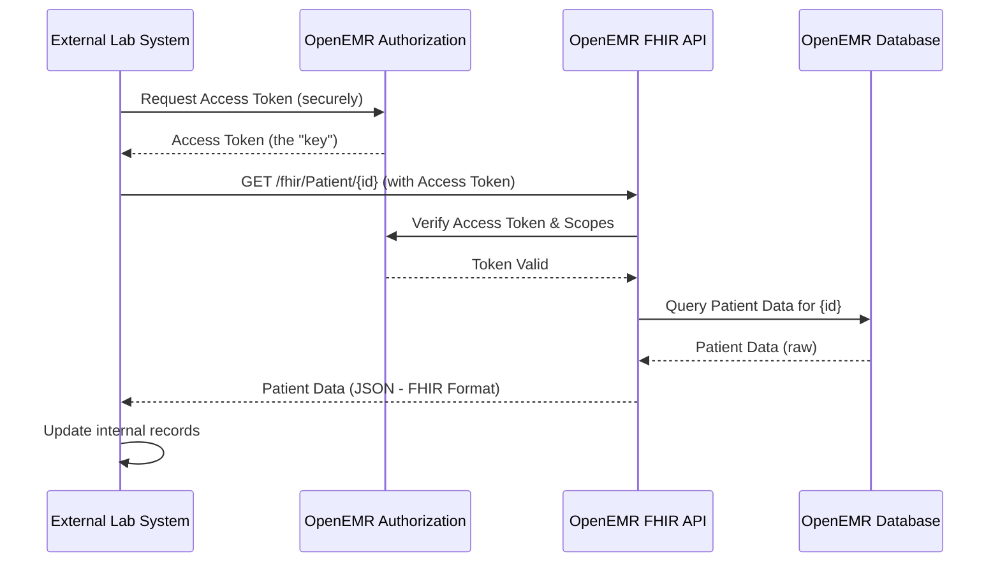

# Chapter 3: API & Integration

Welcome back! In [Chapter 1: User Interface (UI) Components & Styling](01_user_interface__ui__components___styling_.md), we learned how OpenEMR looks and feels. In [Chapter 2: Core Patient Data Management (Client-Side)](02_core_patient_data_management__client_side__.md), we explored how data is gathered and validated in your browser. Now, let's talk about how that data actually gets stored permanently and how OpenEMR can "talk" to other medical software systems.

### The Problem: Making Systems Talk to Each Other

Imagine you're a doctor's office using OpenEMR, and you've just updated a patient's address in their record. Your office also uses a separate lab system for ordering tests, and that lab system *also* needs the patient's updated address. How do these two separate computer programs "know" about each other's updates without someone manually typing the address into both systems? That would be slow, prone to errors, and very frustrating!

The challenge is getting different computer systems, maybe even made by different companies, to share information smoothly and securely. It's like trying to get people who speak different languages to have a conversation.

### The Solution: Universal Translators and Data Roadways

OpenEMR solves this by providing "universal translators" and "data roadways." These are called **APIs (Application Programming Interfaces)**.

Think of an API as a restaurant menu. When you go to a restaurant, you don't go into the kitchen to prepare your food. You look at the menu, tell the waiter what you want (e.g., "I'd like the patient's record for John Doe"), and the waiter (the API) takes your order to the kitchen (OpenEMR's internal system). The kitchen prepares it, and the waiter brings you back your food (the patient data).

This chapter will teach you about two main types of "menus" or APIs in OpenEMR:

1.  **RESTful APIs:** These are like a general menu for many different types of requests, good for interacting with OpenEMR's data and functions in a general way.
2.  **FHIR APIs:** These are special, healthcare-specific menus designed for exchanging medical information in a standardized way. FHIR stands for **F**ast **H**ealthcare **I**nteroperability **R**esources. It's like a restaurant menu that only has very specific, standardized medical dishes.

These APIs allow other programs to "order" information from OpenEMR or "send" information to OpenEMR without needing to understand all of OpenEMR's internal workings.

**Use Case: Automatically Sharing Patient Data**

Let's stick with our example: automatically sharing a patient's updated address between OpenEMR and an external lab system.

1.  A staff member updates John Doe's address in OpenEMR (using the client-side forms we discussed in Chapter 2).
2.  OpenEMR's internal systems save this update.
3.  The lab system can then "ask" OpenEMR, using its API, "Hey OpenEMR, what's John Doe's latest patient information?"
4.  OpenEMR "responds" with the updated address, and the lab system can then update its own records automatically.

This seamless exchange is possible because of OpenEMR's APIs.

#### Key Concept 1: What is an API (General RESTful API)

An API defines a set of rules for how different software programs can communicate with each other. For OpenEMR's RESTful APIs, these rules often involve sending requests over the internet (like visiting a website) and getting back information in a commonly understood format, usually **JSON (JavaScript Object Notation)**. JSON is like a simple, organized way to write down information.

The `API_README.md` file talks about how to use OpenEMR's Standard REST API. It mentions:

```markdown
## Overview

Easy-to-use JSON-based REST API for OpenEMR. FHIR is also supported, see FHIR API documentation [here](FHIR_README.md),

## Prerequisite

Enable the Standard API service (/api/ endpoints) in OpenEMR menu: Administration->Config->Connectors->"Enable OpenEMR Standard REST API"
```

This tells us:
*   OpenEMR has a REST API.
*   It uses JSON for data exchange.
*   You need to enable it in OpenEMR's settings first.

A simple example of an API interaction:

```javascript
// From interface/super/edit_globals.js
class ApiHandler {
    #apiUrl = null; // Where OpenEMR's API lives
    #csrfToken = null; // Security token

    getStandardApiUrl(path) {
        // Builds the full address to "talk" to OpenEMR's general API
        return this.#apiUrl + "/api/" + path;
    }

    fetchStandardApiJSON(path) {
        let url = this.getStandardApiUrl(path); // Get the full address
        let headers = {'apicsrftoken': this.getCsrfToken()}; // Add the security token

        // This is like making a web request to that address
        return window.fetch(url, {
            method: 'GET', // We want to GET information
            headers: headers
        })
        .then(result => {
            // Check if the request was successful
            if (!(result.ok && result.status === 200)) {
                throw new Error("Failed to retrieve valid response");
            } else {
                return result.json(); // If successful, get the data as JSON
            }
        });
    }
}
```
This is a simplified version of `ApiHandler` from `edit_globals.js`. It shows how OpenEMR internally fetches data using its own Standard API. The `fetchStandardApiJSON` function creates a web request (`window.fetch`), adds a security token, and expects JSON data back.

#### Key Concept 2: FHIR APIs (Healthcare-Specific)

FHIR (Fast Healthcare Interoperability Resources) is a modern standard specifically designed for exchanging healthcare information. It's like a special language that all medical software systems are learning to speak. This makes it easier to share patient records, lab results, appointments, and more, accurately and securely.

The `FHIR_README.md` file explains this:

```markdown
# OpenEMR FHIR API Documentation

## Overview

Easy-to-use JSON-based REST API for OpenEMR FHIR. See standard OpenEMR API docs [here](API_README.md).  The OpenEMR FHIR API conforms to the R4 specification and the US Core 3.1 Implementation Guide (IG).

## Prerequisite

Enable the Standard FHIR service (/fhir/ endpoints) in OpenEMR menu: Administration->Config->Connectors->"Enable OpenEMR Standard FHIR REST API"
```
This highlights that OpenEMR also has a FHIR API, it's JSON-based, and it follows specific healthcare standards (R4 and US Core 3.1).

Just like with the general API, there's a specific way to build the address for FHIR requests:

```javascript
// From interface/super/edit_globals.js
class ApiHandler {
    // ... (previous code) ...

    getFhirApiUrl(path) {
        // Builds the full address to "talk" to OpenEMR's FHIR API
        return this.#apiUrl + "/fhir/" + path;
    }

    // ... (rest of the class) ...
}
```
This `getFhirApiUrl` function from `ApiHandler` shows that the path for FHIR requests includes `/fhir/`. So, for example, to get patient data using FHIR, you might ask for `/fhir/Patient`.

#### Key Concept 3: Authorization and Security

When different systems "talk" to each other, especially with sensitive patient data, security is paramount. OpenEMR uses a system called **OAuth2/OIDC** for this.

Imagine you're visiting a friend's house. You don't just walk in; you knock, they verify who you are, and if you're welcome, they give you a key. OAuth2 is like that key system. An external application "knocks" (authenticates), OpenEMR verifies if it's allowed, and then gives it a temporary "key" (an access token). This key is used for all subsequent requests until it expires.

The `API_README.md` clearly states this:

```markdown
## Authorization

OpenEMR uses OIDC compliant authorization for API. SSL is required and setting baseurl at Administration->Config->Connectors->'Site Address (required for OAuth2 and FHIR)' is required. The listing of scopes can be found in below Scopes section.
```
This tells us that OpenEMR secures its API with OIDC (OpenID Connect, an extension of OAuth2) and requires secure connections (SSL). It also mentions "scopes," which are like permissions – limiting what an external system can access (e.g., "read patient data" but not "modify patient data").

#### How API & Integration Works (Internal Flow)

Let's trace how our lab system might "ask" OpenEMR for John Doe's updated patient information using its API:

1.  **Lab System's Request:** The external lab system (let's call it "LabApp") wants John Doe's updated demographic information.
2.  **Authorization:** LabApp first securely connects to OpenEMR and asks for an access token (the "key"). OpenEMR verifies LabApp's identity and permissions.
3.  **Data Request:** Once LabApp has the "key," it sends a request to OpenEMR's FHIR API, something like: `GET /fhir/Patient/john_doe_id`. This is like requesting a specific "dish" (patient data) from the FHIR "menu." LabApp includes the "key" (access token) in its request.
4.  **OpenEMR Processes:** OpenEMR receives the request, checks the "key" to ensure LabApp is authorized and has the right permissions (`patient/Patient.read` scope).
5.  **Database Query:** If authorized, OpenEMR's internal system (which you would eventually explore in database chapters) fetches John Doe's latest details from its database.
6.  **JSON Response:** OpenEMR packages this information into a standardized FHIR patient resource in JSON format.
7.  **Lab System Receives:** OpenEMR sends this JSON response back to LabApp.
8.  **Lab System Updates:** LabApp "reads" the JSON data and automatically updates its own records for John Doe.

Here's a simplified sequence diagram:



This diagram illustrates how an external system communicates with OpenEMR: first getting permission, then making a data request, and finally receiving the standardized data.

Another interesting example of internal API use (which uses a generic `$.ajax` jQuery call to a controller, which in turn could be using the internal API directly) is found in modules like `product_registration_service.js` or `telehealth-appointment.js`. These are special cases where internal OpenEMR components communicate with other OpenEMR components.

For instance, the `product_registration_service.js` uses an AJAX call (which is a way for a web page to talk to a server without refreshing the whole page) to get or submit product registration status:

```javascript
// From interface/product_registration/product_registration_service.js
function ProductRegistrationService() {
    const self = this;

    self.getProductStatus = function (callback) {
        $.ajax({
            url: top.webroot_url + '/interface/product_registration/product_registration_controller.php',
            type: 'GET', // Asking for information
            dataType: 'json', // Expecting JSON data back
            success: function (response) {
                // Handle the successful data
            },
            error: function (jqXHR) {
                // Handle errors
            }
        });
    };
    // ... submitRegistration function (similar POST request) ...
}
```
This snippet from `product_registration_service.js` shows how JavaScript within OpenEMR can use AJAX to talk to its own server-side files (like `product_registration_controller.php`). This is a type of API call, but happening *within* the OpenEMR application itself to get internal information or perform an internal action.

Another example, from the `oe-module-comlink-telehealth` module, shows how a custom module might use the API to validate a patient for telehealth:

```javascript
// From interface/modules/custom_modules/oe-module-comlink-telehealth/public/assets/js/telehealth-appointment.js
function validatePatientForTelehealthForm(form, patientId, telehealthCategories) {
    let url = moduleLocation + 'public/index.php?action=patient_validate_telehealth_ready&validatePid=' + encodeURIComponent(patientId);
    // This is making another AJAX request, similar to the product registration example.
    // It calls a specific action on the server to check if a patient is ready for telehealth.
    // This internally uses OpenEMR's API capabilities.
    // ... (actual fetch/ajax call hidden for brevity, but it's similar)
}
```
This is a conceptual example based on `telehealth-appointment.js`. It emphasizes that new modules can also leverage OpenEMR's internal communication patterns (which are exposed via APIs, even if not directly the documented REST/FHIR ones) to build new features.

### Conclusion: Connecting the Healthcare Dots

In this chapter, we've explored the powerful concept of "API & Integration" in OpenEMR. We learned that:

*   **APIs** are like universal translator menus that allow different software systems to "talk" to OpenEMR.
*   **RESTful APIs** provide a general way to interact with OpenEMR's data and functions.
*   **FHIR APIs** offer a specialized, standardized language for exchanging healthcare-specific data.
*   **Authorization and Security** (like OAuth2) ensure that these conversations are private and only happen between authorized parties.

By understanding APIs, you can see how OpenEMR can not only manage patient data internally but also become a crucial hub for sharing that data with other essential healthcare systems, making the entire process more efficient and accurate.

Next, we'll dive into OpenEMR's flexible [Module System](04_module_system_.md), which allows developers to extend OpenEMR's functionality and integrate even more deeply.

---

Generated by [AI Codebase Knowledge Builder](https://github.com/The-Pocket/Tutorial-Codebase-Knowledge)