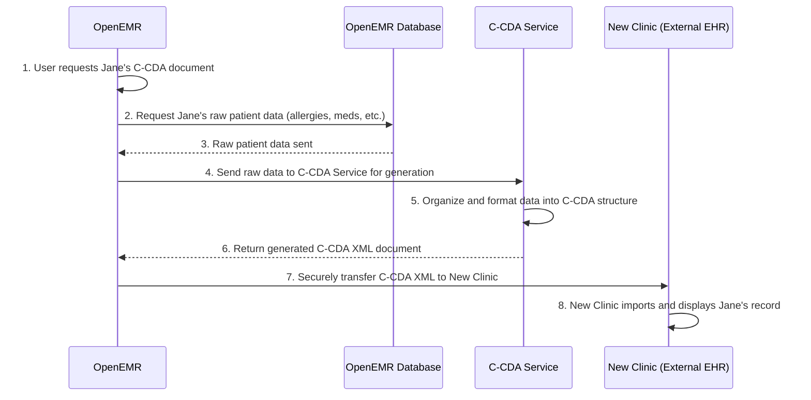

# Chapter 4: CCDA Service (C-CDA Generation)

Welcome back! In our last chapter, [Chapter 3: RESTful APIs (OpenEMR and FHIR)](03_restful_apis__openemr_and_fhir__.md), we learned how different computer systems "talk" to each other using standardized messages. This communication is essential for sharing health data. Now, we're going to explore another important way OpenEMR shares patient records: the **CCDA Service (C-CDA Generation)**.

Imagine you're visiting a new doctor, and they need to see your complete medical history. Instead of printing out stacks of paper or calling your old doctor's office for every detail, what if your previous clinic could send a single, standardized digital document that summarizes everything? That's what C-CDA (Consolidated Clinical Document Architecture) is all about!

The C-CDA Service in OpenEMR is like a **specialized printer** that takes all sorts of patient information (like allergies, medications, past visits) from OpenEMR's database, organizes it, and then prints it out into a very specific, standardized digital document. This document is in a format called **XML**, which is a lot like HTML (what web pages are made of!), but designed for data.

The main idea is to make patient records easily sharable and understandable by other healthcare systems, even if they use different software. It's like having a universal medical record language!

## A Real-World Use Case: Sharing a Patient Summary

Let's imagine our patient, Jane Doe, is moving and needs to transfer her medical records to a new clinic that uses a different Electronic Health Record (EHR) system.

**Use Case: A new clinic needs Jane Doe's patient summary from OpenEMR.**

1.  **Request for Record:** Jane's new clinic requests her patient summary from the clinic using OpenEMR.
2.  **OpenEMR Processes Request:** The OpenEMR system receives this request.
3.  **C-CDA Generation:** OpenEMR gathers all of Jane's relevant health data (demographics, allergies, medications, problems, etc.) from its database.
4.  **Standardized Document Created:** The C-CDA Service takes this raw data and "assembles" it into a standardized C-CDA XML document.
5.  **Secure Transfer:** This C-CDA document is then securely sent to Jane's new clinic.
6.  **New Clinic Imports:** The new clinic's EHR system can then easily read and understand Jane's medical history because it's in the C-CDA standard.

This process ensures that Jane's new doctor has a complete and accurate picture of her health, even if their software wasn't made by the same company as OpenEMR. No more lost faxes or confusing phone calls!

## Key Concepts of the C-CDA Service

The C-CDA Service handles a very specific, and highly regulated, type of data exchange.

1.  **Consolidated Clinical Document Architecture (C-CDA):** This is the "blueprint" for how clinical documents should be structured in XML. It's an industry standard that specifies what information goes where (e.g., patient name, allergies, medications, lab results) and how it should be formatted.
2.  **XML (eXtensible Markup Language):** This is the format of the generated documents. It uses "tags" (like `<PatientName>Jane Doe</PatientName>`) to describe the data, making it both human-readable and machine-readable.
3.  **Data Assembly:** The service pulls various pieces of information from different parts of the OpenEMR database and brings them together into a single, cohesive document.
4.  **Standardization:** The C-CDA Service ensures that the output document strictly follows the C-CDA rules, so any other system that understands the standard can read it.
5.  **Quality Reporting (QRDA):** Besides patient summaries (CCDA), this service can also generate QRDA (Quality Reporting Document Architecture) documents, which are used for reporting healthcare quality measures. It shares the same underlying technology for data assembly and XML generation.

## How it Works: The Document Assembly Line

Let's simplify how OpenEMR creates a C-CDA document for Jane Doe.



**Step-by-step Explanation:**

1.  **User Request:** A user (e.g., a clinic administrator) within OpenEMR clicks an option to generate a C-CDA document for Jane Doe.
2.  **OpenEMR Queries Database:** OpenEMR gathers all the necessary raw data about Jane from its database (e.g., her demographic details, current medications, known allergies, medical history).
3.  **Raw Data Received:** This raw, unformatted data is sent back to the part of OpenEMR that will coordinate C-CDA generation.
4.  **Send to C-CDA Service:** OpenEMR sends this raw data to the specialized **C-CDA Service**. This service often runs as a separate program (powered by Node.js, a JavaScript runtime) to handle the complex task of document generation.
5.  **Data Processing & XML Generation:** The C-CDA Service takes this raw data and carefully places it into the correct sections and fields of the C-CDA XML structure, following all the strict rules. It's like filling out a very detailed form.
6.  **C-CDA XML Returned:** Once the XML document is complete, the C-CDA Service sends it back to OpenEMR.
7.  **Secure Transfer:** OpenEMR then provides options to securely transfer this C-CDA XML document to the new clinic.
8.  **New Clinic Imports:** The new clinic's EHR system receives the C-CDA XML and can easily parse it to add Jane's information to their system.

## A Glimpse at the Code: Building the C-CDA Document

The C-CDA Service is powered by Node.js and resides in the `openemr/ccdaservice/` directory. It uses several helper functions to prepare the data and then a "generation engine" to transform that prepared data into the final XML.

### Preparing the Patient's Demographics (`populate-demographics.js`)

Before the C-CDA document can be generated, the raw patient data needs to be structured in a way the generation engine understands. OpenEMR has functions that do this.

Here's a simplified look at how patient demographics (name, address, etc.) are prepared. This is just a small piece, but it shows how raw data is mapped.

```javascript
// From ccdaservice/utils/demographics/populate-demographics.js (simplified)

function populateDemographics(documentData) {
    const patient = documentData.patient;

    return {
        name: { // Structure for patient's name
            last: patient.lname,
            first: patient.fname,
        },
        dob: { // Structure for patient's date of birth
            point: {
                date: fDate(patient.dob),
                precision: 'day',
            },
        },
        gender: patient.gender.toUpperCase(), // Patient's gender
        addresses: fetchPreviousAddresses(patient), // Handles addresses
        phone: [ // Handles phone numbers
            { number: patient.phone_home, type: 'primary home' },
            { number: patient.phone_mobile, type: 'primary mobile' },
            // ... more phone types ...
        ],
        ethnicity: patient.ethnicity,
        race: patient.race,
        // ... more patient details ...
    };
}
exports.populateDemographics = populateDemographics;
```
**Explanation:** This `populateDemographics` function takes raw `patient` data (like `patient.lname` for last name, `patient.fname` for first name) and organizes it into a specific structure. This structured data is then ready to be fed into the C-CDA generation process. Notice how `fDate` is used to format dates correctly, and `fetchPreviousAddresses` is a separate helper for addresses.

### The C-CDA Generation Engine (`oe-blue-button-generate/lib/engine.js`)

Once the data is prepared, it's sent to the core "engine" that builds the XML. This engine uses "templates" (like blueprints) to know how to arrange the data into the C-CDA XML.

Here's a super simplified view of how the `create` function in the generation engine actually builds the XML document. It creates XML nodes (like `<ClinicalDocument>`) and adds attributes and content to them.

```javascript
// From ccdaservice/oe-blue-button-generate/lib/engine.js (simplified)
const xmlutil = require('./xmlutil'); // Helper for creating XML parts

// This function creates the XML document using a template and patient data
exports.create = function (template, input, context) {
    // 1. Start a new empty XML document
    var doc = new xmlutil.newDocument();

    // 2. Recursively build the XML structure based on the 'template'
    //    and fill it with 'input' data. 'context' holds other info.
    update(doc, input, context, template);

    // 3. Convert the XML document object into a readable string
    var result = xmlutil.serializeToString(doc);

    return result; // The final C-CDA XML string
};
```
**Explanation:** The `create` function is the public face of the generation process. It starts with an empty XML document, then uses a magical `update` function (which handles the complex, recursive process of filling out the XML structure based on pre-defined templates and the
`input` data) to build the C-CDA. Finally, it converts the complex XML object into a simple string that can be saved or sent.

### XML Utilities (`oe-blue-button-generate/lib/xmlutil.js`)

The generation engine relies on a small helper (`xmlutil.js`) to actually create the XML bits.

```javascript
// From ccdaservice/oe-blue-button-generate/lib/xmlutil.js (simplified)
const libxmljs = require("libxmljs2"); // A library to work with XML

// Creates an empty XML document
exports.newDocument = function () {
    return new libxmljs.Document();
};

// Creates a new XML tag (or "node") with an optional text inside
exports.newNode = function (xmlDoc, name, text) {
    if (text === undefined) {
        return xmlDoc.node(name); // Example: <MyTag/>
    } else {
        return xmlDoc.node(name, text); // Example: <MyTag>Some text</MyTag>
    }
};

// Adds an attribute to an XML tag
exports.nodeAttr = function (node, attr) {
    node.attr(attr); // Example: <MyTag id="123"/>
};

// Converts the XML document object into a beautiful string
exports.serializeToString = function (xmlDoc) {
    return xmlDoc.toString();
};
```
**Explanation:** This `xmlutil.js` file acts as the low-level XML builder. It uses `libxmljs2`, a Node.js library, to perform the actual XML creation tasks. `newDocument` starts the XML file, `newNode` makes tags (like `<Patient>`), and `nodeAttr` adds details to those tags (like `id="123"`). Finally, `serializeToString` gives us the complete XML text.

## Conclusion

The C-CDA Service is a vital part of OpenEMR's ability to communicate with other healthcare systems. By taking disparate patient data and transforming it into a standardized C-CDA XML document, OpenEMR ensures that patient information can be easily and accurately shared, significantly improving interoperability within the healthcare ecosystem. This capability is essential for patient care coordination and for fulfilling regulatory requirements.

In the next chapter, we'll shift gears and look at **Docker Development Environments**, which are powerful tools for setting up and running OpenEMR for development and testing.

[Next Chapter: Docker Development Environments](05_docker_development_environments_.md)

---

Generated by [AI Codebase Knowledge Builder](https://github.com/The-Pocket/Tutorial-Codebase-Knowledge)