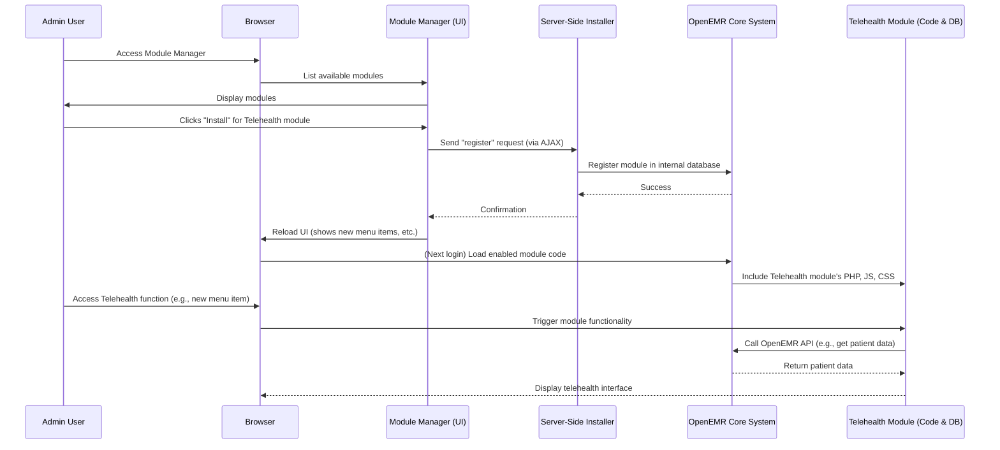

# Chapter 4: Module System

Welcome back! In [Chapter 3: API & Integration](03_api___integration_.md), we learned how OpenEMR can "talk" to other systems using APIs. Now, let's explore how OpenEMR can grow and adapt by adding new features and specialized functionalities, much like adding new apps to your smartphone.

### The Problem: OpenEMR Needs to Do More!

OpenEMR is great for managing patient records, but what if a clinic needs something very specific? Maybe they want to offer online video appointments (telehealth), or they need a special way to send electronic prescriptions to pharmacies (e-prescribing), or they have a unique billing process. Building all these specific features directly into the core OpenEMR system would make it too big, complicated, and hard to update.

Imagine your smartphone. It comes with basic functions like calling and texting. But if you want to watch videos, you download a video app. If you want to order food, you download a food delivery app. You don't get a whole new phone just because you want a new feature!

### The Solution: Building OpenEMR with LEGO Bricks, but for Features!

OpenEMR solves this by having a **Module System**. This means the core OpenEMR provides the essential functions, but you can add "modules" (like apps) to give it new features without changing the original system.

These modules can be:
*   **Custom Modules:** Built specifically for certain needs, like the Telehealth module mentioned in the concept details, or a special module for e-prescribing like "Weno."
*   **Plugins/Extensions:** Smaller pieces that add specific functionalities or integrations.

Think of it this way: the core OpenEMR is like the main engine of a car. It does the driving. Modules are like adding a GPS system, a special sound system, or a towing hitch. They extend what the car can do without redesigning the entire engine.

**Use Case: Adding Telehealth Video Calls to OpenEMR**

Let's imagine a clinic wants to start offering video consultations with patients directly through OpenEMR. Without a module system, this would be a huge task, requiring changes to many parts of OpenEMR. But with modules, it becomes much simpler.

OpenEMR has a specific module called `oe-module-comlink-telehealth`. By installing and enabling this module, the clinic can add telehealth functionality easily.

#### Key Concept 1: What is a Module? (Just an App)

A module is a self-contained package of code and resources (like files, images, or database instructions) that adds specific functionality to OpenEMR. These modules can interact with the core OpenEMR system, use its APIs, and even add new UI elements (as we discussed in [Chapter 1: User Interface (UI) Components & Styling](01_user_interface__ui__components___styling_.md)).

The `interface/modules/custom_modules/README.md` file simply says:

```markdown
Custom Modules
```
This tells us that OpenEMR has a dedicated place for these specialized "app-like" additions.

Look inside `interface/modules/custom_modules/oe-module-comlink-telehealth/Readme.md`:

```markdown
### Comlink Telehealth Module

This project implements the Comlink Telehealth system for video conferencing for OpenEMR installations.
```
This `Readme.md` explicitly states what the `oe-module-comlink-telehealth` module does: it adds video conferencing capabilities.

#### Key Concept 2: Managing Modules (Install, Enable, Disable)

Just like you manage apps on your smartphone (installing new ones, updating, or uninstalling), OpenEMR has a **Module Manager**. This manager is part of OpenEMR's administration interface and lets users (with proper permissions) register, enable, disable, and unregister modules.

The `interface/modules/zend_modules/public/js/installer/action.js` file contains JavaScript code that handles these actions.

To register a module:

```javascript
// From interface/modules/zend_modules/public/js/installer/action.js
function register(status, title, name, method, type) {
    $.post("./Installer/register", {st: status, mod_title: title, mod_name: name, mod_method: method, mtype: type},
        function (data) {
            if (data == "Success") {
                window.location.reload(); // Reloads the page if successful
            } else {
                const resultTranslated = js_xl(data);
                $('#err').html(resultTranslated.msg).fadeIn().delay(2000).fadeOut(); // Shows error message
            }
        }
    );
}
```
This `register` function (simplified) shows how a new module is registered with OpenEMR's system. It uses `$.post` to send information to the server's `Installer/register` location, telling OpenEMR about the new module's details. If successful, the page reloads.

To manage (enable/disable/reset) a module:

```javascript
// From interface/modules/zend_modules/public/js/installer/action.js
function manage(id, action) {
    if (action === 'unregister') {
        if (!confirm("Please Confirm with OK to Unregister this Module.")) { // Asks for confirmation
            return false;
        }
    }
    // ... other confirmation for 'reset_module' ...

    $.ajax({
        type: 'POST',
        url: "./Installer/manage", // Sends request to the server's manager
        data: {modId: id, modAction: action, /* ... other data ... */},
        success: function (data) {
            // ... handles success, reloads parts of the UI ...
            if (parent.left_nav.location) {
                parent.left_nav.location.reload(); // Reloads navigation menus
                // ...
            }
        },
        // ... error and complete handling ...
    });
}
```
The `manage` function shows how you can trigger actions like `unregister` (remove), `reset_module`, or enable/disable a module. It sends a request to the server, and if successful, it even reloads parts of the OpenEMR UI (like the left navigation menu) so that any new menu items or changes from the module appear immediately.

#### Key Concept 3: Module Configuration (Settings)

Many modules have their own settings or configuration options. For example, a Telehealth module might need to know which video service to use, or an e-prescribing module (like Weno) needs API keys.

The `interface/modules/zend_modules/public/js/installer/action.js` also has a `configure` function:

```javascript
// From interface/modules/zend_modules/public/js/installer/action.js
function configure(id, imgpath) {
    if ($("#ConfigRow_" + id).css("display") != "none") {
        $(".config").hide();
        $("#ConfigRow_" + id).fadeOut(); // Hides current config if visible
    } else {
        $.post("./Installer/configure", {mod_id: id}, // Requests config form from server
            function (data) {
                $(".config").hide();
                $("#ConfigRow_" + id).hide();
                $("#ConfigRow_" + id).html('<td colspan="10" style="background-color: var(--light);">' + data + '</td>').fadeIn(); // Shows config form
            }
        );
    }
}
```
This `configure` function handles showing the configuration settings for a specific module. It sends a request to the server asking for the module's configuration form, and then displays that form in the OpenEMR interface for the user to interact with.

The `interface/modules/custom_modules/oe-module-weno/README.md` provides a great example of specific module configuration:

```markdown
- To start, go to OpenEMRs top menu and select **Modules->Manage Modules** ...
- If this is the first time the module has been installed a warning will pop up telling that Weno Admin settings have not been completed and validated. This is indicated by a red module config icon. By clicking this icon ... the **Weno eRx Service Admin Setup** settings will show in a panel.
```
This clearly describes how the Weno e-prescribing module needs specific administration settings.

#### Internal Implementation: How Modules Integrate

When a module is installed and enabled, how does OpenEMR actually "include" its new features?

1.  **Module Registration:** When you register a module through the Module Manager, OpenEMR saves its details (like its name, location, and type) in its internal database. This tells OpenEMR that this module exists.
2.  **Code Loading:** When OpenEMR starts up or performs certain actions, it checks its module registry. If a module is enabled, OpenEMR includes its code. This might mean:
    *   Loading new PHP files that contain server-side logic.
    *   Loading new JavaScript files for client-side interactivity (as seen in [Chapter 2: Core Patient Data Management (Client-Side)](02_core_patient_data_management__client_side__.md)).
    *   Adding new styling (SASS/CSS) from the module (as seen in [Chapter 1: User Interface (UI) Components & Styling](01_user_interface__ui__components___styling_.md)).
    *   Adding new menu items or routes (URL paths) that the module provides.
3.  **Database Integration:** Some modules might add their own tables to OpenEMR's database to store module-specific data.
4.  **API Interaction:** Modules often use OpenEMR's existing APIs (FHIR, RESTful, or internal APIs) to interact with core patient data or other OpenEMR functionalities. For example, the Telehealth module might use an API to get patient details for a video call.

Here's a simplified sequence diagram for installing and using a module:



This diagram shows how an admin user interacts with the Module Manager which then orchestrates the server-side installation, allowing the core OpenEMR system to load and integrate the new module's features.

An example of a module adding validation logic (potentially client-side, but managed through the module system):

```markdown
--- File: interface/modules/zend_modules/module/Patientvalidation/Readme.md ---
This is the patient validation form in order to use it you must set the global flag in Administration > Globals > New Patient Form.  Set the value to be 'Mandatory or specified fields only, use patient validation Laminas module'.
```
This specific `Patientvalidation` module (which is an older kind of module, but shows the concept) indicates that it can introduce new validation rules for patient forms. This means the module hooks into OpenEMR's existing form processing to add its own checks.

Other modules like `oe-module-claimrev-connect` (for billing) and `oe-module-ehi-exporter` (for exporting health information) highlight the diverse functionalities that can be added:

```markdown
--- File: interface/modules/custom_modules/oe-module-claimrev-connect/README.md ---
This module creates the connetion the the Claim Revolution, LLC clearinghouse. Using rest API's the module will send your claim file in for processing and download the 999/277 files to the appropriate location on the OpenEMR system.
```
```markdown
--- File: interface/modules/custom_modules/oe-module-ehi-exporter/Readme.md ---
# EHI Export Module

This Module is to handle the ONC certification (b)(10) requirement for
Electronic Health Information Export.
```
These `README.md` files show how different modules add connections to external services or fulfill specific regulatory requirements, extending OpenEMR's capabilities far beyond its core.

### Conclusion: Expandable and Adaptable

In this chapter, we've explored OpenEMR's powerful **Module System**. We learned that:

*   It solves the problem of adding new, specific features without making the core system too complex.
*   Modules are like "apps" that can be installed and enabled.
*   The **Module Manager** allows administrators to control these modules.
*   Modules can add new UI elements, server-side logic, database structures, and interact with OpenEMR's APIs.

This modular design makes OpenEMR highly customizable and adaptable to the unique needs of different clinics and healthcare providers. It means OpenEMR can grow and change with the demands of the healthcare landscape without constant redevelopment of its foundation.

Next, we'll shift gears and look at the developer's perspective in [Chapter 5: Frontend Development Workflow](05_frontend_development_workflow_.md), understanding how to build and contribute to OpenEMR's user interface.

---

Generated by [AI Codebase Knowledge Builder](https://github.com/The-Pocket/Tutorial-Codebase-Knowledge)