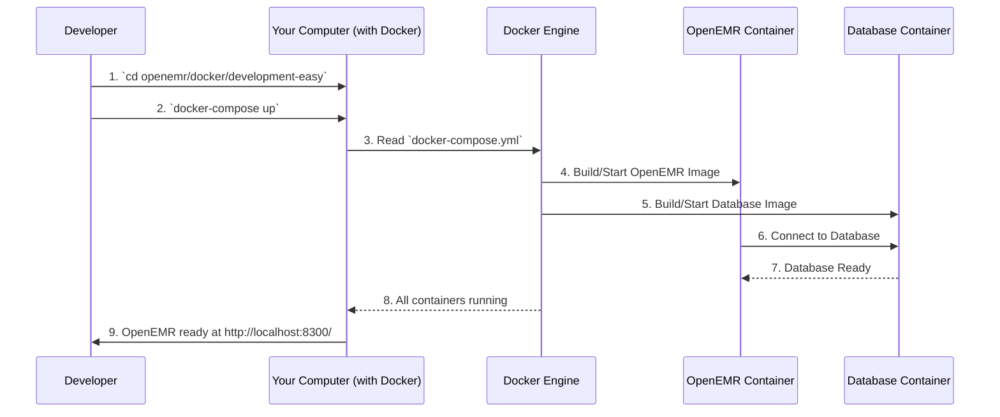

# Chapter 5: Docker Development Environments

Welcome back! In our previous chapters, we explored different parts of OpenEMR:
*   [Chapter 1: Patient Portal](01_patient_portal_.md) showed us how patients interact with their data online.
*   [Chapter 2: Telehealth Module](02_telehealth_module_.md) demonstrated virtual visits.
*   [Chapter 3: RESTful APIs (OpenEMR and FHIR)](03_restful_apis__openemr_and_fhir__.md) covered how different systems talk to each other.
*   [Chapter 4: CCDA Service (C-CDA Generation)](04_ccda_service__c_cda_generation_.md) explained how OpenEMR generates standardized patient summary documents.

All these amazing features in OpenEMR need a place to run, especially when developers are building new features or fixing bugs. Setting up OpenEMR with all its necessary parts (like databases, web servers, and other behind-the-scenes magic) can be tricky. You need to install specific versions of software, make sure they talk to each other correctly, and avoid conflicts with other programs on your computer. This can be a headache!

This is where **Docker Development Environments** come in. Think of Docker as a magic box builder. Instead of gathering all the individual tools and ingredients (like a database, web server, or programming language) and setting them up one by one on your computer, Docker can build a ready-to-go, perfectly configured "workshop" for you. This workshop contains OpenEMR and everything it needs to run, all neatly packaged away.

This "workshop" is called a **Docker Container**. It's like a self-contained, mini-computer that runs exactly what you need, without messing up your main computer.

## A Real-World Use Case: Getting OpenEMR Ready for Development

Imagine you want to start developing a new feature for OpenEMR. If you tried to install everything manually, you'd spend hours downloading, configuring, and troubleshooting.

**Use Case: A new developer wants to set up OpenEMR on their computer to start coding.**

1.  **Manual Way (Headache-inducing):** Download PHP, Apache, MySQL, Node.js, OpenEMR's code, configure Apache to serve OpenEMR, set up a MySQL database, create a user, integrate everything, fix permissions, install composer packages, etc. Many steps, many potential errors.
2.  **Docker Way (Easy Button):** Have Docker installed on your computer. Tell Docker to build and run the OpenEMR development environment. Go grab a coffee. Come back, and OpenEMR is ready for you to code!

This makes it super simple to get started and ensures that everyone developing OpenEMR has the exact same setup, which helps prevent "it works on my machine!" problems.

## Key Concepts of Docker Development Environments

Docker makes setting up complex software much simpler by packaging everything into isolated units.

1.  **Docker:** This is the main tool. It's a platform that allows you to create, deploy, and run applications in containers.
2.  **Docker Container:** A lightweight, standalone, executable package of software that includes everything needed to run an application: code, runtime, system tools, system libraries and settings. It's like a small, isolated computer specifically for your application.
3.  **Docker Image:** A blueprint for creating a container. When you run a Docker image, it becomes a Docker container. Think of it as a recipe book for building your "workshop."
4.  **`docker-compose`:** A tool for defining and running multi-container Docker applications. OpenEMR needs a database and a web server, so `docker-compose` helps you start both of them together with one command. It's like a conductor for an orchestra of containers.
5.  **"Easy" vs. "Insane" Flavors:** OpenEMR provides different types of Docker development environments:
    *   **Easy Development Environment:** This is the recommended one for most developers. It's designed to be simple to set up and get started quickly. (See `docker/development-easy/` and `CONTRIBUTING.md`).
    *   **Insane Development Environment:** This is for advanced users who need to test OpenEMR against many different versions of PHP, databases, and other services. It's much more complex to set up and run. (See `docker/development-insane/`).

## How it Works: Starting Your OpenEMR Workshop

Let's illustrate how you would start an OpenEMR development environment using Docker.



**Step-by-step Explanation:**

1.  **Developer Navigates:** You, the developer, open your terminal and navigate to the `development-easy` folder within the OpenEMR project.
2.  **Run `docker-compose up`:** You type `docker-compose up` and press Enter. This command tells Docker to look at the `docker-compose.yml` file in that folder.
3.  **Docker Reads Configuration:** The Docker Engine on your computer reads the `docker-compose.yml` file, which describes what containers are needed (e.g., one for OpenEMR, one for the database) and how they should be set up.
4.  **OpenEMR Container Starts:** Docker pulls the necessary OpenEMR image (blueprint) and starts an OpenEMR container. This container includes the web server (Apache), PHP, and the OpenEMR application code.
5.  **Database Container Starts:** Docker also pulls the database image (like MariaDB) and starts a separate database container.
6.  **Containers Connect:** The OpenEMR container knows how to find and connect to the database container (because it's configured in `docker-compose.yml`). OpenEMR then sets up its database tables.
7.  **Database Ready:** The database signals it's ready.
8.  **All Running:** Docker confirms that all containers are running and healthy.
9.  **OpenEMR Ready:** You can now open your web browser and go to `http://localhost:8300/` (or `https://localhost:9300/` for secure access) to see a fully functional OpenEMR instance!

## Using Docker: Getting Your Easy Development Environment Running

Let's look at the actual steps and files involved for the "Easy Development Docker Environment." This method is the recommended way to get started.

### 1. **Clone the OpenEMR Repository**

First, you need to get the OpenEMR code onto your computer. This is done using `git`.

```bash
git clone https://github.com/openemr/openemr.git
cd openemr
```
**Explanation:** `git clone` downloads all the OpenEMR code from GitHub. `cd openemr` moves you into the newly created `openemr` folder.

### 2. **Navigate to the Easy Development Environment Folder**

The configuration for the Easy Development Environment is in a specific subfolder.

```bash
cd docker/development-easy
```
**Explanation:** This command puts you in the directory containing the `docker-compose.yml` file, which orchestrates your development environment. For Raspberry Pi, you'd use `development-easy-arm` or `development-easy-arm64`.

### 3. **Run `docker-compose up`**

This command will download the necessary Docker images (if not already present), build the containers as specified, and start them up. The first time, this can take a few minutes.

```bash
docker-compose up
```
**Explanation:** `docker-compose up` reads the instructions in `docker-compose.yml` and brings your entire OpenEMR development environment to life. You'll see a lot of text scrolling by as Docker sets everything up.

Once it's done, you'll see messages like this, indicating OpenEMR and its services are ready:

```
openemr_1  | Love OpenEMR? You can now support the project via the open collective:
openemr_1  |  > https://opencollective.com/openemr/donate
openemr_1  |
openemr_1  | Starting cron daemon!
openemr_1  | Starting apache!
```

### 4. **Access OpenEMR**

Open your web browser and go to:

*   `http://localhost:8300/` (for standard HTTP)
*   `https://localhost:9300/` (for secure HTTPS)

You can log in with username `admin` and password `pass`.

## Under the Hood: The `docker-compose.yml` File

The magic behind `docker-compose up` is the `docker-compose.yml` file. This is a simple text file that tells Docker **what services (containers)** to run and **how to configure them**.

Let's look at parts of `docker/development-easy/docker-compose.yml`:

```yaml
# Simplified docker/development-easy/docker-compose.yml

services:
  mysql: # This defines our database service
    image: mariadb:11.4 # We're using the MariaDB database image, version 11.4
    ports:
    - 8320:3306 # Map our computer's port 8320 to the container's 3306
    environment:
      MYSQL_ROOT_PASSWORD: root # Set the root password for the database
    healthcheck: # Checks if the database is running correctly
      test: ["CMD", "/usr/local/bin/healthcheck.sh", "--su-mysql", "--connect"]
      start_period: 1m
      interval: 1m
  openemr: # This defines our OpenEMR application service
    image: openemr/openemr:flex # We're using the OpenEMR 'flex' development image
    ports:
    - 8300:80 # Map our computer's port 8300 to the container's 80 (HTTP)
    - 9300:443 # Map our computer's port 9300 to the container's 443 (HTTPS)
    volumes: # Link local project folders to the container (important for development!)
    - ../..:/openemr:ro # Read-only access to the main OpenEMR source
    - ../..:/var/www/localhost/htdocs/openemr:rw # Read/write access to OpenEMR's web root
    environment: # Variables passed into the container
      MYSQL_HOST: mysql # Tell OpenEMR the database is named 'mysql' (from services config)
      MYSQL_ROOT_PASS: root
      OE_USER: admin
      OE_PASS: pass
      EASY_DEV_MODE: "yes" # Special settings for easy development
      XDEBUG_ON: 1 # Turn on XDebug for debugging code
    depends_on: # Ensure MySQL starts before OpenEMR
      mysql:
        condition: service_healthy
    healthcheck: # Checks if OpenEMR web server is running correctly
      test: ["CMD", "/usr/bin/curl", "--fail", "--insecure", "--location", "--silent", "https://localhost/"]
      start_period: 3m
      interval: 1m
  phpmyadmin: # A tool to manage the database via web interface
    image: phpmyadmin
    ports:
    - 8310:80 # Map our computer's port 8310 to the container's 80
    environment:
      PMA_HOSTS: mysql # Tell phpMyAdmin to connect to our 'mysql' service
    depends_on:
      mysql:
        condition: service_healthy
```
**Explanation:**
*   **`services:`**: This section lists all the individual containers (like `mysql`, `openemr`, `phpmyadmin`) that work together.
*   **`image:`**: This line tells Docker exactly which blueprint (image) to use for that container. `mariadb:11.4` means "MariaDB, version 11.4". `openemr/openemr:flex` is a special OpenEMR development image.
*   **`ports:`**: This maps a port on *your computer* to a port *inside the container*. For example, `8300:80` means you can access the container's web server (which listens on port 80) by going to `http://localhost:8300` in your browser.
*   **`volumes:`**: This is super important for development! It creates a link between a folder on your computer and a folder inside the container. When you edit a file on your computer, those changes instantly appear inside the container. This means you can use your favorite code editor to change OpenEMR's code directly!
    *   `../..:/openemr:ro` gives read-only access to the whole OpenEMR project code.
    *   `../..:/var/www/localhost/htdocs/openemr:rw` gives read/write access to the specific folder where the web server serves OpenEMR.
*   **`environment:`**: These are like configuration settings passed into the container. For example, `MYSQL_HOST: mysql` tells the OpenEMR container that its database is reachable at the hostname `mysql` (which `docker-compose` knows is the `mysql` service).
*   **`depends_on:`**: This tells Docker to start the `mysql` container first and wait until it's healthy, before starting the `openemr` container.

This `docker-compose.yml` file essentially sets up a complete, isolated development environment with all the pieces configured to work together, so you don't have to do it manually.

## Conclusion

Docker Development Environments are an incredibly powerful tool for OpenEMR developers. They simplify the complex setup process, ensure consistency across different development machines, and allow developers to focus on writing code rather than wrestling with configurations. By packaging OpenEMR and all its dependencies into portable containers, Docker makes it easy to get a fully functional development environment up and running with just a few commands. This is especially helpful when dealing with a large, feature-rich application like OpenEMR, with many interacting components (like the [Patient Portal](01_patient_portal_.md), [Telehealth Module](02_telehealth_module_.md), [APIs](03_restful_apis__openemr_and_fhir__.md), and [CCDA Service](04_ccda_service__c_cda_generation_.md)).

In the next chapter, we'll dive into **Module Management & Configuration**, exploring how different features and functionalities within OpenEMR can be managed and customized.

[Next Chapter: Module Management & Configuration](06_module_management___configuration_.md)

---

Generated by [AI Codebase Knowledge Builder](https://github.com/The-Pocket/Tutorial-Codebase-Knowledge)