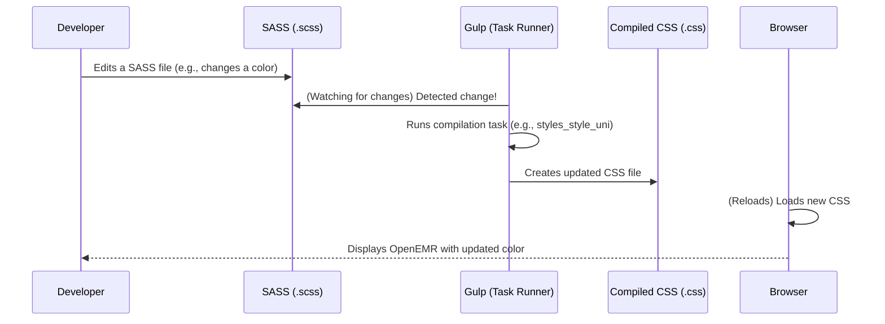

# Chapter 5: Frontend Development Workflow

Welcome back! In [Chapter 4: Module System](04_module_system_.md), we saw how OpenEMR can be expanded with "apps" (modules). Now, let's look behind the scenes and understand how the visual and interactive parts of OpenEMR (the "frontend" you see and click on) are built and updated. This is important for anyone who wants to help make OpenEMR look better or add new features!

### The Problem: Building and Updating OpenEMR's Look

Imagine you're building a website. You have fancy SASS files (our "smart paintbrushes" from [Chapter 1: User Interface (UI) Components & Styling](01_user_interface__ui__components___styling_.md)) for styling, and lots of JavaScript files for interactivity. How do you take all these individual pieces, organize them, combine them, and make them ready for a web browser to display properly? You can't just throw them onto the internet haphazardly.

The challenge is to have a smooth, repeatable process for developers to:
1.  **Write code:** Create new styles or interactive elements.
2.  **Organize and preprocess code:** Turn SASS into regular CSS, combine JavaScript files, etc.
3.  **Check code quality:** Make sure the code works as expected and doesn't break anything.
4.  **Prepare for deployment:** Get the final, ready-to-use files.

It's like running a busy kitchen. You need specific tools (knives, ovens, mixers) and a clear process (prep, cook, plate) to turn raw ingredients into a delicious meal consistently.

### The Solution: A Well-Equipped Workshop

OpenEMR uses a "Frontend Development Workflow" that's like a well-equipped workshop. It has specific tools and processes to build the visual and interactive parts of the application efficiently. This helps ensure that all the pieces (HTML, CSS, JavaScript) work together smoothly.

Here are the main tools in this workshop:
*   **npm (Node Package Manager):** Like a central store for all the special tools and libraries (packages) developers need.
*   **Gulp:** Our automated factory (from [Chapter 1: User Interface (UI) Components & Styling](01_user_interface__ui__components___styling_.md)) that builds and processes files automatically.
*   **Jest:** A tool specifically for testing JavaScript code to catch mistakes early.

**Use Case: Updating a Theme's Color**

Let's say you want to change the main blue color of the `light` theme to a slightly darker shade.

1.  You'd find the SASS file that defines this blue.
2.  You'd change the color code in that SASS file.
3.  Then, you need to "build" the new CSS file so OpenEMR uses your updated color. This is where the workflow comes in!

#### Key Concept 1: npm - Your Project's Tool Manager

`npm` stands for Node Package Manager. It's a tool that comes with Node.js (a way to run JavaScript outside of a web browser). Think of `npm` as a universal remote control for your project's tools. It helps you:

*   **Install tools:** Download and set up Gulp, Jest, and other helper programs.
*   **Run scripts:** Execute predefined commands, like "build the project" or "run tests."

When you set up OpenEMR for development, you often run `npm install`.

```bash
# In the root 'openemr' directory
npm install
```
This command looks at a file called `package.json` (which lists all the tools and libraries OpenEMR needs) and downloads them to a special folder called `node_modules` in your project. It's like unpacking all the new tools you bought for your workshop.

`npm` is also used to run bigger "recipes" (scripts) defined in `package.json`. For example, `npm run build` or `npm run dev`:

```bash
# In the root 'openemr' directory
npm run build
```
This command tells `npm` to look for a script named `build` in the `package.json` file and execute it. This `build` script usually involves `gulp` to compile all frontend assets.

The `cloudbuild.yaml` file shows how `npm` is used even in automated build processes:

```yaml
# From cloudbuild.yaml
steps:
- name: 'gcr.io/cloud-builders/npm' # Use the npm tool
  args: ['install'] # To install all required packages
- name: 'gcr.io/cloud-builders/npm'
  args: ['run', 'build'] # Then run the 'build' script
```
This snippet shows that `npm install` and `npm run build` are fundamental steps for preparing the OpenEMR project.

#### Key Concept 2: Gulp - The Automated Builder

We touched on Gulp in [Chapter 1: User Interface (UI) Components & Styling](01_user_interface__ui__components___styling_.md). Gulp is a "task runner." It's like having a robot in your workshop that automatically performs repetitive chores for you. For frontend development, Gulp's main jobs are:

*   **Compiling SASS:** Taking your `.scss` files and turning them into regular `.css` files that web browsers can understand.
*   **Optimizing:** Making CSS files smaller and faster to download. You can see `csso()` in the `gulpfile.js` which is a CSS optimizer.
*   **Watching files:** Gulp can keep an eye on your SASS or JavaScript files and automatically re-build them whenever you make a change. This is very useful for developers!

The `gulpfile.js` file is the instruction manual for Gulp. It tells Gulp exactly what steps to follow.

```javascript
// From gulpfile.js
// standard themes css compilation
function styles_style_uni() {
    let isSuccess = true;
    return gulp.src(config.src.styles.style_uni) // Find all universal SASS files
        // ... various processing steps (like adding header, importing other files) ...
        .pipe(sass().on('error', (err) => { // Compile SASS to CSS
            log_error(isSuccess, err);
        }))
        .pipe(postcss([prefix()])) // Add browser specific prefixes
        .pipe(gulpif(!config.dev, csso())) // Make CSS smaller if not in dev mode
        .pipe(gulp.dest(config.dest.themes)) // Save the finished CSS files here
        .on('end', () => {
            if (isSuccess) {
                console.log(logprefix + "Finished compiling OpenEMR base themes");
            }
        });
}
```
This is a small part of `gulpfile.js`, showing the `styles_style_uni` function. This function tells Gulp to find specific SASS files (`.scss`), process them through `sass()` (to turn them into CSS), add browser compatibility (`postcss`), make them smaller (`csso`), and then save them to the `public/themes` folder.

When you run `npm run dev` or `npm run build`, these Gulp tasks are activated.

#### Key Concept 3: Jest - The Quality Checker

Jest is a testing framework for JavaScript. While Gulp is about *building* your code, Jest is about *checking* it. Think of Jest as a meticulous inspector in your workshop, making sure every interactive part (JavaScript) works exactly as it should.

Why test? Because it helps catch bugs early! If you change something in the code, running tests can tell you immediately if your change broke something else that was previously working.

The `jest.config.js` file tells Jest what to test and what to ignore.

```javascript
// From jest.config.js
/** @type {import('jest').Config} */
const config = {
    modulePathIgnorePatterns: [ // Don't test these folders
        'public/assets',
        'vendor'
    ],
    coverageDirectory: 'coverage/js-unit', // Where to save test reports
    collectCoverageFrom: ['**/*.js'], // Test all JavaScript files
    coveragePathIgnorePatterns: [ // But ignore these specific JavaScript files
        'gulpfile.js',
        'jest.config.js',
        'node_modules',
        // ... many other paths to ignore a lot of third party libraries
    ]
};

module.exports = config;
```
This `jest.config.js` snippet shows how Jest is configured to know which JavaScript files should be tested and which should be skipped (often third-party libraries or build files).

Developers usually run tests using `npm test`.

```bash
# In the root 'openemr' directory
npm test
```
This command executes all the JavaScript tests defined in the project, checking if everything works correctly.

#### The Workflow in Action: Updating a Theme's Color

Let's revisit our use case: changing a theme's color.

Here's how the frontend development workflow tools help you:

1.  **You write the code:** You open a SASS file (e.g., `interface/themes/oe-styles/style_uni.scss`) and change the value of a color variable from `$my-old-blue` to `$my-new-blue`.
2.  **Gulp 'watches' and builds:** If you ran `npm run dev`, Gulp is already active. It detects a change in your `.scss` file.
3.  **Gulp processes the SASS:** The `styles_style_uni` task in `gulpfile.js` starts, automatically compiling your updated `.scss` file into a new `.css` file in `public/themes`.
4.  **You see the change:** Your web browser, reloading the page, now loads the newly compiled CSS file, and you instantly see the updated color in OpenEMR without any manual steps.
5.  **Jest checks JavaScript (optional but good practice):** If you make any JavaScript changes, you'd run `npm test` to ensure your new JS code hasn't introduced any bugs into existing features (like patient forms or UI interactions from [Chapter 2: Core Patient Data Management (Client-Side)](02_core_patient_data_management__client_side__.md)).

Here's a simplified sequence diagram for the workflow:



This diagram shows how quickly Gulp can react to your changes when you're in development mode (`npm run dev`), making the styling process very efficient.

The `interface/README.md` also gives instructions on how to get started:

```markdown
# OpenEMR-interface
...
## Getting Started

Compiling SASS files locally requires [node.js](http://nodejs.org) and [npm](https://www.npmjs.com/).

1. **Setup your local development environment** as described in [CONTRIBUTING.md](../CONTRIBUTING.md)

- If running on a local machine, run `npm install` from the root directory.
- If running in docker: `docker exec -it [your_container_id] /bin/sh` then cd into `openemr`

From here you can either:
* `npm run dev` - just compiles the local `.scss` files and recompiles them whenever they are changed.
* `npm run dev-sync` (EXPERIMENTAL*) - loads your local OpenEMR instance using BrowserSync (port 3000) in front of 80 (feel free to edit the package.json to change the port)
```
This section explicitly tells developers to use `npm install` and then either `npm run dev` for automatic compilation or `npm run dev-sync` for an even more advanced development setup with live browser reloading.

The `webpack` configurations for the `telehealth` module (from `interface/modules/custom_modules/oe-module-comlink-telehealth/public/assets/js/webpack.config.js` and `webpack-dev.config.js`) show that larger JavaScript modules might also use another tool called Webpack (often used for bundling JavaScript files for web browsers). This is an example of specialized tools within the broader workflow, but the core idea of using `npm` to run build tools remains the same.

```javascript
// From interface/modules/custom_modules/oe-module-comlink-telehealth/public/assets/js/webpack.config.js
const path = require ('path');

module.exports = {
  mode: 'production', // This version is for when the code is ready for real users
  entry: './src/telehealth.js', // Start here to bundle the telehealth code
  output: {
    path: path.resolve(__dirname, 'dist'), // Put the finished file here
    filename: 'telehealth.min.js', // Name the final file 'telehealth.min.js'
  },
};
```
This snippet shows `webpack.config.js`, which tells the `webpack` tool how to take source JavaScript (`telehealth.js`) and bundle it into a smaller, production-ready file (`telehealth.min.js`). This is another piece of the "build" puzzle, often run as part of the overall `npm run build` process.

### Conclusion: Efficient Development

In this chapter, we've explored OpenEMR's **Frontend Development Workflow**. We learned that it's like a well-organized workshop that uses:

*   **npm:** To manage tools and run predefined development tasks.
*   **Gulp:** To automate building and processing of CSS (from SASS) and other frontend assets.
*   **Jest:** To test JavaScript code and ensure quality.

This workflow ensures that developers can efficiently create, organize, test, and package the visual and interactive parts of OpenEMR, making the process of building and updating the system smoother and more reliable.

This wraps up our beginner-friendly tour of OpenEMR's core concepts!

---

Generated by [AI Codebase Knowledge Builder](https://github.com/The-Pocket/Tutorial-Codebase-Knowledge)