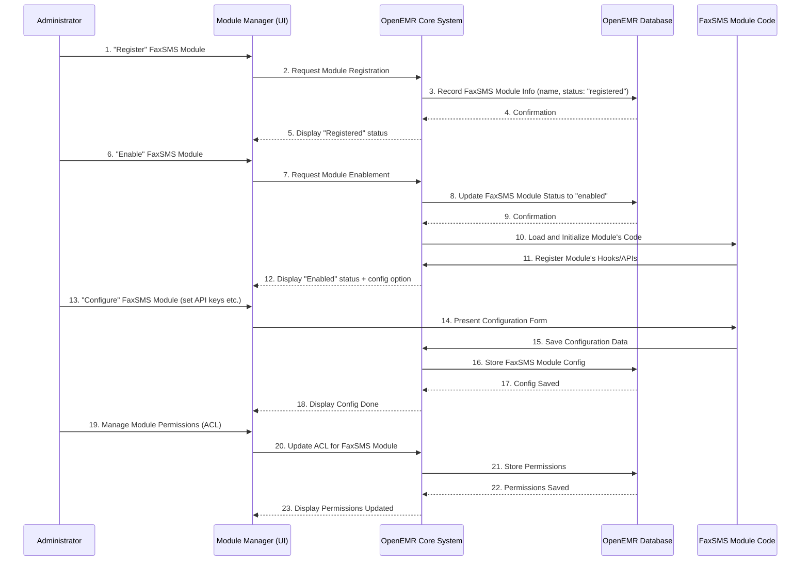

# Chapter 6: Module Management & Configuration

Welcome back! In our previous chapter, [Chapter 5: Docker Development Environments](05_docker_development_environments_.md), we learned how to easily set up a complete OpenEMR development environment without the usual hassle. Now that we have OpenEMR up and running, let's explore how new features and functionalities can be added and managed within it.

Imagine OpenEMR as a basic smartphone. Out of the box, it can do many useful things for a clinic, just like a smartphone can make calls and send texts. But what if you want to add new capabilities, like a special app for sending faxes or a tool for managing insurance authorizations? You wouldn't rebuild your entire phone, right? You'd go to an app store and install a new app.

The **Module Management & Configuration** system in OpenEMR is exactly like that app store and settings panel for your clinic's OpenEMR. It allows administrators to **register**, **enable**, **disable**, and **configure** various "apps" or **modules**. These modules extend OpenEMR's core functionality without needing to change the main system code. This keeps OpenEMR flexible, customizable, and secure.

## A Real-World Use Case: Adding Fax & SMS Capabilities

Let's say a clinic wants to integrate a new way to send faxes and SMS messages directly from OpenEMR. They've heard about the "FaxSMS" module.

**Use Case: Install and activate the FaxSMS module in OpenEMR.**

1.  **Discover Module:** The clinic administrator finds the FaxSMS module.
2.  **Register Module:** The administrator tells OpenEMR about this new module. This is like "importing" the app into your phone's app store.
3.  **Install/Enable Module:** Once registered, the administrator "installs" it and then "enables" it to make it active. This is like installing an app and then giving it permissions to run.
4.  **Configure Module:** Finally, the administrator sets up the module's specific settings, like connecting it to their chosen fax or SMS service. This is like entering your login details for a new app.

This process allows the clinic to easily add new functionalities as needed, without complex technical changes to OpenEMR itself.

## Key Concepts of Module Management

OpenEMR's module system organizes and controls these add-on features.

1.  **Module:** This is a self-contained package of code that adds specific functionality to OpenEMR. Think of it as a separate "app" (e.g., FaxSMS, Prior Authorizations).
2.  **Registration:** The first step to making OpenEMR aware of a new module. It tells OpenEMR "Hey, this module exists!" without necessarily making it active.
3.  **Enable/Disable:** This controls whether a module is active and available for users. You can turn features on or off as needed.
4.  **Configuration:** Modules often have settings that need to be adjusted (e.g., API keys for a fax service, specific rules for authorizations). Configuration allows administrators to customize these settings.
5.  **User Permissions (ACL):** Modules can define their own specific permissions. For example, only certain staff members might be allowed to use the FaxSMS module. This is handled by a special Access Control List (ACL) system within the module management.

## How it Works: Bringing a Module to Life

Let's trace how the FaxSMS module (or any module, generally) goes from being just a file on the server to an active feature within OpenEMR.



**Step-by-step Explanation:**

1.  **Register:** The administrator clicks the "Register" button for the FaxSMS module in the OpenEMR Module Manager user interface.
2.  **Record in Database:** OpenEMR receives this request and stores basic information about the module (like its name and path) in its database, marking it as "registered." At this point, the module's code isn't actually running.
3.  **Enable:** The administrator then clicks "Enable." OpenEMR updates the module's status in the database. Crucially, it then loads the FaxSMS module's code. The FaxSMS module, now active, tells OpenEMR about any new menu items it adds or any "hooks" (places where it can inject its functionality).
4.  **Configure:** The administrator enters API keys or other settings specific to the FaxSMS module. OpenEMR saves these settings in the database, linked to the FaxSMS module.
5.  **Manage Permissions (ACL):** The administrator sets who can use the FaxSMS feature. This information is saved using OpenEMR's ACL system, which we'll see in the code.

## A Glimpse at the Code: Managing Modules

The core of Module Management is found in `interface/modules/zend_modules/`. We'll look at `public/js/installer/action.js` and `public/js/acl/acl.js`.

### `installer/action.js`: Registering and Enabling Modules

This JavaScript file handles the actions you take in the Module Manager UI, like "Register," "Install," "Enable," and "Configure."

Let's look at `register` and `manage` functions.

```javascript
// From interface/modules/zend_modules/public/js/installer/action.js (simplified)

// Called when you click 'Register' for a new module
function register(status, title, name, method, type) {
    $.post("./Installer/register", {st: status, mod_title: title, mod_name: name, mod_method: method, mtype: type},
        function (data) {
            if (data == "Success") {
                window.location.reload(); // Reloads the page to show the module as registered
            } else {
                const resultTranslated = js_xl(data);
                $('#err').html(resultTranslated.msg).fadeIn().delay(2000).fadeOut(); // Show error
            }
        }
    );
}

// Called for actions like 'Install', 'Enable', 'Disable', 'Unregister', 'Reset'
function manage(id, action) {
    if (action === 'unregister') {
        if (!confirm("Please Confirm with OK to Unregister this Module.")) {
            return false; // Requires confirmation for unregister
        }
    }
    // ... similar confirmation for 'reset_module' ...

    $.ajax({
        type: 'POST',
        url: "./Installer/manage", // Send data to a PHP controller
        data: {modId: id, modAction: action, /* ... other data ... */},
        beforeSend: function () {
            $('.modal').show(); // Show a loading modal
        },
        success: function (data) {
            try {
                var data_json = JSON.parse(data);
                if (data_json.status.toUpperCase() === "SUCCESS") {
                    // ... handle logs and UI reloads ...
                    if (parent.left_nav.location) {
                        parent.left_nav.location.reload(); // Reload navigation menus (important for new module menus)
                        parent.Title.location.reload();
                        // ... other frame reloads ...
                    }
                    if (data_json.output == undefined || data_json.output.length <= 1) {
                        window.location.reload(); // Reload page to show status change (e.g., enabled/disabled)
                    }
                } else {
                    alert(data_json.status); // Show error messages
                    window.location.reload();
                }
            } catch (e) {
                // ... error handling for JSON parsing failures ...
            }
        },
        complete: function () {
            $('.modal').hide(); // Hide loading modal
        }
    });
}
```
**Explanation:**
*   The `register` function sends a request to the server (`./Installer/register`) to tell OpenEMR about a new module. If successful, the page reloads, and you'll see the module listed as "Registered."
*   The `manage` function is a more general-purpose tool. It's used for actions like "Install," "Enable," or "Disable." When you click one of these buttons, this function sends the `modId` (module ID) and `modAction` (e.g., 'enable') to the server (`./Installer/manage`).
*   Upon success, a crucial step in `manage` is reloading parts of the OpenEMR interface (like the `left_nav` frames). This ensures that if the module adds new menu items (like the FaxSMS module would), they appear immediately.

### `installer/action.js`: Configuring Modules

Modules frequently have configuration settings. The `configure` and `saveConfig` functions handle this.

```javascript
// From interface/modules/zend_modules/public/js/installer/action.js (simplified)

// Called when you click the 'Cog' icon to configure a module
function configure(id, imgpath) {
    if ($("#ConfigRow_" + id).css("display") != "none") {
        $(".config").hide();
        $("#ConfigRow_" + id).fadeOut(); // Hide if already open
    } else {
        $.post("./Installer/configure", {mod_id: id}, // Request config HTML from server
            function (data) {
                $(".config").hide(); // Hide any other open config panels
                $("#ConfigRow_" + id).hide();
                $("#ConfigRow_" + id).html('<td colspan="10" style="background-color: var(--light);">' + data + '</td>').fadeIn(); // Display the config form
            }
        );
    }
}

// Called when you click a 'Save' button inside a module's configuration form
function saveConfig(frmId, mod_id) {
    $.ajax({
        type: 'POST',
        url: "./Installer/saveConfig", // Send form data to server
        data: $('#' + frmId + mod_id).serialize(), // Serialize the form inputs
        success: function (data) {
            var resultTranslated = js_xl('Configuration saved successfully');
            $('#target' + data.modeId).html(resultTranslated.msg + ' ....').show().fadeOut(4000); // Show success message
        }
    });
}
```
**Explanation:**
*   The `configure` function is triggered when an administrator clicks the settings icon for a module. It makes an AJAX request to the server to fetch the actual HTML form for that module's configuration. This form is then displayed directly on the page.
*   Once the administrator fills out the form and clicks "Save," the `saveConfig` function is called. It takes all the input values from the form (`$('#' + frmId + mod_id).serialize()`) and sends them to the server for saving. This is how module-specific settings (like the Twilio API key for FaxSMS) are stored.

### `acl/acl.js`: Managing Module Permissions

Modules can also have their own specific user permissions. This code is responsible for the drag-and-drop interface used to assign permissions for module components.

```javascript
// From interface/modules/zend_modules/public/js/acl/acl.js (simplified)

// This function loads the current ACL (Access Control List) for a module
function loadAcl(module_id) {
    // ... resets UI elements ...
    $.ajax({
        type: "POST",
        url: ajax_path, // Path to the ACL backend
        dataType: "html",
        data: {
            ajax_mode: 'get_acl_data',
            module_id: module_id
        },
        async: false,
        success: function(thedata) {
            obj = JSON.parse(thedata); // Parse the existing ACL data
            // console.log("ACL Data: ", obj); // Log for debugging

            // Loop through existing allowed/denied groups and users
            // and update the drag-and-drop UI to reflect current permissions.
            // This involves showing/hiding specific UI elements.
            for (var index in obj['group_allowed']) {
                $("#li_user_group_allowed_" + obj['group_allowed'][index] + "-0").css("display", "");
                // ... update for individual users within groups ...
            }
            // ... similar loops for denied groups and users ...
        }
    });
}

// This function saves the changes made to the ACL (e.g., after dragging users/groups)
function saveAcl() {
    var ACL_DATA = {};
    // ... Logic to collect all allowed/denied users/groups from the UI ...

    // Sends the collected ACL data to the server
    $.ajax({
        type: "POST",
        url: ajax_path,
        dataType: "html",
        data: {
            ajax_mode: 'save_acl', // Action to save ACL data
            acl_data: JSON.stringify(ACL_DATA), // All permissions as JSON
            module_id: module_id // Which module these permissions apply to
        },
        async: false,
        success: function(thedata) {
            var resultTranslated = js_xl('ACL Updated Successfully');
            $("#messages_div").html(resultTranslated.msg); // Show success message
            setTimeout(function() {
                $("#messages_div").html("");
            }, 3000);
        },
    })
}
```
**Explanation:**
*   `loadAcl(module_id)`: When an administrator clicks the "Permissions" tab for a module, this function fetches the currently configured permissions (which users/groups are allowed or denied access to this module) from the server. It then updates the visual drag-and-drop interface to show these existing settings.
*   `saveAcl()`: After the administrator makes changes to the permissions using the drag-and-drop interface, this function gathers all the new permission assignments and sends them back to the server (`ajax_path` with `ajax_mode: 'save_acl'`). The server then stores these updated permissions in the database, ensuring only authorized users can access the module's features.

## Conclusion

Module Management & Configuration is a powerful feature of OpenEMR that allows clinics to customize and extend their system with new functionalities without altering the core software. By understanding concepts like registration, enablement, configuration, and user permissions, administrators can effectively control which "apps" are available and who can use them, ensuring that OpenEMR adapts to their unique needs securely. This flexibility makes OpenEMR a versatile solution for a wide range of healthcare practices.

In the next chapter, we'll shift our focus to the **Frontend UI Frameworks (jQuery, Bootstrap, Knockout.js)**, exploring the tools that make OpenEMR's user interface interactive and user-friendly.

[Next Chapter: Frontend UI Frameworks (jQuery, Bootstrap, Knockout.js)](07_frontend_ui_frameworks__jquery__bootstrap__knockout_js__.md)

---

Generated by [AI Codebase Knowledge Builder](https://github.com/The-Pocket/Tutorial-Codebase-Knowledge)