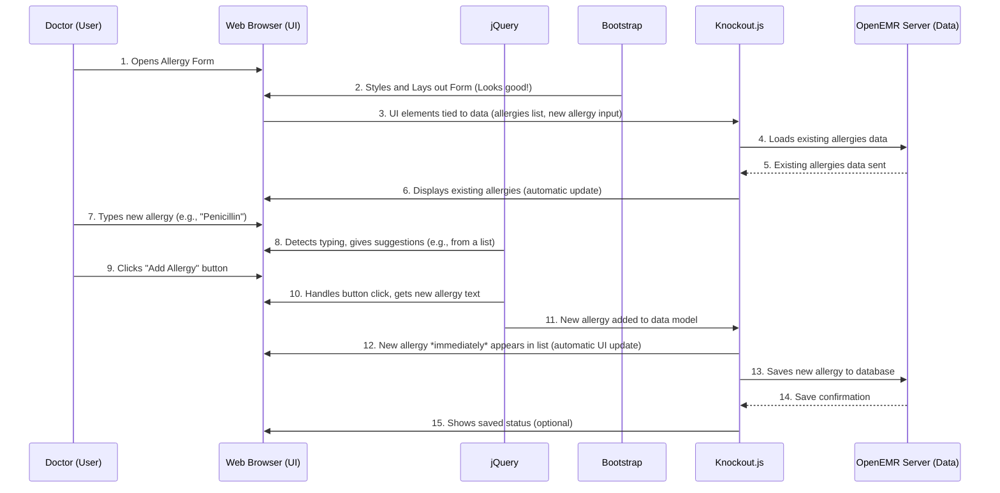

# Chapter 7: Frontend UI Frameworks (jQuery, Bootstrap, Knockout.js)

Welcome back! In our last chapter, [Chapter 6: Module Management & Configuration](06_module_management___configuration_.md), we explored how OpenEMR allows clinics to add new features and customize their system using modules. Many of these features, like the [Patient Portal](01_patient_portal_.md) we discussed earlier, involve building user interfaces (UIs) that people interact with every day.

Imagine you're painting a house. You *could* mix all the colors yourself, design every brushstroke, and build all your painting tools from scratch. It would take a very long time! Or, you could use pre-mixed paints, ready-made brushes, and even stencils to make the job faster and look better.

In web development, "Frontend UI Frameworks" are like those ready-made paints, brushes, and stencils. They are collections of tools and pre-built components that help developers create the parts of a website or application that users see and interact with – the "frontend" or "user interface." These tools make it much faster and easier to build interactive and visually appealing web pages.

OpenEMR uses several popular frontend UI frameworks to create its user-friendly interface. We'll focus on three key ones: **jQuery**, **Bootstrap**, and **Knockout.js**.

## A Real-World Use Case: Making a Form Interact with Data

Let's imagine a common task in OpenEMR: a doctor needs to update a patient's allergy information. The form for allergies needs to look good, be easy to use, and quickly update the displayed information as the doctor types or makes selections.

**Use Case: An allergy form in OpenEMR needs to be interactive and visually appealing.**

1.  **Doctor opens allergy form:** The form loads in the browser.
2.  **Form needs to look good:** It has a nice layout, clear buttons, and is easy to read on different screen sizes.
3.  **Form needs to be interactive:** As the doctor types a new allergy, relevant suggestions might appear. When a doctor clicks "Add Allergy," the new allergy immediately shows up in a list without the whole page reloading.
4.  **Data stays synchronized:** If the new allergy is saved, the form reflects this. If it's deleted, it disappears from the list.

How do jQuery, Bootstrap, and Knockout.js help with this?

## Key Concepts of Frontend UI Frameworks

These frameworks work together to simplify web development.

1.  **jQuery:**
    *   **What it is:** A very popular JavaScript "library." Think of a library as a collection of pre-written code snippets that make common tasks much easier.
    *   **What it does:** It simplifies how you work with HTML (the structure of a web page), CSS (the styling), and JavaScript (the interactive parts). It makes it much easier to select parts of a web page, change their content or styles, and react to user actions (like clicks or typing).
    *   **Analogy:** Like having a super-efficient robot that can quickly find any object in a room, change its color, or make it move with simple commands.

2.  **Bootstrap:**
    *   **What it is:** A popular CSS (and JavaScript) framework. A framework provides a structure and common patterns, not just snippets.
    *   **What it does:** It provides ready-made styles and components (like buttons, forms, navigation bars) that make web pages look modern and professional. It also helps with "responsive design," meaning your web page looks good on any device, from a large computer screen to a small smartphone.
    *   **Analogy:** Like having a huge catalog of stylish, pre-designed furniture and room layouts for your house. You pick what you want, and it instantly looks good and fits well.

3.  **Knockout.js:**
    *   **What it is:** A JavaScript library that helps you build UIs that stay synchronized with your data.
    *   **What it does:** It uses a concept called "Model-View-ViewModel (MVVM)." Don't worry too much about the big name! It essentially means when your data changes, the UI automatically updates, and when the user interacts with the UI, the data updates. This makes complex UIs much easier to manage.
    *   **Analogy:** Imagine a smart mirror. When you put on a hat (change your "data"), the mirror immediately shows you wearing the hat (updates the "UI"). If you smile in the mirror (interact with "UI"), the mirror remembers that you're happy (updates your "data").

## How They Work Together: The Allergy Form Example

Let's see how these three could make our allergy form interactive.



**Step-by-step Explanation:**

1.  **Form Setup:** When the allergy form loads ([Chapter 1: Patient Portal](01_patient_portal_.md) and [Chapter 3: RESTful APIs (OpenEMR and FHIR)](03_restful_apis__openemr_and_fhir__.md) are relevant here for data loading), **Bootstrap** applies its styles to make sure the form fields, buttons, and layout look professional and are responsive.
2.  **Data Binding (Knockout.js):** **Knockout.js** then connects the HTML elements on the page (like the input field for a new allergy, and the list where allergies are displayed) to specific pieces of data (the "model"). When the data loads from the server, Knockout automatically fills in the form.
3.  **Interactivity (jQuery):** As the doctor types, **jQuery** can be used to listen for key presses and provide real-time suggestions (e.g., from a stored list of common allergies).
4.  **User Action & Synchronization:** When the doctor clicks the "Add Allergy" button:
    *   **jQuery** detects the click and gets the text from the input field.
    *   This new text is then added to Knockout's "data model." The key part: **Knockout.js** automatically updates the display, so the new allergy immediately appears in the list on the screen without the whole page having to refresh.
    *   **Knockout.js** then talks to the OpenEMR server (often using [RESTful APIs](03_restful_apis__openemr_and_fhir__.md)) to save the new allergy permanently.

## A Glimpse at the Code: Making Elements Interactive and Data-Driven

OpenEMR uses these frameworks extensively. Let's look at a simplified example from a JavaScript file that might be involved in such a form.

### 1. **jQuery: Simplifying Element Selection and Action**

Many OpenEMR pages include `jquery.min.js` (you can see several versions, like `interface/forms/eye_mag/js/jquery-1-10-2/jquery.min.js` or `interface/modules/zend_modules/public/js/lib/jquery-1.8.2.min.js`). jQuery allows you to easily find HTML elements and tell them to do things.

```javascript
// A simplified example using jQuery
// (imagine this is a file like allergy-form.js)

// This code runs when the web page is fully loaded and ready
$(document).ready(function() {

    // 1. Find the button with the ID "add-allergy-button" and react when it's clicked
    $("#add-allergy-button").on("click", function() {
        // Get the text from the input field with ID "new-allergy-input"
        var newAllergyText = $("#new-allergy-input").val();

        if (newAllergyText) {
            console.log("New allergy to add:", newAllergyText);
            // In a real app, you would pass this to Knockout.js or save it to the server
            // For now, let's just add it to a list on the page for demonstration
            $("#allergies-list").append("<li>" + newAllergyText + "</li>");
            $("#new-allergy-input").val(""); // Clear the input field
        } else {
            alert("Please enter an allergy!");
        }
    });

    // 2. Make an alert message fade out after a few seconds
    $(".alert-message").delay(3000).fadeOut("slow");
});
```
**Explanation:**
*   `$(document).ready(function() { ... });` is a common jQuery pattern. It ensures that your JavaScript code only runs *after* the entire web page (HTML) has been loaded and is ready to be interacted with.
*   `$("#add-allergy-button")`: This is how jQuery "selects" an HTML element. It looks for an element with `id="add-allergy-button"`. This is much simpler than standard JavaScript!
*   `.on("click", function() { ... });`: This tells jQuery to "listen" for a `click` event on the selected button. When the button is clicked, the function inside will run.
*   `$("#new-allergy-input").val();`: This gets the current value (the text typed by the user) from the input field. Using `.val()` to get or set values is much easier than traditional JavaScript.
*   `$("#allergies-list").append("<li>" + newAllergyText + "</li>");`: This selects an unordered list (`<ul>`) with the ID `allergies-list` and adds a new list item (`<li>`) to it, containing the new allergy text.
*   `$(".alert-message").delay(3000).fadeOut("slow");`: This shows some other jQuery magic. It selects any elements with the class `alert-message`, waits 3000 milliseconds (3 seconds) using `.delay()`, and then smoothly fades them out using `.fadeOut()`.

### 2. **Bootstrap: Styling HTML Elements**

Bootstrap is primarily a CSS framework, but it also has JavaScript components. Its power comes from adding specific "classes" to your HTML elements. You can see `bootstrap.min.js` (example: `Documentation/EHI_Export/docs/bower/admin-lte/bootstrap/js/bootstrap.min.js`) in OpenEMR.

Here's how Bootstrap makes a button and a form look good using CSS classes:

```html
<!-- Simplified HTML for an allergy form using Bootstrap classes -->

<form>
    <div class="form-group">
        <label for="new-allergy-input">New Allergy:</label>
        <!-- 'form-control' makes the input field look nice and responsive -->
        <input type="text" class="form-control" id="new-allergy-input" placeholder="e.g., Penicillin">
    </div>
    <!-- 'btn' and 'btn-primary' style the button according to Bootstrap's design -->
    <button type="button" class="btn btn-primary" id="add-allergy-button">Add Allergy</button>
</form>

<div class="alert alert-success alert-dismissible" role="alert">
  <!-- 'alert', 'alert-success', 'alert-dismissible' create a styled dismissible alert box -->
  <button type="button" class="close" data-dismiss="alert" aria-label="Close"><span aria-hidden="true">&times;</span></button>
  Allergy successfully added!
</div>

<ul id="allergies-list" class="list-group">
    <!-- 'list-group' styles the list -->
    <li class="list-group-item">Dust Mites</li>
    <li class="list-group-item">Pollen</li>
</ul>
```
**Explanation:**
*   `class="form-control"` on the `input` tag tells Bootstrap to apply its default styles for input fields, making them have a consistent look and feel.
*   `class="btn btn-primary"` on the `button` tag transforms a plain button into a styled Bootstrap button, with `btn-primary` giving it a prominent blue color.
*   `class="alert alert-success alert-dismissible"`: These classes turn a simple `div` into a green "success" alert box that can be closed by the user.

### 3. **Knockout.js: Keeping UI and Data in Sync**

Knockout.js is all about connecting your HTML elements directly to your JavaScript data. When the data changes, the HTML automatically updates, and vice-versa. OpenEMR uses Knockout.js in various places, including within its codebase for UI components.

Let's imagine a simplified Knockout.js example for our allergy list:

```javascript
// (imagine a file like allergy-viewmodel.js)

// This is our data model that Knockout.js will observe
function AllergyViewModel() {
    var self = this; // 'self' is a common pattern to keep 'this' consistent

    // An "observable array" for our list of allergies
    // When this array changes, Knockout automatically updates the HTML list
    self.allergies = ko.observableArray([
        "Dust Mites",
        "Pollen"
    ]);

    // An "observable" for the new allergy input field
    // When the user types, this observable updates, and vice-versa
    self.newAllergyText = ko.observable("");

    // A function to add a new allergy when the button is clicked
    self.addAllergy = function() {
        var allergyToAdd = self.newAllergyText().trim(); // Get value from observable
        if (allergyToAdd) {
            self.allergies.push(allergyToAdd); // Add to observable array, UI updates!
            self.newAllergyText(""); // Clear input field, UI updates!
            console.log("Allergies updated:", self.allergies());
            // In a real OpenEMR module, you would then call a server API to save this.
        }
    };
}

// Activate Knockout.js on the specific part of the page
// This line links the ViewModel to the HTML elements that use 'data-bind' attributes
ko.applyBindings(new AllergyViewModel(), document.getElementById("allergy-section"));
```

```html
<!-- Simplified HTML for allergy form using Knockout.js data-bind attributes -->
<div id="allergy-section">
    <form>
        <div class="form-group">
            <label for="new-allergy-input-ko">New Allergy (Knockout):</label>
            <!-- 'value' binds the input field to newAllergyText observable -->
            <input type="text" class="form-control" id="new-allergy-input-ko"
                   data-bind="value: newAllergyText, valueUpdate: 'afterkeydown'"
                   placeholder="e.g., Penicillin">
        </div>
        <!-- 'click' binds button click to addAllergy function -->
        <button type="button" class="btn btn-primary" data-bind="click: addAllergy">
            Add Allergy (Knockout)
        </button>
    </form>

    <h4>Current Allergies:</h4>
    <ul class="list-group" data-bind="foreach: allergies">
        <!-- 'foreach' loops through the allergies array -->
        <li class="list-group-item" data-bind="text: $data"></li>
        <!-- '$data' refers to the current item in the loop -->
    </ul>
</div>
```
**Explanation:**
*   `ko.observableArray([])`: This creates a special list that Knockout.js can "watch." If you add or remove items from this array, Knockout will automatically make corresponding changes in the HTML.
*   `ko.observable("")`: This creates a special variable that Knockout.js can watch. If its value changes, any HTML elements bound to it will update, and if the HTML element's value changes (e.g., user types), this observable updates.
*   `self.allergies.push(allergyToAdd);`: When an allergy is added to this `observableArray`, Knockout.js automatically updates the `<ul>` and `<li>` elements in the HTML without you needing to write any jQuery to manipulate the DOM!
*   `data-bind="value: newAllergyText"`: This HTML attribute is how Knockout.js connects the `newAllergyText` observable in our JavaScript to the `input` field. Whatever you type in the input instantly updates `newAllergyText`, and vice-versa.
*   `data-bind="foreach: allergies"`: This tells Knockout.js to loop through every item in the `allergies` observable array and create an `<li>` for each one.
*   `data-bind="text: $data"`: Inside the loop, `$data` refers to the current allergy (e.g., "Dust Mites"). `text: $data` tells Knockout to put the allergy text inside the `<li>` tag.
*   `data-bind="click: addAllergy"`: This connects the button's click event directly to our `addAllergy` function in the `AllergyViewModel`.

These simplified examples show how these frameworks save development time and create a more dynamic user experience. You don't have to manually update every change; the frameworks handle much of the heavy lifting.

## Conclusion

Frontend UI Frameworks like jQuery, Bootstrap, and Knockout.js are powerful tools that help OpenEMR's developers create interactive, visually appealing, and responsive user interfaces more efficiently. jQuery simplifies manipulating the content of web pages, Bootstrap provides ready-made styles and responsive layouts, and Knockout.js ensures that the user interface stays perfectly synchronized with the underlying data. Together, they form the foundation for a smooth and intuitive user experience within OpenEMR.

In the next chapter, we'll explore **Form Management & Validation**, learning how OpenEMR handles collecting information from users, and ensures that data is entered correctly.

[Next Chapter: Form Management & Validation](08_form_management___validation_.md)

---

Generated by [AI Codebase Knowledge Builder](https://github.com/The-Pocket/Tutorial-Codebase-Knowledge)