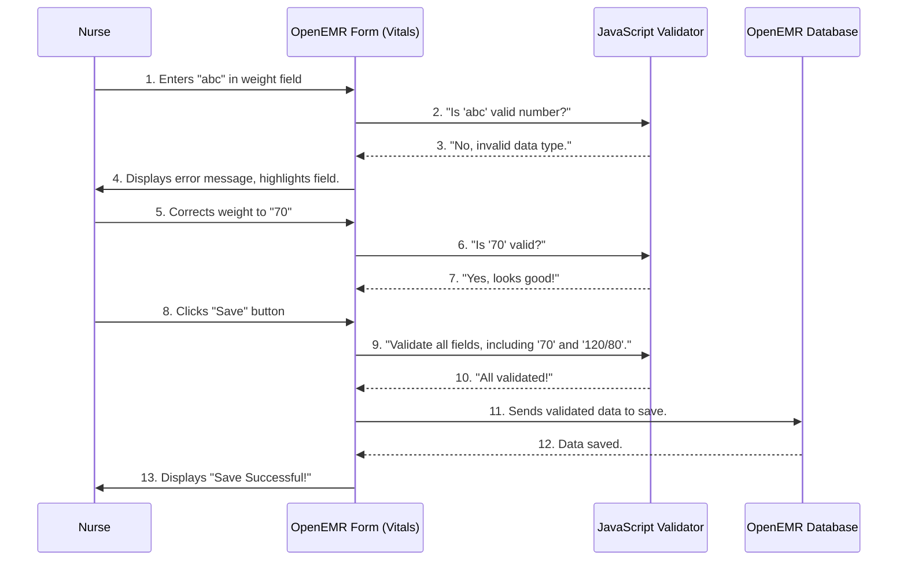

# Chapter 8: Form Management & Validation

Welcome back! In our last chapter, [Chapter 7: Frontend UI Frameworks (jQuery, Bootstrap, Knockout.js)](07_frontend_ui_frameworks__jquery__bootstrap__knockout_js__.md), we learned how OpenEMR uses cool tools like jQuery, Bootstrap, and Knockout.js to make its user interface look good and be interactive. Now, let's dive into **Form Management & Validation**, which is all about how OpenEMR collects information from users and makes sure that information is correct.

Think about filling out any kind of form in real life – maybe getting a driver's license or signing up for a new service. You usually have to fill in specific boxes, sometimes in a particular format (like a date), and some boxes you simply *must* fill in. If you don't, the form-checker will tell you what's wrong!

In OpenEMR, doctors, nurses, and staff fill out many digital forms every day: recording a patient's vital signs (like blood pressure), planning their care, or even creating a new patient record. **Form Management & Validation** is the system that handles all of this. It ensures that when someone enters data into OpenEMR, it's done correctly, consistently, and completely. This is super important because medical records need to be accurate!

## A Real-World Use Case: Entering Patient Vitals

Let's imagine a nurse is using OpenEMR to record a patient's vital signs, like their weight and blood pressure. The system needs to make sure the numbers entered make sense and are in the right format.

**Use Case: A nurse enters a patient's weight and blood pressure into OpenEMR.**

1.  **Nurse opens Vitals form:** The nurse accesses the Vitals form within OpenEMR.
2.  **Enters Weight:** The nurse types the patient's weight. Let's say the nurse types "abc" instead of a number.
3.  **System checks input:** OpenEMR immediately spots that "abc" isn't a valid weight.
4.  **Error Message:** It shows an error message, highlighting the field, and prevents the nurse from saving until it's corrected.
5.  **Enters Blood Pressure:** The nurse then types the patient's blood pressure, say "120/80".
6.  **System validates format:** OpenEMR checks if this looks like a valid blood pressure (two numbers separated by a slash).
7.  **Data Saved:** If everything looks good, the data is saved, and the patient's record is updated.

This process of checking input data and ensuring it's correct is what "Form Management & Validation" is all about.

## Key Concepts of Form Management & Validation

This system involves several moving parts to ensure data integrity and ease of use.

1.  **Forms:** These are the screens users interact with to enter information (e.g., Vitals Form, New Patient Form, Care Plan Form).
2.  **Input Fields:** The individual boxes where users type or select data (e.g., an input for weight, a dropdown for gender).
3.  **Validation Rules:** These are the specific checks that determine if data is correct. Examples:
    *   **Required Fields:** "You must fill this in."
    *   **Data Type:** "This must be a number/date/email."
    *   **Format:** "Dates must be YYYY-MM-DD."
    *   **Range:** "Age must be between 0 and 120."
4.  **Dynamic Interactions:** Forms aren't just static. They can change based on user input, like:
    *   **Adding/Removing Rows:** Adding multiple medications or problems.
    *   **Calculations:** Automatically calculating BMI from height and weight.
    *   **Conditional Display:** Showing certain fields only if a previous option is selected.
5.  **Error Handling:** What happens when validation fails? The system typically highlights the incorrect field and provides a clear message.

## How it Works: The Data Collection and Checking Process

Let's simplify how OpenEMR handles form input and validation for our nurse entering vital signs.



**Step-by-step Explanation:**

1.  **User Input:** The nurse types "abc" into the weight field on the Vitals form.
2.  **Client-Side Validation (JavaScript):** Before even sending data to the server, OpenEMR uses JavaScript (in the web browser) to perform quick checks. It asks its JavaScript Validation component, "Is 'abc' a valid numerical input for weight?"
3.  **Immediate Feedback:** The JavaScript validator quickly returns "No, this is not a number." The form immediately highlights the field in red and shows an error message, telling the nurse to correct it. This "client-side" validation provides fast feedback, which is great for user experience.
4.  **Correction:** The nurse corrects the weight to "70". The JavaScript validator checks it again, sees it's valid, and the error goes away.
5.  **Submission:** The nurse clicks "Save." Before actually sending the data to the server, a final client-side validation runs on *all* required fields to ensure everything is correct.
6.  **Server-Side Validation (PHP):** If all client-side checks pass, the data is sent to the OpenEMR server. (Though not shown in the simple diagram, the server also performs its *own* validation checks using PHP code.) This "server-side" validation is crucial because client-side validation can sometimes be bypassed.
7.  **Database Storage:** If both client-side and server-side validation pass, the data is securely saved into the OpenEMR database.

## A Glimpse at the Code: How Forms and Validation are Handled

OpenEMR has many forms, each with its own specific logic. Files like `interface/forms/vitals/vitals.js`, `interface/forms/newpatient/newpatient.js`, and `interface/forms/care_plan/careplan.js` are examples of where form-specific JavaScript logic lives.

### Valdiating Vitals Input (`vitals.js`)

Let's look at a simplified version of `vitals.js`, specifically the `vitalsFormSubmitted` function, which checks if the fields are valid before saving.

```javascript
// From interface/forms/vitals/vitals.js (simplified)

(function(window, oeUI) {
    function vitalsFormSubmitted() {
        var invalid = ""; // To collect error messages

        // These are the input fields that need to be validated
        var elementsToValidate = ['weight_input_usa', 'weight_input_metric', 'height_input_usa', 'height_input_metric', 'bps_input', 'bpd_input'];

        for (var i = 0; i < elementsToValidate.length; i++) {
            var current_elem_id = elementsToValidate[i];
            var inputElement = document.getElementById(current_elem_id);

            // Remove any previous error highlighting
            inputElement.classList.remove('error');

            // Check if the input value is NOT a number
            if (isNaN(inputElement.value)) {
                // If it's not a number, add an error message
                invalid += "Invalid field: " + current_elem_id + "\n";
                // Add 'error' class to highlight the field in red
                inputElement.className = inputElement.className + " error";
                inputElement.focus(); // Focus on the first error field
            }
        }

        if (invalid.length > 0) {
            alert(invalid + "\nValidation failed!"); // Show all errors in an alert
            return false; // Stop form submission
        } else {
            return true; // All good, allow form submission
        }
    }

    function initDOMEvents() {
        let vitalsForm = document.getElementById('vitalsForm');
        if (!vitalsForm) return;

        vitalsForm.addEventListener('submit', function(event) {
            if (!vitalsFormSubmitted()) {
                event.preventDefault(); // Stop the form from submitting if validation fails
                // Scroll to the first error element for better UX
                let firstErrorElement = document.querySelector('.error');
                if (firstErrorElement) {
                    firstErrorElement.scrollIntoView({ behavior: 'smooth', block: 'center' });
                }
            }
        });
    }

    // Call initDOMEvents when the page is loaded
    window.document.addEventListener("DOMContentLoaded", initDOMEvents);

    // Expose vitalsForm object globally (simplified)
    let vitalsForm = { "init": function() { /* ... */ } };
    window.vitalsForm = vitalsForm;
})(window, window.oeUI || {}); // Self-executing anonymous function
```
**Explanation:**
*   **`vitalsFormSubmitted()`**: This function is the core of the validation logic. It loops through a list of input IDs (like `weight_input_usa`).
*   **`isNaN(inputElement.value)`**: This is a JavaScript function that checks if a value is "Not-a-Number." If the user types "abc," `isNaN` will return `true`, indicating an error.
*   **`inputElement.classList.remove('error');` and `inputElement.className = inputElement.className + " error";`**: These lines add or remove the `error` CSS class, which typically makes the field border turn red and highlights it.
*   **`alert(invalid + "\nValidation failed!")`**: If any errors are found, a pop-up alert shows all the issues.
*   **`vitalsForm.addEventListener('submit', function(event) { ... });`**: This part listens for when the user tries to submit the form. If `vitalsFormSubmitted()` returns `false` (meaning there were errors), `event.preventDefault()` stops the form from being sent to the server.
*   **`firstErrorElement.scrollIntoView(...)`**: This is a nice user experience touch that automatically scrolls the page to the first error field, so the user doesn't have to search for it.

### Dynamic Row Addition (`careplan.js` and `observation.js`)

Many forms in OpenEMR allow users to add multiple entries of the same type (like multiple problems in a care plan). Let's look at `careplan.js` and `observation.js`, which both have `duplicateRow` functions.

```javascript
// From interface/forms/care_plan/careplan.js (simplified)
function duplicateRow(e) {
    // 1. Clone the existing row (e is the element to duplicate)
    var newRow = e.cloneNode(true);
    // 2. Insert the new row right after the original row
    e.parentNode.insertBefore(newRow, e.nextSibling);

    // 3. Update IDs to make them unique (e.g., tb_row_1, tb_row_2)
    changeIds('tb_row');
    changeIds('description');
    changeIds('code');
    changeIds('code_date');
    // ... more changeIds functions for other elements in the row ...

    // 4. Clear values in the new row (so it's empty for new input)
    removeVal(newRow.id);

    // 5. If there are widgets (like for reason codes), reload their event listeners
    // (This part might be specific to certain forms and relies on other modules)
    // window.oeUI.reasonCodeWidget.reload();
}

// From interface/forms/care_plan/careplan.js (simplified)
function changeIds(class_val) {
    // Get all elements that have a specific class (e.g., 'tb_row')
    var elem = document.getElementsByClassName(class_val);
    for (let i = 0; i < elem.length; i++) {
        // If the element has an ID, update it
        if (elem[i].id) {
            index = i + 1; // Increment the index for uniqueness
            elem[i].id = class_val + "_" + index; // New ID (e.g., description_1, description_2)
        }
    }
}

// From interface/forms/care_plan/careplan.js (simplified)
function removeVal(rowid) {
    rowid1 = rowid.split('tb_row_'); // Get the numeric part of the row ID
    // Clear out values for specific fields in the new row
    document.getElementById("description_" + rowid1[1]).value = '';
    document.getElementById("code_" + rowid1[1]).value = '';
    // ... clear other fields ...
}
```
**Explanation:**
*   **`duplicateRow(e)`**: This function takes an HTML element `e` (which represents an entire row from the form) and `cloneNode(true)` creates an exact copy of it, including all its content and attributes.
*   **`e.parentNode.insertBefore(newRow, e.nextSibling)`**: This line then tells the browser to put the `newRow` right after the original row on the page.
*   **`changeIds('tb_row')`**: After copying, the IDs of the elements in the new row would be the same as the original, which causes problems. The `changeIds` function goes through all elements with a specific class (`tb_row`, `description`, `code`, etc.) and updates their IDs to be unique (e.g., `_1`, `_2`, `_3`).
*   **`removeVal(newRow.id)`**: Finally, the `removeVal` function clears out any pre-filled values in the new row, making it ready for fresh input.

### Centralized Validation (`library/validation/validation_script.js`)

Beyond individual form-specific validations, OpenEMR also uses a more general validation library, `validate.js`, which is extended by `library/js/vendors/validate/validate_extend.js` and managed by `library/validation/validation_script.js`. This allows for common validation rules across many forms, especially `NewPatientForm`.

```javascript
// From library/validation/validation_script.js (simplified)

window.OeFormValidation = (function(window) {
    function submitme(new_validate, e, form_id, constraints) {
        // 1. Basic checks and setup (e.g., session restore)
        top.restoreSession();

        // 2. Check if validation constraints are provided
        if (!constraints) {
            console.error("Validation Constraints are missing.");
            return true; // No constraints, so nothing to validate, proceed safely.
        }

        // 3. Find the form element and collect its values
        var form = document.querySelector("form#" + form_id);
        var elements = validate.collectFormValues(form); // Uses validate.js to get all form data

        // 4. Perform the actual validation using the validate.js library
        //    This returns an object with error messages if validation fails
        var errors = validate(elements, constraints);

        // 5. Handle validation results
        if (errors) {
            // There are errors! Display them.
            // Loop through each field that has errors
            for (var attr in errors) {
                var inputElement = $('[name="' + attr + '"]'); // Find the HTML input element
                var errorMessage = errors[attr][0]; // Get the first error message for this field
                appendError(inputElement, attr, errorMessage); // Custom function to display error on UI
            }
            e.preventDefault(); // Stop the form submission
            return false; // Indicate validation failed
        } else {
            // No errors. All clear!
            somethingChanged = false; // Flag for form changes (optional, but good for saving)
            return true; // Allow form submission
        }
    }

    // Helper function (simplified) to display errors on the UI
    function appendError(input, id, message) {
        $(input).addClass('error-border'); // Add CSS class to highlight field
        $("#error_" + id).text(message); // Display message next to field (assuming an element exists for errors)
        // Set up event listeners to hide errors if user tries to fix them
        $(input).on('click focus select', function(){
            hideErrors(this, id);
        });
    }

    // Helper function (simplified) to hide errors
    function hideErrors(input, id){
        $(input).removeClass('error-border');
        $("#error_" + id).text('');
    }

    return {
        submitme: submitme // Expose the main submit validation function
    };
})(window);
```
**Explanation:**
*   **`validate.collectFormValues(form)`**: This is a powerful function provided by the `validate.js` library. It automatically grabs all the input values from the HTML form and puts them into a JavaScript object, ready for validation.
*   **`var errors = validate(elements, constraints);`**: This is the core call to the `validate.js` library. `elements` is the data from the form, and `constraints` is a JavaScript object that defines all the validation rules for each field (e.g., `weight_input_usa: { numericality: { onlyInteger: true, greaterThan: 0 } }`). If validation fails, `errors` will contain a list of all validation messages; otherwise, it's `null`.
*   **`appendError(inputElement, attr, errorMessage)`**: If errors are found, this custom function (simplified here) is called to visually indicate the error on the form, typically by adding a class for styling (`error-border`) and displaying the `errorMessage` next to the field.
*   **`e.preventDefault();`**: Just like in `vitals.js`, this stops the form from being submitted to the server if validation fails.

The `validate.js` library is highly configurable, allowing OpenEMR developers to define custom validation rules and messages. This provides a robust and centralized way to ensure data quality across various forms.

## Conclusion

Form Management & Validation is a crucial system in OpenEMR that focuses on collecting accurate and reliable patient data. By implementing robust validation rules (both client-side and server-side) and providing dynamic form interactions, OpenEMR ensures that user input is correctly formatted and complete. This is fundamental for maintaining the integrity of patient records and supporting effective healthcare delivery.

In the next chapter, we'll explore **Global UI Utilities & Helpers**, which are common tools and functions used across OpenEMR to make development easier and the user experience smoother.

[Next Chapter: Global UI Utilities & Helpers](09_global_ui_utilities___helpers_.md)

---

Generated by [AI Codebase Knowledge Builder](https://github.com/The-Pocket/Tutorial-Codebase-Knowledge)