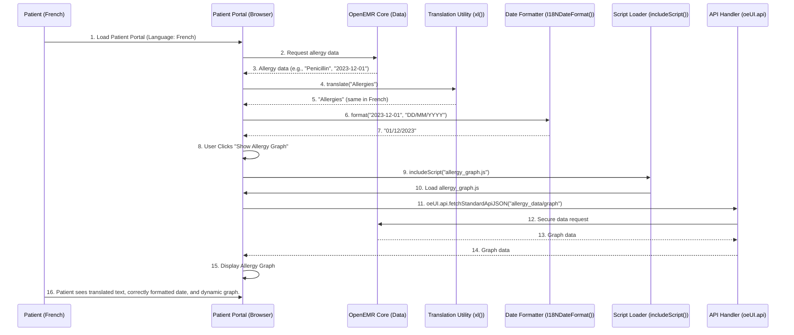

# Chapter 9: Global UI Utilities & Helpers

Welcome back! In our last chapter, [Chapter 8: Form Management & Validation](08_form_management___validation_.md), we learned how OpenEMR ensures that the data entered into its forms is correct and accurate. Now, let's explore a set of tools that make the entire OpenEMR interface work more efficiently and consistently: **Global UI Utilities & Helpers**.

Imagine you're a chef in a busy kitchen. You have your main cooking stations (like the forms and modules we've discussed), but you also have a drawer full of handy gadgets: a universal whisk, a set of measuring spoons, a quick-chop tool, and a universal timer. These aren't specific to one dish, but they make *all* the cooking tasks faster, more accurate, and consistent.

In OpenEMR, **Global UI Utilities & Helpers** are exactly like that Swiss Army knife of tools. They are small, reusable pieces of code that developers use constantly to handle common tasks across the entire user interface. This includes things like:

*   **Translations (`xl` function):** Making OpenEMR speak different languages.
*   **Date/Time Formatting:** Displaying dates and times in the correct local style.
*   **Dynamic Script Loading:** Loading extra JavaScript code only when needed, making pages faster.
*   **General HTML (DOM) Manipulation:** Easily changing what's on the screen (like adding text, showing/hiding elements).
*   **API Interactions:** A standardized way for the frontend to talk to OpenEMR's backend [RESTful APIs (OpenEMR and FHIR)](03_restful_apis__openemr_and_fhir__.md).

These tools ensure that no matter where you are in OpenEMR – whether it's the [Patient Portal](01_patient_portal_.md), a form, or a report – things behave and look similar, saving developers time and keeping the user experience smooth.

## A Real-World Use Case: A Patient's Allergies in Different Languages

Let's imagine a patient from France is using the [Patient Portal](01_patient_portal_.md), and they want to see "Allergies" translated into French. Also, the date their allergy was recorded needs to appear in the European format (e.g., `DD/MM/YYYY`).

**Use Case: Displaying "Allergies" and an allergy recording date correctly for a French-speaking patient.**

1.  **Patient visits Portal:** The patient logs into the portal, which is set to French.
2.  **"Allergies" needs translation:** The label "Allergies" should appear as "Allergies" (French for allergies) or whatever the closest translated term is.
3.  **Date Formatting:** An allergy recorded on, say, December 1st, 2023, needs to show up as "01/12/2023" instead of "2023-12-01" (the default OpenEMR backend format) or "12/01/2023" (US format).
4.  **Loading extra features:** If the allergy system has a special visual graph, the code for that graph should only load when the allergy section is opened, not for every page in the portal.

This simple example highlights how the Global UI Utilities address common needs: language, formatting, and efficient loading.

## Key Concepts of Global UI Utilities & Helpers

These utilities are primarily JavaScript functions available throughout OpenEMR's frontend.

1.  **`xl()` (Translation Function):**
    *   **What it is:** A super important function that helps OpenEMR "speak" many languages. `xl` stands for "eXternalize Language" or simply "translate."
    *   **What it does:** When you see text in OpenEMR's code that needs to be translated (like "Save" or "Patient Name"), it's wrapped in `xl("Save")`. This function looks up the translation for that English word in the currently selected language.
    *   **Analogy:** Like a universal translator app on your phone. You say "Hello," and it instantly translates it into "Bonjour" if your setting is French.

2.  **Date & Time Formatters:**
    *   **What it is:** Functions that take a date or time from the computer system and display it in a human-readable format according to the user's settings.
    *   **What it does:** Ensures that dates like "2023-12-01" can be shown as "12/01/2023" (US), "01/12/2023" (European), or "Dec 1, 2023".
    *   **Analogy:** Imagine different countries write dates differently (some put the day first, some the month). These formatters are like a "date conversion service" that displays it in the style you prefer.

3.  **Dynamic Script Loading (`includeScript()`):**
    *   **What it is:** A helper function that loads additional JavaScript files into the web page *only when they are needed*.
    *   **What it does:** Instead of loading every possible script when OpenEMR first loads (which would make it slow), `includeScript()` allows parts of OpenEMR to say, "Hey, I need that special charting library now," and load it on the fly.
    *   **Analogy:** Like having a big toolbox, but you only bring out the specific wrench you need for the current task, instead of carrying the whole heavy toolbox everywhere.

4.  **API Handlers (`oeUI.api`):**
    *   **What it is:** A standardized way to make network requests (like [RESTful APIs (OpenEMR and FHIR)](03_restful_apis__openemr_and_fhir__.md) calls) to OpenEMR's backend from the frontend.
    *   **What it does:** It handles common tasks like adding security tokens (`csrfToken`) to requests and getting data back in a structured way.
    *   **Analogy:** Like a dedicated messenger service for your kitchen. Instead of you shouting orders and managing security for every ingredient delivery, you tell the messenger, "Get me 5 tomatoes," and they handle all the secure communication and delivery.

5.  **DOM (Document Object Model) Manipulation Helpers:**
    *   **What it is:** Functions that make it easier to change the actual visual elements on a web page. OpenEMR uses a lot of [Frontend UI Frameworks (jQuery, Bootstrap, Knockout.js)](07_frontend_ui_frameworks__jquery__bootstrap__knockout_js__.md), and these helpers often work alongside or simplify those.
    *   **What it does:** Common tasks like showing/hiding elements, adding/removing text, or finding specific parts of the page.
    *   **Analogy:** Like a remote control for your TV (the website). You press a button, and it instantly changes channels (loads new content), shows/hides a menu, or updates the volume (adjusts text size).

## How They Work Together: The Patient Portal Example

Let's see how these utilities might work for our French-speaking patient in the [Patient Portal](01_patient_portal_.md).



**Step-by-step Explanation:**

1.  **Initial Load:** The patient logs in, and the portal is set to French.
2.  **Data Fetch:** The portal requests allergy data from the OpenEMR backend via its [RESTful APIs (OpenEMR and FHIR)](03_restful_apis__openemr_and_fhir__.md). The backend returns data like the allergy name ("Penicillin") and its date ("2023-12-01").
3.  **Translation:** To display the section header "Allergies," the portal calls `xl("Allergies")`. The `xl()` utility looks up the translation based on the configured French language and returns "Allergies" (which happens to be the same in this case, but for other terms like "Save", it would return "Sauvegarder").
4.  **Date Formatting:** For the date "2023-12-01", the portal uses a date formatting utility (like `I18NDateFormat()`) to convert it to "01/12/2023" for its French-speaking user.
5.  **Dynamic Feature Load:** When the patient clicks a button to "Show Allergy Graph," the `includeScript()` utility loads the `allergy_graph.js` file (which contains the code for the interactive graph). This script then uses `oeUI.api.fetchStandardApiJSON()` to securely fetch the actual data needed to draw the graph from OpenEMR.
6.  **Full Experience:** The patient sees the correct language, correctly formatted dates, and a dynamically loaded graph, all thanks to these global utility functions.

## A Glimpse at the Code: Common Utilities in Action

OpenEMR's global utilities are often found in files like `library/js/utility.js`, `library/js/xl/formatting.js`, and `interface/super/edit_globals.js`.

### 1. **`xl()`: The Translation Powerhouse**

This fundamental function is defined in `library/js/utility.js`.

```javascript
// From library/js/utility.js (simplified)

// This function translates strings based on the current language setting.
function xl(string) {
    // Check if the i18next translation library is available.
    if (top.i18next && typeof top.i18next.t == 'function') {
        // If it is, use its 't' (translate) function.
        return top.i18next.t(string);
    } else {
        // If i18next isn't found (e.g., in development or an error),
        // log a message and return the original string.
        console.log("xl function is unable to translate since can not find the i18next.t function");
        return string;
    }
}
```
**Explanation:** When you call `xl("hello")`, this function asks the underlying `i18next` library (which manages all the translations loaded for OpenEMR) for the translated version of "hello" in the current language. If `i18next` isn't set up, it just returns the original English string. This keeps the code clean and supports multiple languages without developers having to write complex translation logic everywhere.

### 2. **`I18NDateFormat()`: Smart Date Formatting**

Found in `library/js/xl/formatting.js`, this function helps display dates correctly for different regions.

```javascript
// From library/js/xl/formatting.js (simplified)

function pad(n) {
    // Helper to add a leading zero if a number is less than 10 (e.g., 5 -> "05")
    return n.toString().padStart(2, '0');
}

function I18NDateFormat(date, displayFormatSetting = undefined) {
    if (typeof date === 'undefined') {
        date = new Date(); // If no date provided, use today.
    } else if (!(date instanceof Date)) {
        date = new Date(date); // Convert input to a Date object if needed.
    }

    let jsGlobals = window.top.jsGlobals || {};
    // Get the user's preferred date display format from global settings (0 = YYYY-MM-DD, 1 = MM/DD/YYYY, 2 = DD/MM/YYYY)
    let date_display_format = displayFormatSetting !== undefined ? displayFormatSetting : jsGlobals['date_display_format'];
    let defaultLocale = 'en-US';

    // Different formatting rules based on the user's settings
    if (date_display_format == 0) {
        // SQL-like format (e.g., "2023-12-01")
        return date.getFullYear() + '-' + pad(date.getMonth() + 1) + '-' + pad(date.getDate());
    } else if (date_display_format == 1) {
        defaultLocale = 'en-US'; // Use US locale for MM/DD/YYYY
    } else {
        defaultLocale = 'en-GB'; // Use UK locale for DD/MM/YYYY
    }

    // Use JavaScript's built-in Intl.DateTimeFormat for locale-specific formatting
    return new Intl.DateTimeFormat(defaultLocale, { month: '2-digit', day: '2-digit', year: 'numeric' }).format(date);
}
```
**Explanation:** This function takes a date and applies the formatting rule specified by the user's OpenEMR settings. For example, if `date_display_format` is `2` (European), it uses `Intl.DateTimeFormat` with `'en-GB'` locale to turn "2023-12-01" into "01/12/2023". This ensures consistency across different displays of dates in OpenEMR.

### 3. **`includeScript()`: Dynamic Script Loading**

This utility, also in `library/js/utility.js`, allows for loading JavaScript or CSS files only when they are needed.

```javascript
// From library/js/utility.js (simplified)

/*
* function includeScript(srcUrl, type)
*
* @summary Dynamically include JS Scripts or Css.
*
* @param {string} url file location.
* @param {string} 'script' | 'link'.
*
*/
function includeScript(srcUrl, type) {
    // Returns a Promise, which means you can wait for the script to load before doing something else.
    return new Promise(function (resolve, reject) {
        let newScriptElement;

        if (type === 'script') {
            newScriptElement = document.createElement('script');
            newScriptElement.src = srcUrl;
        } else if (type === "link") { // For CSS files
            newScriptElement = document.createElement("link")
            newScriptElement.type = "text/css";
            newScriptElement.rel = "stylesheet";
            newScriptElement.href = srcUrl;
        } else {
            reject(new Error(`Unsupported type: ${type}`));
            return;
        }

        // Add event listeners to know when the script loads or fails
        newScriptElement.onload = () => {
            console.log('Successfully loaded: [' + srcUrl + ']');
            resolve(newScriptElement);
        };
        newScriptElement.onerror = () => {
            console.error('Failed to load: [' + srcUrl + ']');
            reject(new Error(`Load error for ${srcUrl}`));
        };

        // Add the new script/link element to the HTML head, which starts the loading process.
        document.head.append(newScriptElement);
    });
}
```
**Explanation:** If a part of OpenEMR, like the complex "Allergy Graph" functionality, needs its own JavaScript code (`allergy_graph.js`), it can call `includeScript('allergy_graph.js', 'script')`. This function creates a `<script>` tag on the fly, adds it to the page, and the browser then downloads and runs that script. This prevents the initial page load from being slowed down by unused code.

### 4. **`oeUI.api`: Standardized API Interactions**

This object, defined in `interface/super/edit_globals.js`, provides a consistent way to interact with OpenEMR's backend APIs.

```javascript
// From interface/super/edit_globals.js (simplified)

(function(window, oeUI) {
    class ApiHandler {
        #apiUrl = null; // Private variable for the base API URL
        #csrfToken = null; // Private variable for security token

        constructor() {
            this.#apiUrl = "";
            this.#csrfToken = null;
        }

        setApiUrl(apiUrl) { this.#apiUrl = apiUrl; }
        getApiUrl() { return this.#apiUrl; }
        setCsrfToken(csrfToken) { this.#csrfToken = csrfToken; }
        getCsrfToken() { return this.#csrfToken; }

        getStandardApiUrl(path) {
            // Helper to build the full URL for standard APIs
            return this.#apiUrl + "/api/" + path;
        }

        fetchStandardApiJSON(path) {
            let url = this.getStandardApiUrl(path);
            let headers = {
                // Attach the CSRF token for security (prevents certain types of attacks)
                'apicsrftoken': this.getCsrfToken()
            };
            // Use window.fetch (modern way to make network requests)
            return window.fetch(url,
                {
                    method: 'GET', // Default to GET request
                    redirect: 'manual', // Control how redirects are handled
                    headers: headers
                })
                .then(result => {
                    // Check if the request was successful
                    if (result.ok && result.status === 200) {
                        return result.json(); // Parse the response as JSON
                    } else {
                        throw new Error("Failed to retrieve valid response");
                    }
                });
        }
    }
    // Make the ApiHandler available globally through oeUI.api
    oeUI.api = new ApiHandler();
    window.oeUI = oeUI;
})(window, window.oeUI || (window.oeUI = {}));
```
**Explanation:** Instead of every part of OpenEMR writing its own `fetch` requests with manual headers and error handling, `oeUI.api` provides a centralized way. When you call `oeUI.api.fetchStandardApiJSON("allergy_data/graph")`, it automatically includes the necessary `apicsrftoken` (a security measure) and returns the data as a clean JSON object, making it much easier to interact with the [RESTful APIs (OpenEMR and FHIR)](03_restful_apis__openemr_and_fhir__.md) backend.

## Conclusion

Global UI Utilities & Helpers are the tireless helpers that keep OpenEMR's frontend running smoothly and consistently. By providing standard functions for common tasks like translation, date formatting, dynamic script loading, and secure API interactions, these utilities simplify development and ensure a cohesive and user-friendly experience across the entire application. They are essential for OpenEMR's flexibility and maintainability as a large, feature-rich healthcare system.

In the next chapter, we'll shift our focus to **Customizing OpenEMR Appearance**, exploring how you can change the look and feel of the application to suit different preferences and branding.

[Next Chapter: Customizing OpenEMR Appearance](10_customizing_openemr_appearance.md)

---

Generated by [AI Codebase Knowledge Builder](https://github.com/The-Pocket/Tutorial-Codebase-Knowledge)