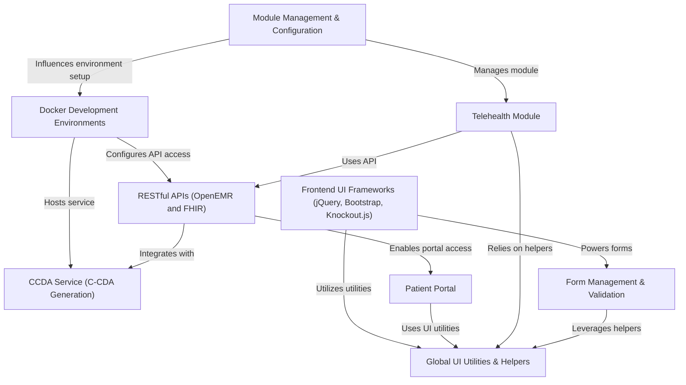

# Tutorial: openemr

OpenEMR is a **Free and Open Source electronic health records and medical practice management application**. It provides a comprehensive suite of features for managing patient care, including **scheduling, electronic billing, and integrated health records**. Developers can leverage _Docker environments_ for easy setup, _APIs_ for external integrations, and a _Patient Portal_ for patient engagement, all built upon various _frontend UI frameworks_ for an intuitive user experience.

**Source Repository:** [https://github.com/openemr/openemr.git](https://github.com/openemr/openemr.git)

## Chapters

1. [Patient Portal
](01_patient_portal_.md)
2. [Telehealth Module
](02_telehealth_module_.md)
3. [RESTful APIs (OpenEMR and FHIR)
](03_restful_apis__openemr_and_fhir__.md)
4. [CCDA Service (C-CDA Generation)
](04_ccda_service__c_cda_generation__.md)
5. [Docker Development Environments
](05_docker_development_environments_.md)
6. [Module Management & Configuration
](06_module_management___configuration_.md)
7. [Frontend UI Frameworks (jQuery, Bootstrap, Knockout.js)
](07_frontend_ui_frameworks__jquery__bootstrap__knockout_js__.md)
8. [Form Management & Validation
](08_form_management___validation_.md)
9. [Global UI Utilities & Helpers
](09_global_ui_utilities___helpers_.md)

---

Generated by [AI Codebase Knowledge Builder](https://github.com/The-Pocket/Tutorial-Codebase-Knowledge)